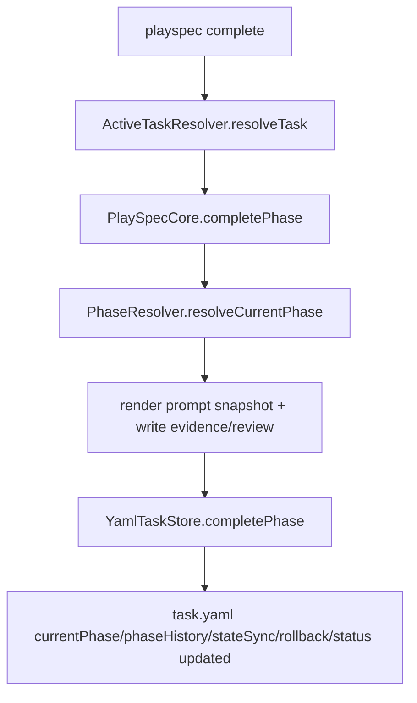
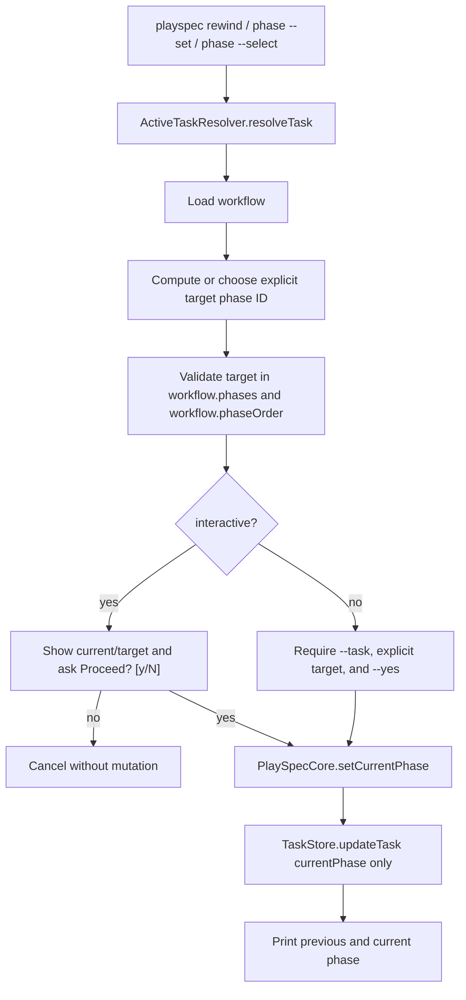

# 20-add-safe-phase-recovery Technical Spec

## Scope

This feature adds safe phase-pointer recovery for active PlaySpec tasks. It is for the user who accidentally runs `playspec complete`, advances to the next workflow phase, and needs a first-class CLI path back without manually editing `.playspec/tasks/active/<taskId>/task.yaml`.

In scope:

- `playspec rewind [--steps <n>] [--task <taskId>] [--yes]` to move backward through `workflow.phaseOrder`.
- `playspec phase --set <phaseId> [--task <taskId>] [--yes]` to set `task.currentPhase` to a validated workflow phase.
- `playspec phase --select [--task <taskId>]` to choose a workflow phase from an interactive list.
- Validation that task, workflow, and target phase exist, and that target phase is listed in `workflow.phaseOrder`.
- State mutation limited to `task.currentPhase` and `updatedAt`.
- Preservation of `phaseHistory`, evidence files, snapshot files, rollback metadata, source files, prompt files, review files, and output files.
- Confirmation before mutation, either by interactive `Proceed? [y/N]` or by explicit `--yes` in non-interactive mode.

Out of scope:

- `rewind --clean-history` or any history deletion.
- Git rollback, snapshot restoration, evidence cleanup, or workspace file edits.
- MCP recovery APIs.
- Migration changes.
- Viewer work.
- DAG navigation or gate-result rerouting.
- Changes to `playspec complete` behavior beyond adding tests that protect the new recovery path.

## Use Case Alignment

Verified source problem:

- Users can accidentally run `playspec complete` before finishing the current phase.
- Today the practical recovery path is direct YAML editing of `.playspec/tasks/active/<taskId>/task.yaml`.
- The desired recovery must be workflow-aware, auditable, and discoverable from CLI commands.

Required user-facing workflows:

- Common recovery:
  - User runs `playspec rewind`.
  - CLI resolves the active task from `.playspec/HEAD`.
  - CLI shows task, current phase, target phase, and asks `Proceed? [y/N]`.
  - On yes, only `currentPhase` and `updatedAt` change.
  - User can then run `playspec prompt`.
- Multiple-step recovery:
  - User runs `playspec rewind --steps 2`.
  - Target phase is computed by subtracting two positions from the current phase index in `workflow.phaseOrder`.
  - If target would precede the first phase, command fails without writing.
- Explicit recovery:
  - User runs `playspec phase --set implementation`.
  - Target must be present in `workflow.phaseOrder`.
  - CLI warns when the move is backward or skips forward.
- Interactive picker:
  - User runs `playspec phase --select`.
  - CLI lists workflow phases, preselects the current phase when possible, then applies the same confirmation and mutation path as `--set`.

Non-interactive requirements from the source problem:

- Require `--task`.
- Require an explicit target. For `rewind`, the source problem names `rewind --steps 2` for multi-step and `rewind` for the default interactive case; this spec treats non-interactive `rewind` without `--steps` as invalid so scripts do not mutate HEAD-derived state by default.
- Require `--yes` for any non-interactive mutation. Explicit target plus explicit task identify what to mutate; `--yes` is the confirmation-equivalent safety signal.
- Do not show a dropdown. `phase --select` fails in non-interactive mode.

## High-Level Current Implementation Summary

Verified code behavior:

- `src/cli/index.ts` registers `phase <phaseId>` as a render-only command and `complete` as the forward phase advancement command.
- `src/cli/commands/phase.ts` resolves a task, then calls `PlaySpecCore.renderExplicitPhasePrompt(task.id, phaseId)`. It prints a prompt and does not mutate state.
- `src/cli/commands/complete.ts` resolves a task, optionally renders a context header, obtains gate results when needed, then calls `PlaySpecCore.completePhase()`.
- `PlaySpecCore.completePhase()` is the only active Core path that advances workflow state. It writes snapshots, evidence, optional review files, rollback metadata, `stateSync`, `phaseHistory`, `currentPhase`, `updatedAt`, and sometimes `status`.
- `YamlTaskStore.completePhase()` updates `currentPhase`, appends completed phase history, drops stale active history entries, updates status to `completed` at the end of the workflow, and writes atomically.
- `YamlTaskStore.updateTask()` merges a partial task patch, refreshes `updatedAt`, validates with `TaskRecordSchema`, and saves the whole record. It currently writes through `saveTask()`, which uses `writeTextFile()` rather than `writeTextFileAtomic()`.
- `PhaseResolver.resolveExplicitPhase()` checks `workflow.phases[phaseId]`, but it does not verify that `phaseId` is also listed in `workflow.phaseOrder`.
- `PlaySpecCore.validateCurrentPhase()` checks `workflow.phaseOrder.includes(task.currentPhase)` for existing task state before rendering the next prompt.
- `ActiveTaskResolver.resolveTask()` is the existing HEAD-or-explicit-task resolver used by CLI commands.
- `src/cli/commands/use.ts` already has a local arrow-key selector implementation suitable as a UX reference for `phase --select`.

Inferred behavior:

- `TaskStore.updateTask(taskId, { currentPhase: targetPhaseId })` will preserve `phaseHistory`, `stateSync`, `rollback`, and artifact references because omitted fields are retained from the existing record.
- A bad `currentPhase` string can pass the task schema because `TaskRecordSchema.currentPhase` is only `string | null`; workflow membership must be enforced in Core or CLI before storage.
- Because `completePhase()` has side effects unrelated to pointer recovery, it must not be reused for `rewind` or `phase --set`.

## Relevant Files Reviewed

Must-read files reviewed:

- `.playspec/tasks/active/20_add_safe_phase_recovery/sources/source_problem.md` - source requirements and UX examples.
- `src/cli/index.ts` - current command registration for `phase`, `complete`, and related task commands.
- `src/cli/commands/phase.ts` - current render-only phase command and extension point.
- `src/cli/commands/complete.ts` - current forward advancement flow and output style.
- `src/cli/commands/use.ts` - existing interactive selector implementation.
- `src/cli/commands/rollback.ts` - confirms rollback is a separate Git/task snapshot recovery path, not the phase-pointer recovery mechanism.
- `src/cli/commands/current-task.ts` - current task and effective phase display reference.
- `src/cli/cli-utils.ts` - `isInteractiveCli()`, HEAD reading, and phase display helpers.
- `src/core/active-task-resolver.ts` - HEAD/default task resolution and `--task` override behavior.
- `src/core/playspec-core.ts` - Core phase rendering, completion, validation, and persistence boundary.
- `src/core/errors.ts` - existing user-facing error style and allowed-values error candidate.
- `src/core/types.ts` - task, workflow, and phase history contracts.
- `src/core/schemas.ts` - runtime schema constraints for task records and workflows.
- `src/storage/task-store.ts` - persistence interface.
- `src/storage/yaml-task-store.ts` - storage update and completion behavior.
- `src/workflow/phase-resolver.ts` - current/next/explicit phase resolution.
- `src/workflow/phase-display.ts` - phase labels for confirmations and picker rows.
- `tests/cli.test.ts` - CLI test harness and PTY helper.
- `tests/integration/completion-engine.test.ts` - completion side effects to avoid in recovery.
- `tests/integration/task-store.test.ts` - updateTask persistence behavior.

Maybe-read files identified by scanner, to use during implementation if needed:

- `src/cli/commands/next.ts`, `src/cli/commands/current.ts`, `src/cli/commands/status.ts` - output compatibility references.
- `src/workflow/workflow-loader.ts` - workflow loading error behavior.
- `tests/unit/phase-resolver.test.ts` - resolver validation baseline.
- `tests/integration/active-task-resolver.test.ts` - HEAD and explicit task resolution coverage.
- `tests/integration/routing.test.ts` - repeated visits and history preservation edge cases.

Intentionally not expanded:

- `src/mcp/**` - CLI-only recovery feature for this phase. The existing MCP completion path is still called out below as an alternate current state-advancing path.
- `src/migration/**` - unrelated to live task phase recovery. No partial migration path exists for this feature because migration operates on historical markdown import, not active task phase recovery.
- `src/template/**` and preset templates - downstream prompt rendering, not recovery state mutation.

## Active Entry Points And Bypasses

Current verified entry points:

- `playspec complete` is the active state-advancing entry point.
- MCP tool `playspec_complete_phase` is an alternate active state-advancing entry point. It resolves task context with `resolveMcpTaskId()` and calls the same `PlaySpecCore.completePhase()` method as CLI completion.
- `playspec phase <phaseId>` is an explicit prompt renderer and must remain render-only.
- MCP tool `playspec_render_phase_prompt` is an alternate explicit prompt renderer. It calls `PlaySpecCore.renderExplicitPhasePrompt()` and does not mutate phase state.
- Manual task YAML editing is the current bypass path users rely on for recovery.
- `playspec rollback` is a broader rollback preview/execution path based on rollback safe points and Git state.

Current verified complete flow:



Proposed new mutating entry points:

- `playspec rewind`
- `playspec rewind --steps <n>`
- `playspec rewind --task <taskId> --steps <n> --yes` for non-interactive scripts
- `playspec phase --set <phaseId>`
- `playspec phase --select`

Bypasses and alternate paths to handle:

- Manual YAML edits remain possible but are no longer the supported UX.
- `playspec phase <phaseId>` must not accidentally become mutating, including when a workflow contains phases named `set` or `select`.
- `playspec rollback` must remain independent and must not be invoked by recovery commands.
- Direct use of `TaskStore.updateTask()` from future callers could bypass workflow validation; this feature should put validation in Core and route CLI mutations through Core.
- MCP has no recovery operation in this feature and should not read `.playspec/HEAD` for this work. Existing MCP completion remains a caller of Core completion and gets no new recovery surface in this phase.
- Migration has no recovery bypass or partial migration to update. Do not add migration action types or migration runner behavior for this feature.

## Current Architecture

Verified architecture:

- CLI commands own argument parsing, terminal interaction, confirmation, and printing.
- Core owns task lifecycle validation, workflow loading, and task state transitions.
- Storage owns schema-validated persistence.
- Workflow utilities own phase ordering, phase definitions, and display labels.

Architecture target:

- Add a Core method for phase pointer mutation. Suggested signature:

```ts
async setCurrentPhase(
  taskId: string,
  targetPhaseId: string
): Promise<{
  taskId: string;
  previousPhase: PhaseId | null;
  currentPhase: PhaseId;
}>
```

- The Core method should:
  - load the task,
  - require `task.status === 'active'`,
  - load the task workflow,
  - validate `targetPhaseId` exists in both `workflow.phases` and `workflow.phaseOrder`,
  - persist with `taskStore.updateTask(taskId, { currentPhase: targetPhaseId })`,
  - return previous/current phase IDs for CLI output.
- CLI should compute rewind targets and warnings because those are command semantics and presentation concerns.
- Storage interface does not need a new method for first implementation.
- `YamlTaskStore.updateTask()` must persist with the existing `writeTextFileAtomic()` helper before recovery uses it. This is a narrow persistence-safety patch, not a broad storage refactor.

## Verified Behavior

Verified:

- `completePhase()` writes more than `currentPhase`; it also creates or updates artifacts, history, rollback, and sync metadata.
- `updateTask()` preserves fields that are not included in the patch and refreshes `updatedAt`.
- `updateTask()` currently uses non-atomic write via `saveTask()`.
- `completePhase()` uses a write lock around artifact writes and task completion.
- `PhaseResolver.resolveExplicitPhase()` validates existence in `workflow.phases`, not ordered membership in `workflow.phaseOrder`.
- `InvalidCurrentPhaseError` already prints a message containing `Allowed values: ...`.
- `isInteractiveCli()` treats CI and `PLAY_SPEC_NON_INTERACTIVE` as non-interactive.
- The existing `use` selector restores terminal state on success, cancel, and failure.

Inferred:

- A new Core `setCurrentPhase()` using `updateTask()` will satisfy the source mutation requirement if it does not include `phaseHistory`, `stateSync`, or `rollback` in the patch.
- Existing prompt rendering after recovery will use the new `currentPhase` because `renderNextPrompt()` resolves the current phase from the task record.
- Existing current/status displays will show the recovered phase because they read task state from storage.

Open verification for implementation:

- Whether tests should assert only `task.yaml` changed or also recursively hash artifact directories before/after.
- Whether implementation has switched `updateTask()` to atomic writes before using it for recovery.

## Problems

Verified problems:

- No safe user-facing recovery command exists.
- The current state-changing path, `completePhase()`, is not suitable for recovery because it writes artifacts and history.
- The current `phase` command name is already used for render-only behavior, so mutating extensions require strict argument exclusivity and help text.
- Workflow membership validation is split: explicit phase rendering validates `workflow.phases`, while current phase state validation checks `workflow.phaseOrder`.
- Generic storage update accepts arbitrary `currentPhase` strings at schema level.

Design problems to avoid:

- Deleting or rewriting `phaseHistory` would violate the source problem's auditability requirement.
- Reusing rollback would broaden scope into Git/workspace recovery.
- Treating effective phase display as a write target would make `currentPhase: null` ambiguous. Recovery must write explicit phase IDs only.
- Copy-pasting selector code without cleanup guarantees can leave a terminal in raw mode on failure.

## Proposed Direction

Proposed verified-preserving recovery flow:



Core validation:

- Use `assertTaskIsActive(task)` or equivalent for all recovery mutations.
- Validate target against `workflow.phaseOrder` first because the source problem names `phaseOrder` as the canonical allowed list.
- Also ensure `workflow.phases[targetPhaseId]` exists so labels and prompt rendering are valid.
- Surface invalid input as a controlled `PlaySpecError` or `InvalidCurrentPhaseError` with allowed values listed.

CLI confirmation:

- Interactive mode requires confirmation for HEAD-inferred and `--task` explicit operations.
- Non-interactive mode requires `--task`, an explicit target, and `--yes`; otherwise fail before mutation.
- Confirmation text should include:
  - task id,
  - current phase label,
  - target phase label,
  - `This will change task currentPhase.`,
  - `phaseHistory will not be deleted.`,
  - `Proceed? [y/N]`.
- Cancellation prints `Cancelled. Phase not changed.` and writes nothing.

Rewind rules:

- `--steps` must be a positive integer.
- Interactive `playspec rewind` defaults to one step.
- Non-interactive `playspec rewind` requires `--task`, explicit `--steps`, and `--yes`.
- If `task.currentPhase === null`, fail with a controlled error because there is no explicit current phase to rewind from. Message should include: `Task has no explicit phase pointer yet.`
- If current phase is not in `workflow.phaseOrder`, fail with allowed values and do not write.
- If `currentIndex - steps < 0`, fail with a controlled out-of-range error and do not clamp silently.
- Target phase is `workflow.phaseOrder[currentIndex - steps]`.

Phase set/select rules:

- `--set` requires a valid target phase ID.
- `--select` requires interactive mode.
- `phase <phaseId>` with no `--set` must keep the current render-only behavior.
- Mutating forms must be mutually exclusive with render-only positional phase rendering.
- Do not implement `phase set <phaseId>` or `phase select` in this phase. Those words remain legal render-only phase IDs for `playspec phase <phaseId>` if a workflow defines them.
- If both a positional phase ID and `--set` or `--select` are provided, fail without mutation.
- Warn when:
  - target index is less than current index,
  - target index is greater than current index + 1.

## File-By-File Plan

`src/cli/index.ts`

- Import `runRewind`.
- Register `rewind` with `--steps <n>`, `--task <id>`, and `--yes`.
- Change `phase <phaseId>` registration to `phase [phaseId]` only so existing render-only positional use survives while option-only mutation can be parsed.
- Add `--set <phaseId>`, `--select`, `--task <id>`, and `--yes` to the phase command path.
- Do not register `phase set` or `phase select` subcommands in this phase.

`src/cli/commands/rewind.ts` (new)

- Resolve the task with `ActiveTaskResolver`.
- Enforce non-interactive requirements: `--task`, explicit `--steps`, and `--yes`.
- Load workflow with `WorkflowLoader`.
- Validate current phase and compute target from `workflow.phaseOrder`.
- Ask for confirmation when `isInteractiveCli()` is true.
- Call `PlaySpecCore.setCurrentPhase(task.id, targetPhaseId)`.
- Print a concise success message with previous and current phase labels.

`src/cli/commands/phase.ts`

- Preserve render-only behavior for `playspec phase <phaseId>`.
- Add runtime routing for:
  - `--set <phaseId>`,
  - `--select`.
- Do not parse positional `set` or `select` as mutating aliases.
- Reject ambiguous combinations such as `phase implementation --set focused_tests`.
- Reject selector use in non-interactive mode.
- Enforce non-interactive mutation requirements: `--task`, `--set <phaseId>`, and `--yes`.
- For mutating forms, resolve task, load workflow for display/warnings, confirm, then call `PlaySpecCore.setCurrentPhase()`.

`src/core/playspec-core.ts`

- Add `setCurrentPhase()`.
- Keep `completePhase()`, `renderNextPrompt()`, artifact writers, rollback, and evidence logic unchanged.
- Consider a small private helper for target phase validation:
  - input: `workflow`, `phaseId`,
  - output: `PhaseDefinition`,
  - error: allowed-values controlled error when target is missing from `workflow.phaseOrder` or `workflow.phases`.

`src/core/errors.ts`

- Reuse `InvalidCurrentPhaseError` if its message/hint are acceptable.
- Otherwise add a dedicated invalid recovery target error with the source-required shape:
  - `Invalid phase: <phaseId>`
  - `Allowed values:`
  - one phase ID per line.
- Add a small cancellation/out-of-range error only if inline `PlaySpecError` messages become duplicated.

`src/storage/yaml-task-store.ts`

- No required API change.
- Change `updateTask()` to validate and persist the merged task with `writeTextFileAtomic()` instead of routing through non-atomic `saveTask()`.
- Do not otherwise refactor storage writes or `saveTask()` callers in this phase.

`src/storage/task-store.ts`

- No required interface change.

`src/workflow/phase-resolver.ts`

- No required change. Do not rely on `resolveExplicitPhase()` alone for recovery because it does not check `phaseOrder`.

`src/cli/commands/use.ts`

- No required change.
- If selector code is shared, extract a small helper such as `src/cli/selector.ts` and update `use.ts` only in a later safe-refactor step if needed. First implementation may keep phase selector local to avoid broad churn.

Tests:

- CLI tests for `rewind` happy path, multi-step path, out-of-range failure, invalid current phase failure, `currentPhase === null` failure, inactive task rejection, explicit `--task` path, non-interactive missing `--task` failure, non-interactive missing explicit `--steps` failure, non-interactive missing `--yes` failure, non-interactive `--task --steps --yes` success, and cancellation no-op.
- CLI tests for `phase --set`, invalid target, ambiguous arguments, non-interactive missing `--task`, non-interactive missing `--yes`, backward/skip-forward warning, and history/artifact preservation.
- CLI tests that `playspec phase set` and `playspec phase select` remain render-only positional phase requests, not mutating aliases.
- CLI/PTU tests for `phase --select` selection and cancellation, following the existing `runCliInPty()` pattern in `tests/cli.test.ts`.
- Core tests for `setCurrentPhase()` validating active status, allowed values, `phaseOrder` membership, `updatedAt`, and preservation of `phaseHistory`.
- Safety tests that compare artifact directory contents before and after recovery.

## Risks And Open Questions

Risks:

- Mutating `phase` command variants can confuse users unless help text clearly distinguishes render-only `phase <phaseId>` from state-changing `phase --set`.
- Non-interactive defaults can be dangerous. This spec requires `--task`, explicit target, and `--yes` in non-interactive mode to avoid hidden HEAD-based mutations.
- Atomicity is weaker if the implementation uses current `updateTask()` unchanged; implementation must first switch that method to `writeTextFileAtomic()`.
- Selector implementation needs careful terminal restoration.
- `workflow.phases` and `workflow.phaseOrder` can theoretically disagree; recovery should reject targets not present in both.

Open questions:

- Should `phase --set` allow setting `currentPhase` to `null` to return to "not started"? Current spec says no because the source requires validation against `workflow.phaseOrder`.
- Should `rewind --steps 0` be a no-op? Current spec says no; it should fail as invalid input.

Resolved cross-validation issues:

- R1 non-interactive confirmation: resolved. Non-interactive mutation now requires `--task`, explicit target, and `--yes`.
- R2 phase command ambiguity: resolved. This phase implements only option-based mutation, preserving `phase <phaseId>` for render-only phases including IDs named `set` or `select`.
- R3 atomic write policy: resolved with a narrow implementation requirement. `updateTask()` must use `writeTextFileAtomic()` before recovery uses it.
- R4 diagram overclaim: downgraded. The proposed flow diagram includes cancel and non-interactive safety branches but remains command-level; validation failures are covered by text and tests.

Final risk ledger:

| Risk ID | Classification | Status | Required implementation guard |
| --- | --- | --- | --- |
| R1 | Blocker | Resolved in spec | Non-interactive mutation fails unless `--task`, explicit target, and `--yes` are all present. |
| R2 | Blocker | Resolved in spec | No `phase set` / `phase select` mutating aliases; `phase <phaseId>` remains render-only. |
| R3 | Medium | Resolved in spec, must verify in code | `YamlTaskStore.updateTask()` uses `writeTextFileAtomic()` before `setCurrentPhase()` relies on it. |
| R4 | Low | Downgraded | Diagram is command-level only; implementation tests must cover cancel, validation failure, and no-write paths. |

## Reader Aids

Terminology:

- `currentPhase`: the task state pointer stored in `task.yaml`; either `null` or a phase ID string.
- `phaseOrder`: ordered workflow list of valid phase IDs; canonical for rewind math.
- `workflow.phases`: phase metadata map; canonical for prompt templates and labels.
- Effective phase: display-only behavior that treats `currentPhase: null` as the first workflow phase. Recovery commands must not write an "effective" value implicitly.
- Recovery command: any new command path that changes `currentPhase` without completing a phase.

Implementation invariants:

- Recovery writes only `task.yaml`.
- Recovery changes only `currentPhase` and `updatedAt` inside `task.yaml`.
- Recovery never changes `phaseHistory`.
- Recovery never changes `status`.
- Recovery never creates, deletes, or rewrites evidence, snapshots, rollback records, prompts, reviews, outputs, sources, or workspace source files.
- Recovery accepts only active tasks.
- Recovery accepts only target phase IDs present in both `workflow.phaseOrder` and `workflow.phases`.
- Recovery cancellation and validation failure are non-mutating.
