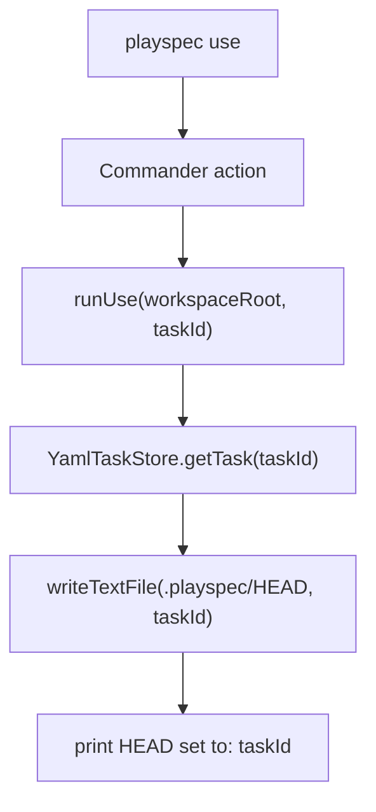
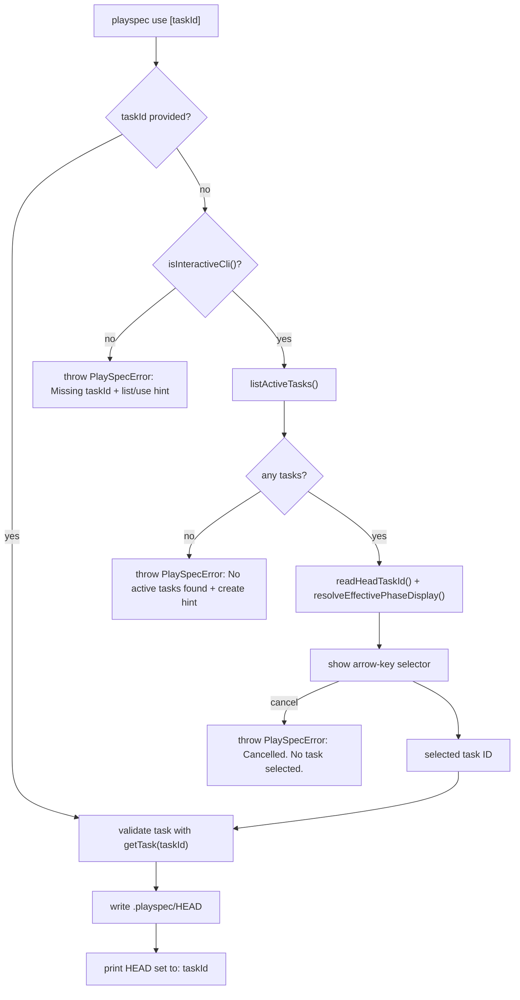

# 22-playspec_use_interactive_selector_issue Technical Spec

## Scope

This step defines the code-level technical spec for making `playspec use` open an interactive task selector when no task ID is provided in an interactive terminal.

In scope:

- Change the CLI entry point so `playspec use` can reach command logic without a required argument.
- Preserve `playspec use <taskId>` behavior.
- Add no-argument interactive selection over active tasks.
- Add a clear non-interactive no-argument failure.
- Reuse existing active-task listing, HEAD reading, and effective phase display behavior.
- Keep the command mutation-limited to `.playspec/HEAD`.

Out of scope:

- MCP task binding or session behavior.
- Task repair, archive/delete, search/filtering, multi-select, web UI, viewer work, or future phase behavior.
- Changing workflow execution, context validation, evidence, snapshots, rollback, or phase completion.

## Use Case Alignment

Verified source problem: users currently need to run `playspec list-tasks`, copy an ID, then run `playspec use <taskId>`. The intended user-facing use case is a terminal workflow where `playspec use` by itself presents active tasks and lets the user choose one with arrow keys and Enter.

Required behavior:

- `playspec use <taskId>` remains the direct scripted path.
- `playspec use` in an interactive TTY lists active tasks, marks the current HEAD task, shows workflow type and effective phase, then writes the selected task ID to `.playspec/HEAD`.
- Cancellation from the selector is non-mutating: restore terminal state, do not write `.playspec/HEAD`, and fail as a controlled command error with message `Cancelled. No task selected.`
- `playspec use` in an interactive TTY with no active tasks is non-mutating and fails as a controlled command error with message `No active tasks found.` and hint `Run: playspec create <workflowType> "<title>"`.
- `playspec use` in non-interactive mode does not prompt and fails with a recovery hint:

```text
Missing taskId.

Run:
  playspec list-tasks
  playspec use <taskId>
```

## High-Level Current Implementation Summary

Verified code behavior:

- The CLI registration currently declares `use <taskId>`, so Commander rejects `playspec use` before `runUse()` is called.
- `runUse()` is narrow: it creates `YamlTaskStore`, validates the task via `getTask(taskId)`, writes `.playspec/HEAD`, and prints `HEAD set to: <taskId>`.
- `list-tasks`, `current-task`, `current`, and `get-task` already use `resolveEffectivePhaseDisplay()` to show the first effective phase when `currentPhase` is `null` and `INVALID (...)` for unknown non-null phases.
- `list-tasks` already reads HEAD and marks the current task in list output.
- There is no existing arrow-key selector dependency in `package.json`.

Inferred behavior:

- The most direct implementation path is to keep the existing `runUse()` validation/write path for explicit task IDs and route selected IDs through the same HEAD write code or a small shared helper.
- Selector rows can be built from `TaskSummary` because active task listing already returns `id`, `title`, `workflowType`, and `currentPhase`.
- Selector cancellation and empty-list handling must be implemented before the shared HEAD write helper is called, so both paths can be tested as no-mutation paths.

## Relevant Files Reviewed

Must-read files reviewed:

- `.playspec/tasks/active/22_playspec_use_interactive_selector_issue/sources/source_problem.md` - source problem, UX, safety rules, and acceptance criteria.
- `src/cli/index.ts` - active CLI command registration; `use <taskId>` is currently required.
- `src/cli/commands/use.ts` - existing direct `use` behavior and HEAD mutation.
- `src/cli/cli-utils.ts` - `isInteractiveCli()`, `readHeadTaskId()`, `resolveEffectivePhaseDisplay()`, and invalid/effective phase formatting.
- `src/cli/commands/list-tasks.ts` - active task listing, HEAD marker, and effective phase display usage.
- `src/storage/task-store.ts` - store interface exposing `getTask()` and `listActiveTasks()`.
- `src/storage/yaml-task-store.ts` - active task listing, task validation, and task mutation methods.
- `tests/cli.test.ts` - current CLI test harness and existing phase display/read-only checks.

Maybe-read files reviewed:

- `src/cli/commands/current-task.ts` and `src/cli/commands/get-task.ts` - additional consumers of effective phase display.
- `src/cli/commands/current.ts` - deprecated HEAD display path still using effective phase display.
- `src/cli/commands/list.ts` - deprecated alias that delegates to `runListTasks()`.
- `src/cli/commands/create.ts` - existing interactive code is numbered selection, not arrow-key selection.
- `src/cli/commands/add-context.ts` - existing use of `isInteractiveCli()` and non-interactive error style.
- `src/workflow/workflow-loader.ts` and `src/workflow/phase-display.ts` - phase loading and label formatting.
- `src/core/types.ts` - `TaskRecord` and `TaskSummary` selector fields.
- `src/utils/fs.ts` and `src/utils/paths.ts` - HEAD path and file write helpers.
- `src/core/errors.ts` - existing `PlaySpecError` pattern for messages with hints.
- `package.json` - dependency inventory.

## Active Entry Points And Bypasses

Verified active entry point:

- `src/cli/index.ts` registers `.command('use <taskId>')`, which is the first blocker. No-argument behavior must start by changing this to optional syntax, likely `use [taskId]`, and by passing `string | undefined` to `runUse()`.

Verified explicit path:



Bypass and old paths:

- `playspec use` without an argument currently bypasses `runUse()` completely because Commander emits `missing required argument 'taskId'`.
- `playspec list` is an old/deprecated path that delegates to `list-tasks`; it already benefits from the same effective phase display but is not part of the selector implementation.
- MCP context resolution is a separate path and must not be coupled to CLI HEAD behavior.
- `create.ts` has a numbered selector for ambiguous planning tasks; it does not satisfy arrow-key selection and should not be treated as end-to-end support for this issue.

Partial migrations already present:

- Effective phase display is already centralized enough for reuse.
- HEAD marker logic exists in `list-tasks` but not in a reusable selector row formatter.
- Non-interactive detection exists in `isInteractiveCli()`, though some older commands still check TTY or environment directly.

## Current Architecture

Current CLI concerns are split as:

- `src/cli/index.ts` owns Commander command shapes and option parsing.
- `src/cli/commands/*.ts` own command behavior.
- `YamlTaskStore` owns task reading/listing/updating in `.playspec/tasks/active`.
- `.playspec/HEAD` is not modeled through `TaskStore`; commands read/write it through `getHeadPath()` plus filesystem helpers.
- Workflow display helpers sit in `src/cli/cli-utils.ts` and load workflow YAML through `WorkflowLoader`.

The `use` command currently does not instantiate `WorkflowLoader` because explicit `use <taskId>` does not need display metadata beyond validation. The new interactive branch will need workflow display only for the selector rows.

## Verified Behavior

Verified code behavior:

- Explicit `playspec use <taskId>` validates existence with `YamlTaskStore.getTask(taskId)`.
- Explicit `playspec use <taskId>` writes only `.playspec/HEAD` in `runUse()`.
- Existing `runUse()` does not call task update, phase completion, evidence, snapshot, rollback, or context validation code.
- `YamlTaskStore.listActiveTasks()` returns only tasks whose parsed `task.yaml` has `status: active` and skips unreadable entries.
- `resolveEffectivePhaseDisplay()` returns first phase with `(effective)` when `currentPhase` is `null`.
- `resolveEffectivePhaseDisplay()` returns `INVALID (<phase>) — allowed: ...` for invalid non-null phases, using chalk color.
- `list-tasks` displays active task ID, `[HEAD]`, workflow type, effective phase, and title.

Inferred behavior:

- A selected task with invalid `currentPhase` should still be selectable if selection writes HEAD using the existing `getTask()` validation path, because `getTask()` schema accepts arbitrary string `currentPhase`; invalid workflow phase detection is only display-level in `resolveEffectivePhaseDisplay()`.
- A selected task with missing `contextRefs` target files should remain selectable because `runUse()` does not render prompts or validate context refs.

Open verification needed in implementation:

- Arrow-key behavior must be tested in a real or emulated TTY, not only by piping stdin to the existing `runCli()` helper.
- The final output should include both selected task ID and title, while keeping the existing `HEAD set to: <taskId>` line compatible.

## Problems

Verified problems:

- `playspec use` cannot trigger custom interactive or non-interactive handling because Commander rejects the missing required argument first.
- There is no arrow-key selector helper in the current CLI.
- `package.json` has no prompt/menu dependency that directly provides a keyboard-selectable list.

Design risks:

- Implementing a custom raw-mode selector incorrectly can leave stdin in raw mode on errors or Ctrl+C.
- Adding a dependency increases install surface but likely reduces terminal edge-case risk.
- Reusing `resolveEffectivePhaseDisplay()` directly in selector rows can include chalk color codes in invalid phase text; acceptable for terminal display, but tests should account for color behavior or disable color.

## Proposed Direction

Intended flow after implementation:



Implementation direction:

- Change the CLI signature to `use [taskId]`.
- Change `runUse(workspaceRoot, taskId)` to accept `taskId?: string`.
- Keep the existing explicit task ID path as the first branch.
- In the no-argument branch, gate with `isInteractiveCli()`.
- In non-interactive mode, throw `PlaySpecError('Missing taskId.', 'Run:\n  playspec list-tasks\n  playspec use <taskId>')` or equivalent formatting that renders the required recovery hint clearly.
- For interactive mode, call `store.listActiveTasks()`, `readHeadTaskId()`, and `resolveEffectivePhaseDisplay()` to build rows.
- If no active tasks are returned, throw `PlaySpecError('No active tasks found.', 'Run: playspec create <workflowType> "<title>"')` before reading, validating, or writing HEAD.
- Prefer a small focused selector helper in `src/cli/commands/use.ts` or a new CLI-local helper module if reuse emerges. It must return only the selected task ID and must not write state itself.
- Selector cancellation through Ctrl+C or Escape must throw `PlaySpecError('Cancelled. No task selected.')`, must not call the HEAD write helper, and must restore terminal state before the error reaches `handleError()`.
- If a custom raw-mode selector is implemented, it must restore raw mode, stdin listeners, cursor visibility, and partial render state in a `finally` block for Enter, Escape, Ctrl+C, thrown errors, and early returns.
- Use a maintained prompt dependency only if implementation confirms one is needed for reliable arrow-key behavior. If adding one, keep it CLI-local and covered by tests.
- Dependency decision gate: any added prompt/test TTY dependency must support Node >=22, the current ESM/TypeScript build, `vitest`, non-interactive detection, and `pnpm build` without module workarounds. If this cannot be verified, use a custom `readline`/stdin implementation with the cleanup contract above.
- After selection, reuse the same validation and HEAD write path as explicit use.

Selector display requirements:

- Show task ID.
- Show title.
- Show workflow type as `[workflowType]`.
- Show `Phase: <effective display>`, using the full `resolveEffectivePhaseDisplay().phaseDisplay` string. This intentionally includes allowed phase IDs for invalid phases.
- Mark the task matching `.playspec/HEAD` with `[HEAD]` for consistency with `list-tasks`.
- Keep invalid phases selectable.

## File-By-File Plan

`src/cli/index.ts`

- Change command registration from `use <taskId>` to `use [taskId]`.
- Update the action parameter type to `string | undefined`.
- Keep `handleError(err)` behavior.

`src/cli/commands/use.ts`

- Accept optional `taskId`.
- Extract a small helper for the existing validate-and-write behavior, for example `setHeadToTask(workspaceRoot, store, taskId)`.
- Add a no-argument branch:
  - If `!isInteractiveCli()`, throw a clear `PlaySpecError`.
  - Load active tasks with `listActiveTasks()`.
  - If no active tasks exist, throw `PlaySpecError('No active tasks found.', 'Run: playspec create <workflowType> "<title>"')` without mutation.
  - Build selector rows using `WorkflowLoader`, `readHeadTaskId()`, and `resolveEffectivePhaseDisplay()`.
  - Run the selector. If the user cancels with Ctrl+C or Escape, throw `PlaySpecError('Cancelled. No task selected.')` without mutation.
  - Pass only a selected task ID to the same HEAD write helper.
- Print selected task ID/title after selection. Preserve `HEAD set to: <taskId>` for compatibility.

`src/cli/cli-utils.ts`

- Reuse existing helpers.
- Only add shared formatting or selector support here if it is genuinely shared by multiple commands. Avoid broad refactors in this issue.

`package.json` / `pnpm-lock.yaml`

- If a prompt library is chosen, add the minimal dependency and lockfile update.
- Before accepting the dependency, verify Node >=22, ESM/TypeScript build, `vitest`, non-interactive execution, and `pnpm build` compatibility.
- If a custom selector is implemented with Node `readline`, no dependency change is needed.
- Custom selector cleanup is acceptance-critical and must be covered by cancellation/error tests.

`tests/cli.test.ts`

- Add explicit path regression: `playspec use <taskId>` still sets HEAD.
- Add non-interactive no-arg test using `PLAY_SPEC_NON_INTERACTIVE=1`, asserting the custom missing task ID message and no HEAD mutation.
- Add selector row formatting coverage through extracted pure helpers if possible.
- Add integration coverage for arrow-key selection using a TTY-capable approach. This is acceptance-critical: at least one pseudo-terminal test must drive no-arg `playspec use`, press arrow keys, press Enter, and verify `.playspec/HEAD` changed to the selected task.
- Add cancellation coverage for Ctrl+C or Escape, asserting non-zero exit, `Cancelled. No task selected.`, no HEAD mutation, and restored terminal state where the harness can observe it.
- Add empty active-list coverage, asserting `No active tasks found.`, the create hint, and no HEAD mutation.
- Add read-only safety test confirming `task.yaml` `updatedAt` and `currentPhase` do not change after `use`.
- Add cases for `currentPhase: null` and invalid non-null `currentPhase` appearing correctly in selector display while still allowing selection.

## Risks And Open Questions

Resolved validation issues:

- R1 cancellation behavior resolved: Ctrl+C/Escape is a controlled non-mutating cancellation with `Cancelled. No task selected.`
- R2 selector lifecycle resolved as an invariant: custom raw-mode implementations must clean up raw mode, listeners, cursor visibility, and partial render state in `finally`.
- R3 TTY verification resolved as acceptance-critical: at least one pseudo-terminal integration test must prove arrow-key selection and Enter end to end.
- R4 dependency risk downgraded: a prompt dependency is allowed only after Node >=22, ESM/TypeScript, `vitest`, non-interactive, and `pnpm build` compatibility are verified.
- R5 empty active-list behavior resolved: `No active tasks found.` plus `Run: playspec create <workflowType> "<title>"`, with no HEAD mutation.
- R6 current marker resolved: selector rows use `[HEAD]`.
- R7 invalid phase display resolved: selector rows use full `resolveEffectivePhaseDisplay().phaseDisplay`, including allowed phase IDs for invalid phases.
- R8 diagram wording resolved: the flow is labeled intended, not verified.

Remaining implementation risks:

- TTY automation can be flaky if tests depend on terminal timing; keep selector logic testable through pure formatting helpers and isolate the true pseudo-terminal test.
- Formatting widths should be stable enough for readability but should not become a brittle public contract beyond required fields.

Current blockers:

- None at spec level after this patch. Implementation must still satisfy the selector cleanup, cancellation, dependency gate, pseudo-terminal test, and HEAD-only mutation requirements before completion can be claimed.

## Reader Aids

Terminology:

- `HEAD`: `.playspec/HEAD`, the CLI's current active task pointer.
- Active task: a task under `.playspec/tasks/active` whose `task.yaml` has `status: active`.
- Effective phase: display-only phase computed from workflow metadata. If `currentPhase` is `null`, it resolves to the first phase without mutating `task.yaml`.
- Invalid phase: display-only state where `currentPhase` is a non-null string that is not present in the task workflow.

Implementation invariant:

- `playspec use` changes only `.playspec/HEAD`. It must not mutate `task.yaml`, complete a phase, create artifacts, validate context ref files, or touch MCP session state.
