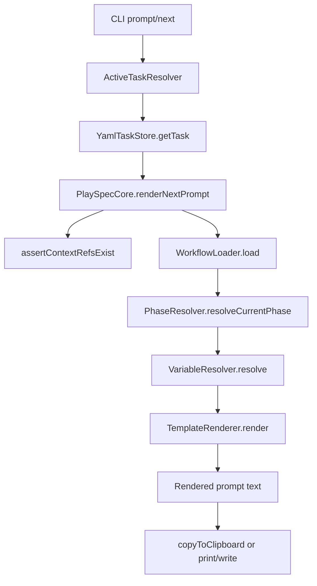
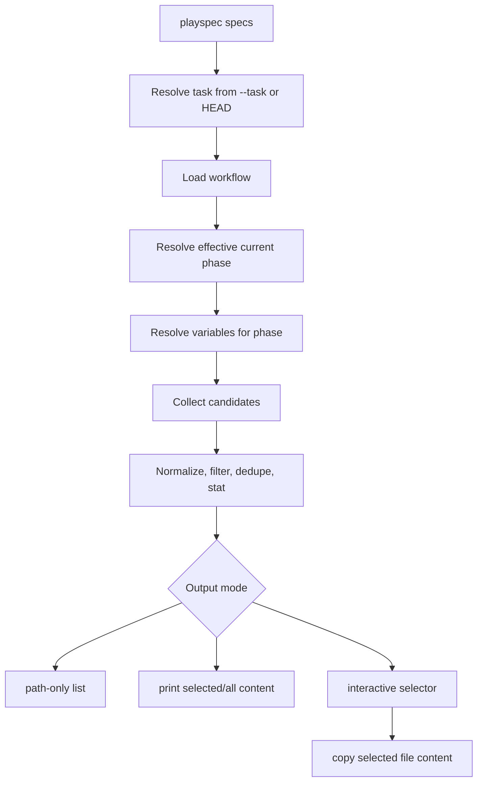

# 24-playspec_phase_aware_relevant_file_selector Technical Spec

## Scope

Build a CLI command, `playspec specs`, that helps a user find and use files relevant to the current task and effective workflow phase.

In scope:

- Resolve the task from `.playspec/HEAD` by default.
- Support explicit task selection with `--task <taskId>`.
- Resolve the effective current phase from the task workflow.
- Derive relevant file candidates from task context refs, resolved template variables, workflow phase metadata, rendered template text, and existing files under `task.paths.projectDocRoot`.
- Show existing files by default and missing expected files only with `--show-missing`.
- Let interactive users choose a file with an arrow-key dropdown, then copy its full content to the clipboard.
- Provide script-safe output through `--path-only`, `--print`, and `--no-copy`.

Out of scope:

- Viewer UI, MCP behavior, archive/delete/migration behavior, evolution proposals, rollback, and DAG execution.
- Hardcoded behavior for only `spec.md`, `plan.md`, `result.md`, or `pr.md`.
- Any task state mutation, phase completion, evidence collection, snapshot creation, or prompt snapshot creation.

## Use Case Alignment

Verified source problem: users currently need to remember paths, navigate directories, open files, and copy content manually. The requested user-facing flow is:

```bash
playspec specs
```

Interactive terminal behavior should show a dropdown of relevant files for the current task and effective phase. Selecting an existing file copies the file content to clipboard and reports success. Non-interactive usage should avoid opening a selector and should require an output mode such as `--path-only` or `--print`.

The core compatibility requirement is dynamic template support. Users can edit workflows and templates, so the selector should inspect the active task, workflow, current phase, resolved variables, template references, and rendered prompt context rather than maintaining a fixed phase-to-filename table.

## High-Level Current Implementation Summary

Verified code behavior:

- There is no `playspec specs` command registered in `src/cli/index.ts`.
- Current CLI task resolution is available through `ActiveTaskResolver.resolveTask(taskId?)`, which reads `.playspec/HEAD` when no task ID is passed.
- Current phase resolution is available through `PhaseResolver.resolveCurrentPhase(task, workflow)`, where `currentPhase: null` means the first workflow phase is effective without mutating task state.
- Prompt rendering already resolves workflow, phase, variables, required variables, template includes, and Handlebars output through `PlaySpecCore.renderNextPrompt()`.
- `VariableResolver` already derives standard file variables such as `SPEC_FILE`, `PLAN_FILE`, `RESULT_FILE`, `PR_FILE`, `SOURCE_PROBLEM_FILE`, legacy phase files, implementation files, test result files, and PR body files.
- `TemplateRenderer` expands `{{include:...}}` directives relative to `.playspec`, validates include paths stay inside `.playspec`, and renders final prompt text.
- `copyToClipboard()` already supports clipboardy, platform commands, Linux PRIMARY best-effort after command fallback, and OSC52 fallback.
- `runUse()` already contains a small raw-mode arrow-key selector that can be reused or generalized for `playspec specs`.

Inferred behavior:

- The simplest safe implementation is a new read-only CLI command backed by a small relevant-file discovery service. It should share task/phase/variable/template resolution with prompt rendering but must not call APIs that write prompt snapshots or complete phases.

Open questions:

- Whether the selector helper should stay command-local at first or be extracted from `use.ts` into a shared CLI utility as part of implementation.
- Resolved for implementation: non-interactive `--print` prints all existing text candidates in candidate priority order with deterministic separators.

## Relevant Files Reviewed

Must-read files reviewed:

- `.playspec/tasks/active/24_playspec_phase_aware_relevant_file_selector/sources/source_problem.md` - requested UX and source-of-truth behavior.
- `.playspec/tasks/active/24_playspec_phase_aware_relevant_file_selector/task.yaml` - current task variables, doc root, context refs, and effective first phase.
- `src/cli/index.ts` - command registration and option patterns.
- `src/cli/commands/use.ts` - existing interactive selector implementation.
- `src/cli/commands/prompt.ts` - current task resolution, phase metadata display, prompt rendering, clipboard fallback.
- `src/core/active-task-resolver.ts` - HEAD/default task resolution.
- `src/core/types.ts` - task, context ref, workflow, and phase shapes.
- `src/storage/task-store.ts` and `src/storage/yaml-task-store.ts` - task loading/listing persistence.
- `src/workflow/phase-resolver.ts` and `src/workflow/workflow-loader.ts` - workflow and effective phase resolution.
- `src/template/variable-resolver.ts` - file/path variable derivation and context ref variable behavior.
- `src/template/template-renderer.ts` - include expansion and rendered prompt behavior.
- `src/utils/clipboard.ts` - clipboard behavior.
- `src/preset/assets/default/workflows/mono-spec.yaml` - active workflow phases and required variables.
- `tests/cli.test.ts` - CLI and PTY test patterns.

Maybe-read files reviewed where needed:

- `src/cli/cli-utils.ts` - interactivity detection and phase display helpers.
- `src/utils/paths.ts` and `src/utils/fs.ts` - canonical path and file helpers.
- `src/core/schemas.ts` - task/workflow schema fields.
- `tests/unit/variable-resolver.test.ts` - current file-variable expectations.
- `tests/unit/clipboard.test.ts` - clipboard result shape expectations.
- `tests/integration/init-create-next.test.ts` - mono-spec prompt variable expectations.
- `package.json` - available dependencies and build/test commands.
- `src/preset/assets/default/templates/mono-spec/*.md` - phase-specific file references.

## Active Entry Points And Bypasses

Verified active entry points:

- `playspec prompt` resolves the HEAD task or `--task`, checks active status only for implicit HEAD, renders the current phase prompt, and copies by default.
- `playspec next` is a deprecated alias for prompt behavior.
- `playspec phase <phaseId>` renders an explicit phase prompt for the active task or `--task`.
- `playspec use [taskId]` sets `.playspec/HEAD`; no-arg interactive mode uses a dropdown selector.
- `playspec current`, `current-task`, `list`, and `list-tasks` display task and phase context but do not expose file contents.

Bypass and alternate paths:

- `playspec phase <phaseId>` can render a prompt for a phase that is not the task's current effective phase. `playspec specs` should not silently use this path unless a future explicit phase flag is added.
- `PlaySpecCore.renderNextPrompt()` validates context refs exist and renders the prompt but returns only text; it does not expose resolved variables or include paths as structured data.
- `VariableResolver.resolve()` exposes many path-like variables, but current callers do not classify which ones are relevant files.
- `TemplateRenderer.render()` consumes template/include paths internally; there is no public API today to return include dependencies.
- `copyToClipboard()` may report `primaryOk` only on platform-command fallback, not when clipboardy succeeds first.

Partial migrations:

- Mono-spec workflows now use stable docs files (`spec.md`, `plan.md`, `result.md`, `pr.md`), while non-mono workflows still derive legacy phase-specific file variables. The selector must support both rather than assuming mono-spec.
- Context refs exist in task records and prompt variables, but there is no command that presents them as selectable files with copy behavior.

## Current Architecture

Verified flow for prompt rendering:



Verified current data sources relevant to file selection:

- `task.contextRefs[]` stores explicit source and planning context paths.
- `task.paths.projectDocRoot` defaults to `docs/features/<taskId>`.
- `task.variables` can override standard file variables.
- `VariableResolver.resolve()` merges task variables with derived workflow/task/phase variables.
- Workflow phase definitions provide `template`, `requiredVariables`, optional `outputs`, gate routing, and next routing.
- Templates contain literal variable references and include directives.

## Verified Behavior

Task and phase:

- `YamlTaskStore.createTask()` sets `currentPhase: null`, `paths.taskRoot`, `paths.projectDocRoot`, and `variables.FEATURE_SLUG`.
- `PhaseResolver.resolveCurrentPhase()` treats `currentPhase: null` as the first `phaseOrder` entry.
- `PlaySpecCore.renderNextPrompt()` rejects invalid non-null `currentPhase` before rendering.
- Display-only helpers in `cli-utils.ts` can show effective and invalid phases without mutating state.

Variables and templates:

- For mono-spec, `SPEC_FILE`, `PLAN_FILE`, `RESULT_FILE`, and `PR_FILE` resolve under `task.paths.projectDocRoot`.
- Mono-spec implementation/test/PR aliases resolve to those same stable files.
- Non-mono workflows keep legacy variables such as `MASTER_SPEC_FILE`, `MASTER_PHASE_FILE`, `IMPLEMENTATION_PLAN_FILE`, `TEST_RESULT_FILE`, and `PR_BODY_FILE`.
- `SOURCE_PROBLEM_FILE` is chosen from `contextRefs` with priority for `role: source-problem`, then `source: stdin`, then the only context ref, otherwise `(multiple context refs)`.
- Template includes are resolved under `.playspec`; include paths are template dependencies but usually not task-relevant user docs.

Clipboard and interaction:

- `copyToClipboard()` tries clipboardy first, then platform clipboard commands, then OSC52.
- On Linux platform-command fallback, it attempts PRIMARY selection separately.
- `runUse()` verifies the command can run a raw-mode selector with Up/Down, Enter, Esc, and Ctrl+C behavior.
- Non-interactive detection already exists as `isInteractiveCli()`.

## Problems

Verified missing behavior:

- `playspec specs` does not exist.
- No code currently extracts relevant files from resolved variables, rendered template text, or workflow phase metadata.
- No code currently lists missing expected files separately.
- No code currently provides file-content copy behavior for selected task docs/context files.
- The current selector is private to `use.ts`.

Design problems to solve:

- Relevant file discovery needs multiple sources with deduplication and priority, not a single hardcoded mapping.
- Path candidates must be filtered to workspace-relative file paths and must reject absolute paths, escaped paths, placeholders like `(none)`, and internal template paths unless intentionally shown.
- Rendering a prompt is useful for discovering dynamic references, but discovery should avoid creating prompt snapshots or mutating task state.
- Missing future docs are expected in early phases and must not fail the command.

## Proposed Direction

Implement a read-only relevant-file discovery path. The diagram below shows the happy path only; warning, invalid-path, render-degraded, binary-file, large-file, and clipboard-failure branches are specified in command behavior and the risk ledger.



Candidate collection priority:

1. Explicit task context refs:
   - `task.contextRefs[].path`
   - Existing source files under `${task.paths.taskRoot}/sources/`
2. Resolved variables:
   - Any variable name ending in `_FILE`, `_PATH`, or `_DOC`.
   - Existing context variables that contain markdown bullet paths, such as `CONTEXT_FILES`, should be parsed conservatively for backticked paths.
3. Workflow/template-derived references:
   - Current phase `requiredVariables` that point to path-like resolved variables.
   - Current phase `outputs`, if present and path-like.
   - Path-like values discovered in the rendered current prompt.
   - Template/include file paths may be recorded as technical dependencies but should not be shown as user docs by default.
4. Existing files under `task.paths.projectDocRoot`:
   - Use as a fallback/supplement after higher-priority candidates.
   - Filter by current phase where possible using references discovered in the current phase prompt and variables.

Recommended candidate shape:

```ts
interface RelevantFileCandidate {
  path: string;
  absolutePath: string;
  exists: boolean;
  source: 'context-ref' | 'task-source' | 'variable' | 'workflow' | 'rendered-prompt' | 'project-doc-root';
  reason: string;
  variableName?: string;
}
```

Filtering rules:

- Accept workspace-relative paths only.
- Normalize paths with `path.normalize()` and resolve against `workspaceRoot`.
- Reject paths that escape the workspace after resolution, but record a warning so the CLI can tell the user and continue with valid candidates.
- For existing files, resolve the real path before reading or copying and reject symlinks that escape the workspace. Use the same safety intent as `resolveOutputFilePath()` in `src/cli/cli-utils.ts`, adapted for read paths.
- Reject empty strings, placeholder strings, URLs, shell fragments, and path values inside `.playspec/templates` by default, again as warnings rather than fatal errors for candidate discovery.
- Prefer markdown/text-like files for display, but do not require `.md` only because user-defined docs may use other text extensions.
- Validate existing candidate content as UTF-8 text before `--print` or clipboard copy. Binary or non-UTF-8 files must be skipped for content output with a warning; they may still appear in `--path-only` output if the path is otherwise valid and existing.
- Existing files appear in the default list; missing files appear only with `--show-missing`.
- Missing context refs discovered during candidate building should not make `specs` unusable if other valid files exist. This is intentionally different from prompt rendering, where `PlaySpecCore.assertContextRefsExist()` currently throws.

Command behavior:

- `playspec specs` in an interactive TTY shows existing candidate files in priority order and copies selected content.
- `playspec specs --path-only` prints existing matching paths, one per line.
- `playspec specs --path-only --show-missing` prints existing paths to stdout and missing paths to stderr under a `Missing expected files:` heading, so stdout remains usable by scripts that consume existing paths.
- `playspec specs --print` prints file content.
  - In an interactive TTY, selection happens first, then the selected file content is printed to stdout.
  - In non-interactive mode, all existing UTF-8 text candidates are printed to stdout in candidate priority order with separators of the form `===== <workspace-relative-path> =====`.
  - Missing, invalid, binary, non-UTF-8, skipped large-file, and discovery warning messages go to stderr.
- `playspec specs --no-copy` in interactive mode selects and reports the path without copying; paired with `--print`, it prints content.
- Non-interactive plain `playspec specs` fails clearly with a hint to use `--path-only` or `--print`.
- If clipboard copy fails after file selection, the command must not create a fallback file. When `--print` is active it has already printed, or should print, the selected file content to stdout. Otherwise it fails clearly with a hint to rerun with `--print` or `--no-copy`.
- If Linux PRIMARY selection fails but CLIPBOARD succeeds, the command should still report clipboard success and include a warning for PRIMARY only when that state is observable from `copyToClipboard()` result data. Do not change clipboard internals solely to guarantee PRIMARY reporting in this phase.
- Large-file threshold is 1 MiB based on the candidate file byte size.
  - Add `--force-large` in this phase.
  - If the selected or printed file is larger than 1 MiB, interactive mode asks for confirmation, for example `Selected file is 2.4 MB. Copy anyway? [y/N]`.
  - Non-interactive `--print` skips files larger than 1 MiB unless `--force-large` is present, writes a warning to stderr for each skipped file, and continues with other valid candidates.
  - Non-interactive clipboard/copy behavior for a large file must fail with a clear hint unless `--force-large` is present.

## File-By-File Plan

- `src/cli/index.ts`
  - Register `specs`.
  - Options: `--task <id>`, `--print`, `--path-only`, `--no-copy`, `--show-missing`, `--force-large`.

- `src/cli/commands/specs.ts` new
  - Resolve task using `ActiveTaskResolver`.
  - Enforce active-status behavior consistent with `prompt`: implicit HEAD must be active; explicit task may be read.
  - Call a relevant-file discovery helper.
  - Handle non-interactive mode, selector, printing, path-only output, clipboard copying, observable PRIMARY warnings, invalid-path and symlink-escape warnings, UTF-8 validation, large-file confirmation/refusal, and clear clipboard-failure messaging without creating files.

- `src/core/relevant-files.ts` or `src/template/relevant-files.ts` new
  - Implement pure candidate discovery from task, workflow, phase, variables, rendered prompt, and filesystem.
  - Keep this read-only and independent of CLI output.
  - Return accepted candidates plus warning records for invalid, escaped, symlink-escaped, missing, unreadable, or ignored candidate paths so the CLI can warn and continue.
  - Prefer path aliases for imports.

- `src/template/template-renderer.ts`
  - Optionally expose a read-only helper for include expansion or render metadata if needed.
  - Avoid changing existing `render()` behavior unless tests prove it is necessary.

- `src/cli/commands/use.ts` and/or `src/cli/selector.ts` new
  - Extract the existing selector only if reuse is cleaner than duplication.
  - Preserve existing `playspec use` behavior.

- `src/utils/clipboard.ts`
  - Reuse as-is for selected file copy.
  - Only change if user-visible PRIMARY warning or deterministic clipboard fallback handling requires more explicit result reporting.

- `tests/cli.test.ts`
  - Add focused CLI tests for `specs --path-only`, `--show-missing`, non-interactive failure, `--task`, context refs, variable-derived docs, and no mutation.
  - Add PTY test for selecting a file and copying behavior with `PLAY_SPEC_DISABLE_CLIPBOARD=1` or another deterministic fallback path as appropriate.
  - Add tests for invalid and symlink-escaped candidate warnings with continuation, clipboard failure messaging/printing, binary/non-UTF-8 exclusion, deterministic non-interactive `--print` separators, and large-file confirmation, skipping, or `--force-large`.

- `tests/unit/variable-resolver.test.ts`
  - No required change unless discovery introduces a new variable API.

- New unit tests for relevant-file discovery
  - Cover dedupe, path filtering, warning records, missing-file classification, context refs priority, `_FILE`/`_PATH`/`_DOC` variables, and project doc root fallback.

## Risks And Open Questions

Risks:

- Rendering the prompt to discover paths can throw on missing context refs, missing templates, unresolved placeholders, or invalid current phases. Discovery must degrade for recoverable prompt-render failures: keep candidates from context refs, resolved variables, workflow metadata, and `projectDocRoot`, then return a warning that rendered-prompt candidates were unavailable. Invalid current phase remains fatal because the command cannot identify the effective phase safely.
- Regex extraction from rendered prompt can overmatch prose. The first implementation must only extract backticked workspace-relative path strings and already-resolved path-like variable values; no broad prose scanning in this phase.
- Reusing the `use` selector by extraction can accidentally alter existing `playspec use` terminal behavior. Existing PTY tests should remain unchanged.
- Clipboard behavior is environment-dependent. Tests should avoid depending on a real system clipboard.
- Showing all files under `projectDocRoot` may become noisy. The fallback should be lower priority and phase-filtered when possible.
- Duplicate candidate paths may come from several sources. Deduplication should keep the highest-priority source for display and preserve additional reasons in a warning/detail field only if useful for tests or debugging.

Finalized risk ledger:

| Risk ID | Status | Final contract |
| --- | --- | --- |
| R1 `--print` behavior | Resolved | Non-interactive `--print` prints all existing UTF-8 text candidates with deterministic separators. Interactive `--print` prints the selected candidate. |
| R2 large-file policy | Resolved | Threshold is 1 MiB. Add `--force-large`. Interactive mode confirms; non-interactive `--print` skips without `--force-large`; non-interactive copy refuses without `--force-large`. |
| R3 clipboard fallback vs read-only | Resolved | `specs` must not create files. Clipboard failure prints content only when `--print` is active; otherwise it fails with a hint to rerun with `--print` or `--no-copy`. |
| R4 render failure policy | Downgraded | Recoverable render failures produce degraded discovery plus warning. Invalid current phase remains a blocker/fatal error. |
| R5 binary/non-UTF-8 handling | Resolved | Validate content before print/copy. Skip binary or non-UTF-8 content output with stderr warning; allow valid existing path in `--path-only`. |
| R6 diagram completeness | Resolved | Architecture diagram is explicitly happy path only; branch behavior is specified textually. |
| R7 selector extraction regression | Active low risk | Extraction is optional. If implemented, existing `playspec use` PTY tests must continue to pass. |
| R8 noisy `projectDocRoot` fallback | Active low risk | Keep fallback low priority and phase-filter where current phase references provide enough signal. |
| R9 symlink workspace escape | Resolved | Existing candidate real paths must stay inside the workspace before read/copy; symlink escapes warn and are skipped. |

Remaining blocker status:

- No spec blockers remain after this patch.
- Implementation must still prove entry point -> discovery data -> selector/output propagation -> copy/print/clipboard-failure behavior -> no task/HEAD/workspace mutation through tests.

## Reader Aids

Definitions:

- Effective phase: the phase used for current work. If `task.currentPhase` is `null`, it is the first phase in `workflow.phaseOrder` and task state is not mutated.
- Context ref: an explicit task-linked file in `task.contextRefs[]`, usually a source problem or planning context.
- Candidate: a potential relevant file path before existence filtering.
- Existing candidate: a candidate whose resolved workspace path exists as a file.
- Missing candidate: a path-like candidate that is expected from variables/templates but does not exist yet.

Implementation invariant:

- `playspec specs` must be read-only with respect to task state, workflow state, and workspace files. It may read files and copy selected content to clipboard, but it must not create or update files, including `task.yaml`, `.playspec/HEAD`, phase history, snapshots, evidence, reviews, prompt snapshots, or output fallback files.

Suggested verification chain for implementation:

1. CLI entry point resolves task and phase.
2. Discovery uses task context refs and resolved phase variables.
3. Discovery adds rendered prompt and project-doc-root candidates without hardcoded mono-spec filenames.
4. Missing future files are filtered by default and shown with `--show-missing`.
5. Interactive selection copies selected file content.
6. Interactive `--print` prints the selected file content; non-interactive `--print` prints all existing UTF-8 text candidates with deterministic separators.
7. Invalid candidate paths warn and valid candidates still work.
8. Binary or non-UTF-8 content is skipped for print/copy with a warning.
9. Clipboard failure prints only when `--print` is active; otherwise it fails with a rerun hint and does not create files.
10. Large selected files warn before copying and require confirmation interactively; non-interactive large files obey `--force-large`.
11. Non-interactive mode never opens a selector.
12. Task, HEAD, docs, output, prompt, evidence, review, and snapshot files are unchanged after all `specs` modes.
