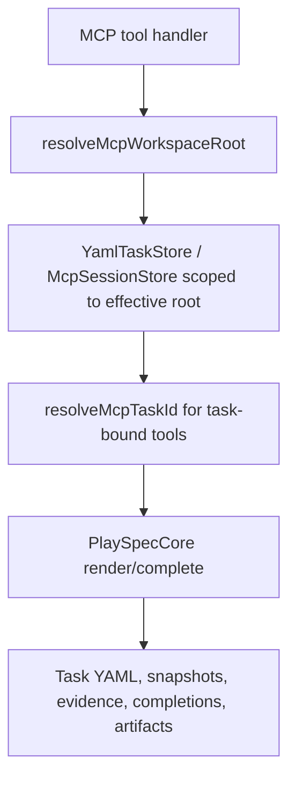
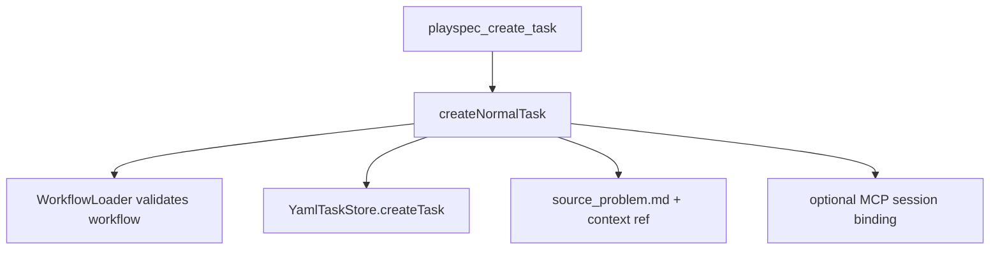

# Technical Spec: End-to-end MCP-only PlaySpec lifecycle test

## Scope

Add a product-level MCP integration test for the PlaySpec lifecycle. The test must drive task creation, session binding, prompt rendering, context addition, phase completion, gated routing, final completion, artifact/status lookup, and evolution proposal handling through MCP tool handlers.

Small supporting fixes are in scope when the lifecycle test exposes MCP/CLI drift or workspace-root inconsistencies. Broad workflow redesign, network calls, production GitHub behavior, and production workflow mega-tests are out of scope.

## Use Case Alignment

The user-facing contract is that an MCP client can complete a PlaySpec task without falling back to the CLI. The test should prove this with a minimal project-local workflow fixture so lifecycle mechanics stay separate from built-in workflow policy.

## High-level Current Implementation Summary

Verified:

- `src/mcp/server.ts` registers `playspec_create_task`, `playspec_use_session_task`, `playspec_render_next_prompt`, `playspec_add_context`, `playspec_complete_phase`, task lookup/listing, and evolution tools.
- `playspec_create_task` delegates to `createNormalTask()` in `src/core/task-creation.ts`, validates the workflow, creates the task through `YamlTaskStore`, writes source problem content, updates `.playspec/HEAD`, and can bind a session.
- MCP phase tools resolve task context with `resolveMcpTaskId()` and a scoped `McpSessionStore`/`TaskIdResolver`; they do not call `ActiveTaskResolver`.
- `PlaySpecCore.completePhase()` handles non-routed phases, gated result routing, completion records, snapshots, evidence files, finalized artifact reporting, and terminal operator guidance.
- Existing `tests/integration/mcp-server.test.ts` covers many individual MCP paths, including task creation, first render, explicit workspace behavior, feedback capture, and terminal completion, but not one full lifecycle contract in a single MCP-only pipeline.

Inferred:

- A single test can use the registered tool handlers directly, avoiding CLI execution entirely after `PresetManager.initWorkspace()` test bootstrapping.

Open questions:

- Full duplicate task/proposal rerun semantics appear to live in separate dedupe work. The lifecycle test should assert current duplicate behavior and leave a follow-up note if true rerun idempotency is not implemented.
- Some evolution tools are server-root scoped today, while `playspec_generate_evolution_proposal` accepts task/session context and resolves workspace root. If the lifecycle test uses explicit workspace-root evolution listing/getting, a support fix may be needed.

## Relevant Files Reviewed

- `src/mcp/server.ts`: MCP tool registration and request handlers.
- `src/mcp/context.ts`: MCP task/session resolution path.
- `src/mcp/errors.ts`: structured MCP context errors and next-action hints.
- `src/core/task-creation.ts`: shared task creation API used by CLI and MCP.
- `src/core/playspec-core.ts`: prompt rendering, phase completion, routing, terminal artifact/status metadata, feedback capture.
- `src/storage/yaml-task-store.ts`: task persistence, duplicate task protection, active/completed listing.
- `tests/integration/mcp-server.test.ts`: current MCP integration helper style and existing individual lifecycle coverage.

## Active Entry Points and Bypasses

Active MCP entry points:

- `playspec_create_task`
- `playspec_use_session_task`
- `playspec_render_next_prompt`
- `playspec_add_context`
- `playspec_complete_phase`
- `playspec_get_task`
- `playspec_list_tasks`
- `playspec_generate_evolution_proposal`
- `playspec_get_evolution_proposal`

Bypasses to avoid in the new lifecycle test:

- Direct `YamlTaskStore.createTask()` for the lifecycle task.
- CLI commands for task creation or phase progression.
- `ActiveTaskResolver` or `.playspec/HEAD` fallback for MCP task resolution.
- Built-in production workflows as the primary lifecycle fixture.

Allowed setup:

- `PresetManager.initWorkspace()` to bootstrap a temp PlaySpec workspace.
- Writing a minimal project-local workflow fixture and fixture artifact files.
- `git init` only if evidence collection requires a repository.

## Current Architecture

Verified flow:

Task creation flow:

## Verified Behavior

- MCP task creation can create a `mono-spec` task with source problem text and render the first prompt.
- Explicit workspace-root MCP creation stores tasks and sessions in the project workspace rather than the server workspace.
- MCP completion returns routed `nextPhase`, terminal `isWorkflowComplete`, `operatorGuidance`, and finalized artifact metadata.
- Missing MCP task/session context produces an error with guidance to call `playspec_use_session_task`.
- Existing terminal tests use direct store setup, so they do not prove the lifecycle starts through MCP.

## Problems

- No single integration test proves MCP-only lifecycle continuity from task creation to final state.
- Current coverage can miss regressions where one MCP tool works in isolation but the combined product flow breaks.
- Duplicate rerun and evolution behavior are not yet proven as part of the lifecycle contract.
- Some evolution handlers use server-root stores, so explicit project-local evolution reads may not match the scoped behavior of task-bound tools.

## Proposed Direction

Add a new test in `tests/integration/mcp-server.test.ts` under the MCP server suite:

1. Bootstrap a temp workspace with `PresetManager.initWorkspace()`.
2. Write a minimal project-local workflow fixture with phases:
   - `problem`: normal phase.
   - `gate`: gated phase with `approved -> final` and another valid route for rejection.
   - `final`: terminal phase.
3. Define workflow variables and artifacts for spec/result output paths.
4. Create source/context fixture files and final artifact files.
5. Drive the lifecycle only through MCP handlers:
   - create task with `playspec_create_task` and `bindSessionId`.
   - render first prompt through the session.
   - add context through MCP.
   - complete normal phase.
   - render gate phase.
   - assert missing gated result returns a structured MCP error mentioning `playspec_complete_phase` and valid action guidance if support is added; otherwise add the smallest core error hint fix.
   - complete gate with `approved` and assert next route.
   - render final.
   - complete final and assert terminal status, finalized artifacts, and operator guidance.
   - get/list task status through MCP.
   - generate an evolution proposal through MCP using explicit session/workspace context and fetch it through MCP.
   - attempt duplicate task creation with the same task id and assert no second task is created; record full rerun idempotency as pending follow-up if not supported.
6. Spy on `execa` or otherwise assert no CLI helper is invoked by the lifecycle test. Since handlers are called directly, this can be a module-level spy with no calls during the lifecycle block.

## File-by-file Plan

- `tests/integration/mcp-server.test.ts`
  - Add lifecycle fixture helpers only if they keep the test readable.
  - Add the MCP-only lifecycle integration test under the MCP server integration suite.
  - Prefer existing `getRegisteredToolHandler()` and `parseToolJson()` helpers.

- `src/core/errors.ts`
  - If gated completion errors lack MCP-action guidance, update the relevant `PlaySpecError` hints narrowly so MCP errors mention the next valid MCP action/tool.

- `src/mcp/server.ts`
  - If evolution proposal lookup/listing needs explicit workspace support for the lifecycle test, scope those stores per `workspaceRoot` consistently with task tools.

- `docs/features/add_end_to_end_mcp_only_playspec_lifecycle_test/result.md`
  - Record final validation and any pending dedupe/evolution follow-ups.

## Risks / Open Questions

- Avoid making the new test too broad. It should prove lifecycle mechanics with one minimal fixture, not exhaust every built-in workflow policy.
- If MCP dedupe support is not implemented, assert current duplicate prevention and document follow-up tied to workflow/task dedupe work.
- If the evolution contract is only partially scoped, keep the support fix small and covered by the same lifecycle test.
- Do not create an MCP dependency on CLI or global HEAD.

## Reader Aids

- "MCP-only" in this spec means task creation and phase progression use MCP tool handlers, not CLI commands or direct task store setup.
- Test harness bootstrapping may initialize a temp workspace and write fixture workflow files.
- The lifecycle task itself must be created via `playspec_create_task`.
