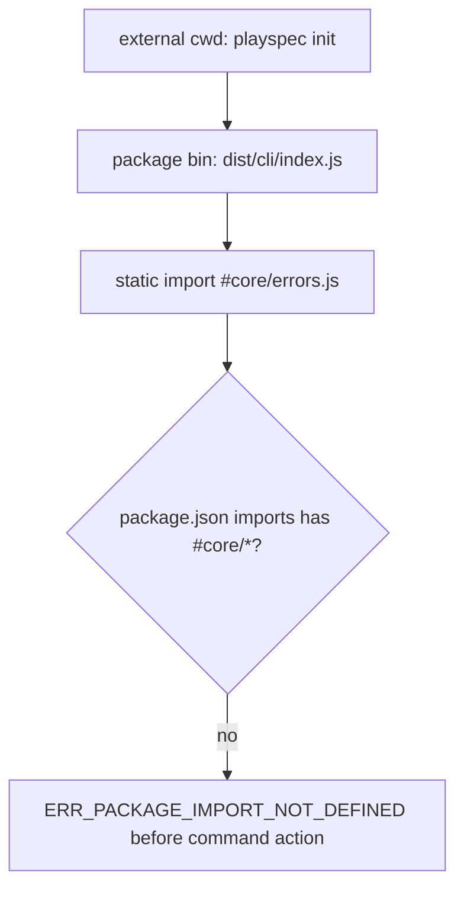
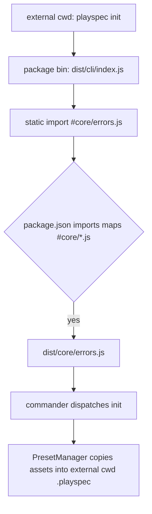

# cross_project_cli_import_alias_bug Technical Spec

## Scope

This spec covers the runtime import-alias failure reported in `cross_project_cli_import_alias_bug.md`.

In scope:

- Make PlaySpec's packaged/linkable runtime entrypoints resolve existing internal package-import aliases.
- Cover aliases currently used by runtime source and emitted `dist` files:
  `#core/*.js`, `#storage/*.js`, `#workflow/*.js`, `#template/*.js`, `#preset/*.js`, `#utils/*.js`, `#mcp/*.js`, and `#migration/*.js`.
- Treat `package.json` `"imports"` as the required Node ESM runtime mechanism for those alias families; `tsconfig.json` `"paths"` and Vitest aliases are not runtime substitutes.
- Verify the human CLI can run from an external project directory, with `playspec init` as the primary user-visible smoke path.
- Include the MCP bin in the analysis because `package.json` exposes `playspec-mcp` and it uses the same alias scheme.
- Add focused regression coverage where practical.

Out of scope:

- Reworking the module architecture or replacing aliases with long relative imports.
- Adding future workflow phases, viewer functionality, harness behavior, archive behavior, or new MCP features.
- Changing Core/CLI responsibility boundaries.
- Changing task state semantics, `.playspec/HEAD` behavior, or migration behavior.

## Use Case Alignment

Verified source problem:

- A user links or installs PlaySpec and runs `playspec init` from another project directory.
- Node loads PlaySpec's package entrypoint from the PlaySpec package, then fails before command handling with:
  `TypeError [ERR_PACKAGE_IMPORT_NOT_DEFINED]: Package import specifier "#core/errors.js" is not defined in package /volume2/PJ/playspec/package.json`.

Intended user-facing behavior:

- `playspec init` must work when the current working directory is an external project, not only when commands are run inside the PlaySpec repository.
- Runtime alias resolution must be package-owned, deterministic, and independent of the caller's current working directory.

Inferred implementation target:

- Because package imports beginning with `#` are resolved through the nearest package's `package.json` `"imports"` field at runtime, PlaySpec's `package.json` must define mappings that mirror the runtime aliases.

## High-Level Current Implementation Summary

Verified code behavior:

- `package.json` declares `"type": "module"`.
- `package.json` exposes two bins:
  - `playspec`: `dist/cli/index.js`
  - `playspec-mcp`: `dist/mcp/index.js`
- `package.json` has no `"imports"` field.
- `tsconfig.json` defines TypeScript path aliases for all internal modules.
- Source and emitted `dist` JavaScript both contain `#...` specifiers.
- Existing CLI and MCP tests mostly run source entrypoints through `tsx --tsconfig`, which lets the test runner resolve aliases and bypasses package-bin resolution.

Current flow, verified:



Proposed flow:



## Relevant Files Reviewed

Must-read files reviewed:

- `cross_project_cli_import_alias_bug.md` - source problem, observed error, expected behavior, required fix.
- `package.json` - bin entrypoints, build script, dependency mode, and missing runtime `"imports"`.
- `tsconfig.json` - existing alias list that runtime mappings should mirror.
- `src/cli/index.ts` - human CLI entrypoint; imports `#core/errors.js` before command dispatch.
- `tests/cli.test.ts` - existing CLI harness uses `tsx` against source from temp workspaces.

Maybe-read files reviewed because they affect the same runtime surface:

- `src/mcp/index.ts` - MCP bin entrypoint; imports `./server.js`, which imports aliased runtime modules.
- `tests/integration/mcp-server.test.ts` - MCP process smoke test also uses `tsx` source execution.
- `src/cli/commands/init.ts` - `playspec init` action delegates to `PresetManager`.
- `src/preset/preset-manager.ts` - init writes `.playspec` under `process.cwd()` supplied by the CLI.
- `src/utils/paths.ts` - workspace-relative path helpers used by init and other commands.
- `README.md` architecture section - documents the same alias families.
- `dist/cli/index.js`, `dist/mcp/server.js`, and sampled `dist/*` files - emitted JavaScript still contains package-import aliases.

## Active Entry Points and Bypasses

Active runtime entry points:

- `dist/cli/index.js` via `package.json` bin `playspec`.
- `dist/mcp/index.js` via `package.json` bin `playspec-mcp`.

Source/dev entry points:

- `src/cli/index.ts` through `pnpm dev` or `npx tsx --tsconfig ...`.
- `src/mcp/index.ts` through existing MCP process tests.

Bypass paths identified:

- `tests/cli.test.ts` executes `npx tsx --tsconfig <repo>/tsconfig.json <repo>/src/cli/index.ts ...` from temp workspaces. This proves command behavior from an external cwd, but not package-bin/runtime alias resolution.
- `tests/integration/mcp-server.test.ts` executes `src/mcp/index.ts` with `tsx`, so it does not prove `dist/mcp/index.js` can start under Node package resolution.
- `vitest.config.ts` defines resolve aliases for tests, so direct imports in test files are not evidence that Node can resolve package imports after build.
- TypeScript accepts source imports because `tsconfig.json` has `"paths"`, but Node does not read `tsconfig.json` for runtime ESM package imports.

Old or partial migration paths:

- The codebase standardized cross-module imports on `#...` aliases.
- The runtime package metadata was not migrated to define corresponding Node `"imports"`.
- The build script includes `tsc-alias`, but verified emitted `dist` files still contain `#...` specifiers. Therefore the package currently depends on Node package-import mappings that do not exist.

## Current Architecture

Verified architecture:

- CLI is the human adapter and passes `process.cwd()` as the workspace root.
- Core modules use explicit task IDs where possible and are not responsible for package-level module resolution.
- MCP has its own bin and server adapter in `src/mcp/`.
- Internal cross-module imports intentionally use package-import aliases rather than cross-boundary relative paths.

Alias ownership:

- `tsconfig.json` owns compile-time TypeScript path resolution.
- `vitest.config.ts` owns test-runner alias resolution.
- `package.json` should own runtime Node ESM package-import resolution.

## Verified Behavior

Verified locally with current repository state:

- `node dist/cli/index.js --help` fails before help output with `ERR_PACKAGE_IMPORT_NOT_DEFINED` for `#core/errors.js`.
- `node dist/mcp/index.js` fails before server startup with `ERR_PACKAGE_IMPORT_NOT_DEFINED` for `#storage/yaml-task-store.js`.
- `node -e "import('#core/errors.js')"` from the package fails with the same error.
- `dist/cli/index.js` still imports `#core/errors.js`.
- `dist/preset/preset-manager.js` still imports `#utils/paths.js` and `#utils/fs.js`.
- `dist/mcp/server.js` still imports `#storage/yaml-task-store.js`, `#core/playspec-core.js`, and `#core/errors.js`.

Inferred behavior:

- A linked global `playspec` command points at the same package bin target and will fail for the same reason when invoked from another project.
- Adding correct `"imports"` mappings to `package.json` should fix both external cwd and repo cwd runtime execution because Node resolves `#` imports against PlaySpec's package metadata, not the caller project.

## Problems

Primary problem:

- Runtime package-import aliases are used by emitted JavaScript, but `package.json` does not define them.

Secondary problems:

- Existing CLI/MCP smoke tests exercise source execution through `tsx`, not the installed or linked `dist` bin path.
- The failure happens during ESM module linking, before command actions run, so command-level tests can pass while packaged binaries remain unusable.
- The exposed MCP bin shares the same package-resolution risk even though the reported user command was `playspec init`.

## Proposed Direction

Implementation should add a minimal package-level runtime alias map in `package.json`.

Preferred mapping for compiled package bins:

```json
"imports": {
  "#core/*.js": "./dist/core/*.js",
  "#storage/*.js": "./dist/storage/*.js",
  "#workflow/*.js": "./dist/workflow/*.js",
  "#template/*.js": "./dist/template/*.js",
  "#preset/*.js": "./dist/preset/*.js",
  "#utils/*.js": "./dist/utils/*.js",
  "#mcp/*.js": "./dist/mcp/*.js",
  "#migration/*.js": "./dist/migration/*.js"
}
```

Rationale:

- `package.json` bins already point to `dist`.
- Runtime should resolve to `dist`, not `src`, for installed or linked package execution.
- This keeps source alias use aligned with the repository's existing cross-module import rule.

Test direction:

- Keep existing `tsx` tests for source-level CLI behavior.
- After adding `package.json` `"imports"`, verify existing source/dev execution still resolves source entrypoints correctly. At minimum, keep the existing `tsx --tsconfig` CLI/MCP tests passing and verify `pnpm dev -- --help` or the equivalent `tsx src/cli/index.ts --help` path does not load stale `dist` output.
- Add package-runtime smoke coverage as build-dependent validation. The smoke must run `pnpm build` first, then execute `node <repo>/dist/...`; do not rely on whatever `dist` happened to exist before the test.
- Preferred placement: a dedicated runtime-bin smoke script/test path, separate from fast source/unit tests, that performs `pnpm build` before invoking compiled bins.
- Minimum user-visible smoke: `node <repo>/dist/cli/index.js init --preset default` from a temp workspace creates `.playspec`.
- The smoke must verify the workspace mutation happens in the external cwd through this path:
  `process.cwd()` -> `runInit()` -> `PresetManager.initWorkspace()` -> external `.playspec`.
- Also verify `node <repo>/dist/cli/index.js --help` succeeds, because it is the smallest check that package import resolution works before command dispatch.
- Add an MCP runtime-bin smoke for `node <repo>/dist/mcp/index.js` with closed stdin, matching the existing source MCP test. The required assertion is narrow: it must not fail with `ERR_PACKAGE_IMPORT_NOT_DEFINED` or another alias-resolution error before startup/stdio shutdown.
- Add a focused alias coverage check or script assertion that every `#...` alias family used by `src` and emitted `dist` is covered by `package.json` `"imports"`. This may be grep-based if kept small and deterministic.

## File-by-File Plan

`package.json`:

- Add an `"imports"` field for every runtime alias family already present in `tsconfig.json`.
- Map aliases to `./dist/...` because published bins point to `dist`.
- Do not change bin names, command registration, dependencies, or build scripts unless implementation testing proves a build-script adjustment is required.
- Do not rely on `tsc-alias` to solve this bug. Leave the build script unchanged unless verification shows it conflicts with Node package `"imports"`.

`tests/cli.test.ts` or a new focused integration test file:

- Add or wire a runtime-bin regression test that executes the compiled CLI entrypoint from a temp workspace without `tsx`, after `pnpm build` has produced fresh `dist`.
- Assert the process does not fail with `ERR_PACKAGE_IMPORT_NOT_DEFINED`.
- For `playspec init --preset default`, assert `.playspec/HEAD` or another stable preset artifact exists under the temp workspace.
- Preserve source-entry regression coverage by keeping the existing `tsx --tsconfig` CLI tests passing after `package.json` `"imports"` is added.

`tests/integration/mcp-server.test.ts` or a new focused runtime-bin test:

- Required for this first fix: execute `node dist/mcp/index.js` with closed stdin from a temp workspace after build and assert clean exit or, at minimum, no package-import resolution error.

No planned changes:

- `src/cli/index.ts` should not need import rewrites.
- `src/mcp/*` should not need import rewrites.
- `tsconfig.json` should remain the compile-time alias source unless a future packaging decision changes source layout.
- Core, storage, workflow, template, preset, migration, and MCP behavior should not change.

## Risks and Open Questions

Verified risks:

- A package-runtime smoke test depends on `dist` existing. If tests run from a clean checkout before build, the test must either run `pnpm build` in setup or be separated into a build-validation/smoke script.
- Mapping runtime aliases to `src` would make installed bins depend on TypeScript source files and would conflict with current `bin` targets.
- `tsc-alias` is currently present but does not remove the need for Node `"imports"` in the observed built output.
- Adding `package.json` `"imports"` mapped to `dist` could affect source/dev execution if a runner starts honoring package imports before `tsconfig.json` paths. Source-entry CLI and MCP tests must remain green after the change.
- Alias families can drift between `tsconfig.json`, source imports, emitted `dist` imports, and `package.json` `"imports"` unless coverage is checked.

Resolved validation issues:

- R1 source/dev compatibility: remains active as a required regression check, no longer an open blocker if implementation keeps `tsx --tsconfig` CLI/MCP paths green.
- R2 build-dependent smoke strategy: resolved for handoff. Runtime-bin smoke must build fresh `dist` first, preferably through a dedicated runtime-bin smoke script/test path.
- R3 MCP runtime-bin coverage: resolved for handoff. MCP alias-resolution smoke is required for the first fix because `playspec-mcp` is an exposed bin.
- R4 alias-list drift: remains active as a required alias coverage check across `src`, emitted `dist`, and `package.json` `"imports"`.
- R5 package artifact completeness: downgraded to follow-up. `pnpm pack` validation is useful for release confidence but is not required for this immediate runtime-alias fix.

Remaining open questions:

- Should CI run the runtime-bin smoke after every build, or only in a packaging/release job?
- Long-term packaging guard: should the project add a package artifact smoke, such as `pnpm pack` into a temporary project, to prove the tarball contains `dist`, preset assets, `package.json` `"imports"`, and working `bin` entries?

## Reader Aids

Key distinction:

- `tsconfig.json` `"paths"` makes TypeScript and `tsx` development execution understand aliases.
- `package.json` `"imports"` makes Node runtime ESM understand aliases in built package files.

Failure signature to search for:

```text
ERR_PACKAGE_IMPORT_NOT_DEFINED
Package import specifier "#core/errors.js" is not defined
```

Acceptance checklist for implementation:

- `package.json` defines runtime imports for all alias families used by `src` and `dist`.
- Alias coverage check confirms every `#...` family in source and emitted `dist` has a matching `package.json` `"imports"` entry.
- Runtime-bin smoke runs after a fresh `pnpm build`.
- `node dist/cli/index.js --help` exits 0.
- `node dist/cli/index.js init --preset default` from a temp external cwd exits 0 and creates `.playspec`.
- `node dist/mcp/index.js` with closed stdin exits cleanly or at least no longer fails with package-import resolution errors.
- Existing source/dev CLI and MCP tests that use `tsx --tsconfig` still pass after adding package imports.
- Existing test suite still passes.
- Build validation still passes.
