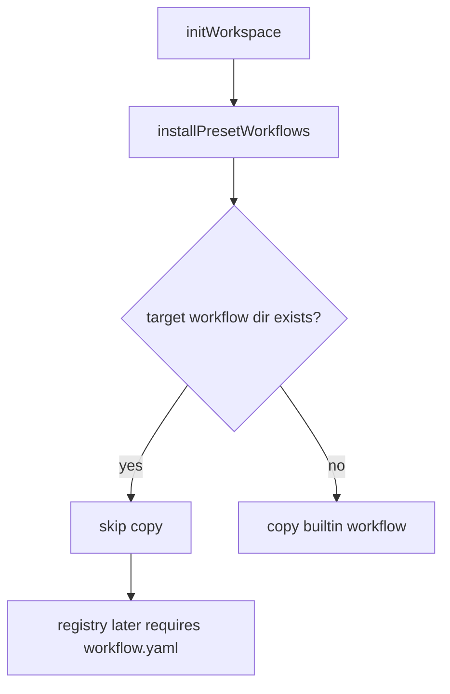
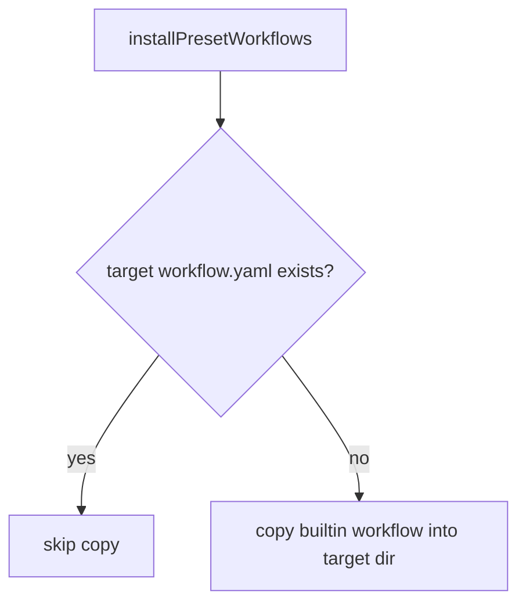

# Fix Preset Workflow Partial Install Spec

## Scope

Fix `PresetManager.initWorkspace(..., "default")` preset workflow installation so a builtin workflow is skipped only when the destination already has `<workflow-id>/workflow.yaml`. Empty or partial destination workflow directories must be repaired by copying the builtin workflow assets. Complete existing workflow directories must keep the current non-overwrite behavior.

Out of scope: workflow precedence redesign, registry source ordering changes, custom workflow migration, and loader/registry behavior changes unless directly required by the installer fix.

## Use Case Alignment

Users can rerun `playspec init --preset default` after a failed/interrupted/manual workflow install. If `.playspec/workflows/mono-spec/` or the user workflow equivalent exists but lacks `workflow.yaml`, the init rerun should install the builtin `workflow.yaml` and templates instead of reporting success while leaving the workflow unresolved.

## High-Level Current Implementation Summary

Verified behavior:
- `PresetManager.initWorkspace` creates `.playspec` runtime state, copies preset config/session files, and calls `installPresetWorkflows` unless `workflowInstall` is `skip`.
- `installPresetWorkflows` enumerates builtin workflow directories and verifies the source has `workflow.yaml`.
- The current skip check is `access(targetDir)`, so any existing destination directory prevents copying.
- `WorkflowRegistry.resolve` and `WorkflowRegistry.list` only consider a workflow present when `<root>/<workflow-id>/workflow.yaml` is accessible.

Inferred behavior:
- A partial destination directory without `workflow.yaml` can hide a missing project/user install from init while the registry later ignores that same directory.

## Relevant Files Reviewed

- `src/preset/preset-manager.ts`: preset workspace initialization and builtin workflow copy logic.
- `src/workflow/workflow-registry.ts`: registry source order and valid workflow detection contract.
- `tests/integration/init-create-next.test.ts`: existing init structure, user-scope install, skip install, and non-overwrite tests.
- `src/preset/assets/workflows/mono-spec/workflow.yaml` and `templates/tech_spec_draft.md`: builtin assets used for assertions.

## Active Entry Points And Bypasses

Active entry points:
- CLI `playspec init --preset default --workflow-install project|user|skip` reaches `PresetManager.initWorkspace` through `src/cli/commands/init.ts`.
- Tests instantiate `PresetManager` directly.

Bypasses:
- `workflowInstall: "skip"` intentionally bypasses workflow installation.
- `WorkflowRegistry` can still resolve builtin workflows directly when project/user sources do not contain valid installs.
- Existing complete project/user workflow installs bypass copying and must remain untouched.

## Current Architecture

Workflow install target roots come from `WorkflowRegistry`:
- project: `.playspec/workflows`
- user: `PLAY_SPEC_USER_WORKFLOWS` or `~/.playspec/workflows`
- builtin source: `src/preset/assets/workflows` in source and copied into `dist` during build

The registry contract for valid installed workflows is the presence of `workflow.yaml`; templates are loaded relative to the same workflow root after workflow resolution.

## Verified Behavior

The issue is reproducible by creating `.playspec/workflows/mono-spec/` before init. `installPresetWorkflows` sees `targetDir` and skips copy. Later `WorkflowRegistry.listFromRoot` and `resolve` skip that partial directory because `workflow.yaml` is absent.

The existing non-overwrite test writes a custom `workflow.yaml` before init and expects the file to remain unchanged. That test captures the behavior that must be preserved.

## Problems

The installer uses a weaker installed-workflow check than the registry/loader. This creates a false success path where init completes without repairing project or user workflow installs.

## Proposed Direction

Change `installPresetWorkflows` to check `access(path.join(targetDir, "workflow.yaml"))` before skipping. If that file exists, continue without copying to preserve complete existing workflow installs. If it does not exist, copy the builtin source directory into the target directory with recursive copy.

Expected `fs.cp` behavior is sufficient for partial directories because the copy target may exist and `force` defaults preserve non-error overwrite semantics for missing files. Since the skip path is guarded by `workflow.yaml`, complete workflows are not copied over.

## File-By-File Plan

- `src/preset/preset-manager.ts`: replace the target-directory existence check with a target `workflow.yaml` existence check.
- `tests/integration/init-create-next.test.ts`: add a project-scope partial directory integration test asserting `workflow.yaml` and `templates/tech_spec_draft.md` are installed.
- `tests/integration/init-create-next.test.ts`: add or extend user-scope coverage for a partial `PLAY_SPEC_USER_WORKFLOWS/mono-spec` directory.
- Existing non-overwrite test remains unchanged and must pass.

## Risks And Open Questions

Risk:
- Copying into a partial directory could add missing builtin files beside unrelated files. This is acceptable for a directory that lacks `workflow.yaml` because the registry does not consider it a complete workflow install.

Open questions:
- None blocking. The issue explicitly allows using `workflow.yaml` presence as the minimum installed-workflow check.

## Reader Aids

Verified current flow:

Proposed flow:

