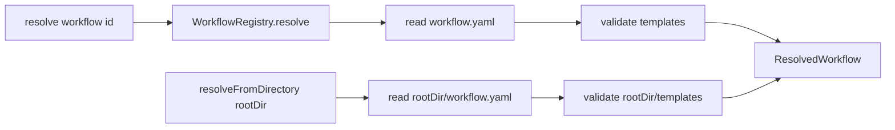

# GitHub issue #104: WorkflowLoader.resolveFromDirectory test coverage

## Scope

Add missing integration test coverage for `WorkflowLoader.resolveFromDirectory()` in `src/workflow/workflow-loader.ts`.

In scope:
- Valid directory loading from a workflow root containing `workflow.yaml` and `templates/`.
- Missing `workflow.yaml` error behavior.
- Direct assertion that `WorkflowRegistry.getBuiltinRoot()` resolves to `dist/preset/assets/workflows`.

Out of scope:
- Changing workflow resolution semantics.
- Changing workflow schema validation.
- Adding new workflow sources or registry priority behavior.

## Use Case Alignment

`resolveFromDirectory(rootDir)` is the public API for loading a workflow from an explicit directory instead of resolving through project, user, and builtin registry roots. Callers use this path for custom workflow installation and direct workflow path handling. A regression here would not necessarily be caught by `loader.resolve()`, because `resolve()` always goes through `WorkflowRegistry`.

## High-Level Current Implementation Summary

Verified code behavior:
- `WorkflowLoader.resolve(workflow)` asks `WorkflowRegistry.resolve(workflow)` for a located workflow, reads the registry-selected `workflow.yaml`, validates the parsed definition, enforces an id match with the requested workflow id, and returns a `ResolvedWorkflow`.
- `WorkflowLoader.resolveFromDirectory(rootDir)` reads `${rootDir}/workflow.yaml`, parses it with `WorkflowDefinitionSchema`, validates all phase templates under `${rootDir}/templates`, and returns a `ResolvedWorkflow` with `source: 'user'`.
- `WorkflowRegistry.getBuiltinRoot()` returns a path derived from the built module location: `path.resolve(__dirname, '..', 'preset', 'assets', 'workflows')`.

Inferred behavior:
- Because tests run against built output through path aliases, `getBuiltinRoot()` should point at `dist/preset/assets/workflows` after `pnpm build`.
- Missing `workflow.yaml` should reject through the shared file read path rather than a workflow-specific not-found error.

Open questions:
- No production code change appears necessary for this issue.

## Relevant Files Reviewed

- `src/workflow/workflow-loader.ts`: contains `resolveFromDirectory()`, registry-backed `resolve()`, and shared template validation.
- `src/workflow/workflow-registry.ts`: contains source priority and `getBuiltinRoot()`.
- `tests/integration/workflow-loader.test.ts`: contains current loader and registry integration coverage, including helper workflow creation for registry roots.
- `package.json`: confirms `pnpm build` and `pnpm test` are the repository validation commands.

## Active Entry Points And Bypasses

Verified entry points:
- `WorkflowLoader.resolve()` covers registry-backed loading.
- `WorkflowLoader.resolveFromDirectory()` covers explicit directory loading.

Bypass path:
- Tests that only call `resolve()` do not execute `resolveFromDirectory()`, so explicit directory loading can regress while registry tests still pass.

## Current Architecture

The workflow loader owns parsing and validation. The registry owns locating workflows by source priority. `resolveFromDirectory()` intentionally bypasses registry source priority and treats the provided directory as the workflow root.

## Verified Behavior

- Existing tests load builtin workflows and assert phase metadata.
- Existing tests verify registry priority between project, user, and builtin roots.
- Existing tests indirectly use `WorkflowRegistry.getBuiltinRoot()` to read issue-scope-create templates, but do not assert that the root is the expected built asset directory.
- No existing test calls `WorkflowLoader.resolveFromDirectory()`.

## Problems

- `resolveFromDirectory()` is public and used by workflow installation/path-based flows, but has no direct test coverage.
- Missing-file behavior for explicit directory loading is not pinned.
- Builtin root path derivation is only exercised indirectly.

## Proposed Direction

Add focused tests to `tests/integration/workflow-loader.test.ts`:
- Create a temporary custom workflow directory with `workflow.yaml` at the root and `templates/start.md`.
- Call `new WorkflowLoader(workspace.dir).resolveFromDirectory(customRoot)`.
- Assert the returned `ResolvedWorkflow` fields: `id`, `rootDir`, `templateDir`, `source`, and parsed definition fields.
- Call `resolveFromDirectory()` on a directory without `workflow.yaml` and assert rejection.
- Add a direct `getBuiltinRoot()` assertion that normalizes path separators and checks the path ends with `dist/preset/assets/workflows`.

## File-By-File Plan

`tests/integration/workflow-loader.test.ts`
- Add or adapt a helper to write a workflow directly into an explicit root directory.
- Add the valid `resolveFromDirectory()` test near other `WorkflowLoader` tests.
- Add the missing `workflow.yaml` rejection test.
- Add the direct builtin root path assertion near registry tests.

No source files should change.

## Risks And Open Questions

Risks:
- Error message assertions for missing files can be brittle across platforms or helper implementation details. Prefer asserting rejection unless the project already pins file-read error text.
- Path suffix assertions should normalize `path.sep` or split path segments to avoid platform-specific failures.

Open questions:
- None requiring human decision.

## Reader Aids

Expected validation:
- `pnpm build`
- `pnpm test`

This is a test-only coverage change with low behavioral risk.
