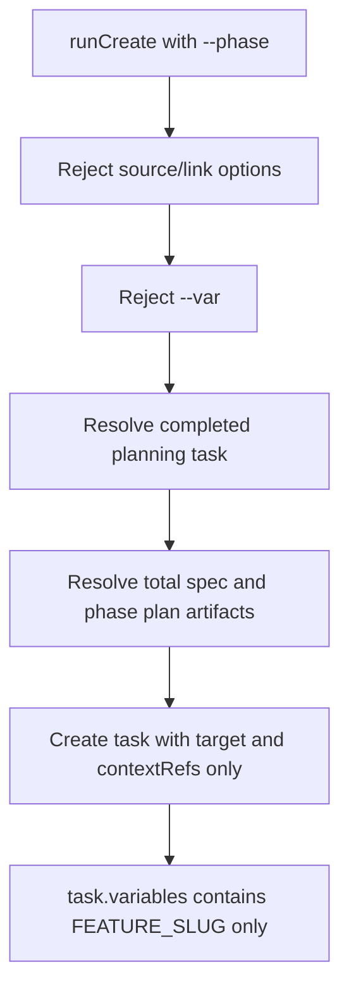
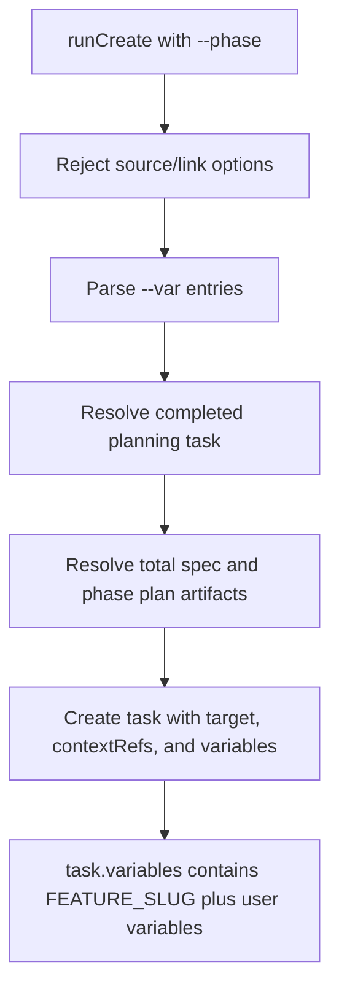

# GitHub Issue #109: `--var` for Phase-Execution Creation

## Scope

Fix the `playspec create --phase ... --var KEY=VALUE` code path so user-supplied variables are preserved on the created task. Keep the change limited to CLI task creation and focused test coverage.

Out of scope:

- Changing `VariableResolver` semantics.
- Redesigning CLI argument parsing.
- Changing workflow schemas or required variable validation.
- Modifying MCP or migration behavior.

## Use Case Alignment

Users create phase-execution tasks from a completed planning task and may need to provide workflow-required variables at creation time. Those variables must be persisted in `task.variables` so later prompt rendering and required variable checks can resolve them.

## High-Level Current Implementation Summary

Verified behavior:

- `src/cli/commands/create.ts` routes `runCreate()` into two paths.
- Normal creation validates workflow existence, resolves optional source problem content, resolves links, parses `options.var`, and passes the parsed map to `createNormalTask()`.
- `createNormalTask()` passes `variables` to `YamlTaskStore.createTask()`.
- `YamlTaskStore.createTask()` already merges `FEATURE_SLUG` with `input.variables`.
- Phase-execution creation currently rejects any non-empty `options.var` before planning task resolution.
- The phase-execution path then calls `store.createTask({ id, title, workflow, target, contextRefs })` without a `variables` field.
- `VariableResolver.assertRequiredVariables()` checks resolved variables later during prompt rendering; missing task variables fail there.

Inferred behavior:

- The original `--var` rejection likely documented an unsupported feature, but the store and normal task path already support the required persistence model.

## Relevant Files Reviewed

- `src/cli/commands/create.ts`: active CLI create command implementation, normal task path, phase-execution path, `parseTaskVariables()`.
- `src/storage/yaml-task-store.ts`: task creation persists `FEATURE_SLUG` plus create-time variables.
- `src/core/types.ts`: `CreateTaskInput.variables` is already supported.
- `src/core/playspec-core.ts`: required variable validation consumes resolved task/workflow/phase variables.
- `tests/cli.test.ts`: existing CLI integration tests, including normal `--var` coverage.

## Active Entry Points And Bypasses

Active entry point:

- CLI command `playspec create <title> --phase <n> --from <planningTaskId> [--workflow <id>] [--var KEY=VALUE]`.

Bypasses and alternate paths:

- Normal `playspec create <title> --var KEY=VALUE` already works and must not regress.
- Interactive create currently calls `createNormalTask()` without a variables argument; no change needed because the wizard does not collect variables.
- Store-level `createTask()` already supports variables, so no storage migration is needed.

## Current Architecture

Verified phase-execution flow:

Proposed phase-execution flow:

## Verified Behavior

- `parseTaskVariables()` already handles repeated `--var`, empty values, invalid missing `=`, and key validation.
- `YamlTaskStore.createTask()` persists variables in the YAML task file.
- Existing normal `--var` test verifies persisted variables for `issue-scope-create`.

## Problems

- Phase-execution rejects `--var`, preventing users from providing required workflow variables.
- Even if the rejection were bypassed, the current phase-execution `store.createTask()` call does not pass parsed variables.
- Required variable failures happen later during prompt rendering instead of at task creation time.

## Proposed Direction

Remove the phase-execution `--var` rejection, parse variables once in the phase-execution path, and pass the parsed map to `store.createTask()`. Print the same `Variables set: <n>` status line used by normal task creation when variables are provided.

This supports the issue acceptance path where variables are stored. It does not add eager validation against workflow `requiredVariables`; that remains owned by prompt rendering and `VariableResolver`, matching current architecture.

## File-By-File Plan

- `src/cli/commands/create.ts`
  - Remove the explicit phase-execution `--var` rejection.
  - Parse `options.var` for phase-execution tasks.
  - Pass `variables` into `store.createTask()`.
  - Emit `Variables set: <n>` when non-empty.

- `tests/cli.test.ts`
  - Keep the existing normal `--var` test.
  - Add or adjust a normal creation assertion so the non-phase path is explicitly covered.
  - Add a phase-execution creation test that creates a completed planning task with required planning artifacts, runs `create --phase ... --var`, and verifies the resulting task YAML/store record includes the supplied variables.

## Risks And Open Questions

- Removing the rejection changes behavior for users who expected `--var` to fail for phase-execution tasks. The new behavior is more consistent with store capabilities and workflow required variable support.
- The test must create enough planning context for the phase-execution path without coupling to unrelated workflow behavior.
- No eager required variable validation is proposed; missing required variables will continue to fail at prompt rendering.

## Reader Aids

- `--phase` in `create.ts` means "create a phase-execution task from a completed planning task," not "set current phase on a normal task."
- `task.variables` is persisted in `.playspec/tasks/active/<taskId>/task.yaml`.
- `FEATURE_SLUG` is always added by `YamlTaskStore.createTask()`.
