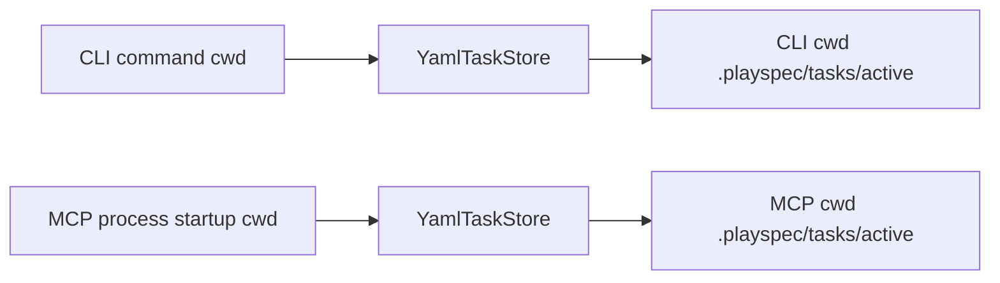
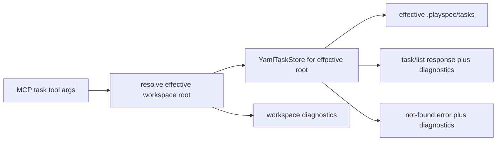

# MCP Task Lookup Desync Technical Spec

## Scope

Fix issue #118 for MCP task inventory and explicit task lookup visibility. The change must keep MCP task context resolution explicit: tools that operate on a task context continue to use `resolveMcpTaskId()` and must not read `.playspec/HEAD` or use `ActiveTaskResolver`.

This spec covers `playspec_list_tasks` and `playspec_get_task`, plus diagnostics that explain which workspace/task store MCP is using. It does not add viewer behavior, archive lookup tools, rollback behavior, or Core-to-CLI coupling.

## Use Case Alignment

An agent working in a repository creates or completes a PlaySpec task with the CLI, then uses MCP tools in the same repository. MCP should see the same task files when it is pointed at that workspace. If MCP is actually bound to a different workspace, the response should make that visible without requiring shell fallback.

## High-Level Current Implementation Summary

Verified behavior:

- `src/mcp/index.ts` binds the MCP server to `process.cwd()` at process startup.
- `buildMcpServer(workspaceRoot)` constructs one `YamlTaskStore` for that root.
- `playspec_list_tasks` returns active and completed summaries from that fixed store.
- `playspec_get_task` calls `taskStore.getTask(args.taskId)` on that fixed store.
- `YamlTaskStore.getTask()` reads only `.playspec/tasks/active/<taskId>/task.yaml` under its configured workspace root.
- CLI commands also use `YamlTaskStore`, but they construct it per command from the CLI command's workspace root.

Inferred behavior:

- If the MCP process starts from a different cwd than the CLI command, MCP will scan a different `.playspec` tree and can return an empty list or `Task not found` even when the task exists in the CLI workspace.
- There is no task cache in `YamlTaskStore`; each lookup/list reads the filesystem.

Open questions:

- The exact cwd used to launch the failing MCP server is not recorded in the issue. The diagnostics are needed to prove or disprove a cwd/workspace mismatch.

## Relevant Files Reviewed

- `src/mcp/index.ts`: MCP process entry point; sets `workspaceRoot = process.cwd()`.
- `src/mcp/server.ts`: Registers task tools and constructs stores/loaders against the provided workspace root.
- `src/mcp/context.ts`: Resolves task context from explicit `taskId` or `sessionId`; intentionally no HEAD fallback.
- `src/storage/yaml-task-store.ts`: Reads active task YAML files and lists active/completed tasks from `.playspec/tasks/active`.
- `src/cli/commands/get-task.ts`: CLI explicit task lookup uses the same store type.
- `src/cli/commands/list-tasks.ts`: CLI active-task inventory uses the same active task root, plus HEAD only for display ordering/marker.
- `src/core/errors.ts`: Current `TaskNotFoundError` hint does not include workspace diagnostics.
- `tests/integration/mcp-server.test.ts`: Existing MCP tests already assert no HEAD fallback and provide a direct way to exercise registered tool handlers.

## Active Entry Points And Bypasses

Active MCP entry points:

- `playspec_list_tasks`
- `playspec_get_task`

Active CLI comparison entry points:

- `playspec get-task <taskId>`
- `playspec status <taskId>`
- `playspec list-tasks`

Bypass paths:

- CLI can succeed from one cwd while MCP is bound to another cwd.
- Direct shell inspection can find task files outside the MCP-bound store root.

No verified cache bypass exists.

## Current Architecture

Verified flow:

If the two cwd values differ, the stores differ even though the API surface looks like it is querying "PlaySpec tasks".

## Verified Behavior

- `playspec_get_task` in MCP already uses explicit `taskId` and does not depend on HEAD.
- `playspec_list_tasks` in MCP already lists both active and completed task summaries from the configured active task root.
- The list methods return empty arrays when `.playspec/tasks/active` cannot be read.
- `TaskNotFoundError` exposes only the missing task ID and a generic `playspec list-tasks` hint.

## Problems

1. MCP responses do not reveal the resolved workspace root or `.playspec` task search paths.
2. MCP `get_task` has no way to query an explicit workspace when the server was launched from a different cwd.
3. MCP `list_tasks` has no way to query an explicit workspace and returns no diagnostics with its inventory.
4. The not-found error text cannot distinguish "task ID absent from this workspace" from "MCP is looking at the wrong workspace".

## Proposed Direction

Add a small MCP workspace diagnostics layer for task inventory/lookup:

- Allow `playspec_list_tasks` and `playspec_get_task` to accept optional `workspaceRoot`.
- Resolve relative `workspaceRoot` values against the MCP server's startup workspace.
- For these read-only task tools, construct a scoped `YamlTaskStore` for the effective workspace root.
- Include diagnostics in `playspec_list_tasks` responses.
- Include diagnostics in `playspec_get_task` success responses.
- On `playspec_get_task` failure, return an MCP error that includes the effective workspace root, `.playspec` root, active/completed/archived task search paths, active HEAD value if readable, and cache status.

Proposed flow:

This keeps task-context tools unchanged and avoids HEAD fallback. HEAD is diagnostic-only.

## File-By-File Plan

- `src/mcp/workspace-diagnostics.ts`: Add helper functions to resolve optional workspace root, collect task search paths, read HEAD defensively, and build diagnostic objects.
- `src/mcp/server.ts`: Use the helper in `playspec_list_tasks` and `playspec_get_task`; update schemas for optional `workspaceRoot`; return diagnostics; format not-found diagnostics in the MCP error response.
- `tests/integration/mcp-server.test.ts`: Add regression tests for explicit workspace lookup/listing from a server bound to a different workspace, same-workspace visibility, and diagnostic text on not-found.

## Risks And Open Questions

- Risk: Adding `workspaceRoot` too broadly could blur task context ownership. Mitigation: limit it to read-only list/get tools in this issue.
- Risk: Diagnostics include absolute local paths. This is intentional for local MCP troubleshooting and matches the acceptance criteria.
- Risk: HEAD diagnostic could be mistaken for task resolution. Mitigation: keep HEAD read in the diagnostics helper only and do not call it from `resolveMcpTaskId()`.

## Reader Aids

- "Server workspace" means the cwd used when the MCP process started.
- "Effective workspace" means either the server workspace or the optional `workspaceRoot` supplied to a read-only task tool.
- "Task search paths" means the `.playspec/tasks/*` directories the effective `YamlTaskStore` would use.
