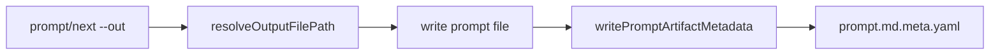
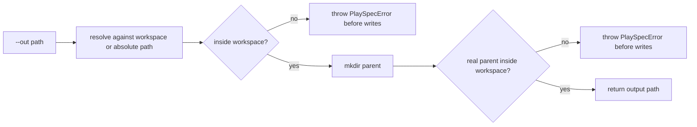

# Reject Absolute Prompt Output Paths Outside Workspace

## Scope

Fix GitHub issue #183 by ensuring user-selected prompt artifact paths cannot write outside the workspace when invoked through `playspec prompt --out` or deprecated `playspec next --out`.

In scope:
- Tighten the shared CLI output-path resolver.
- Preserve supported relative `--out` paths.
- Preserve symlink escape rejection through relative output parent directories.
- Add focused CLI coverage for rejected outside-workspace absolute paths and allowed inside-workspace output paths.

Out of scope:
- Redesigning prompt artifact storage.
- Changing completion snapshots, task-local prompt snapshots, or evidence naming.
- Removing or redesigning `next`.
- Changing clipboard behavior except where validation prevents the `--out` write path.

## Use Case Alignment

Users and automation expect PlaySpec-generated prompt artifacts and `.meta.yaml` sidecars to remain auditably inside the project workspace. When a user supplies `--out`, PlaySpec should either write inside the workspace and record a workspace-relative `promptArtifactPath`, or fail before creating prompt and metadata files.

## High-Level Current Implementation Summary

Verified behavior:
- `src/cli/commands/prompt.ts` handles `prompt --out` through `outputPrompt()`.
- `src/cli/commands/next.ts` handles deprecated `next --out` independently but uses the same `resolveOutputFilePath()` helper.
- Both commands write the prompt file after resolving the output path, then call `writePromptArtifactMetadata()`.
- `src/core/prompt-metadata.ts` writes `${promptArtifactPath}.meta.yaml` next to the prompt artifact and stores `promptArtifactPath: path.relative(workspaceRoot, promptArtifactPath)`.
- `src/cli/cli-utils.ts` currently checks workspace escapes only when the original `outputPath` is relative.

Inferred behavior:
- An absolute path outside the workspace can produce a metadata value starting with `..` because the metadata writer assumes callers have already selected an in-workspace artifact path.

## Relevant Files Reviewed

- `src/cli/cli-utils.ts`
- `src/cli/commands/prompt.ts`
- `src/cli/commands/next.ts`
- `src/core/prompt-metadata.ts`
- `tests/cli.test.ts`
- `tests/integration/init-create-next.test.ts`
- `docs/features/ui_ux_update_260427/spec.md`

## Active Entry Points And Bypasses

Active entry points:
- `playspec prompt --out <file>` -> `outputPrompt()` -> `resolveOutputFilePath()` -> prompt write -> metadata write.
- `playspec next --out <file>` -> `runNext()` -> `resolveOutputFilePath()` -> prompt write -> metadata write.

Bypass paths checked:
- `prompt --write` and fallback prompt snapshots write to task-local prompt directories and do not use user-selected absolute paths.
- `next --write` writes to task-local prompt directories.
- Clipboard fallback without `--out` writes through `writeFallbackPrompt()` inside the task prompt directory.

## Current Architecture

The CLI layer owns user-selected output path validation. Core metadata writing receives an already resolved artifact path and serializes metadata next to it. This keeps Core free of CLI path policy, but it requires `resolveOutputFilePath()` to enforce the workspace boundary for both relative and absolute user input.

## Verified Behavior

`resolveOutputFilePath()` currently:
- Resolves the real workspace root.
- For absolute paths, returns `path.normalize(outputPath)` and does not compare it to the workspace root.
- For relative paths, resolves against the real workspace root and rejects lexical `..` workspace escapes.
- Creates the parent directory.
- For relative paths only, realpaths the parent directory and rejects symlink escapes.

## Problems

- Absolute `--out` paths outside the workspace are accepted.
- The prompt artifact can be written outside the repository.
- The sidecar can be written outside the repository.
- Metadata can store a `promptArtifactPath` that escapes the workspace with `..`.
- CLI tests cover relative `--out` behavior but not this absolute path boundary.

## Proposed Direction

Keep absolute paths supported when they resolve inside the workspace, because that is a useful and unsurprising extension of existing behavior. Reject absolute paths that resolve outside the workspace with guidance that tells users to choose an output path inside the workspace or a workspace-relative path.

Use one shared boundary check for both relative and absolute paths:
- Resolve the workspace realpath.
- Resolve absolute input with `path.resolve(outputPath)` or normalize it.
- Resolve relative input against the workspace realpath.
- Compare `path.relative(workspaceRealPath, resolvedPath)` for all inputs.
- Create the parent directory only after the lexical boundary check passes.
- Realpath the parent directory for all inputs after creation, then reject symlink escapes.

This preserves relative behavior and makes `prompt` and `next` consistent through the shared helper.

## File-By-File Plan

`src/cli/cli-utils.ts`
- Update `resolveOutputFilePath()` so absolute and relative output paths both fail when the resolved target is outside the real workspace root.
- Apply the parent-directory realpath symlink check to all output paths.
- Use clear recovery text: choose an output path inside the workspace or a workspace-relative path.

`tests/cli.test.ts`
- Add regression tests for `prompt --out <absolute outside path>` and `next --out <absolute outside path>`.
- Assert non-zero exit, clear error text, no prompt file, and no `.meta.yaml` sidecar.
- Add or update allowed absolute inside-workspace coverage and assert metadata `promptArtifactPath` is workspace-relative and does not start with `..`.
- Keep existing relative `tmp/prompt.md` tests passing.

## Risks And Open Questions

Risk:
- Users who intentionally wrote prompt artifacts outside a repository with absolute paths will now get a validation error.

Decision:
- Preserve absolute paths inside the workspace. This avoids a broader compatibility break while still enforcing artifact boundary correctness.

Open questions:
- None blocking.

## Reader Aids

Verified current flow:

Proposed validation flow:

