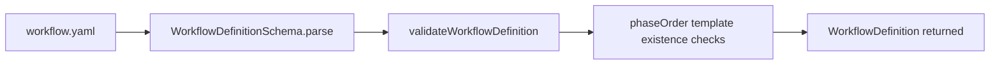
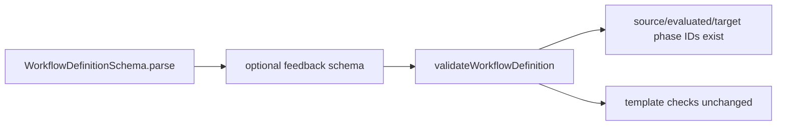

# GitHub Issue #195 Phase Validation Feedback Config Schema

## Scope

Add optional typed `feedback` metadata to workflow phase definitions so later phases can capture prompt-evolution signals from validation phases. This phase only validates and types configuration. It must not parse scores, write evolution feedback, mutate proposals, or opt existing workflows into capture.

## Use Case Alignment

Workflow authors need to declare that one phase, usually a validation phase, can emit feedback about another phase's prompt or artifact. The metadata must separately identify:

- `sourcePhaseId`: phase where validation feedback is produced.
- `evaluatedArtifactPhaseId`: phase whose artifact is being evaluated.
- `evolutionTargetPhaseId`: phase whose prompt/template should eventually evolve.

Existing workflows that omit `feedback` must continue to load and resolve variables exactly as they do now.

## High-Level Current Implementation Summary

Verified code behavior:

- `src/core/schemas.ts` defines `PhaseDefinitionSchema` and `WorkflowDefinitionSchema` with zod.
- `src/core/types.ts` defines matching TypeScript interfaces for workflow and phase definitions.
- `src/workflow/workflow-loader.ts` parses workflow YAML through `WorkflowDefinitionSchema`, then validates every phase in `phaseOrder` has a template file.
- `src/workflow/workflow-schema.ts` re-exports core workflow schemas and types.

Inferred behavior:

- Adding a strict optional field to `PhaseDefinitionSchema` and `PhaseDefinition` will propagate to workflow loading, editor validation, and callers importing from `#workflow/workflow-schema.js`.

## Relevant Files Reviewed

- `src/core/schemas.ts`
- `src/core/types.ts`
- `src/workflow/workflow-loader.ts`
- `src/workflow/workflow-schema.ts`
- `tests/integration/workflow-loader.test.ts`
- `docs/features/phase_validation_feedback_evolves_workflow_guidance/phase_validation_feedback_evolves_workflow_guidance_phase_plan.md`

## Active Entry Points And Bypasses

Active entry points:

- `WorkflowLoader.load()`
- `WorkflowLoader.resolve()`
- `WorkflowLoader.resolveFromDirectory()`
- Workflow editor validation through `WorkflowDefinitionSchema.parse()`

Bypasses and alternate paths:

- Direct consumers of `PhaseDefinitionSchema` will get schema validation automatically.
- Direct consumers of `PhaseDefinition` only get compile-time structure after type updates.
- Runtime validation for phase ID references must live in `WorkflowLoader.validateWorkflowDefinition()` because the zod phase schema only sees an individual phase object.

## Current Architecture

Workflow YAML is parsed into a full workflow definition, then the loader checks phase order and template files. There is no current feedback metadata, no feedback store involved in workflow loading, and no evolution side effect during phase completion.

## Verified Behavior

- Workflows without `feedback` are currently accepted when required fields and templates are valid.
- Invalid enum-like workflow fields fail when modeled as zod enums.
- Template path safety is validated independently in `WorkflowLoader.resolveTemplatePath()`.
- Required variable resolution is outside `WorkflowLoader` and should not need changes for optional phase metadata.

## Problems

- There is no typed place for a phase to declare prompt evolution feedback capture configuration.
- Phase ID references cannot be validated by the current phase-local schema alone.
- The requested metadata includes several policy enums and bounded numeric fields that need explicit validation to avoid ambiguous downstream behavior.

## Proposed Direction

Add a `PhaseFeedbackConfigSchema` and matching TypeScript interfaces/types. The config should be optional on `PhaseDefinition`.

Recommended schema shape:

- `enabled: boolean`
- `kind: 'prompt_evolution_signal'`
- `feedbackThreshold: number` in `0..100`
- `thresholdMode: 'greater_or_equal'`
- `required: boolean`
- `onFailure: 'fail_completion' | 'warn_and_continue' | 'record_failure'`
- `sourcePhaseId`, `evaluatedArtifactPhaseId`, `evolutionTargetPhaseId`: strings
- `scoreSource`: artifact role, preferred block, markdown fallback
- `approval`: threshold in `0..100`, result source
- `causeClassification`: required flag and allowed cause categories
- `targetPromptSnapshot`: required flag and hash algorithm
- `dedupe`: enabled flag and stable field names
- `evolution`: `mode: 'thread_only'`, `storageMode: 'thread_with_compact_history'`, target files
- `workflowSource`: source kind and root path kind
- `targetPromptTemplate`: path, path kind, writable flag
- `compactHistoryPolicy`: positive integer limits and booleans, with `keepLatest <= maxEntries`
- `proposalReadinessPolicy`: manual readiness mode and bounded maturity thresholds

Load-time validation should additionally verify that the configured source, evaluated, and target phase IDs exist in `definition.phases`. Target file paths should remain only schema-shaped strings in Phase 1; workspace-relative safety and writability belong to later capture/proposal phases.

## File-By-File Plan

- `src/core/schemas.ts`: add feedback sub-schemas and attach `feedback: PhaseFeedbackConfigSchema.optional()` to `PhaseDefinitionSchema`.
- `src/core/types.ts`: add matching feedback config types and `feedback?: PhaseFeedbackConfig` to `PhaseDefinition`.
- `src/workflow/workflow-loader.ts`: validate configured phase IDs exist after schema parsing and before returning loaded workflow definitions.
- `tests/integration/workflow-loader.test.ts`: add workflow loading tests for valid config, omitted config, invalid enums/policies/path kinds/thresholds, separate phase IDs, missing referenced phase IDs, and unchanged required variable resolution.

## Risks And Open Questions

- Exact enum names should follow the approved planning reference to avoid churn in later phases.
- Cause classification categories are probably intentionally closed for Phase 1; later phases can broaden only with explicit planning.
- Dedupe `fields` are requested as stable semantic keys; Phase 1 can validate non-empty strings but should avoid enforcing downstream semantics too early.
- `feedback.enabled: false` with otherwise complete metadata should still parse. No downstream behavior exists in this phase.

## Reader Aids

Verified current load flow:

Proposed Phase 1 validation addition:

