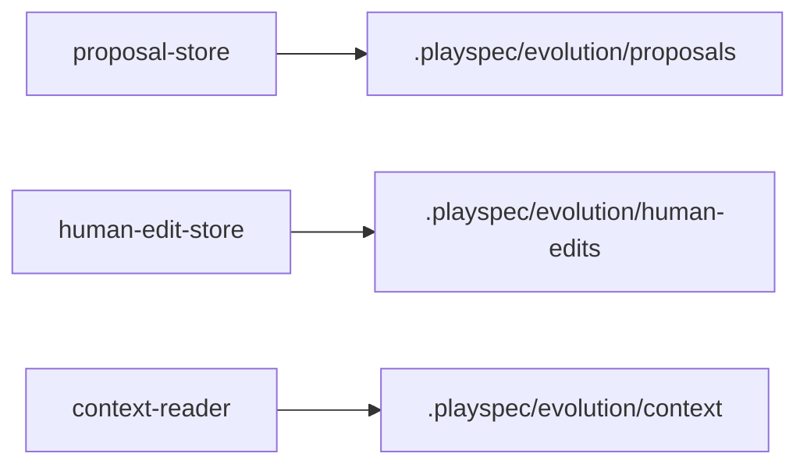
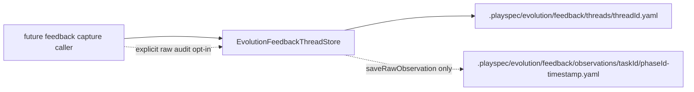

# GitHub Issue #196 Phase Validation Feedback Thread Schema And Store

## Scope

Add evolution-native schemas, types, path helpers, and a workspace-local store for prompt evolution feedback threads. This phase persists canonical ongoing feedback threads independently from proposals. It may define optional raw observation/audit event records, but raw observation files must only be written when explicitly requested by store caller/configuration.

Out of scope: proposal matching, prompt surfacing changes, score extraction, phase completion integration, MCP integration, and automatic proposal generation.

## Use Case Alignment

When a validation phase produces a prompt evolution signal, PlaySpec needs a durable thread that tracks repeated feedback against the same prompt/workflow target. Reviewers should be able to inspect this canonical thread without first creating or reviewing an evolution proposal. The stored thread must preserve:

- workflow source metadata and target prompt template metadata from the Phase 1 `feedback` config,
- target prompt writability,
- cause classification,
- compact event history and trend state,
- proposal readiness policy,
- mutation strategy,
- event-level approval result and feedback result as separate concepts.

## High-Level Current Implementation Summary

Verified code behavior:

- `src/core/schemas.ts` and `src/core/types.ts` define optional `PhaseFeedbackConfig` metadata on workflow phases, including workflow source, target prompt template, cause classification, compact history policy, and proposal readiness policy.
- `src/workflow/workflow-loader.ts` validates configured feedback phase references exist in the loaded workflow.
- `src/evolution/schemas.ts` and `src/evolution/types.ts` currently model proposals, human edit observations, apply reports, and prompt context snapshots. They do not model feedback threads or raw feedback observation events.
- `src/evolution/proposal-store.ts` and `src/evolution/human-edit-store.ts` use zod validation, YAML serialization, `#utils/paths.js` helpers, and workspace-local `.playspec/evolution/*` roots.
- `src/utils/paths.ts` centralizes existing evolution paths under `.playspec/evolution`.

Inferred behavior:

- A new feedback store should follow the existing evolution store style: validate with zod before write/read, use YAML, use `writeTextFileAtomic()`, and expose typed load/list/update APIs.
- Path helpers should live in `src/utils/paths.ts` so future CLI/MCP callers do not hand-build `.playspec/evolution/feedback` paths.

## Relevant Files Reviewed

- `src/evolution/schemas.ts`
- `src/evolution/types.ts`
- `src/evolution/proposal-store.ts`
- `src/evolution/human-edit-store.ts`
- `src/utils/paths.ts`
- `src/core/schemas.ts`
- `src/core/types.ts`
- `src/workflow/workflow-loader.ts`
- `tests/integration/evolution-proposal-store.test.ts`
- `tests/integration/evolution-human-edit-store.test.ts`
- `tests/integration/workflow-loader.test.ts`
- `docs/features/github_issue_195_phase_validation_feedback_config_schema/spec.md`

## Active Entry Points And Bypasses

Active entry points to add:

- `FeedbackThreadSchema` and raw event schema exports from `src/evolution/schemas.ts`.
- Matching `FeedbackThread` and raw event types from `src/evolution/types.ts`.
- Feedback path helpers in `src/utils/paths.ts`.
- New `EvolutionFeedbackThreadStore` in `src/evolution/feedback-thread-store.ts`.

Bypasses and alternate paths:

- No existing CLI/MCP command should write feedback threads in this phase.
- No phase completion path should be changed in this phase.
- Direct callers can still write files manually under `.playspec`, but the new store must never accept a caller-supplied absolute or escaping destination path.

## Current Architecture

Evolution state is split by concern under `.playspec/evolution`:

- proposals under `.playspec/evolution/proposals/{proposalId}/...`,
- human edits under `.playspec/evolution/human-edits/{editId}.yaml`,
- context snapshots under `.playspec/evolution/context/{taskId}/...`,
- reports and backups under `.playspec/evolution/reports` and `.playspec/evolution/backups`.

There is no current `.playspec/evolution/feedback` area and no thread canonicalization. Proposal records are proposal-centric and terminal-status aware, which makes them the wrong persistence model for ongoing feedback signals.

## Verified Behavior

- Existing evolution stores validate IDs before path construction.
- Existing workspace-relative path schemas reject absolute paths and `..` escapes.
- Atomic writes create parent directories through `writeTextFileAtomic()`.
- Existing list APIs tolerate missing evolution subdirectories by returning empty arrays.
- Phase 1 feedback config preserves workflow source kind/path kind and target prompt path kind/writable flag at workflow load time.

## Problems

- There is no schema for canonical feedback threads.
- There is no schema for optional raw feedback events.
- There is no feedback path helper that constrains canonical threads to `.playspec/evolution/feedback/threads/{threadId}.yaml`.
- There is no update API that overwrites an existing thread by ID without creating a new file.
- Event data needs to preserve approval and feedback results separately; folding both into one result would lose acceptance-criteria detail.

## Proposed Direction

Add thread schemas/types under `src/evolution/*` with these core concepts:

- `FeedbackThreadIdSchema`: filesystem-safe string, same general safety constraints as proposal IDs.
- `FeedbackApprovalResult`: the completion/gate approval result, for example `approved` or `needs_revision`.
- `FeedbackSignalResult`: the parsed/recorded feedback signal result, for example `positive`, `negative`, or `neutral`.
- `FeedbackCauseClassification`: selected cause plus optional confidence/evidence summary, constrained to the Phase 1 cause categories.
- `FeedbackTrendState`: compact aggregate state such as total event count, positive/negative/neutral counts, current direction, confidence, last event time, and readiness state.
- `FeedbackThreadEvent`: compact per-run event preserving task ID, phase ID, timestamp, approval result, feedback result, score when present, cause classification, summary, and optional raw observation reference.
- `FeedbackThread`: canonical record with id, created/updated timestamps, source/evaluated/target phase IDs, workflow source metadata, target prompt template metadata, target writability, compact history policy, proposal readiness policy, mutation strategy, trend state, and compact event history.
- `FeedbackRawObservationEvent`: optional audit detail record for callers that explicitly request raw observation persistence.

Add store behavior:

- `saveThread(thread)` validates and writes to the canonical thread path.
- `loadThread(threadId)` validates ID, reads YAML, parses schema.
- `upsertThread(thread)` validates and writes to the same canonical path for that thread ID; existing file count must not grow.
- `listThreads()` returns sorted parsed thread records and tolerates a missing feedback root.
- `saveRawObservation(event)` writes under `.playspec/evolution/feedback/observations/{taskId}/{phaseId}-{timestamp}.yaml` only when called explicitly. No thread save/upsert method should create observation files by default.

## File-By-File Plan

- `src/evolution/schemas.ts`: add thread ID, feedback event, trend state, mutation strategy, raw observation event, and thread schemas. Reuse or mirror Phase 1 enum values where the stored thread must preserve config values.
- `src/evolution/types.ts`: add matching exported types/interfaces.
- `src/utils/paths.ts`: add feedback root, threads root, observations root, thread path, task observation root, and observation path helpers.
- `src/evolution/feedback-thread-store.ts`: implement validated YAML load/list/save/upsert and explicit raw observation save.
- `tests/integration/evolution-feedback-thread-store.test.ts`: add focused integration coverage for write/reload, update by ID, path locality, separate approval/feedback result preservation, metadata preservation, and default absence of raw observation files.

## Risks And Open Questions

- The exact feedback result enum can be conservative in this phase. It should cover positive/negative/neutral and parser failure without implying future proposal matching.
- Mutation strategy should be schema-preserved but not executed. A closed enum such as `manual_review_only` is safest until a later phase defines automatic mutations.
- Raw observation timestamp strings need filesystem-safe normalization in the store path helper or caller contract. The store should normalize `:` and `.` characters for filenames to avoid cross-platform path issues.
- This phase should not import Core runtime logic into evolution storage. Shared literal values can be duplicated in zod/type definitions or imported only as TypeScript types if needed, but the store should remain storage-focused.

## Reader Aids

Verified current evolution storage shape:

Proposed Phase 2 flow:

