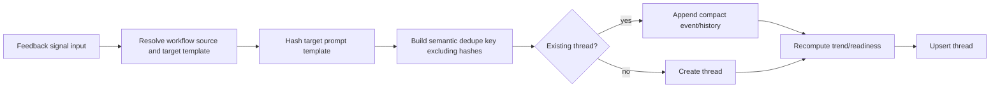

# GitHub Issue #197 Technical Spec

## Scope

Implement Phase 3 of validation-feedback-to-prompt-evolution signals. This phase records the prompt/template/rule version that a feedback event refers to, resolves workflow/template source metadata, and updates one compact feedback thread per repeated semantic signal.

In scope:
- capture-time SHA-256 prompt template hashing
- workflow source metadata resolution for project-local, user-global, bundled preset, and external workflow roots
- semantic feedback dedupe key computation that excludes target hashes
- thread updater that creates or updates `EvolutionFeedbackThreadStore` records by dedupe key
- compact event history bounding with first/latest retention and overflow summaries
- mixed positive/negative trend accounting
- manual-only readiness policy; do not auto-set proposal candidacy from this phase

Out of scope:
- proposal generation
- prompt/template mutation
- auto-applying evolution proposals
- CLI or MCP surface beyond testable library entry points unless required by the implementation plan

## Use Case Alignment

When a validation phase emits a repeated automation feedback signal, PlaySpec should attach the signal to the same durable feedback thread even if the target prompt template hash has changed. The thread should preserve the hash history so a later human or future proposal generator can see which prompt version was evaluated and whether a newer hash needs revalidation.

Bundled preset and read-only workflow targets must be marked non-writable so future phases do not accidentally mutate shipped or external assets.

## High-Level Current Implementation Summary

Verified code behavior:
- `src/core/schemas.ts` and `src/core/types.ts` already parse workflow phase `feedback` config, including score source, approval, dedupe fields, target prompt snapshot, workflow source metadata, target prompt template metadata, compact history policy, and proposal readiness policy.
- `src/workflow/workflow-loader.ts` validates that feedback phase references point at existing phases.
- `src/evolution/schemas.ts` and `src/evolution/types.ts` define persisted feedback threads and raw observations.
- `src/evolution/feedback-thread-store.ts` can save, upsert, load, list threads, and explicitly write raw observations.
- `src/utils/paths.ts` owns `.playspec/evolution/feedback/{threads,observations}` paths.

Missing behavior:
- No code hashes a target prompt/template at signal capture time.
- No code resolves workflow source metadata from `ResolvedWorkflow` into feedback metadata.
- No semantic dedupe key or dedupe-key-to-thread lookup exists.
- No thread updater computes trend/readiness/history; callers must construct whole thread objects.
- Compact history policy is only schema state; it is not enforced.
- There is no prompt hash history on thread events, so hash changes cannot be recorded without changing the schema.

## Relevant Files Reviewed

- `src/core/types.ts`
- `src/core/schemas.ts`
- `src/workflow/workflow-loader.ts`
- `src/workflow/workflow-registry.ts`
- `src/template/template-renderer.ts`
- `src/core/playspec-core.ts`
- `src/evolution/types.ts`
- `src/evolution/schemas.ts`
- `src/evolution/feedback-thread-store.ts`
- `src/utils/paths.ts`
- `tests/integration/evolution-feedback-thread-store.test.ts`

## Active Entry Points And Bypasses

Verified active paths:
- Prompt rendering: `PlaySpecCore.renderNextPrompt()` and `renderExplicitPhasePrompt()` resolve workflow and phase, then render a template through `TemplateRenderer`.
- Completion: `PlaySpecCore.completePhase()` renders a prompt snapshot and writes snapshot/evidence/completion artifacts.
- Feedback storage: currently only direct `EvolutionFeedbackThreadStore` calls can persist feedback data.

Bypasses and partial paths:
- Feedback config is validated during workflow load, but completion does not yet interpret the config.
- `targetPromptSnapshot.required` is parsed but not enforced.
- `PhaseFeedbackDedupe.fields` is parsed but not used.
- `workflowSource` and `targetPromptTemplate` can be hardcoded in workflow YAML today; Phase 3 should resolve effective metadata from loaded workflow state rather than trusting stale config values when possible.

## Current Architecture

`WorkflowLoader` returns a `ResolvedWorkflow` with source, root/template directories, optional builtin shadow details, and parsed workflow definition. `TemplateRenderer` resolves and expands templates internally, but it does not expose a template hashing API. The feedback store persists complete thread documents and validates them with zod.

The natural Phase 3 architecture is to add small evolution-side services that reuse the existing workflow and filesystem primitives:
- a prompt snapshot hasher that resolves and hashes the target phase template at capture time
- a workflow source resolver that maps `ResolvedWorkflow` and template target paths into feedback source/template metadata
- a feedback thread updater that loads existing threads, matches by a stable semantic dedupe key, appends evidence/snapshot history, enforces compact history, recomputes trend/readiness state, and upserts one thread

## Verified Behavior

- `saveThread()` rejects duplicate thread IDs.
- `upsertThread()` overwrites the same thread ID and does not create raw observations.
- `saveRawObservation()` is explicit and stores observation files under `.playspec/evolution/feedback/observations/<taskId>/`.
- Feedback thread schemas currently allow source metadata, target template writability, compact history policy, readiness policy, mutation strategy, trend counters, and events.

## Problems

1. Prompt hash history cannot be represented. `FeedbackThreadEvent` needs prompt snapshot fields so each event can record target template hash and related metadata.
2. Repeated signals cannot be deduped semantically. The store has only ID-based upsert.
3. Hash changes would force callers to choose between a new thread ID or losing the hash change. The dedupe key must exclude hashes while event evidence stores hashes.
4. Compact history is not enforced, so threads can grow unbounded.
5. Trend direction/readiness must support mixed positive and negative signals without collapsing to a single latest status.
6. Read-only targets are a policy requirement, but no resolver computes writability from project/user/bundled/external source.

## Proposed Direction

Add the following library entry points:
- `PromptSnapshotHasher` in `src/evolution/prompt-snapshot-hasher.ts`
- `FeedbackWorkflowSourceResolver` in `src/evolution/feedback-workflow-source-resolver.ts`
- `FeedbackThreadUpdater` in `src/evolution/feedback-thread-updater.ts`
- exported types/schemas for dedupe keys, prompt snapshots, compact history summaries, and updater input/result

Proposed flow:

## File-By-File Plan

- `src/evolution/types.ts`
  - Add `FeedbackPromptSnapshot`, `FeedbackDedupeKey`, compact overflow summary fields, event snapshot fields, and updater input/result types.
  - Add `dedupeKey` to `FeedbackThread`.
  - Add `promptSnapshot` to each `FeedbackThreadEvent`.
  - Add `historyOverflowSummary` or equivalent compact summary storage on `FeedbackThread`.

- `src/evolution/schemas.ts`
  - Mirror new types with zod schemas.
  - Keep hashes as evidence fields, not dedupe key fields.
  - Preserve existing enum constraints and path safety.

- `src/evolution/prompt-snapshot-hasher.ts`
  - Resolve the feedback target phase from `PhaseFeedbackConfig.evolutionTargetPhaseId`.
  - Render the target phase prompt with `TemplateRenderer` using the same `ResolvedWorkflow.templateDir`, `VariableResolver`, and required-variable validation path used by normal prompt rendering.
  - Hash the fully rendered target prompt snapshot at capture time with SHA-256. This includes resolved `{{include:...}}` content and task/workflow variables, so the hash represents the concrete prompt text that the automation would receive, not only the root template file bytes.
  - Record the target root template path separately from the hash for auditability.
  - Include algorithm, hash, rendered byte length, template path, path kind, target phase ID, createdAt, and workflow version when present.

- `src/evolution/feedback-workflow-source-resolver.ts`
  - Convert `ResolvedWorkflow.source` and root locations into `FeedbackWorkflowSource`.
  - Map project source to `project_local` and workspace-relative root.
  - Map user source to `user_global` and user-home-relative root when under `homedir()`.
  - Map builtin source to `bundled_preset`, package-relative root, `presetId: default`, and non-writable target.
  - Map `resolveFromDirectory()` external roots outside known roots to `external` and non-writable target unless safely inside project workflows.
  - Compute `targetWritable` and `targetPromptTemplate.writable`; bundled preset and read-only/external targets must be false.

- `src/evolution/feedback-thread-updater.ts`
  - Accept task/phase/result/classification/summary plus `ResolvedWorkflow` and feedback config.
  - Build a stable dedupe key from semantic fields only: workflow id, feedback kind, source phase ID, evaluated artifact phase ID, evolution target phase ID, selected cause category, and normalized configured `feedback.dedupe.fields` values.
  - Exclude prompt/template hashes from the dedupe key.
  - Persist both a structured `dedupeKey` object and a canonical `dedupeKeyHash` string on `FeedbackThread`; use `dedupeKeyHash` as the deterministic thread ID suffix.
  - Find an existing thread by `dedupeKey`; otherwise create a deterministic thread ID from the key.
  - Append the new event with prompt snapshot.
  - Enforce compact history deterministically after each append: preserve first when configured, preserve latest N, and fold removed middle events into a `historyOverflowSummary` containing total/positive/negative/neutral/parse-failure counts plus first/last omitted timestamps.
  - Recompute total/positive/negative/neutral/parse-failure counters from retained events plus `historyOverflowSummary` so mixed state survives compaction.
  - Compute `readinessState` as `not_ready` or `ready_for_review` only. Never set `proposal_candidate` in this phase, even if policy thresholds are met.

- `src/evolution/index.ts`
  - Export new public entry points if this barrel exists or create one if local patterns support it.

- `tests/integration/evolution-feedback-thread-updater.test.ts`
  - Cover repeated semantic dedupe with same thread ID.
  - Cover prompt hash changes updating the same thread and recording a new hash.
  - Cover compact history first/latest retention and overflow summary.
  - Cover mixed positive/negative trend counters.
  - Cover readiness computation without auto-setting `proposal_candidate`.

- `tests/integration/feedback-workflow-source-resolver.test.ts`
  - Cover project-local, user-global with `PLAY_SPEC_USER_WORKFLOWS`, bundled preset, and external workflow targets.
  - Assert bundled preset and external/read-only targets are non-writable.

## Validation Patch Ledger

Latest Step 2 score: 90/100.

Resolved issues:
- Hash target ambiguity resolved: hash the fully rendered target prompt snapshot, including includes and variables, at capture time.
- Dedupe identity resolved: dedupe keys are semantic and exclude prompt/template hashes; hashes are evidence on events.
- Compact history accounting resolved: removed middle events are folded into `historyOverflowSummary`, and trend counters are recomputed from retained plus summarized counts.
- Readiness boundary resolved: Phase 3 may compute `ready_for_review`, but must not set `proposal_candidate`.

Remaining non-blocking risks:
- No CLI/MCP entry point is required in this phase because the issue asks for new implementation entry points and explicitly excludes proposal generation and prompt mutation.
- The issue body's entry point names were blank in the queue payload; implementation uses conservative `src/evolution/` services with tests as the contract.

## Risks And Open Questions

- The issue body lists blank entry point names, likely due formatting loss. The proposed names are conservative and local to `src/evolution/`.
- Existing `PhaseFeedbackConfig.workflowSource` and `targetPromptTemplate` may be intended as declarative defaults. The resolver must prefer effective runtime workflow location and use config as fallback only where it does not conflict with actual resolution.
- Hashing target prompt snapshots may fail if the target phase has required variables not available on the current task. That failure should be surfaced as updater failure; it must not create or mutate a feedback thread with a missing hash when `targetPromptSnapshot.required` is true.
- If compact history removes middle event details, trend counters need summarized counts so mixed state is not lost.

## Reader Aids

Key invariant: dedupe keys describe the repeated semantic signal; prompt hashes describe evidence history. A changed hash must cause revalidation state/history updates, not a new thread by itself.
