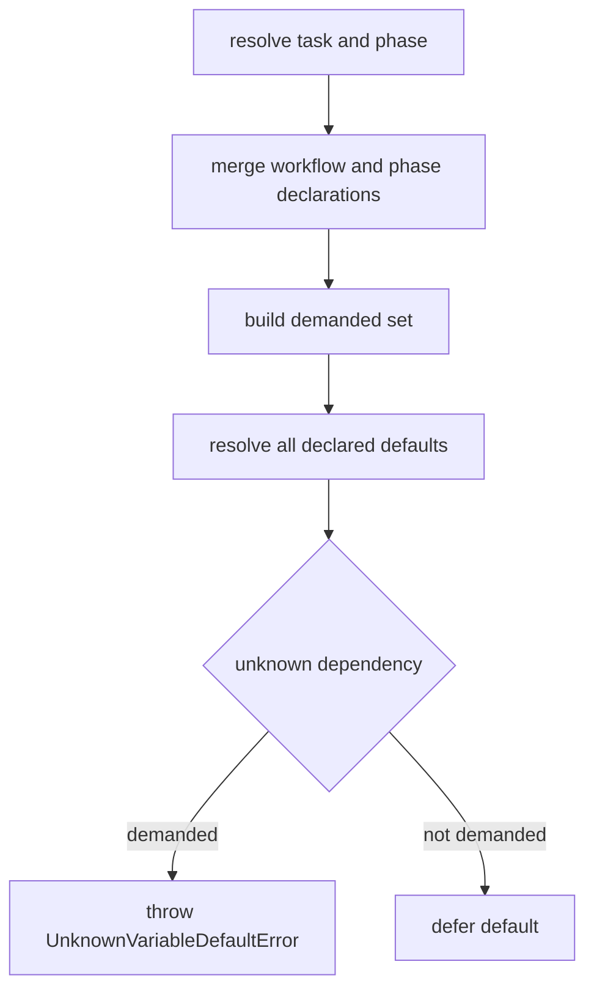
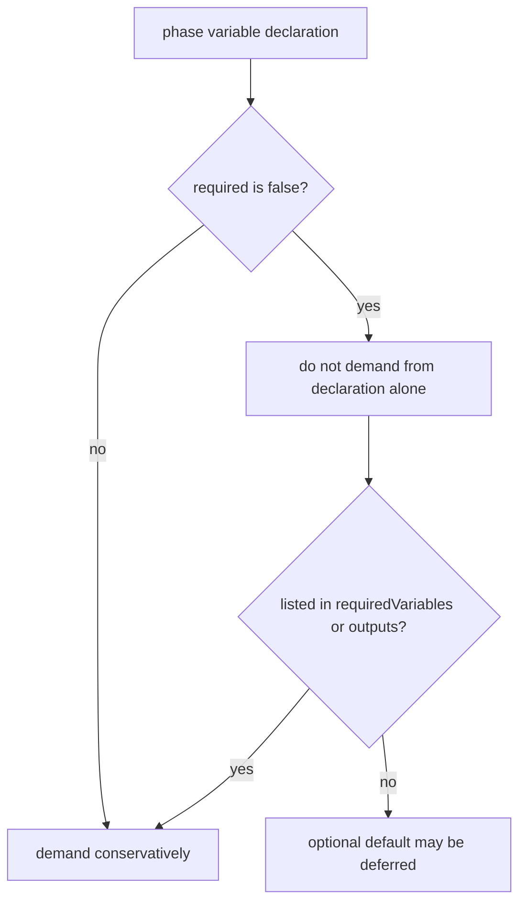

# GitHub Issue #231 Optional Phase Defaults Spec

## Scope

Fix `VariableResolver` demand tracking so an active phase-local variable declared with `required: false` is not demanded solely because it appears in `phase.variables`. Keep the change in `src/template/variable-resolver.ts` and focused resolver tests unless implementation proves another touch point is necessary.

Out of scope: workflow schema redesign, template engine changes, MCP, rollback, routing, viewer behavior, or any future workflow phase work.

## Use Case Alignment

Workflow authors need to declare optional phase helper variables whose defaults may depend on task-shape-specific variables. If the optional helper is not required by phase metadata, output metadata, a required declaration, a task override, or another demanded default, its unresolved default dependency should not block prompt rendering.

## High-Level Current Implementation Summary

Verified in `src/template/variable-resolver.ts`: `VariableResolver.resolve()` builds engine variables, merges workflow-level and phase-level declarations, resolves declared defaults, and overlays non-empty task variables. Default resolution knows all engine, declaration, and task variable names and suppresses `UnknownVariableDefaultError` for defaults that are not demanded.

The current demand set includes every declaration in the active phase because `getDemandedVariableNames()` unconditionally adds `Object.keys(definition.variables)`. This makes optional phase declarations stricter than optional workflow declarations.

## Relevant Files Reviewed

- `src/template/variable-resolver.ts`: active implementation for declaration merge, demand tracking, default resolution, unknown-default suppression, and circular-default detection.
- `tests/unit/variable-resolver.test.ts`: unit coverage for standard variables, declaration merging, empty task variables using defaults, unused workflow defaults, required unknown defaults, and circular defaults.
- `src/core/types.ts` and `src/core/schemas.ts` via search results: phase declarations include `variables`, `requiredVariables`, and `outputs`.

## Active Entry Points And Bypasses

Verified entry points:

- `VariableResolver.resolve(task, phaseId, workflow, definition)` is used directly by tests and by prompt/rendering-related callers.
- `resolveDeclaredDefaults()` resolves all declared defaults but only rethrows unknown dependency errors when the current variable is demanded.

Bypass paths:

- Task-provided non-empty variables bypass defaults because `resolveOne()` returns existing values.
- Explicit empty task variables still allow defaults because empty strings are not treated as resolved values.
- Circular defaults are not suppressed by the unknown-default guard and still throw.

## Current Architecture

Demand sources today:

- Declarations with `required: true`.
- All active `definition.variables` keys.
- Active `definition.requiredVariables`.
- Active `definition.outputs`.

Default dependency behavior:

- Dependencies that are engine variables, task variables, or declared variables are known.
- Unknown dependencies throw `UnknownVariableDefaultError`.
- Unknown dependency errors are suppressed only for defaults currently classified as not demanded.
- Circular defaults throw `CircularVariableDefaultError`.

## Verified Behavior

Verified code behavior:

- Unused workflow-level defaults with unavailable dependencies can be deferred.
- Required defaults listed in `requiredVariables` throw `UnknownVariableDefaultError`.
- Same-name workflow and phase declaration metadata merges per field, including phase overrides.
- Empty task variables use declaration defaults.
- Circular default detection is covered for demanded defaults.

Inferred behavior:

- A phase-local declaration with `required: false` and an unknown default dependency currently throws because all phase-local variables are demanded.

Open questions:

- No template placeholder discovery appears necessary for this issue if the change is narrowly limited to explicit optional phase declarations.

## Problems

`required: false` does not relax phase-local declarations for demand tracking. A variable can be optional in metadata and unused by the active phase, yet still fail resolution before prompt rendering because its default references a variable absent from the current task shape.

## Proposed Direction

Change `getDemandedVariableNames()` so phase-local declarations are not automatically demanded when their merged declaration is explicitly `required: false`. Keep existing demand for:

- `required: true` declarations.
- Phase variables without explicit `required: false`, preserving conservative legacy behavior.
- Names listed in `requiredVariables`.
- Names listed in `outputs`.
- Defaults reached while resolving a demanded variable.

This preserves workflow-level required metadata merged with phase declarations because the merged declaration still drives the `required` check. Explicit phase `required: false` relaxation should remove automatic demand unless other phase metadata demands the variable.

## File-By-File Plan

- `tests/unit/variable-resolver.test.ts`: add a failing test where an optional phase variable default references `MISSING_KEY` and is not demanded; add or update coverage for `requiredVariables` and `outputs` demanding phase variables with unknown default dependencies.
- `src/template/variable-resolver.ts`: update demand calculation for `definition.variables` so explicit optional declarations are skipped unless demanded by other metadata.

## Risks And Open Questions

Main risk: under-demanding a phase-local variable that is actually rendered by a template but not listed in metadata. The scoped mitigation is to preserve conservative demand for phase declarations unless they explicitly set `required: false`; workflow authors opting into optional behavior must still list rendered variables in `requiredVariables` or `outputs` if needed.

## Reader Aids

Verified current flow:

Proposed demand adjustment:

