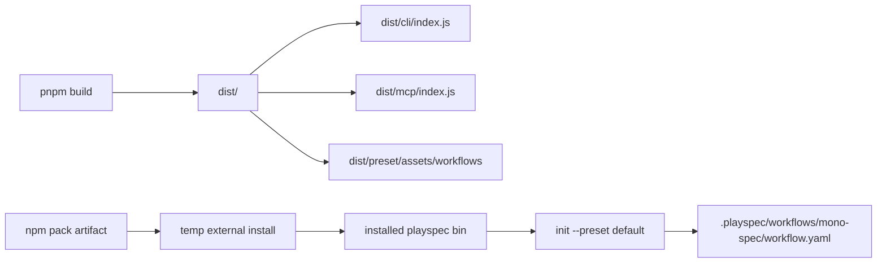

# GitHub Issue #244 Package Artifact Coverage Spec

## Scope

Add a narrow package artifact guard for the public npm artifact. The guard must prove that the packed/installed package contains compiled executable bins, runtime import alias targets under `dist`, and bundled preset workflow assets used by `playspec init --preset default`.

Out of scope: redesigning workflow loading, changing preset installation semantics, changing CLI command UX, changing the runtime alias scheme, or creating a broad release process.

## Use Case Alignment

Consumers install or pack `playspec` and then run the installed `playspec` bin from a workspace outside the source repository. That installed bin must be able to initialize `.playspec` and install at least the built-in `mono-spec` workflow from bundled package assets.

## High-Level Current Implementation Summary

Verified code behavior:

- `package.json` exposes `playspec` as `dist/cli/index.js` and `playspec-mcp` as `dist/mcp/index.js`.
- `package.json#imports` maps all internal alias families to `./dist/...`.
- `pnpm build` compiles TypeScript, rewrites aliases via `tsc-alias`, then copies `src/preset/assets/.` into `dist/preset/assets`.
- `WorkflowRegistry.getBuiltinRoot()` resolves built-in workflows relative to the compiled workflow module directory: `dist/workflow` -> `dist/preset/assets/workflows`.
- `PresetManager.initWorkspace()` installs built-in workflows by reading `WorkflowRegistry.getBuiltinRoot()`.
- `tests/integration/runtime-bin.test.ts` runs `pnpm build` and executes local `dist` entrypoints.

Inferred behavior:

- Local runtime-bin tests can pass even if `npm pack` excludes `dist` or excludes copied preset workflow assets, because they execute the repository-local build output directly.
- With no `files`, `prepack`, `prepare`, or package-artifact smoke script, there is no explicit artifact boundary test.

## Relevant Files Reviewed

- `package.json`: bin paths, imports, scripts, dependency metadata.
- `tests/integration/runtime-bin.test.ts`: existing build-backed compiled-bin coverage.
- `src/workflow/workflow-registry.ts`: built-in workflow root resolution.
- `src/preset/preset-manager.ts`: preset initialization and workflow copy behavior.
- `src/cli/commands/init.ts`: `playspec init --preset default` entrypoint behavior.
- `src/preset/assets/workflows/**`: built-in workflow fixtures that must be copied into the package artifact.
- `tests/helpers/createTempWorkspace.ts`: temporary external workspace helper.

## Active Entry Points And Bypasses

Active entry points:

- Installed `playspec` bin -> `dist/cli/index.js` -> `runInit()` -> `PresetManager.initWorkspace()` -> `WorkflowRegistry.getBuiltinRoot()` -> `dist/preset/assets/workflows`.
- Installed `playspec-mcp` bin -> `dist/mcp/index.js`.
- Runtime package imports -> `package.json#imports` -> `dist/<module>/*.js`.

Bypasses and partial coverage:

- `tests/integration/runtime-bin.test.ts` bypasses npm packing and package installation by executing `node dist/cli/index.js` and `node dist/mcp/index.js` directly.
- Alias-family coverage checks `package.json#imports` and emitted/local source imports, but it does not prove the packed tarball contains those emitted files.
- `pnpm build` proves the copy step can create local `dist/preset/assets`, but not that the package artifact includes it.

## Current Architecture

Verified artifact-sensitive flow:

The missing verification is the `Package -> Install -> Bin -> Init -> WorkflowCopy` segment.

## Verified Behavior

- Fresh worktree needed `pnpm install` before the TypeScript CLI could run.
- `playspec init --preset default` installs project workflows in non-interactive mode.
- `src/preset/assets/workflows/mono-spec/workflow.yaml` exists and is a suitable acceptance assertion fixture.

## Problems

- No lifecycle or script-level guard ensures artifacts are built before packing/publishing.
- No `files` allowlist documents and constrains what runtime directories must be included in the package.
- No integration test packs and installs the package before invoking `playspec`.
- Missing `dist/preset/assets/workflows` in the artifact would fail only after installation.

## Proposed Direction

Add both metadata and test coverage:

- Add package metadata that builds before pack, using a focused `prepack` script.
- Add a package `files` allowlist that includes `dist`, `README.md`, and `package.json` defaults while excluding source/test-only content from the artifact.
- Add a dedicated package artifact integration test separate from `runtime-bin.test.ts`.
- In the test, run `pnpm pack --pack-destination <temp>`, install the resulting tarball into a temporary consumer workspace using local package-manager operations, execute the installed `playspec` bin, and assert:
  - installed package contains `dist/cli/index.js`;
  - installed package contains `dist/mcp/index.js`;
  - installed package contains at least one runtime alias target such as `dist/workflow/workflow-registry.js`;
  - installed package contains `dist/preset/assets/workflows/mono-spec/workflow.yaml`;
  - `playspec init --preset default` creates `.playspec/workflows/mono-spec/workflow.yaml`.

The test should use temp directories outside the repository and avoid global installs or network access.

## File-By-File Plan

- `package.json`
  - Add `prepack` to run the existing build before package creation.
  - Add a focused smoke script name if useful for direct execution.
  - Add `files: ["dist", "README.md"]` so packed runtime contents are explicit.

- `tests/integration/package-artifact.test.ts`
  - Build/pack through `pnpm pack`.
  - Install the tarball into a temp consumer project.
  - Inspect installed package files under `node_modules/playspec`.
  - Execute the installed package bin and verify init installs `mono-spec`.
  - Keep this separate from `runtime-bin.test.ts`.

- `tests/integration/runtime-bin.test.ts`
  - Leave existing direct-`dist` runtime coverage meaningful; do not fold package artifact assertions into it.

## Risks And Open Questions

- `prepack` will run during `pnpm pack`; the artifact test should avoid running an extra redundant build unless necessary.
- Installing a local tarball may trigger lifecycle behavior depending on package manager defaults; use local file install and repo lockfile conventions to avoid network dependency.
- A strict `files` allowlist must include every runtime directory referenced by `package.json#imports`; including all of `dist` is simpler and less brittle than enumerating each subdirectory.
- The test will be slower than source-only unit tests; keep it focused and, if needed, runnable by path for release validation.

## Reader Aids

Key acceptance path:

1. `pnpm pack` builds and creates a tarball.
2. Temp consumer project installs the tarball locally.
3. Installed package exposes `node_modules/.bin/playspec`.
4. Running `playspec init --preset default` copies `mono-spec/workflow.yaml` into the consumer workspace.
5. Direct file assertions prove compiled bins, alias targets, and preset workflow assets are present in the installed package.
