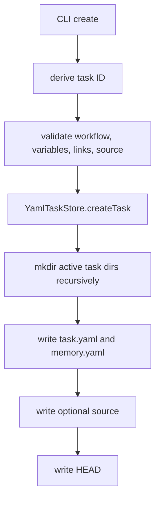
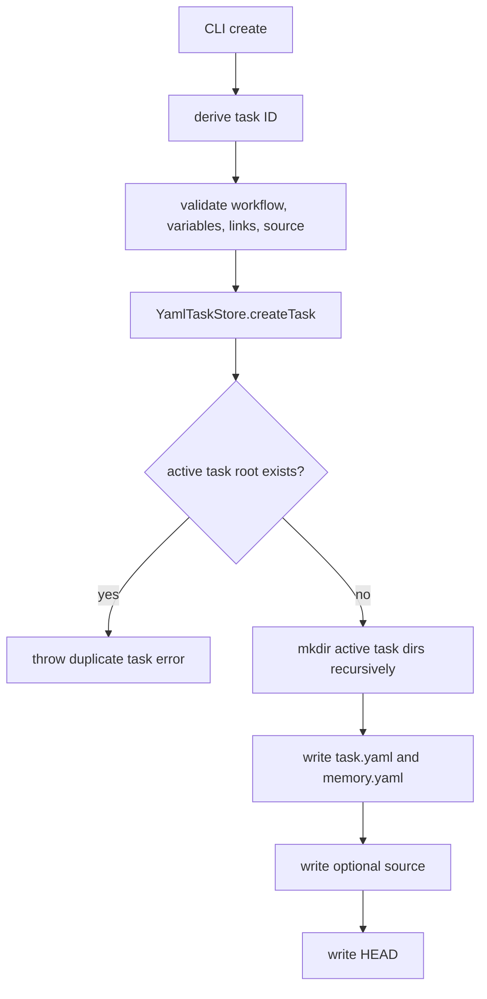

# GitHub Issue 268 Duplicate Create Protection Spec

## Scope

Add duplicate active task ID protection for `playspec create` so a title that slugifies to an existing active task fails before create-time files are written. Keep successful creation for new task IDs unchanged.

Out of scope: task ID suffixing, archive behavior changes, migration/repair of existing overwritten tasks, and reset semantics.

## Use Case Alignment

Users expect `playspec create` to create a new task, not silently reset an existing task whose ID matches the title slug. A duplicate create attempt should return a clear error, leave the existing task state intact, and leave `.playspec/HEAD` pointing where it was before the failed command.

## High-Level Current Implementation Summary

Verified code behavior:

- `src/cli/commands/create.ts` validates workspace and workflow before normal creation.
- Normal creation derives `taskId` from `slugify(title)`, resolves optional source input, links, and variables, then calls `createNormalTask`.
- `createNormalTask` validates first-phase required variables, calls `YamlTaskStore.createTask`, writes optional source content, then writes `.playspec/HEAD`.
- `src/storage/yaml-task-store.ts` creates the active task directory tree with recursive `mkdir`, writes `task.yaml`, and writes `memory.yaml`.

Problem: `YamlTaskStore.createTask` does not check for an existing active task root before writing. Recursive `mkdir` permits reuse, and subsequent writes replace lifecycle state.

## Relevant Files Reviewed

- `src/cli/commands/create.ts`: active CLI entry point for normal, interactive, and phase-execution task creation.
- `src/storage/yaml-task-store.ts`: persistence boundary for active task creation.
- `src/core/errors.ts`: existing typed error pattern with actionable hints.
- `tests/cli.test.ts`: existing CLI create tests and helpers.
- `package.json`: validation scripts are `pnpm build` and `pnpm test`.

## Active Entry Points And Bypasses

Verified active paths:

- `playspec create <title>` and `playspec create <workflow> <title>` reach `runCreate` and `createNormalTask`.
- `playspec create ... --stdin`, `--from-file`, or `--edit` can prepare source content before persistence.
- Interactive creation reaches `createNormalTask` after collecting inputs.
- Phase-execution creation calls `YamlTaskStore.createTask` directly.

Bypass paths:

- Direct callers of `YamlTaskStore.createTask` bypass CLI checks. Duplicate protection belongs in storage so all creation paths share the guard.

## Current Architecture

Verified flow:

Proposed flow:

## Verified Behavior

- Existing duplicate active task roots are currently reused because `mkdir(..., { recursive: true })` is not exclusive.
- `task.yaml` and `memory.yaml` are overwritten on duplicate storage creation.
- In normal CLI creation, source and HEAD writes happen only after `createTask` resolves.

## Problems

- Duplicate creation can erase `phaseHistory`, `stateSync`, `rollback`, variables, links, context refs, and memory.
- The failure point must be before storage writes; otherwise the command can leave partial or misleading state.
- CLI-only checks would not protect interactive, phase-execution, or direct storage callers consistently.

## Proposed Direction

Add a `TaskAlreadyExistsError` or similarly named `PlaySpecError` in `src/core/errors.ts`.

In `YamlTaskStore.createTask`, check `getActiveTaskRoot(workspaceRoot, input.id)` before building/writing the task directory. If it exists, throw the duplicate error before any `mkdir` or file write. Keep archive behavior unchanged.

Add CLI regression coverage that:

- Initializes a workspace.
- Creates an initial task with variables and source content.
- Records `task.yaml`, `memory.yaml`, source file content, and `.playspec/HEAD`.
- Creates another task to make HEAD differ from the duplicate target.
- Attempts to create the original title again with different `--var` values and source input.
- Expects a non-zero exit and duplicate-task message.
- Verifies all recorded files and HEAD are unchanged.
- Verifies creating a different title still succeeds and becomes HEAD.

Because the guard belongs in `YamlTaskStore.createTask`, add storage-level coverage by calling `YamlTaskStore.createTask` twice with the same `id`, expecting the second call to reject, and asserting the original serialized `task.yaml` and `memory.yaml` remain unchanged.

## File-By-File Plan

- `src/core/errors.ts`: add a typed duplicate active task error with an actionable hint.
- `src/storage/yaml-task-store.ts`: import and throw that error before any task directory or YAML writes.
- `tests/cli.test.ts`: add focused regression coverage near existing create tests.

## Validation Patch Ledger

Latest Step 2 validation score: 94/100.

Resolved validation issue:

- Storage-level coverage is now mandatory instead of conditional. Since duplicate protection is specified at the storage boundary, implementation must include direct `YamlTaskStore.createTask` regression coverage in addition to CLI coverage.

Remaining blockers:

- None.

## Risks And Open Questions

Risks:

- Scripts relying on duplicate create as an implicit reset will now fail. This is intentional and matches the issue scope.
- A simple existence check is not a full cross-process exclusive create lock. The issue asks for overwrite prevention before writes; exclusive directory creation could be considered later if concurrent create races become a reported problem.

Open questions:

- None blocking.

## Reader Aids

Expected duplicate error should name the task ID and tell users to choose a different title or inspect the existing task with `playspec list-tasks`.
