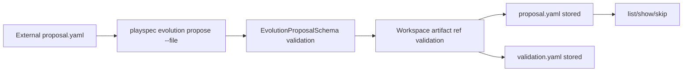

# GitHub Issue #50: PlaySpec Update 6.1 - Evolution Proposal CLI Intake

## Scope

Implement only Phase 6.1 from `docs/features/playspec_evolution/playspec_evolution_phase_plan.md`: expose the existing Phase 6 evolution proposal schema/store through CLI intake, listing, inspection, and skip status updates.

In scope:

- `playspec evolution propose --file <proposal.yaml>`
- `playspec evolution list`
- `playspec evolution show <proposalId>`
- `playspec evolution skip <proposalId> [--reason <text>]`
- validation report persistence for accepted proposal files
- read-only list/show output that includes `pending` and `skipped`
- skip metadata without deleting proposal or validation files

Out of scope:

- applying proposal actions
- mutating workflows, templates, rules, task records, or prompts from proposals
- surfacing proposals in prompt rendering
- completion-time evolution snapshots
- MCP proposal intake tools
- later Phase 6.2+ behavior

## Use Case Alignment

External agents can write structured proposal YAML files. Human users can ask PlaySpec to validate and store those files, inspect pending/skipped proposals, and mark proposals skipped before any apply path exists.

## Current Implementation Summary

Verified behavior:

- `src/evolution/schemas.ts` defines proposal, action, status, review, and validation report schemas.
- `src/evolution/proposal-store.ts` validates and stores proposal YAML under `.playspec/evolution/proposals/{proposalId}/proposal.yaml`.
- The store writes validation reports, loads proposals, loads validation reports, and updates proposal status to `skipped`.
- Prompt rendering and completion paths already have regression tests proving stored proposals are ignored.
- MCP has a regression test proving no proposal/evolution intake tools are registered.
- `src/cli/index.ts` currently has no public `evolution` command group.

Inferred behavior:

- Phase 6.1 can be implemented without touching Core prompt/completion logic because the existing store is standalone and currently unused by prompt/completion.
- The CLI can use `process.cwd()` as the workspace root, matching other command implementations.

Open questions:

- None for this phase. Proposal apply semantics are explicitly deferred to Phase 6.2.

## Relevant Files Reviewed

- `docs/features/playspec_evolution/playspec_evolution_phase_plan.md`
- `docs/features/playspec_evolution/playspec_evolution_total_spec.md`
- `src/cli/index.ts`
- `src/cli/commands/archive.ts`
- `src/evolution/proposal-store.ts`
- `src/evolution/schemas.ts`
- `src/evolution/types.ts`
- `src/utils/paths.ts`
- `tests/cli.test.ts`
- `tests/integration/evolution-proposal-store.test.ts`
- `tests/integration/init-create-next.test.ts`
- `tests/integration/mcp-server.test.ts`

## Active Entry Points And Bypasses

Active entry points to add:

- `playspec evolution propose --file <proposal.yaml>`
- `playspec evolution list`
- `playspec evolution show <proposalId>`
- `playspec evolution skip <proposalId> [--reason <text>]`

Bypasses to avoid:

- no Core prompt integration
- no MCP tool registration
- no mutation engine or action executor
- no proposal generation command
- no automatic HEAD/task lookup requirement for proposals

## Current Architecture

The Phase 6 architecture is already isolated under `src/evolution/`. The CLI should call `EvolutionProposalStore` directly for this human command layer. Cross-module imports must use aliases where applicable.

Proposed Phase 6.1 flow:

## Verified Behavior

- Existing proposal IDs must be filesystem safe.
- Existing proposals reject duplicate proposal directories.
- Artifact refs must stay workspace-relative and exist.
- `updateProposalStatus(..., 'skipped')` preserves proposal ID and validation reports.
- Prompt rendering ignores stored proposals.
- Completion does not create evolution context snapshots.
- MCP does not register proposal/evolution intake tools.

## Problems

- Users cannot currently create stored proposals from files through the public CLI.
- Users cannot list, view, or skip stored proposals through the public CLI.
- `EvolutionProposalStore` lacks a list API, so CLI listing would otherwise need to duplicate storage path details.
- Existing CLI tests assert the absence of the `evolution` command group and must be updated for Phase 6.1.

## Proposed Direction

Add a narrow CLI command module `src/cli/commands/evolution.ts` and register it from `src/cli/index.ts`. Add a store-level `listProposals()` method that returns validated proposal records sorted by ID or creation time deterministically. Keep all proposal mutations limited to `saveProposal`, `saveValidationReport`, and `updateProposalStatus(..., 'skipped')`.

`propose --file` should:

- read YAML from the supplied file
- parse and validate it with the existing store validation path
- store `proposal.yaml`
- write `validation.yaml`
- print proposal ID, status, and stored paths
- fail without partial storage when validation fails

`list` should:

- print an empty-state message when no proposals exist
- print proposal ID, status, risk level, created time, and action count

`show` should:

- print proposal details, actions, source refs, skip metadata, and validation report summary when present

`skip` should:

- mark status `skipped`
- write `skippedAt`
- optionally write `skipReason`
- keep proposal and validation files in place

## File-By-File Plan

- `src/evolution/proposal-store.ts`: add `listProposals()` using existing path helpers and schema validation.
- `src/cli/commands/evolution.ts`: add command handlers for propose/list/show/skip.
- `src/cli/index.ts`: register the `evolution` command group.
- `tests/cli.test.ts`: replace Phase 6 command absence assertions with Phase 6.1 CLI behavior tests.
- Existing integration tests: keep prompt/completion/MCP non-surfacing tests unchanged.

## Risks And Open Questions

- Invalid proposal files should not leave `proposal.yaml` or `validation.yaml` behind. This preserves a simple intake contract; storing invalid reports can be considered later if specified.
- The CLI must not infer apply readiness from proposal status. `pending` and `skipped` are intake/review states only in Phase 6.1.
- List output should be stable enough for tests but remain human-readable.

## Reader Aids

Phase boundary checklist:

- CLI intake: yes
- Stored proposal listing: yes
- Stored proposal inspection: yes
- Skip status update: yes
- Apply actions: no
- Prompt surfacing: no
- Completion snapshots: no
- MCP proposal tools: no
