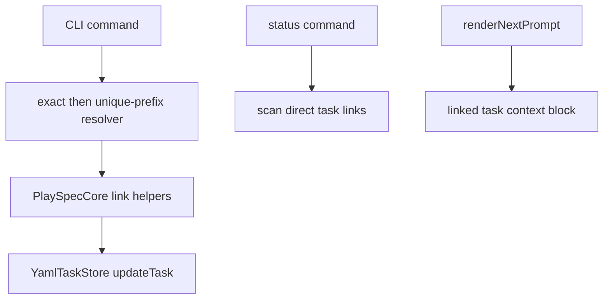

# GitHub Issue 84 Lightweight Task Links Implementation Spec

## Scope

Implement v1 Lightweight Task Links from the already-merged issue #82 planning package.

In scope:

- Optional task metadata links with types `parent`, `after`, and `related`.
- `playspec create --parent <taskId>` and `playspec create --after <taskId>`.
- New `playspec link` and `playspec unlink` commands.
- Exact task ID resolution first, then unique-prefix resolution.
- `playspec status [taskId]` direct outgoing and incoming link display.
- Simple parent suggested-next display for direct child tasks.
- Compact linked-task context in rendered prompts.
- Backward compatibility for existing tasks without `links`.

Out of scope:

- Graph/report/task-links commands.
- Recursive traversal, dependency enforcement, or complex cycle detection.
- Automatic inverse link persistence.
- `--related` on `playspec create`.
- Viewer, MCP, migration, evolution, or archive behavior.

## Use Case Alignment

The user-visible workflow is ordered grouped work:

1. Create a parent task.
2. Create child tasks with `--parent` and optional `--after`.
3. Inspect parent `status` to see included children and the next obvious open child.
4. Inspect a child `status` to see parent, predecessor, and direct followers.
5. Render prompts with enough linked-task context for humans and agents to orient themselves.

The feature is metadata and display only. It must not turn task selection, completion, or prompt rendering into a scheduler.

## Current Implementation Summary

Verified current behavior:

- `TaskRecordSchema` has no `links` field, so task YAML with links currently fails schema validation.
- `YamlTaskStore.createTask()` creates task YAML with fixed fields and cannot persist initial links.
- `TaskStore` has `getTask`, task listing, `createTask`, and `updateTask`, which are enough for a small link mutation path.
- `playspec create` supports `--workflow`, `--from`, `--from-file`, `--stdin`, `--edit`, and phase-execution options, but not link flags.
- `playspec status` resolves HEAD or an explicit task through `ActiveTaskResolver` and prints compact task detail only.
- `PlaySpecCore.renderNextPrompt()` renders workflow templates and context refs but does not add linked-task context.

Inferred behavior:

- Existing prompt and completion paths should continue to work if `links` is optional and omitted for unlinked tasks.
- Direct incoming link display can be implemented by scanning active and completed task summaries plus `getTask()`.

Open questions:

- Archived task link display is not required for v1. The implementation should resolve and scan active/completed tasks only unless an existing helper makes archived support trivial without broadening scope.

## Relevant Files Reviewed

- `docs/features/issue_82_lightweight_task_links/spec.md`
- `docs/features/issue_82_lightweight_task_links/plan.md`
- `docs/features/issue_82_lightweight_task_links/result.md`
- `docs/features/issue_82_lightweight_task_links/pr.md`
- `src/core/types.ts`
- `src/core/schemas.ts`
- `src/storage/task-store.ts`
- `src/storage/yaml-task-store.ts`
- `src/core/playspec-core.ts`
- `src/cli/commands/create.ts`
- `src/cli/commands/status.ts`
- `src/cli/commands/prompt.ts`
- `src/cli/index.ts`

## Active Entry Points And Bypasses

Active entry points to update:

- `playspec create`: add `--parent` and `--after` target resolution before task creation.
- `playspec link`: new command with explicit source or current-task source shorthand.
- `playspec unlink`: new command with explicit source or current-task source shorthand.
- `playspec status [taskId]`: use exact/prefix resolution and render links.
- `playspec prompt`: indirectly changes through `PlaySpecCore.renderNextPrompt()`.

Bypasses to preserve:

- Tasks without `links` remain valid and render exactly as before except for no linked-context block.
- MCP must not be touched for this issue.
- Core must not depend on CLI or `.playspec/HEAD`; current-task shorthand belongs in CLI command code.

## Proposed Architecture

Add small Core-level helpers for task ID resolution and link mutation.



The resolver and mutation helpers should be reusable by create/link/unlink/status without making the store aware of CLI concepts.

## Data Model

Add:

```ts
type TaskLinkType = 'parent' | 'after' | 'related';

interface TaskLink {
  type: TaskLinkType;
  targetTaskId: string;
  createdAt: string;
  createdBy?: 'cli' | 'manual' | 'import' | 'agent';
}
```

Add `links?: TaskLink[]` to `TaskRecord` and `CreateTaskInput`. Store outgoing links only on the source task.

## Validation Rules

Required:

- Source task exists.
- Target task exists.
- Source and target are not identical.
- Link type is `parent`, `after`, or `related`.
- Duplicate exact links are no-op warnings.
- Missing unlink targets are no-op warnings.
- Prefix resolution must fail on ambiguity and list matching IDs with guidance to use a longer prefix.
- Missing resolution must suggest `playspec list-tasks`.

Unsupported manual link types may remain a schema hard fail in v1 because that preserves current strict YAML guarantees.

## Status Behavior

`playspec status` shows HEAD task. `playspec status <taskId>` shows the resolved task.

Direct outgoing sections:

- `Parents`
- `After`
- `Related`

Direct incoming sections:

- `Includes`: tasks with `parent` link to current task.
- `Followed by`: tasks with `after` link to current task.
- `Related by`: tasks with `related` link to current task, if present.

Suggested next for a parent task:

1. Find direct children.
2. Treat a child as blocked only when its direct `after` target is another child that is not done.
3. Suggest the single first open child when ordering is clear.
4. If multiple open children are unblocked, show all candidates instead of guessing.

## Prompt Behavior

For linked tasks, prepend or append a compact block to the rendered prompt:

```text
Linked task context:
Parents:
- parent_task_id
After:
- previous_task_id
Related:
- related_task_id
```

No linked-context block should appear for tasks without links.

## File-By-File Plan

- `src/core/types.ts`: add link types and optional task fields.
- `src/core/schemas.ts`: add zod link schema and optional `links`.
- `src/core/task-id-resolver.ts`: add exact/unique-prefix resolver over active/completed task IDs.
- `src/core/playspec-core.ts`: add link/unlink methods and prompt linked-context injection.
- `src/cli/commands/create.ts`: add create-time `--parent` and `--after`.
- `src/cli/commands/link.ts`: implement explicit and current-task source linking.
- `src/cli/commands/unlink.ts`: implement explicit and current-task source unlinking.
- `src/cli/commands/status.ts`: render direct link sections and suggested-next.
- `src/cli/index.ts`: register new flags and commands.
- `tests/integration/task-links.test.ts`: cover resolver, create flags, link/unlink, status, and prompt behavior.

## Risks And Controls

- Scope creep into graph management: keep all displays direct-only.
- Incorrect prefix resolution: exact match first and ambiguity failure.
- Hidden inverse state: never write inverse links to YAML.
- Prompt churn: only add linked context when the task has outgoing links.
- HEAD coupling in Core: CLI may resolve current task; Core receives explicit task IDs.

## Quality Gate

Spec quality score: 96/100.

Evidence for score:

- Maps all issue #82 acceptance areas into issue #84 implementation behavior.
- Separates verified current code behavior from proposed changes.
- Defines user-visible CLI/status/prompt paths and validation rules.
- Keeps future graph/viewer/MCP behavior out of scope.
