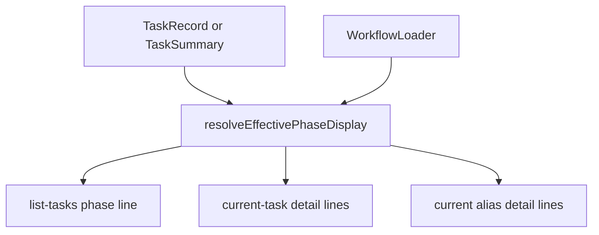

# GitHub Issue #93: Current Task Phase Display

## Scope

Fix the human CLI display mismatch where `playspec list-tasks` shows the resolved workflow phase clearly, but `playspec current-task` and deprecated `playspec current` do not expose the same phase information consistently.

Out of scope:
- MCP behavior.
- Workflow semantics or phase routing.
- Task persistence changes.
- New workflows, viewer work, rollback, migration, or evolution behavior.

## Use Case Alignment

Users switching between task overview and current task detail should see the same resolved phase identity. For a mono-spec task whose `currentPhase` is null, `list-tasks` currently shows the effective first phase as `1. 기술 명세서 업데이트 (effective)`. The current task detail commands should make that same resolved phase visible without requiring users to infer it from a `Step:` label or from raw YAML.

## High-Level Current Implementation Summary

Verified from code:
- `src/cli/commands/list-tasks.ts` loads active task summaries and prints `phase: ${eph.phaseDisplay}` for each task.
- `src/cli/commands/current-task.ts` resolves the same effective phase helper but prints the display under `eph.phaseLabel`, which becomes `Step` for workflows with `stepNumber`.
- `src/cli/commands/current.ts` is a deprecated alias that also resolves the effective phase display, but prints only the compact `Phase:` line and omits the resolved phase ID.
- `src/cli/cli-utils.ts` contains the shared `computeEffectivePhaseDisplay()` and `resolveEffectivePhaseDisplay()` helpers.
- `src/workflow/phase-display.ts` builds labels from workflow phase definitions.

Inferred behavior:
- The user report likely refers to the label and detail mismatch: list output says `phase`, while current-task says `Step` for mono-spec and current lacks the phase ID detail that current-task has as `Step ID`.

Open questions:
- None blocking. The safest fix is display-only and keeps the shared resolver unchanged.

## Relevant Files Reviewed

- `src/cli/commands/list-tasks.ts`
- `src/cli/commands/current-task.ts`
- `src/cli/commands/current.ts`
- `src/cli/commands/get-task.ts`
- `src/cli/cli-utils.ts`
- `src/workflow/phase-display.ts`
- `tests/cli.test.ts`
- `.playspec/workflows/mono-spec/workflow.yaml`

## Active Entry Points And Bypasses

Active entry points:
- `playspec list-tasks`
- `playspec current-task`
- Deprecated `playspec current`
- Related explicit lookup command `playspec get-task --task <id>`

Bypasses and alternate paths:
- `playspec status` prints task detail through its own command and is not part of the reported issue.
- MCP task lookup is separate and must remain untouched.
- Raw `--json` output from `get-task` should remain the persisted task record, not a display projection.

## Current Architecture

All three relevant commands already use the shared phase display resolver:



The bug is in command output formatting, not phase resolution.

## Verified Behavior

For a fresh mono-spec task in this worktree:

- `playspec list-tasks` prints `phase: 1. 기술 명세서 업데이트 (effective)`.
- `playspec current-task` prints `Step: 1. 기술 명세서 업데이트 (effective)` and `Step ID: tech_spec_draft (effective)`.
- `playspec current` prints `Phase: 1. 기술 명세서 업데이트 (effective)` but no resolved phase ID.

## Problems

1. `current-task` hides phase terminology behind `Step:` for mono-spec workflows, even though list output and user mental model are phase-based.
2. `current` does not show the resolved phase ID, so users cannot confirm the actual workflow phase ID from the deprecated command.
3. Tests cover effective phase display for `current-task`, `list-tasks`, and `get-task`, but not the deprecated `current` command's effective phase display or phase ID parity.

## Proposed Direction

Display a consistent resolved phase field in current task detail commands:

- Keep `list-tasks` unchanged.
- Change `current-task` and `get-task` human output to print `Phase:` and `Phase ID:` for resolved phase displays, including mono-spec workflows.
- Change deprecated `current` to print `Phase ID:` when the resolver has a phase ID display.
- Leave resolver behavior and task persistence untouched.
- Update tests to assert current/current-task phase terminology and current effective phase display.

## File-By-File Plan

- `src/cli/commands/current-task.ts`: print `Phase:` instead of dynamic `Step:` and `Phase ID:` instead of `Step ID:`.
- `src/cli/commands/current.ts`: add `Phase ID:` when `eph.phaseIdDisplay` exists.
- `src/cli/commands/get-task.ts`: keep explicit task detail terminology aligned with current-task by printing `Phase:` and `Phase ID:`.
- `tests/cli.test.ts`: update expectations and add regression coverage for deprecated `current`.

## Risks And Open Questions

- This changes CLI text output and can affect users parsing human output. Existing output is human-oriented, not JSON. `get-task --json` remains stable for machine use.
- Korean workflow phase titles are preserved from workflow definitions.
- No Core, MCP, migration, or storage behavior changes are required.

## Reader Aids

Relevant user-facing output after the fix should look like:

```text
Phase:       1. 기술 명세서 업데이트 (effective)
Phase ID:    tech_spec_draft (effective)
```
