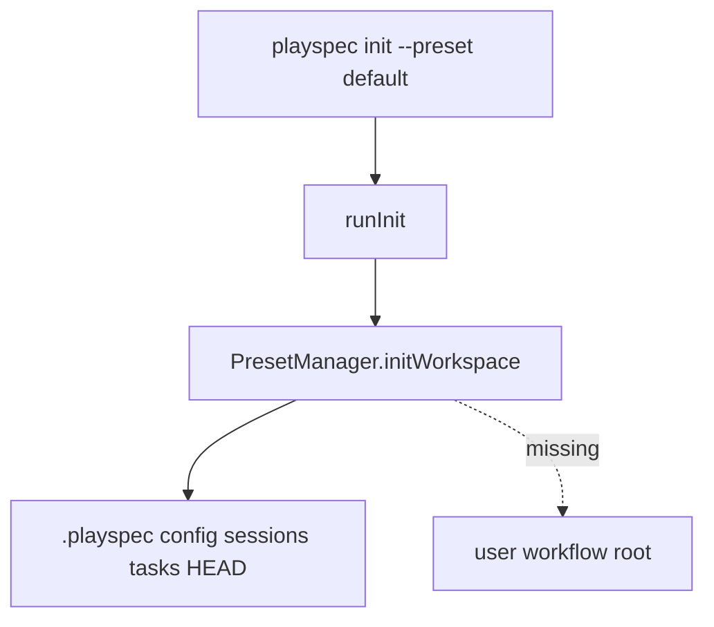
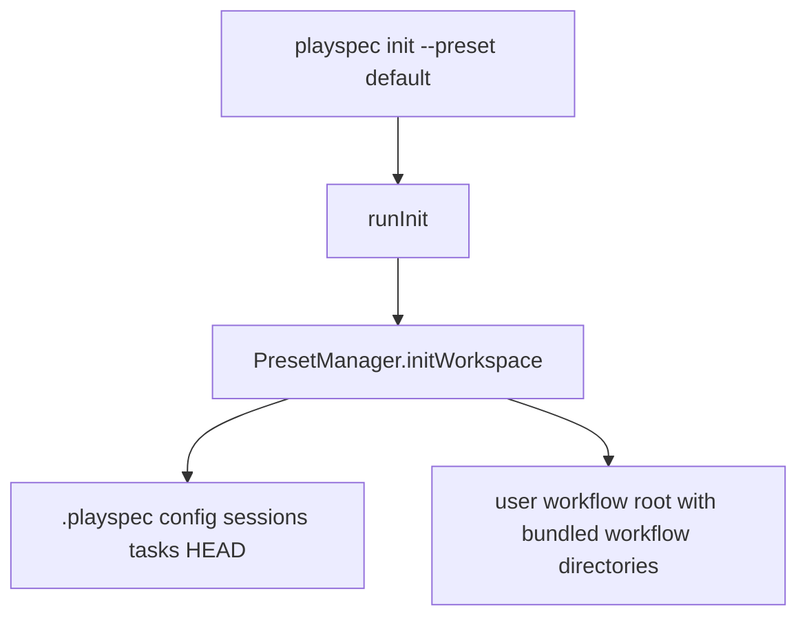

# Install Preset Workflows During Init

## Scope

Implement GitHub issue #40 only: when `playspec init --preset default` initializes a workspace, the workflows shipped with the initially configured preset must be installed into PlaySpec's user workflow location. Do not change workflow execution semantics, add new workflows, remove built-in fallback loading, or broaden preset configuration.

## Use Case Alignment

Users expect `playspec init` to make the workflows PlaySpec already provides visible as installed workflow files. Today tasks can still render because `WorkflowRegistry` falls back to built-in package assets, but no workflow files appear in the user workflow install location after init. The requested behavior is materialization of provided workflow assets during initialization.

## High-Level Current Implementation Summary

Verified:

- `src/cli/index.ts` registers `playspec init --preset <name>` and calls `runInit(process.cwd(), opts.preset)`.
- `src/cli/commands/init.ts` delegates directly to `PresetManager.initWorkspace()`.
- `src/preset/preset-manager.ts` creates `.playspec/tasks/active`, copies preset `sessions`, copies `config.yaml`, and writes an empty `.playspec/HEAD`.
- `src/preset/assets/workflows/` contains the provided workflow directories: `mono-spec`, `multi-spec`, `simple-bug`, `phase-execution`, and `total-plan`.
- `src/workflow/workflow-registry.ts` resolves workflows from a user workflow root before falling back to built-in package assets. By default that user root is `~/.playspec/workflows`, or `PLAY_SPEC_USER_WORKFLOWS` when set.
- `docs/features/issue_34_declarative_workflow_assets/result.md` records the current architecture: user workflows resolve from `~/.playspec/workflows`, built-ins resolve from package assets, and `playspec init` no longer copies workflow/template runtime assets into `.playspec`.

Inferred:

- The "appropriate workflow location during init" should be the existing registry user root, not project-local `.playspec/workflows`, because issue #34 intentionally moved workflow runtime assets out of task-state `.playspec`.
- "Initially configured preset's workflows" maps to the bundled workflows currently available with the default preset. The default preset has no manifest/subset list, and only `default` exists, so install all bundled workflows from `src/preset/assets/workflows`.

## Relevant Files Reviewed

- `src/cli/index.ts` - init and workflow command wiring.
- `src/cli/commands/init.ts` - init command wrapper.
- `src/preset/preset-manager.ts` - initialization behavior to update.
- `src/preset/assets/default/config.yaml` - selected preset metadata.
- `src/preset/assets/workflows/**` - source workflow assets to install.
- `src/workflow/workflow-installer.ts` - existing user workflow install behavior.
- `src/workflow/workflow-loader.ts` - workflow validation from directories and registry resolution.
- `src/workflow/workflow-registry.ts` - built-in/user workflow roots and listing.
- `docs/features/issue_34_declarative_workflow_assets/result.md` - latest workflow asset architecture.
- `tests/integration/init-create-next.test.ts` - init structure coverage.
- `tests/integration/runtime-bin.test.ts` - compiled init smoke test.
- `tests/integration/workflow-loader.test.ts` - workflow loader behavior after init.

## Active Entry Points And Bypasses

Active entry point:

```text
playspec init --preset default
  -> runInit()
  -> PresetManager.initWorkspace()
  -> copies preset state assets and writes HEAD
```

Bypass/alternate paths:

- Direct tests instantiate `PresetManager` and call `initWorkspace()` without the CLI.
- `WorkflowLoader` can load built-in workflows without installed workspace files, so prompt rendering can pass even when init failed to materialize workflows.
- `playspec workflow install <path>` installs one user workflow into `WorkflowRegistry.getUserRoot()`, but it is an explicit user command and not part of initialization.

## Current Architecture

Workspace state is rooted under `.playspec/` via `getPlayspecRoot()`. Preset static assets are read relative to the compiled preset module directory. Workflow assets are stored separately under `src/preset/assets/workflows/` and copied into `dist/preset/assets/workflows` by the build script.

Workflow resolution currently has two sources:

- `user`: `PLAY_SPEC_USER_WORKFLOWS` or `~/.playspec/workflows`
- `builtin`: package asset root under `preset/assets/workflows`

This issue should add an init-time materialization step from `builtin` source directories into the `user` root, without adding `.playspec/workflows` back as a runtime source.

## Verified Behavior

- Running `npx tsx src/cli/index.ts init --preset default` in the issue worktree creates `.playspec/HEAD`, `.playspec/config.yaml`, `.playspec/sessions/`, and `.playspec/tasks/active`.
- No implementation in `PresetManager.initWorkspace()` copies `src/preset/assets/workflows` into `.playspec/workflows`.
- No implementation in `PresetManager.initWorkspace()` copies `src/preset/assets/workflows` into `WorkflowRegistry.getUserRoot()`.
- Existing tests for init structure do not assert `.playspec/workflows` exists or contains workflow definitions.

## Problems

1. `playspec init` does not install bundled workflows into the user workflow root, so users do not see the workflows shipped with the preset as installed workflow files.
2. Prompt/rendering tests do not catch this because workflow resolution falls back to built-in package workflows.
3. The requested behavior is about initialization side effects, so the regression should be covered at the preset manager and compiled CLI smoke surfaces.

## Proposed Direction

Copy the bundled workflow asset directories into `WorkflowRegistry.getUserRoot()` during `PresetManager.initWorkspace()`.

Implementation constraints:

- Keep the fix in preset initialization.
- Do not change task workflow execution.
- Do not change MCP behavior.
- Do not remove built-in fallback resolution.
- Keep init safe to rerun by skipping workflow directories that already exist instead of overwriting user-modified installed workflows.

## File-By-File Plan

- `src/preset/preset-manager.ts`
  - Copy bundled `assets/workflows/*` directories to `new WorkflowRegistry(workspaceRoot).getUserRoot()` during init.
  - Create the user workflow root as needed.
  - Skip already-existing workflow ids to preserve user changes and idempotent init.
  - Continue copying existing preset-specific config and sessions.
  - Preserve empty HEAD creation.
- `tests/integration/init-create-next.test.ts`
  - Extend init structure assertions to include installed workflow files under `PLAY_SPEC_USER_WORKFLOWS`.
  - Add assertions for representative installed workflow files/templates, including `mono-spec/workflow.yaml`.
  - Add idempotence coverage that an existing installed workflow file is not overwritten by rerunning init.
- `tests/integration/runtime-bin.test.ts`
  - Add a compiled CLI init assertion that `PLAY_SPEC_USER_WORKFLOWS/mono-spec/workflow.yaml` exists.

## Risks And Open Questions

- Risk: overwriting user-modified installed workflows on re-init would be destructive. Avoid this by copying only missing workflow ids.
- Risk: installing bundled workflows into the user root means a later package update will not automatically refresh an already-installed workflow id. This is acceptable for this issue because init should be idempotent and non-destructive; users can remove/reinstall workflows through the workflow CLI if needed.
- Open question: future presets may want preset-specific workflow subsets. Current assets are global, and only `default` exists, so copying all bundled workflows is the minimal behavior.

## Reader Aids

Verified current flow:



Proposed flow:


