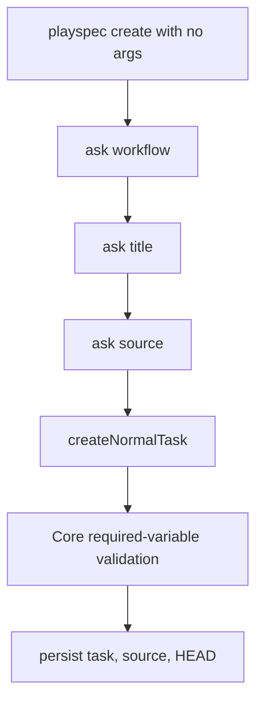
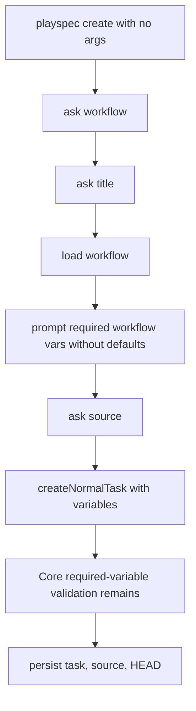

# Interactive Create Required Variables Spec

## Scope

Implement issue #141 in the CLI create flow only. The change covers `playspec create` interactive wizard behavior and tests around required workflow variable collection. It does not change Core prompt rendering validation, MCP task resolution, workflow schemas, or non-interactive create semantics.

## Use Case Alignment

A user starts `playspec create` with no arguments in a terminal, selects a workflow, enters a title, and expects the resulting task to be ready for the first prompt. If the selected workflow declares required workflow variables without defaults, the wizard must collect those values before any task state, source file, or HEAD update is written.

## Current Implementation Summary

Verified behavior in `src/cli/index.ts`: the create command enters `runInteractiveCreate(process.cwd())` only when no positional arguments are supplied and the terminal guard passes.

Verified behavior in `src/cli/commands/create.ts`: `runInteractiveCreate` asks for workflow, task title, and source input, then calls `createNormalTask(workspaceRoot, workflow, titleInput, sourceResult)` without passing workflow variables. `createNormalTask` builds task variables, calls `assertInitialPhaseRequiredVariables`, then persists task state, writes any source file, and updates `.playspec/HEAD`.

Verified behavior in `src/template/variable-resolver.ts`: resolver combines engine variables, declaration defaults, and task variables. Defaults can reference other known variables. Empty values remain invalid for required-variable checks.

Verified behavior in `src/core/required-variables.ts`: Core still validates required workflow variables, required phase variables, and phase `requiredVariables` at prompt/create validation time.

## Relevant Files Reviewed

- `src/cli/index.ts`: create command dispatch and interactive guard.
- `src/cli/commands/create.ts`: interactive wizard, non-interactive create, source handling, variable parsing, pre-persistence validation.
- `src/template/variable-resolver.ts`: default and built-in variable resolution rules.
- `src/core/required-variables.ts`: required variable validation that must remain intact.
- `src/storage/yaml-task-store.ts`: task persistence and `variables` storage.
- `src/preset/assets/workflows/mono-spec/workflow.yaml`: required `FEATURE_SLUG` declaration.
- `src/preset/assets/workflows/issue-scope-create/workflow.yaml`: multiple required workflow variables and defaulted variables.
- `tests/cli.test.ts`: existing CLI create coverage and pseudo-TTY helper.

## Active Entry Points And Bypasses

Active entry point: `playspec create` with no positional arguments calls `runInteractiveCreate`.

Bypass path: non-interactive create with a title calls `runCreate`, which already accepts repeated `--var KEY=VALUE`. This behavior must remain unchanged.

Bypass path: phase-execution create uses `runCreate` with `--phase` and parsed `--var` values. This should not be changed.

Partial migration path: `createNormalTask` already prevents persistence when required variables are missing. Interactive create currently depends on that failure instead of collecting values first.

## Current Architecture

The CLI owns prompting and user input. Core owns validation and rendering. The storage layer persists whatever `variables` map the CLI passes into `YamlTaskStore.createTask`, with `FEATURE_SLUG` defaulting to the task id when not overridden.

## Verified Behavior

- Non-interactive `--var` values are parsed by `parseTaskVariables` and stored in task YAML.
- Defaults declared at workflow or phase level satisfy required-variable validation during create/prompt.
- Missing first-phase required variables currently fail before `createNormalTask` persists task state.
- Interactive create can be exercised in tests through `runCliInPty`.

## Problems

- Interactive create has no prompt equivalent for non-interactive `--var`.
- Workflows with required declarations such as `issue-scope-create` cannot be completed through the wizard.
- The wizard does not load the workflow until the final persistence helper validates it, so it cannot know which required variables to ask for.
- Blank input for a required variable is not handled because no variable prompt exists.

## Proposed Direction

Add a CLI-only helper in `src/cli/commands/create.ts` that loads the selected workflow after the title is known and before source persistence. It should inspect required workflow-level variable declarations, skip declarations satisfied by usable defaults, prompt for the remaining missing values, reject blank responses by reprompting, and return a `Record<string, string>` for `createNormalTask`.

For `mono-spec`, prompt for `FEATURE_SLUG` because it is a required workflow declaration without a default and the acceptance criteria explicitly call it out. For workflows like `issue-scope-create`, prompt for all required declarations without defaults: `TARGET_REPOSITORY`, `ISSUE_SCOPE`, `FOCUS_AREA`, `OUT_OF_SCOPE_RULES`, and `DUPLICATE_SEARCH_QUERY`. Do not prompt for defaulted values such as `MAX_ISSUES`, `ISSUE_LABEL`, or derived output paths.

Cancellation or EOF during variable collection should throw before `createNormalTask` is called. Since source files are only written inside `createNormalTask`, this preserves the no-task/no-source/no-HEAD requirement.

## File-by-File Plan

- `src/cli/commands/create.ts`: load the selected workflow during interactive create, collect missing required workflow variables, validate non-empty input, pass collected variables to `createNormalTask`, and make `askQuestion` able to surface cancelled/closed input.
- `tests/cli.test.ts`: add pseudo-TTY tests for mono-spec `FEATURE_SLUG`, multiple `issue-scope-create` variables, blank reprompt behavior, cancellation/no persistence, existing non-interactive `--var`, and prompt rendering after interactive creation.

## Risks And Open Questions

- Open question: whether built-in `FEATURE_SLUG` should count as already resolvable. The issue explicitly requires prompting for mono-spec `FEATURE_SLUG`, so the implementation should treat required workflow declarations without defaults as wizard prompts even when engine fallback exists.
- Risk: prompt label wording could make pseudo-TTY tests brittle. Tests should assert persisted variables and rendered prompts rather than depend heavily on full prompt text.
- Risk: `readline` close behavior on piped pseudo-TTY cancellation needs explicit handling so failures occur before task persistence.

## Reader Aids

Verified current flow:

Proposed interactive flow:

