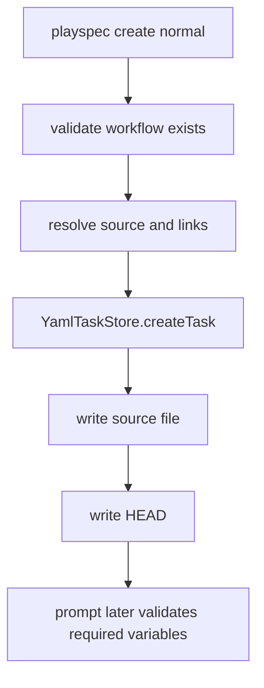
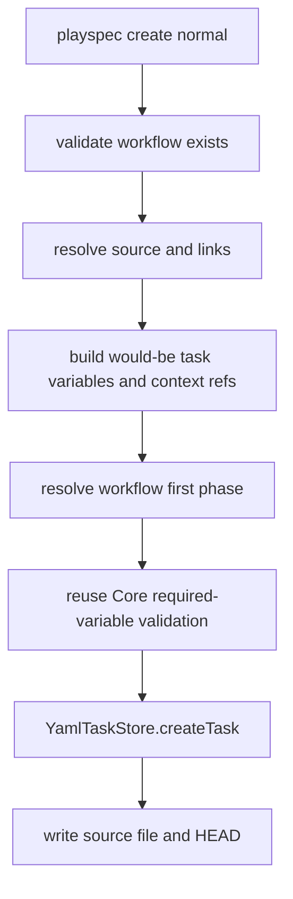

# Validate first-phase required variables during task creation

## Scope

Implement create-time validation for normal `playspec create` tasks so a workflow whose initial phase has unsatisfied required variables is rejected before any task record, source file, link state, or `.playspec/HEAD` mutation is written.

Out of scope: phase-execution task creation, variable storage redesign, completion-time variable mutation, CLI workflow argument redesign, and future workflow phases.

## Use Case Alignment

Users and automation call `playspec create "<title>" --workflow <workflow> [--var KEY=VALUE]`. If the selected workflow cannot render its first phase because a required variable is missing and no workflow/phase default supplies it, the create command should fail immediately with the same missing-variable contract used by prompt rendering. Successful creates should still persist task variables, source-problem variables, context refs, links, and HEAD.

## High-Level Current Implementation Summary

Verified behavior:

- `src/cli/commands/create.ts` validates workflow existence, resolves source-problem input and links, then calls `createNormalTask`.
- `createNormalTask` calls `YamlTaskStore.createTask`, optionally writes the source problem, writes `.playspec/HEAD`, and prints success.
- `src/core/playspec-core.ts` validates required variables only inside `renderResolvedPhase`, after `VariableResolver.resolve` has combined task variables, workflow defaults, and phase defaults.
- `MissingRequiredVariablesError` already includes workflow id, phase id, and the missing variable names.

Inferred behavior:

- A normal create can leave a new task and HEAD for a workflow that later fails in `prompt`, because normal create does not currently resolve the initial phase or call the Core validation path.

## Relevant Files Reviewed

- `src/cli/commands/create.ts`
- `src/core/playspec-core.ts`
- `src/core/errors.ts`
- `src/template/variable-resolver.ts`
- `src/workflow/phase-resolver.ts`
- `tests/integration/init-create-next.test.ts`
- `tests/cli.test.ts`
- `src/preset/assets/workflows/mono-spec/workflow.yaml`

## Active Entry Points And Bypasses

Active entry point:

- `runCreate(workspaceRoot, workflow, title, options)` for normal create when `options.phase` is absent.

Bypass path:

- `createNormalTask` persists before any first-phase render validation. This bypasses `PlaySpecCore.renderNextPrompt`, which is where required-variable validation happens today.

Alternate path intentionally unchanged:

- `--phase` execution task creation has separate planning-context validation and is out of scope.

## Current Architecture

Verified flow:

Proposed flow:

## Verified Behavior

- `PhaseResolver.resolveCurrentPhase` can identify the first phase for a task with no current phase/history.
- `VariableResolver.resolve` includes `TASK_TITLE`, `TASK_ID`, `TASK_ROOT`, `CURRENT_PHASE`, context variables, task variables, workflow variable defaults, and phase variable defaults.
- `PlaySpecCore.renderResolvedPhase` currently calls `assertRequiredVariables`, but that method is private and coupled to full prompt rendering.

## Problems

- Required-variable validation is not reusable outside prompt rendering because it is a private method in `PlaySpecCore`.
- Normal create has no pre-persistence representation of the would-be task, so it cannot currently run the same resolver/validation contract before writing.
- Tests cover Core prompt failure for missing required variables, but not CLI create atomicity for the same condition.

## Proposed Direction

Extract the required-variable validation logic into a reusable Core-level helper that accepts workflow id, phase id, phase definition, workflow variables, and resolved variables. Keep `PlaySpecCore.renderResolvedPhase` using this helper. Add a normal-create preflight that:

1. Constructs the exact variables/context refs that would be persisted, including `SOURCE_PROBLEM_FILE` when source input exists.
2. Builds a lightweight `TaskRecord` for resolver input without writing it to disk.
3. Resolves the workflow's initial phase with `PhaseResolver`.
4. Uses `VariableResolver.resolve` and the extracted required-variable helper.
5. Only calls `YamlTaskStore.createTask` after validation succeeds.

## File-By-File Plan

- `src/core/required-variables.ts`: add a shared assertion helper that preserves `MissingRequiredVariablesError` wording.
- `src/core/playspec-core.ts`: replace the private validation implementation with the shared helper.
- `src/cli/commands/create.ts`: add first-phase preflight for normal task creation before `store.createTask`.
- `tests/integration/init-create-next.test.ts` or `tests/cli.test.ts`: add CLI coverage for missing required variable atomicity, success with `--var`, and required variables satisfied by defaults.

## Risks And Open Questions

- Risk: creating a synthetic task record for validation could drift from store defaults. Mitigation: include only fields needed by `VariableResolver` and preserve the same task variables/context refs passed to `createTask`.
- Risk: validating templates by rendering the full prompt would require source files to exist before persistence. Mitigation: validate only required variables using the same resolver and assertion contract, not template rendering.
- Open question: whether create-time validation should validate all phases or only the initial phase. Issue scope says initial phase only.

## Reader Aids

- The visible error should remain: `Missing required variables for workflow "<workflow>" phase "<phase>": <vars>`.
- Successful `--var` creates should still print `Variables set: <count>` based on user-supplied variables, not internal `SOURCE_PROBLEM_FILE`.
