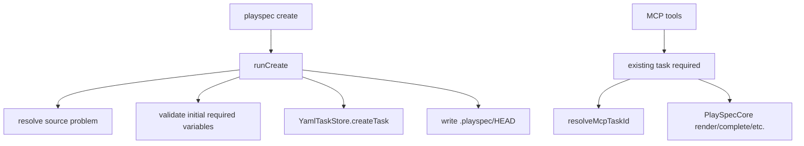
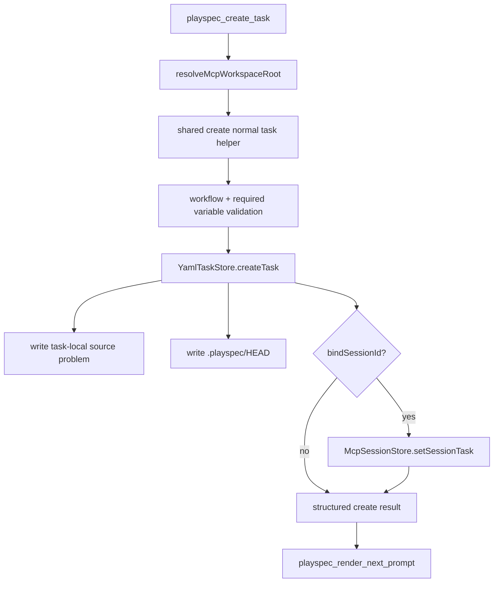

# Expose task creation through PlaySpec MCP

## Scope

Add an MCP tool named `playspec_create_task` that creates a normal PlaySpec task for any installed workflow without invoking the CLI. The tool must support the non-interactive create path: title, workflow, optional explicit `taskId`, workflow variables, source problem text, source problem file, task links, workspace scoping, and optional session binding.

Out of scope: the interactive create wizard, phase-execution task creation, workflow-specific shortcuts, changing existing CLI behavior, and changing MCP tools to use HEAD fallback.

## Use Case Alignment

MCP-only automation needs to start workflows such as `mono-spec`, `total-plan`, and `issue-scope-create` from a user request. Today it can list, read, bind, render, and complete tasks only after a task already exists. This forces automation to call the CLI for initial task creation, which breaks MCP-only execution.

The desired flow is:

1. Call `playspec_create_task` with `workspaceRoot`, `title`, `workflow`, variables, and source problem text or file.
2. Receive the created task metadata and source/context details.
3. Optionally bind the task to an MCP session during creation.
4. Call `playspec_render_next_prompt` or `playspec_complete_phase` with the returned `taskId` or bound `sessionId`.

## High-Level Current Implementation Summary

Verified behavior:

- `src/cli/commands/create.ts` owns the non-interactive creation path used by `playspec create`.
- The CLI validates that the workspace is initialized, resolves the workflow, reads source problem input from stdin or a file, validates initial phase required variables, creates a `YamlTaskStore` task, writes the task-local source file, and updates `.playspec/HEAD`.
- `src/mcp/server.ts` registers MCP tools and scopes task operations by resolving `workspaceRoot` through `resolveMcpWorkspaceRoot`.
- MCP task lookup and phase tools use `resolveMcpTaskId()` through `resolveScopedTask()` and do not read HEAD.
- Existing MCP tests use `getRegisteredToolHandler()` to call registered tool handlers directly.

Inferred behavior:

- The CLI create logic should be refactored so both CLI and MCP can call a shared non-interactive helper instead of duplicating validation and source handling.
- MCP task creation does not need `resolveMcpTaskId()` because no prior task exists, but workspace resolution should match `playspec_list_tasks` and `playspec_get_task`.

## Relevant Files Reviewed

- `src/cli/index.ts`: wires `playspec create` options to `runCreate()`.
- `src/cli/commands/create.ts`: current task creation implementation, source problem handling, variable parsing, link resolution, and initial phase required-variable validation.
- `src/mcp/server.ts`: MCP tool registration, workspace scoping helpers, task/session tools, render/complete tools.
- `src/mcp/context.ts`: MCP task ID resolution for existing-task operations.
- `src/mcp/workspace-diagnostics.ts`: workspace root resolution and diagnostics used by task lookup tools.
- `src/storage/yaml-task-store.ts`: persisted task creation behavior.
- `src/core/required-variables.ts`: required-variable error clarity.
- `src/template/variable-resolver.ts`: workflow/task variable resolution.
- `tests/integration/mcp-server.test.ts`: MCP tool integration coverage pattern.
- `.playspec/workflows/mono-spec/workflow.yaml`: required `FEATURE_SLUG` and `SOURCE_PROBLEM_FILE` behavior for source-backed tasks.
- `.playspec/workflows/total-plan/workflow.yaml`: required workflow variables for total-plan coverage.

## Active Entry Points and Bypasses

Active entry points:

- CLI: `playspec create [first] [second]` in `src/cli/index.ts`.
- MCP: `buildMcpServer()` in `src/mcp/server.ts`, currently without a create tool.
- Core rendering/completion: `PlaySpecCore` methods invoked by MCP after a task exists.

Bypasses and partial paths:

- MCP can bind an existing task to a session but cannot create that task.
- MCP can resolve explicit `workspaceRoot`; if a create tool uses the server root directly, it risks creating tasks in the wrong workspace.
- CLI create writes HEAD; MCP creation may preserve parity by updating HEAD, but existing MCP operations must still require explicit task/session context for follow-up tools.

## Current Architecture

## Verified Behavior

- `runCreate()` creates normal tasks with a slug derived from title.
- The created source problem path is `.playspec/tasks/active/<taskId>/sources/source_problem.md`.
- Source-backed tasks receive `SOURCE_PROBLEM_FILE` in task variables and a `source-problem` context ref.
- `assertInitialPhaseRequiredVariables()` validates the first phase with merged workflow/phase variables before the task is persisted.
- Missing required variables produce explicit workflow/phase/variable error messages through `assertRequiredVariables()`.
- `resolveMcpWorkspaceRoot()` is already the central MCP workspace scoping hook.
- Existing MCP explicit workspace tests ensure session files and task mutations land under the provided project workspace, not the server workspace.

## Problems

- Task creation logic is private to the CLI module and returns `void`, which makes it awkward for MCP to reuse and return structured metadata.
- `createNormalTask()`, source resolution helpers, and variable validation helpers are not exported from a shared module.
- CLI variable input is `--var KEY=VALUE`; MCP should accept a structured object and avoid re-parsing CLI strings.
- MCP error responses are plain text, while acceptance asks for clear structured errors for missing variables.
- A create tool must not accidentally use global HEAD or the server process workspace when `workspaceRoot` is explicitly supplied.

## Proposed Direction

Extract shared non-interactive normal-task creation into a reusable helper, likely under `src/core/task-creation.ts` or a similarly neutral module. The helper should:

- Validate initialized workspace and workflow existence.
- Support generated IDs from `slugify(title)` and optional explicit `taskId`.
- Accept variables as `Record<string, string>`.
- Accept exactly one source input: `sourceProblemText` or `sourceProblemFile`.
- Write the task-local source problem file and context ref using existing CLI semantics.
- Resolve `parent` and `after` links with `TaskIdResolver`.
- Validate initial phase required variables before persisting.
- Create the task through `YamlTaskStore`.
- Update `.playspec/HEAD` for parity with CLI create.
- Return structured metadata needed by CLI and MCP.

Then change `src/cli/commands/create.ts` to call the shared helper for normal task creation, preserving current command output and options.

Add `playspec_create_task` in `src/mcp/server.ts` using `resolveMcpWorkspaceRoot()` and `YamlTaskStore` scoped to the effective workspace. The tool schema should include:

- `workspaceRoot?: string`
- `title: string`
- `workflow?: string` defaulting to `mono-spec`
- `taskId?: string`
- `variables?: Record<string, string>`
- `sourceProblemText?: string`
- `sourceProblemFile?: string`
- `parentTaskId?: string`
- `afterTaskId?: string`
- `bindSessionId?: string`
- `adapter?: string`

The result should include:

- `taskId`, `title`, `workflow`, `status`, `currentPhase`
- `taskRoot`, `projectDocRoot`
- `contextRefs`
- `sourceProblemFile` when written
- `variables`
- `links`
- `boundSession` when requested
- `diagnostics`
- `nextStep: "Call playspec_render_next_prompt with taskId or sessionId."`

## Proposed Flow

## File-by-File Plan

- `src/core/task-creation.ts`: add shared normal-task creation types and implementation.
- `src/cli/commands/create.ts`: replace normal-task creation internals with the shared helper while keeping interactive and phase-execution flows intact.
- `src/mcp/server.ts`: import the shared helper, register `playspec_create_task`, handle optional session binding, include diagnostics.
- `tests/integration/mcp-server.test.ts`: add direct handler tests for mono-spec source text, total-plan variables, first prompt rendering, missing required variable errors, and explicit project workspace creation.

## Risks and Open Questions

- Explicit `taskId` must be validated against path traversal and unsafe IDs before any file write. Reuse existing task ID validation where available or add equivalent validation near the helper.
- Updating HEAD from MCP matches CLI create parity, but MCP follow-up tools should continue to require explicit `taskId` or session binding.
- Returning structured errors may require preserving MCP `isError` while encoding machine-readable JSON. At minimum the error text should include the missing variables and workflow/phase context; ideally missing-variable errors expose a `code` and `missingVariables`.
- The helper should avoid importing CLI code into Core to preserve the no Core-to-CLI coupling rule.

## Reader Aids

- Generated IDs should match CLI defaults unless `taskId` is explicitly provided.
- Source problem file input should be read relative to the effective workspace root when not absolute.
- `sourceProblemText` and `sourceProblemFile` are mutually exclusive.
- `variables` should be string-valued because current workflow variable resolution expects strings.
- Follow-up MCP tools should work immediately because they already operate on persisted task records.
