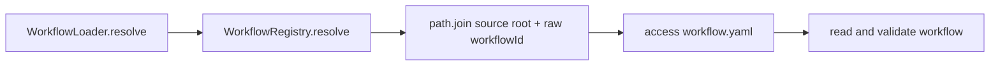
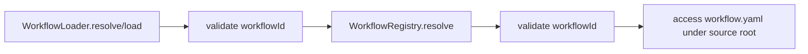

# Issue 115: workflowId Path Traversal Guard

## Scope

Add input validation around workflow IDs and direct workflow directory loading so workflow resolution cannot escape the intended workflow roots. The change is limited to `src/workflow/` and focused integration coverage.

Out of scope:
- Changing workflow resolution precedence.
- Changing CLI argument parsing or `--workflow` behavior.
- PresetManager path hardening.
- Runtime sandboxing.

## Use Case Alignment

Callers should be able to resolve valid project, user, and builtin workflows using existing IDs such as `mono-spec`, `simple_bug`, or dotted names. Callers that pass traversal input such as `../../etc`, absolute paths, or null bytes should get a deterministic validation error before PlaySpec checks the filesystem.

## High-Level Current Implementation Summary

Verified behavior:
- `WorkflowRegistry.resolve(workflowId)` iterates source order `project`, `user`, `builtin`.
- For each source it calls `rootFor(source, workflowId)`, which currently joins the source root with the raw workflow ID.
- `WorkflowLoader.resolve(workflow)` delegates to the registry, reads `workflow.yaml`, parses it, validates the declared ID matches the requested workflow, then validates templates.
- `WorkflowLoader.load(workflow)` delegates to `resolve(workflow)`.
- `WorkflowLoader.resolveFromDirectory(rootDir)` reads `${rootDir}/workflow.yaml`, validates templates from `${rootDir}/templates`, and returns `source: 'user'`.

Inferred behavior:
- CLI flows usually resolve known workflow IDs through existing setup and are not the primary exploit path, but direct consumers of the core API can call these methods with arbitrary strings.

## Relevant Files Reviewed

- `src/workflow/workflow-registry.ts`
- `src/workflow/workflow-loader.ts`
- `tests/integration/workflow-loader.test.ts`
- `package.json`

## Active Entry Points And Bypasses

Active entry points:
- `WorkflowRegistry.resolve(workflowId)`
- `WorkflowLoader.load(workflow)`
- `WorkflowLoader.resolve(workflow)`
- `WorkflowLoader.resolveFromDirectory(rootDir)`

Bypass paths:
- Any direct registry consumer can bypass CLI-level validation and pass a malicious workflow ID.
- Any direct loader consumer can pass an unsafe directory path to `resolveFromDirectory()`.

## Current Architecture

`WorkflowLoader` owns parsing and schema/template validation. `WorkflowRegistry` owns source precedence and source root discovery. Path safety should live at these workflow boundary methods rather than in callers.

## Verified Behavior

The current registry does filesystem access using paths derived from unsanitized `workflowId`. Existing tests verify happy path loading, workflow metadata, unknown workflow errors, and source precedence. They do not verify rejection of traversal, absolute paths, null bytes, or invalid direct directory loading.

## Problems

- `workflowId` can contain `..` and alter the path computed by `path.join()`.
- Absolute workflow IDs can override the intended source root in path resolution semantics.
- Null bytes should be rejected before path construction and filesystem access.
- `resolveFromDirectory()` accepts arbitrary directory labels without confirming the directory is a safe workflow directory rooted under a known workflow source.

## Proposed Direction

Add a small workflow path guard that rejects:
- Any null byte.
- Any absolute path.
- Any path segment equal to `..`.

Use the guard in:
- `WorkflowRegistry.resolve()` before iterating source roots.
- `WorkflowLoader.load()` and `WorkflowLoader.resolve()` before registry delegation.
- `WorkflowLoader.resolveFromDirectory()` to require the supplied directory to resolve to a direct child of one of the registry source roots and to derive source/id from that location.

Legitimate IDs with hyphens, underscores, and dots should continue to work.

## File-By-File Plan

- `src/workflow/workflow-registry.ts`: add workflow ID validation and call it at the start of `resolve()`.
- `src/workflow/workflow-loader.ts`: reuse the workflow ID validation for `load()` and `resolve()`, normalize `resolveFromDirectory()` with `path.resolve()`, verify it is a direct workflow directory under project/user/builtin roots, and return the matched source.
- `tests/integration/workflow-loader.test.ts`: add tests for malicious IDs, null bytes, absolute paths, valid source precedence, and `resolveFromDirectory()` source labeling and invalid structure rejection.

## Risks And Open Questions

- Risk: Dotted workflow IDs like `v1.workflow` must remain valid. Guarding only path segments equal to `..` avoids rejecting dots inside normal names.
- Risk: Error class expectations are not currently specified. A plain validation `Error` is acceptable unless existing project patterns suggest a dedicated error.
- Open question: `resolveFromDirectory()` currently always returns `source: 'user'`; changing it to label actual source is behaviorally visible but matches the issue acceptance criteria.

## Reader Aids

Verified current flow:

Proposed guarded flow:

