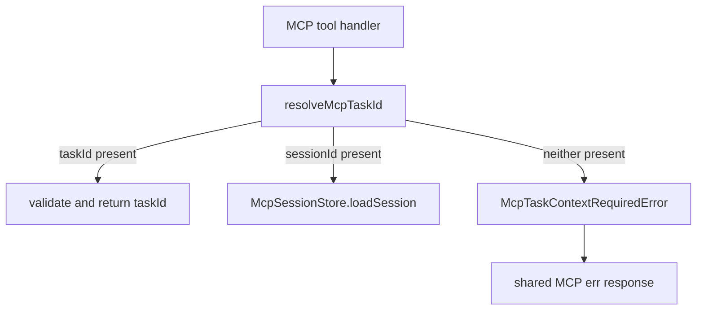

# Issue #126 MCP Missing-Context Session Binding Guidance

## Scope

Improve the diagnostic hint for MCP calls that require task context and receive neither `taskId` nor `sessionId`.

In scope:

- Update `McpTaskContextRequiredError` guidance to mention direct `taskId`/`sessionId` input and the reusable session binding flow through `playspec_use_session_task`.
- Preserve current MCP routing behavior: no `.playspec/HEAD` fallback in MCP context resolution.
- Add focused integration assertions for resolver-level error text and at least one MCP tool-handler response.

Out of scope:

- Adding HEAD fallback to MCP.
- Changing CLI active-task behavior.
- Redesigning MCP session storage or task resolution precedence.
- Broad error-formatting changes.

## Use Case Alignment

MCP clients often call multiple PlaySpec tools in one automation session. The intended flow is either to pass `taskId` directly on each contextual tool call or to bind a reusable session with `playspec_use_session_task` and then pass `sessionId`. The missing-context error currently says only to provide `taskId` or `sessionId`, which is correct but incomplete for clients that need to learn how to establish a usable session.

## High-Level Current Implementation Summary

Verified behavior:

- `src/mcp/context.ts` resolves direct `taskId` first.
- If `sessionId` is provided, it loads the session from `McpSessionStore`.
- If neither field is present, it throws `McpTaskContextRequiredError`.
- `resolveMcpTaskId()` does not read `.playspec/HEAD`.
- MCP tool handlers call `resolveMcpTaskId()` and return thrown errors through the shared MCP response formatter.

Inferred behavior:

- Updating only the error hint should propagate to both resolver callers and MCP tool responses because the same error instance is returned by handlers.

## Relevant Files Reviewed

- `src/mcp/context.ts`
- `src/mcp/errors.ts`
- `src/mcp/server.ts`
- `src/core/errors.ts`
- `tests/integration/mcp-server.test.ts`
- `package.json`

## Active Entry Points And Bypasses

Active entry points:

- `resolveMcpTaskId(input, sessionStore)` for task-context resolution.
- MCP tools registered in `buildMcpServer()`, including `playspec_render_next_prompt`, `playspec_add_context`, and task-link tools.

Bypass paths:

- Direct MCP tool calls without `taskId` or `sessionId` currently reach `McpTaskContextRequiredError`.
- Existing tests already create `.playspec/HEAD` and assert missing MCP context still does not use it.

No old active path was found that resolves MCP context through `ActiveTaskResolver` or `.playspec/HEAD`.

## Current Architecture

Verified flow:



## Verified Behavior

- `McpTaskContextRequiredError` message: `MCP tool call requires taskId or sessionId.`
- Current hint: `Provide taskId or sessionId in the tool input.`
- `McpSessionNotFoundError` and `McpSessionContextEmptyError` already mention `playspec_use_session_task`.
- `tests/integration/mcp-server.test.ts` already covers no HEAD fallback at the resolver level and a tool-handler missing-context path through task linking.

## Problems

- The missing-context hint does not tell callers how to bind a session before using `sessionId`.
- Tool-handler tests assert the broad missing-context text but not the recommended session-binding recovery path.

## Proposed Direction

Change only the `McpTaskContextRequiredError` hint to state both supported recovery paths:

- provide `taskId` directly, or
- call `playspec_use_session_task` to bind a task to a session, then pass that `sessionId`.

Add assertions in `tests/integration/mcp-server.test.ts` that:

- `resolveMcpTaskId({})` still throws `McpTaskContextRequiredError`.
- The thrown error hint includes `taskId`, `sessionId`, and `playspec_use_session_task`.
- At least one MCP tool-handler missing-context response includes `playspec_use_session_task`.
- Existing no-HEAD fallback assertions remain intact.

## File-By-File Plan

- `src/mcp/errors.ts`: update the `McpTaskContextRequiredError` hint string only.
- `tests/integration/mcp-server.test.ts`: extend resolver and tool-handler assertions for the improved hint text.
- `docs/features/issue_126_mcp_missing_context_session_binding_guidance/spec.md`: record this spec.

## Risks And Open Questions

Risk:

- Low. The intended change is diagnostic only.

Guardrail:

- Keep existing no-HEAD fallback coverage unchanged so the explicit MCP routing contract remains tested.

Open questions:

- None blocking.

## Reader Aids

Expected user-visible hint shape:

```text
Provide taskId directly, or call playspec_use_session_task to bind a task to a session and then pass that sessionId.
```
