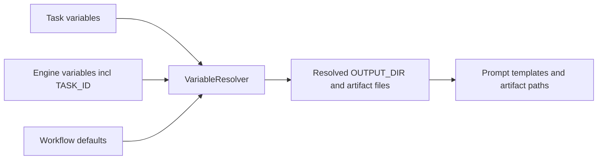

# Issue 132 Technical Spec

## Scope

Update only the built-in `issue-scope-create` workflow asset, its documentation, and focused tests around workflow loading/variable resolution. The default report paths must become unique per task or sanitized scope/repository segment while preserving explicit overrides for `OUTPUT_DIR`, `DISCOVERY_FILE`, `CANDIDATE_ISSUES_FILE`, and `CREATED_ISSUES_FILE`.

Out of scope: general artifact storage redesign, unrelated workflow changes, GitHub issue creation semantics, scheduler behavior, or workflow registry source priority changes.

## Use Case Alignment

Users can run `issue-scope-create` repeatedly in the same checkout for different repositories, scopes, or scheduled discovery jobs. Each run should write discovery evidence and final creation reports to a distinct default location so previous runs are not overwritten. Callers that need the old stable shared path can still pass explicit artifact path variables.

## High-Level Current Implementation Summary

Verified behavior:

- `src/preset/assets/workflows/issue-scope-create/workflow.yaml` declares workflow variables and artifact paths.
- `VariableResolver` resolves workflow variable defaults before task variables are returned, and task variables take final precedence.
- Current built-in `OUTPUT_DIR` default on this branch is `docs/issues/scope-create/{{ISSUE_SCOPE}}`.
- `DISCOVERY_FILE`, `CANDIDATE_ISSUES_FILE`, and `CREATED_ISSUES_FILE` derive from `{{OUTPUT_DIR}}`.
- `tests/integration/workflow-loader.test.ts` loads the built-in workflow and asserts core shape/template safeguards.
- `tests/unit/variable-resolver.test.ts` already covers defaults that reference task variables and explicit output overrides for other workflows.

Inferred behavior:

- Because default rendering is simple placeholder substitution, `ISSUE_SCOPE` values containing spaces or path separators can produce awkward or nested paths.
- Repeated runs with the same `ISSUE_SCOPE` still collide because the default lacks `TASK_ID`.

## Relevant Files Reviewed

- `src/preset/assets/workflows/issue-scope-create/workflow.yaml`
- `src/preset/assets/workflows/issue-scope-create/templates/scoped_issue_discovery.md`
- `src/preset/assets/workflows/issue-scope-create/templates/create_scoped_issues.md`
- `docs/workflows/issue-scope-create.md`
- `src/template/variable-resolver.ts`
- `tests/integration/workflow-loader.test.ts`
- `tests/unit/variable-resolver.test.ts`
- `tests/cli.test.ts`

## Active Entry Points And Bypasses

Active entry points:

- `playspec create ... --workflow issue-scope-create --var ...` stores task variables.
- `playspec prompt` / core prompt rendering invokes `VariableResolver.resolve()`, then templates receive resolved artifact variables.
- Workflow artifacts use `{{DISCOVERY_FILE}}`, `{{CANDIDATE_ISSUES_FILE}}`, and `{{CREATED_ISSUES_FILE}}`.

Bypasses:

- Callers can pass `OUTPUT_DIR` to choose a stable or custom directory.
- Callers can pass individual artifact file variables to override the derived files.
- Project or user workflow copies can override the built-in workflow by existing registry priority. This change must not alter that behavior.

## Current Architecture

Workflow defaults are data-driven YAML. The resolver provides engine variables such as `TASK_ID` and merges workflow defaults before task variables, so a YAML default can include `{{TASK_ID}}` without changing core code. Since task variables are merged last, explicit caller variables preserve override behavior.

## Verified Behavior

The current resolver can resolve nested defaults:

- `OUTPUT_DIR: docs/issues/{{ISSUE_SCOPE}}`
- `DISCOVERY_FILE: {{OUTPUT_DIR}}/discovery.md`

It also allows explicit task variables to override declared defaults.

## Problems

- The current default is only scope-specific, not task-specific.
- Scope-only paths still collide across repeated runs of the same scope.
- Scope values are not sanitized by workflow default rendering.
- The docs do not describe the current default report directory or how to opt into a stable shared path.

## Proposed Direction

Use a compatibility-conscious path under the existing prefix:

`docs/issues/scope-create/{{TASK_ID}}`

This avoids collisions between task ids in one checkout, uses the already slugified task id, and keeps artifacts easy to find under `docs/issues/scope-create`. Leave file variable defaults derived from `OUTPUT_DIR` unchanged. Add tests that resolve the built-in workflow defaults and verify explicit overrides.

## File-By-File Plan

- `src/preset/assets/workflows/issue-scope-create/workflow.yaml`: change `OUTPUT_DIR.default` to `docs/issues/scope-create/{{TASK_ID}}` and clarify the description.
- `docs/workflows/issue-scope-create.md`: document the default task-specific report directory and the override variables for stable paths.
- `tests/integration/workflow-loader.test.ts`: assert the loaded built-in `OUTPUT_DIR` default includes `{{TASK_ID}}` and is not only `docs/issues/scope-create`.
- `tests/unit/variable-resolver.test.ts`: add issue-scope-create focused cases for resolved default artifact paths and explicit override precedence.

## Risks And Open Questions

- Risk: automation reading `docs/issues/scope-create/*.md` directly will need explicit variables to keep that shared path.
- Risk: task ids are unique for distinct task titles, but creating two tasks with the same title is already constrained by task id collision semantics.
- Open question: whether future workflow defaults should support explicit sanitization helpers. Not needed for this issue because `TASK_ID` is already slugified.

## Reader Aids

Verified default-resolution flow:



Proposed path pattern:

```text
docs/issues/scope-create/{{TASK_ID}}/discovery.md
docs/issues/scope-create/{{TASK_ID}}/candidate_issues.md
docs/issues/scope-create/{{TASK_ID}}/created_issues.md
```
