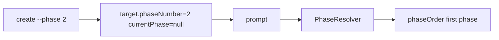
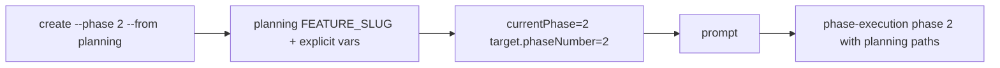

# Issue 136 Create Phase Handoff Spec

## Scope

Fix newly created `playspec create ... --phase <n> --from <planningTaskId>` execution tasks so their first rendered prompt uses the requested execution phase and planning-derived feature variables. Keep the change limited to phase handoff task creation and prompt rendering inputs.

Out of scope: workflow redesign, arbitrary new variable mechanisms, source-problem task behavior, completion routing changes, and unrelated prompt/template changes.

## Use Case Alignment

A user completes a `total-plan` planning task for a feature, then runs:

```sh
playspec create phase-execution "Feature Title" --phase 2 --from planning_task_id
playspec prompt --no-copy
```

The first prompt should be phase-execution phase 2 and should refer to files under the planning feature slug, such as `docs/planning_task_id/planning_task_id_phase2_implementation_spec.md`, instead of paths based on the new execution task id.

## High-Level Current Implementation Summary

Verified behavior:

- `src/cli/commands/create.ts` handles `--phase` by resolving a completed planning task, finding its total spec and phase plan artifacts, building context refs, and storing `target: { phaseNumber }`.
- `src/storage/yaml-task-store.ts` creates every new task with `currentPhase: null` and seeds `variables.FEATURE_SLUG` from `input.id` unless explicitly overridden through `input.variables`.
- `src/workflow/phase-resolver.ts` resolves `currentPhase: null` to the first workflow phase.
- `src/template/variable-resolver.ts` uses `task.variables.FEATURE_SLUG` and derives `PHASE_NUMBER` from the resolved phase id/step number.

Inferred behavior:

- For phase-execution workflows with phase ids `"1"` through `"5"`, setting `currentPhase` to the requested phase id at creation is enough to make `prompt` render that phase first.
- Passing the planning task `FEATURE_SLUG` into the execution task variables before store creation is enough for phase file variable defaults to resolve against planning artifacts.

## Relevant Files Reviewed

- `src/cli/commands/create.ts`
- `src/storage/yaml-task-store.ts`
- `src/workflow/phase-resolver.ts`
- `src/template/variable-resolver.ts`
- `src/core/types.ts`
- `src/core/schemas.ts`
- `src/preset/assets/workflows/phase-execution/workflow.yaml`
- `tests/integration/init-create-next.test.ts`
- `tests/cli.test.ts`

## Active Entry Points And Bypasses

Active entry point:

- CLI `create` command with `--phase` in `runCreate()`.

Prompt propagation path:

- `store.createTask()` writes task state.
- `prompt --no-copy` loads HEAD task.
- Core prompt rendering resolves the current phase with `PhaseResolver`.
- `VariableResolver` computes template variables from task state and workflow defaults.

Bypasses:

- Normal task creation without `--phase` should remain unchanged.
- Direct store usage should remain unchanged unless the store interface is intentionally extended.
- Existing completed or active tasks are not migrated.

## Current Architecture

The handoff creation logic lives in CLI because it interprets user flags and planning task discovery. Storage owns durable task defaults. Phase resolution is deterministic from stored task state. Variable resolution combines engine variables, workflow defaults, and stored task variables.

The narrow fix should keep core prompt rendering simple by storing the correct initial phase and planning feature slug at task creation time.

## Verified Behavior

The existing compatibility integration test only checks that `--phase 2 --from <planningTaskId>` auto-links total spec and phase plan context refs. It does not render a prompt or inspect phase file variables.

The existing CLI variable test confirms explicit `--var` values are stored for phase handoff tasks. That behavior should remain, with a user-supplied `FEATURE_SLUG` still able to override any planning-derived default.

## Problems

- Requested `target.phaseNumber` is not used by prompt phase selection.
- `currentPhase: null` causes the first prompt to use phase 1.
- `FEATURE_SLUG` defaults to the execution task id, causing phase file defaults to drift away from the planning feature slug.
- Stored state is misleading: `target.phaseNumber` says one phase, while prompt selection follows another.

## Proposed Direction

At phase handoff creation time:

1. Resolve and validate the requested phase id against the selected execution workflow.
2. Derive base execution variables from the planning task, currently `FEATURE_SLUG`.
3. Merge variables so explicit `--var FEATURE_SLUG=...` wins over the planning-derived value.
4. Store the selected initial phase in task state, ideally through a small `CreateTaskInput.currentPhase` extension used only by this path.

This avoids teaching global phase resolution to infer from `target.phaseNumber`, so existing tasks with `currentPhase: null` keep their current semantics.

## File-By-File Plan

- `src/core/types.ts`: add optional `currentPhase` to `CreateTaskInput`.
- `src/storage/yaml-task-store.ts`: use `input.currentPhase ?? null` when creating a task.
- `src/cli/commands/create.ts`: keep the resolved workflow, validate `phaseNumber`, build planning-derived variables, and pass `currentPhase: phaseNumber`.
- `tests/integration/init-create-next.test.ts`: extend the phase-execution context test to render the prompt and assert phase 2 plus planning slug-based `FEATURE_SLUG`, `PHASE_SPEC_FILE`, and `PHASE_HANDOFF_FILE`.
- `tests/cli.test.ts`: adjust the phase handoff variable-storage expectation if it now observes planning-derived `FEATURE_SLUG`.

## Risks And Open Questions

- Risk: changing `CreateTaskInput` affects direct store callers. Mitigation: make the field optional and preserve `null` as the default.
- Risk: workflows whose phase ids do not match user-facing phase numbers. Mitigation: validate against the selected workflow’s phase ids for the narrow handoff path.
- Compatibility note: non-`phase-execution` workflows can still use the `--phase` handoff path for legacy automation. Initial `currentPhase` is only stored when the selected workflow declares that phase id, and planning-derived `FEATURE_SLUG` is only injected when the workflow declares that variable.

## Reader Aids

Verified current flow:



Proposed flow:


