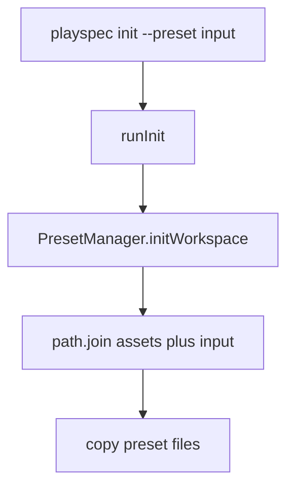
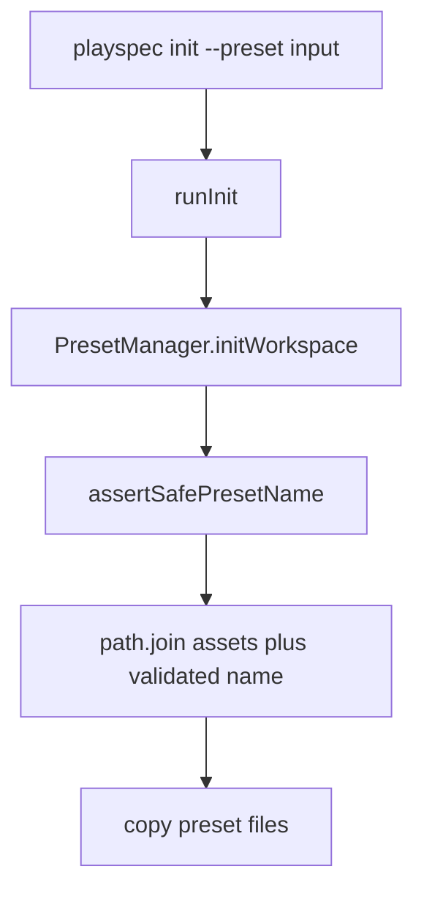

# Validate Preset Names Before Resolving Preset Asset Paths

## Scope

Fix `playspec init --preset <name>` so untrusted preset names are validated before any preset asset path is constructed. Keep the change limited to preset initialization and focused regression coverage.

Out of scope: adding new presets, changing workflow install semantics, changing workflow ID validation, MCP behavior, migration behavior, or viewer behavior.

## Use Case Alignment

A user or automation may pass a preset name to `playspec init`. Valid names such as `default` should keep working. Malformed names such as traversal strings, absolute paths, Windows absolute paths, null-byte strings, or path separators should fail with a deterministic validation error before PlaySpec resolves or probes filesystem paths.

## High-Level Current Implementation Summary

Verified behavior:

- `src/cli/commands/init.ts` accepts a `preset` string and passes it directly to `PresetManager.initWorkspace()`.
- `src/preset/preset-manager.ts` computes `presetAssetsDir` with `path.join(__dirname, 'assets', presetName)` at the start of `initWorkspace()`.
- The code later reads from that computed directory to copy sessions and config into `.playspec`.
- `src/workflow/workflow-registry.ts` already validates workflow IDs before path resolution with `assertSafeWorkflowId()`, but there is no equivalent preset-name helper.

Inferred behavior:

- Unsafe preset input can influence a filesystem path before PlaySpec determines whether the preset name is valid.
- Missing invalid presets eventually fail during filesystem reads, but the failure is not a deliberate preset-name validation failure and happens after path construction.

Open questions:

- None blocking. Only the built-in `default` preset exists today, so a conservative preset-name allowlist can be enforced without compatibility risk.

## Relevant Files Reviewed

- `src/cli/commands/init.ts` - CLI entry point for init and workflow install option parsing.
- `src/preset/preset-manager.ts` - preset asset path resolution and workspace initialization.
- `src/workflow/workflow-registry.ts` - existing model for validating untrusted IDs before path joining.
- `src/workflow/workflow-loader.ts` - existing path containment validation patterns.
- `tests/integration/init-create-next.test.ts` - existing `PresetManager.initWorkspace()` structure and CLI init coverage.
- `tests/cli.test.ts` - CLI init destination tests and command-runner style.
- `docs/features/issue_115_workflowid_path_traversal_guard/*` - prior analogous workflow ID guard.

## Active Entry Points And Bypasses

Active entry points:

- CLI: `playspec init --preset <name>` -> `runInit(process.cwd(), preset, opts)` -> `PresetManager.initWorkspace(workspaceRoot, preset, options)`.
- Programmatic tests and API use: callers instantiate `PresetManager` and call `initWorkspace()` directly.

Bypass path:

- Fixing only `runInit()` would still leave direct `PresetManager.initWorkspace()` callers able to pass unsafe names. Validation belongs in the preset module before path construction.

## Current Architecture

`PresetManager` is the concrete preset initialization orchestrator. It may use package asset paths, workflow registry roots, and workspace path helpers. Core does not participate in init and should not become coupled to CLI behavior.

Workflow asset resolution already uses a dedicated guard before joining IDs into source roots. Preset resolution should mirror that pattern locally in the preset module rather than reusing workflow-specific terminology.

## Verified Behavior

Current `PresetManager.initWorkspace()` resolves:

```ts
const presetAssetsDir = path.join(__dirname, 'assets', presetName);
```

before validating `presetName`.

`WorkflowRegistry.resolve()` validates:

```ts
assertSafeWorkflowId(workflowId);
```

before computing per-source workflow paths.

## Problems

- Preset names are untrusted input and currently affect filesystem path construction immediately.
- Invalid preset failures are incidental filesystem failures, not clear validation errors.
- Programmatic callers are not protected by CLI-only validation.

## Proposed Direction

Add a preset-name validation helper in `src/preset/preset-manager.ts` or a sibling preset module and call it as the first operation in `PresetManager.initWorkspace()`.

Minimum validation:

- Reject null bytes.
- Reject POSIX and Windows absolute paths.
- Reject any slash or backslash path separator.
- Reject `.` and `..`.
- Accept the current preset name `default`.

Then resolve preset assets only after validation succeeds. Keep error messages explicit enough for CLI users and tests.

## File-By-File Plan

- `src/preset/preset-manager.ts`
  - Add/export `assertSafePresetName(presetName: string): void`.
  - Call it before `path.join(__dirname, 'assets', presetName)`.
  - Keep existing init copy and workflow install behavior unchanged.

- `tests/integration/init-create-next.test.ts`
  - Add direct `PresetManager.initWorkspace()` regression coverage proving unsafe preset names reject before workspace directories are created.
  - Include traversal, absolute path, Windows absolute path, null byte, slash, backslash, `.`, and `..` cases.
  - Keep valid `default` tests unchanged.

- `tests/cli.test.ts`
  - Add CLI coverage for `playspec init --preset ../default` returning a clear validation failure and not creating `.playspec`.

## Risks And Open Questions

- Risk: Overly strict validation could reject future preset naming schemes. Low risk because only `default` exists now and preset names are expected to identify direct children of the bundled `assets` directory.
- Risk: Tests that assert exact error strings could become brittle. Prefer substring checks around the validation reason.
- Open question: none blocking.

## Reader Aids

Verified current flow:



Proposed flow:


