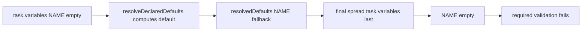
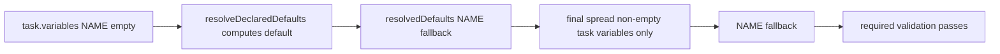

# Issue 147 Technical Spec

## Scope

Fix variable resolution so a stored empty task variable does not erase a non-empty workflow or phase declaration default before required-variable validation and prompt rendering. Keep the change focused on `VariableResolver.resolve()` and tests for the resolver plus the render path.

Out of scope: workflow model redesign, phase routing, MCP, rollback, harness behavior, and changing non-empty task variable override semantics.

## Use Case Alignment

Automation or CLI plumbing may serialize a variable key with an empty string, for example `CUSTOM_FILE: ""`. If the active workflow declares `CUSTOM_FILE` with a valid default and marks it required, rendering should use the resolved default instead of failing as missing.

Explicit non-empty task variables remain authoritative overrides.

## High-Level Current Implementation Summary

`PlaySpecCore.renderNextPrompt()` resolves a task and phase, calls `VariableResolver.resolve()`, then calls `assertRequiredVariables()` before rendering. Required validation treats `undefined` and `""` as missing.

`VariableResolver.resolve()` builds engine variables, resolves declaration defaults through `resolveDeclaredDefaults()`, then returns a merged map. The default resolver treats empty task variables as unresolved and can compute a declaration default, but the final returned map spreads `task.variables` after `resolvedDefaults`, restoring the empty string.

## Relevant Files Reviewed

- `src/template/variable-resolver.ts`: builds engine variables, resolves workflow/phase defaults, and performs final variable precedence merge.
- `src/core/playspec-core.ts`: render path calls resolver and required-variable validation.
- `src/core/required-variables.ts`: required variables are missing when resolved value is `undefined` or `""`.
- `tests/unit/variable-resolver.test.ts`: existing coverage for defaults, non-empty overrides, unknown references, and circular references.
- `tests/integration/init-create-next.test.ts`: existing render-path coverage for missing required variables.

## Active Entry Points And Bypasses

Active entry points:

- `PlaySpecCore.renderNextPrompt(taskId)` and explicit phase rendering use `resolveAndAssertRequiredVariables()`.
- `VariableResolver.resolve()` is also used by relevant-file discovery, so the final precedence behavior should be consistent outside prompt rendering.

Bypass paths:

- Direct consumers of `VariableResolver.resolve()` receive the same final variable map and can observe the empty override bug without going through `assertRequiredVariables()`.
- Required validation itself is not the source of the bug; it correctly treats `""` as missing.

## Current Architecture

Verified behavior:

1. Engine variables are initialized with stable task, phase, context, and document path keys.
2. Workflow variables and phase variables are merged into a declaration map, with phase declarations overriding same-named workflow declarations.
3. `resolveDeclaredDefaults()` starts with engine variables and task variables, treats existing non-empty values as resolved, and uses declaration defaults when the current value is empty or absent.
4. `resolve()` returns `{ ...engineVariables, ...resolvedDefaults, ...task.variables }`, so task variables win even when they are empty.

Inferred behavior:

- The intended contract is that non-empty task variables override declaration defaults, while empty task variables act like unresolved values for declared variables.

## Verified Behavior

The issue reproduces from code inspection:

- A declaration like `CUSTOM_REQUIRED: { required: true, default: "fallback" }` resolves `CUSTOM_REQUIRED` to `"fallback"` inside `resolveDeclaredDefaults()` when the task variable is `""`.
- The returned variable map becomes `CUSTOM_REQUIRED: ""` because `task.variables` is spread last.
- `assertRequiredVariables()` then throws `MissingRequiredVariablesError`.

Existing tests preserve important behavior:

- Non-empty task variables override declaration defaults.
- Defaults can reference task variables.
- Unknown default references throw `UnknownVariableDefaultError`.
- Circular default references throw `CircularVariableDefaultError`.
- Missing required variables throw `MissingRequiredVariablesError`.

## Problems

- Resolver behavior is internally inconsistent: empty task values are unresolved during default resolution but authoritative during final merge.
- Required variables with valid declaration defaults can fail rendering when a serialized empty task value is present.
- There is no focused unit or integration test for empty task value plus declaration default.

## Proposed Direction

Change final variable precedence so task variables are only authoritative when they are non-empty, while preserving the existing resolution of defaults against task variables. A minimal implementation is to derive a map of non-empty task variables and spread that after `resolvedDefaults`.

This keeps:

- Engine variables as the base.
- Resolved declaration defaults as fallback for empty or absent declared values.
- Non-empty explicit task variables as the highest precedence.

No required-variable validation change is needed.

## File-By-File Plan

- `src/template/variable-resolver.ts`: replace the final `...task.variables` spread with a non-empty task-variable overlay.
- `tests/unit/variable-resolver.test.ts`: add a test where a declared required variable has a default and the task stores `""`; assert the default is returned. Keep or add assertion that non-empty task override still wins.
- `tests/integration/init-create-next.test.ts`: add a render-path test with a custom workflow required variable that has a declaration default and a task variable set to `""`; assert prompt rendering succeeds and includes the default.

## Risks And Open Questions

Risk: callers may have used serialized empty task variables as a deliberate way to blank optional defaults. This change treats empty strings as absent for all final task-variable precedence, aligning the final map with existing default-resolution behavior.

Open question: none blocking for this issue. The acceptance criteria explicitly allow empty task values to stop erasing non-empty declaration defaults.

## Reader Aids

Verified current flow:

Proposed flow:

