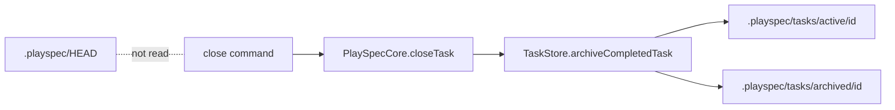
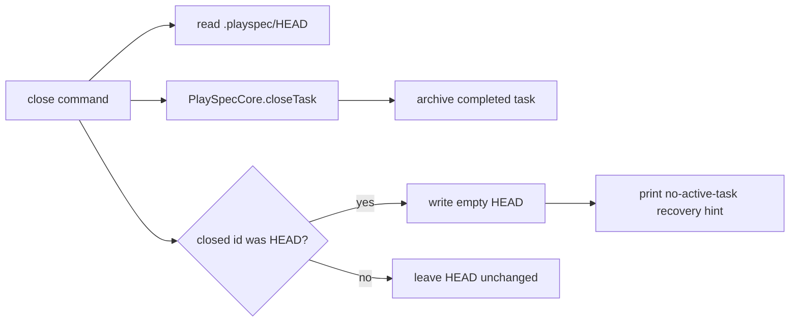

# Issue 148 Technical Spec

## Scope

Fix the CLI close path so closing the task currently selected in `.playspec/HEAD` does not leave HEAD pointing at archived storage. The change must stay narrow: archived tasks remain unavailable through normal active-task commands, and non-HEAD close behavior remains unchanged.

## Use Case Alignment

When an operator runs `playspec close --task <taskId>` for a completed task, the command archives that task. If that task is also the current HEAD selection, subsequent commands that depend on HEAD should start from the normal "no active task set" state or otherwise give a targeted recovery hint. The selected task must not silently become an archived task ID that fails later as a generic missing active task.

## High-Level Current Implementation Summary

Verified behavior:

- `src/cli/commands/close.ts` constructs `YamlTaskStore` and `PlaySpecCore`, calls `core.closeTask(taskId)`, and prints the archive path.
- `src/core/playspec-core.ts` delegates `closeTask()` directly to `taskStore.archiveCompletedTask(taskId)`.
- `src/storage/yaml-task-store.ts` archives by moving `.playspec/tasks/active/<taskId>` to `.playspec/tasks/archived/<taskId>`, then rewriting `task.yaml` with `status: archived` and the archived task root path.
- `src/core/active-task-resolver.ts` reads `.playspec/HEAD` only when no explicit `--task` is provided, then calls `taskStore.getTask(resolvedId)`.
- `YamlTaskStore.getTask()` reads only active task storage, so HEAD pointing to an archived task is surfaced as `TaskNotFoundError`.

Inferred behavior:

- A close command that archives the selected task leaves `.playspec/HEAD` unchanged today because neither the CLI close command nor storage archive method reads HEAD.

## Relevant Files Reviewed

- `src/cli/commands/close.ts`
- `src/core/playspec-core.ts`
- `src/storage/yaml-task-store.ts`
- `src/core/active-task-resolver.ts`
- `src/core/errors.ts`
- `src/utils/paths.ts`
- `tests/integration/init-create-next.test.ts`
- `tests/integration/active-task-resolver.test.ts`

## Active Entry Points And Bypasses

Active entry point:

- `playspec close --task <taskId>` is the only close entry point exposed by the CLI. It requires an explicit task ID.

Bypasses and alternate paths:

- Direct calls to `YamlTaskStore.archiveCompletedTask()` do not update HEAD. This is acceptable because storage should not own selected-task policy.
- Direct calls to `PlaySpecCore.closeTask()` do not update HEAD. This keeps core free from global HEAD state.
- Normal HEAD-based commands should continue to use `ActiveTaskResolver` and active storage only.

## Current Architecture

Close currently crosses these boundaries:

The proposed CLI-only behavior:

## Verified Behavior

- Closing a completed task succeeds and moves the task into archive storage.
- Closing an active task fails with `TaskNotCompletedError`.
- Closing to an existing archive destination fails with `ArchivedTaskAlreadyExistsError`.
- Listing active tasks tolerates a stale HEAD without crashing.
- HEAD-based phase rendering already rejects completed active tasks, but there is no test for closing the selected task into archive storage.

## Problems

- The selected task can become stale immediately after a successful close.
- The next HEAD-based command reports the archived task as a missing active task, which hides the causal action and recovery path.
- Automation logs can show a successful close followed by an unrelated-looking `Task not found` failure.

## Proposed Direction

Implement HEAD handling in `src/cli/commands/close.ts`:

- Read `.playspec/HEAD` before or after close using `getHeadPath()` and `readTextFile()`.
- If the closed task ID equals the trimmed HEAD value and close succeeds, write an empty HEAD file.
- Print deterministic command output stating that HEAD was cleared and how to select another active task.
- Do not update HEAD when the closed task is not the selected task.
- Do not clear HEAD if close fails.

This keeps global HEAD policy in CLI space and preserves the active-only archive model.

## File-By-File Plan

- `src/cli/commands/close.ts`: add narrow HEAD comparison and clearing behavior after successful archive; print targeted recovery output.
- `tests/integration/init-create-next.test.ts`: add regression coverage for selected-task close clearing HEAD and follow-up HEAD-based command behavior; add regression that closing a different completed task leaves the existing active HEAD unchanged.
- `src/core/active-task-resolver.ts`: no change expected if clearing HEAD is chosen, because `NoActiveTaskError` already provides an actionable message.
- `src/utils/paths.ts`: no change expected; `getHeadPath()` already exists.

## Risks And Open Questions

- Clearing HEAD changes the literal post-close HEAD file content for scripts that expected it to remain unchanged. The prior value was unusable for active commands, so the new behavior is safer and more deterministic.
- The close command is hidden but still used by automation and tests; output should stay concise.
- No storage-level HEAD mutation should be added, because storage is used outside CLI contexts.

## Reader Aids

- Chosen behavior: clear HEAD when closing the selected task.
- Recovery message: tell the operator to run `playspec use <TASK_ID>` to select another active task.
- Follow-up HEAD-based command behavior: normal `NoActiveTaskError` path, not a generic archived task lookup failure.
