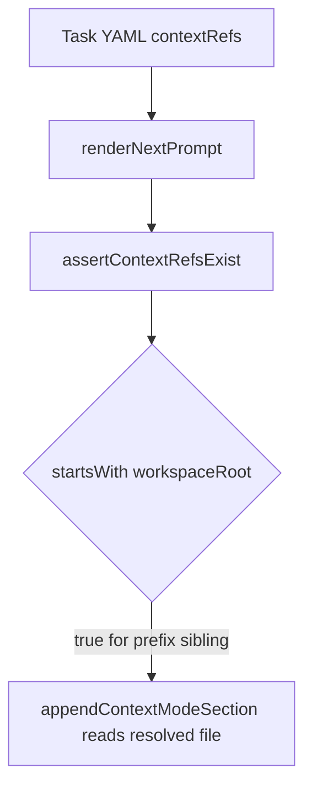
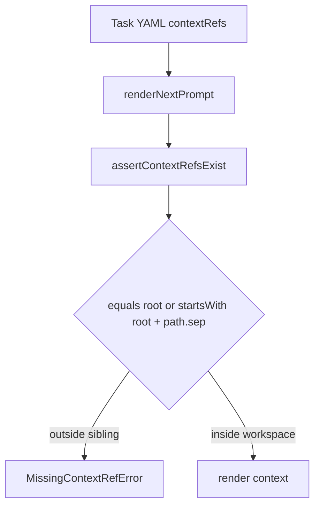

# Issue 149 Context Ref Boundary Spec

## Scope

Harden render-time context reference validation so prompt rendering rejects task YAML `contextRefs` that resolve outside the workspace, including sibling paths whose absolute string shares the workspace root prefix.

In scope:
- `src/core/playspec-core.ts` render-time `contextRefs` validation.
- Focused integration coverage in `tests/integration/init-create-next.test.ts`.

Out of scope:
- Relevant-file ranking, context discovery, task YAML schema redesign, template include validation, and documentation cleanup.

## Use Case Alignment

Manually edited or migrated task records can contain `contextRefs` that did not pass through `addContextRef()`. Rendering a prompt must not read such refs when they escape the workspace boundary.

## High-Level Current Implementation Summary

Verified behavior:
- `PlaySpecCore.renderNextPrompt()` and `renderExplicitPhasePrompt()` call `assertContextRefsExist()` before rendering.
- `appendContextModeSection()` later reads each linked context file with `path.resolve(this.workspaceRoot, ref.path)`.
- `addContextRef()` rejects absolute paths and requires the resolved path to equal the workspace root or start with `path.resolve(this.workspaceRoot) + path.sep`.
- `assertContextRefsExist()` rejects absolute paths but currently checks only `resolved.startsWith(path.resolve(this.workspaceRoot))`.

Impact:
- A stored ref such as `../playspec-sibling/context.md` can resolve outside the workspace while still passing the prefix check when the workspace root is a prefix of the sibling path string.

## Relevant Files Reviewed

- `src/core/playspec-core.ts`: contains `addContextRef()`, render entry points, context rendering, and `assertContextRefsExist()`.
- `src/core/errors.ts`: `MissingContextRefError` is the existing render-time stale/missing context error.
- `tests/integration/init-create-next.test.ts`: existing prompt rendering and context ref integration tests.
- `tests/cli.test.ts`: existing CLI coverage for manual context prompt rendering.

## Active Entry Points And Bypasses

Active entry points:
- `PlaySpecCore.renderNextPrompt(taskId, options)`.
- `PlaySpecCore.renderExplicitPhasePrompt(taskId, phaseId, options)`.
- CLI prompt/next paths that call those core render APIs.

Bypass path:
- Direct task YAML writes or `YamlTaskStore.updateTask()` can create `contextRefs` without `addContextRef()` validation.

## Current Architecture

The core owns both context ref mutation and render-time validation. The mutation path already has the correct workspace boundary semantics. The render path duplicates similar validation but with a weaker prefix check.

## Verified Behavior

Valid in-workspace refs render:
- Existing integration coverage creates a workspace context file, stores it as a task `contextRefs` entry, and verifies compact/strict/full prompt rendering includes it.

Missing refs fail:
- Existing integration coverage asserts `renderNextPrompt()` rejects a missing stored `contextRefs` entry with `MissingContextRefError`.

Escaping refs are vulnerable:
- `assertContextRefsExist()` accepts any resolved absolute path that begins with the workspace root string, even when the next character is not a path separator.

## Problems

- Render-time validation can drift from add-time validation.
- Prompt context can be read from unintended sibling paths if task YAML is manually edited or generated incorrectly.
- The existing error message says "not found"; for a boundary failure, this is imprecise but acceptable under the issue acceptance criteria if the error type stays handled.

## Proposed Direction

Use the same boundary predicate for both add-time and render-time validation. Prefer a small private helper in `PlaySpecCore`:

- Resolve `this.workspaceRoot` once per check with `path.resolve(this.workspaceRoot)`.
- Treat a path as inside the workspace only if `resolved === workspaceRoot` or `resolved.startsWith(workspaceRoot + path.sep)`.
- Keep `assertContextRefsExist()` throwing `MissingContextRefError` for absolute, escaping, or missing render-time refs to preserve caller handling.

## File-By-File Plan

`src/core/playspec-core.ts`:
- Add a private workspace boundary helper.
- Replace duplicated `addContextRef()` boundary logic with the helper.
- Use the helper in `assertContextRefsExist()` before `access()`.

`tests/integration/init-create-next.test.ts`:
- Add a regression test that creates a workspace sibling path sharing the workspace path prefix.
- Store a task `contextRefs` entry pointing to the sibling through a relative `../...` path.
- Assert `core.renderNextPrompt(taskId)` rejects with `MissingContextRefError`.
- Keep the existing valid context rendering test unchanged.

## Risks And Open Questions

Risk:
- Existing manually edited task YAML that references files outside the workspace will fail during prompt rendering. This is intended for artifact path correctness.

Open questions:
- None for this issue scope.

## Reader Aids

Verified current flow:

Proposed flow:

