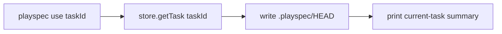
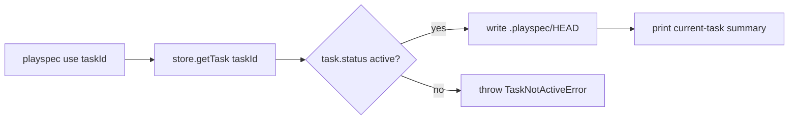

# Issue 152 Completed Use Guard Spec

## Scope

Add a narrow CLI lifecycle guard for explicit `playspec use <taskId>` so a task with `status: completed` cannot be selected into `.playspec/HEAD`.

In scope:

- Reject explicit `playspec use <completedTaskId>` before writing `.playspec/HEAD`.
- Keep explicit `playspec use <activeTaskId>` behavior unchanged.
- Keep no-argument interactive `playspec use` behavior unchanged.
- Add focused CLI regression coverage in `tests/cli.test.ts`.

Out of scope:

- Task lifecycle redesign.
- Archive fallback or read-only inspection commands.
- Changes to prompt, next, phase, complete, close, archive, rollback, or workflow routing behavior.

## Use Case Alignment

Users should only be able to mutate HEAD to an active task. Completed tasks can remain in `.playspec/tasks/active/<taskId>/task.yaml` until archived, but that storage detail must not make terminal tasks selectable as the current active task.

## High-Level Current Implementation Summary

Verified behavior:

- `src/cli/commands/use.ts` handles both explicit and no-argument use.
- The explicit path calls `setHeadToTask(workspaceRoot, store, taskId)`.
- `setHeadToTask()` calls `store.getTask(taskId)`, writes `taskId` to `.playspec/HEAD`, then prints the compact current-task summary.
- The no-argument interactive path calls `store.listActiveTasks()` and therefore only presents tasks where `status === 'active'`.
- `src/storage/yaml-task-store.ts` implements `getTask()` as a direct active-storage read. It validates and returns completed records still stored under `.playspec/tasks/active`.
- `YamlTaskStore.listActiveTasks()` filters by `task.status === 'active'`.
- `YamlTaskStore.listCompletedTasks()` intentionally returns completed records still in active storage.
- Existing errors include `TaskNotActiveError`, with a message that the task is not active and a hint to switch HEAD to or pass an active task.

Inferred behavior:

- The completed-task explicit `use` bypass exists because `setHeadToTask()` treats existence in active storage as sufficient.
- A completed task selected into HEAD can later be rejected by HEAD-based lifecycle commands, producing confusing command sequencing.

## Relevant Files Reviewed

- `src/cli/commands/use.ts`: explicit and interactive `use` command implementation.
- `src/storage/yaml-task-store.ts`: `getTask()`, `listActiveTasks()`, and `listCompletedTasks()` behavior.
- `src/core/errors.ts`: existing `TaskNotActiveError` lifecycle error and hint wording.
- `tests/cli.test.ts`: existing explicit active `use` coverage, interactive `use` coverage, and completed HEAD rejection coverage.

## Active Entry Points And Bypasses

Active entry point:

- CLI command `playspec use [taskId]` registered in `src/cli/index.ts` delegates to `runUse()`.

Current bypass:

- Explicit `taskId` path bypasses `listActiveTasks()` and does not check `task.status`.

Already guarded path:

- No-argument interactive `use` is guarded by `listActiveTasks()` before selection.

Downstream guards:

- Existing HEAD-based lifecycle commands reject completed HEAD tasks through active-task checks. Those guards should remain unchanged and continue passing.

## Current Architecture

`TaskStore.getTask()` is a broad active-storage lookup and should remain usable for read paths that need to inspect records by ID. The status boundary for mutating HEAD belongs in the CLI `use` command because the issue is specifically about selecting the current task, not about changing storage semantics.

## Verified Behavior

Verified from code:

- `setHeadToTask()` writes HEAD after `getTask()` without checking task status.
- `listActiveTasks()` filters completed tasks out.
- `tests/cli.test.ts` already checks that explicit active `use <taskId>` writes HEAD and prints the current-task summary.
- `tests/cli.test.ts` already checks no-argument interactive use behavior and completed HEAD rejection for `phase`.

## Problems

- Completed records can be selected into HEAD through explicit `playspec use <taskId>`.
- The command currently succeeds and prints a current-task summary even though the selected task is terminal.
- `.playspec/HEAD` can be changed away from an active task to a completed task, causing the next lifecycle command to reject the state.

## Proposed Direction

Add a status check in `setHeadToTask()` immediately after `store.getTask(taskId)` and before `writeTextFile(getHeadPath(...))`.

If `task.status !== 'active'`, throw an active-task lifecycle error with an actionable hint. Reusing `TaskNotActiveError` is preferred because it already says the task is not active and tells the user to switch to or pass an active task.

## File-By-File Plan

- `src/cli/commands/use.ts`
  - Import `TaskNotActiveError`.
  - After loading the task in `setHeadToTask()`, reject non-active tasks before writing HEAD or printing success.

- `tests/cli.test.ts`
  - Add a regression near existing `use` tests.
  - Create an active HEAD task.
  - Create another task, mark it completed, then run `use <completedTaskId>`.
  - Assert non-zero exit, message includes not-active lifecycle problem and active-task hint, and HEAD remains on the original active task.
  - Keep existing explicit active-task use test unchanged.

## Risks And Open Questions

Risks:

- Error text assertions should be specific enough to prove the lifecycle guard and recovery hint, but not brittle to unrelated formatting.
- The guard should not change missing-task suggestion behavior; missing IDs should still flow through `throwUseSuggestionError()`.

Open questions:

- None for implementation. The issue asks for a narrow guard only.

## Reader Aids

Verified current explicit flow:

Proposed explicit flow:

