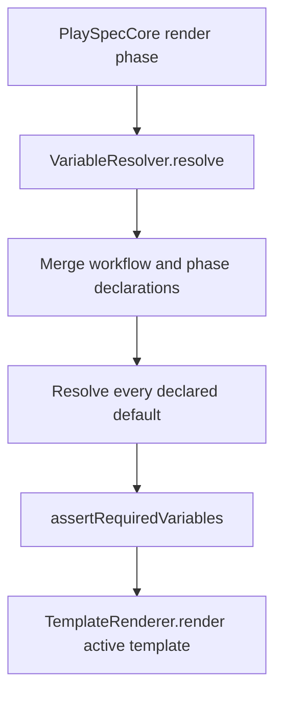
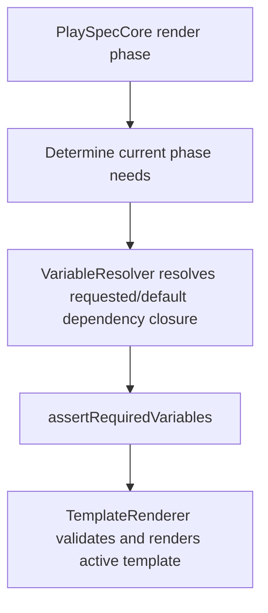

# Issue #154: Lazy Workflow Default Resolution

## Scope

Fix variable default resolution so an active phase is not blocked by an unused workflow-level default whose dependencies are unavailable. Keep the change focused on `src/template/variable-resolver.ts`, with `src/core/playspec-core.ts` changes only if phase/template needs must be supplied to the resolver.

Out of scope: workflow schema redesign, phase engine redesign, MCP, rollback, harness, routing, archive, viewer, or weakening errors for defaults that are actually needed.

## Use Case Alignment

Workflow authors should be able to define defaults for variables used by later or optional phases. Rendering the current phase should resolve and validate only the variables needed by that phase's required variables, rendered template placeholders, outputs, and dependency chain.

## High-Level Current Implementation Summary

Verified behavior:

- `PlaySpecCore.renderNextPrompt()` resolves the active phase, then delegates to `renderResolvedPhase()`.
- `renderResolvedPhase()` calls `resolveAndAssertRequiredVariables()` before rendering the template.
- `resolveAndAssertRequiredVariables()` calls `VariableResolver.resolve()`, then `assertRequiredVariables()`.
- `VariableResolver.resolve()` merges workflow and phase declarations and calls `resolveDeclaredDefaults()`.
- `resolveDeclaredDefaults()` iterates every declaration with `for (const name of Object.keys(declarations))`, so all defaults are evaluated whether the phase needs them or not.
- `renderDefault()` throws `UnknownVariableDefaultError` when a default placeholder is unknown or resolves to an empty string.

Inferred behavior:

- A future-phase variable such as `FUTURE_FILE: docs/{{FUTURE_KEY}}/out.md` fails the current phase because the resolver eagerly evaluates `FUTURE_FILE` before the core can validate the active phase contract.

## Relevant Files Reviewed

- `src/template/variable-resolver.ts`: builds engine variables, merges declarations, resolves all declared defaults, detects circular defaults, and raises unknown default errors.
- `src/core/playspec-core.ts`: active render path and required-variable assertion ordering.
- `src/core/required-variables.ts`: collects required workflow variables, phase variables, and `definition.requiredVariables`.
- `src/template/template-renderer.ts`: checks placeholders in the expanded active template against the resolved variable map.
- `tests/unit/variable-resolver.test.ts`: existing coverage for chained defaults, explicit overrides, unknown default references, empty task variables, and circular defaults.
- `tests/integration/init-create-next.test.ts`: broad CLI/core integration coverage for workspace initialization, task creation, prompt rendering, and validation behavior.

## Active Entry Points And Bypasses

Active entry points:

- CLI `prompt` / core `renderNextPrompt()`
- core `renderExplicitPhasePrompt()`
- core snapshot paths that call `renderResolvedPhase()`
- completion routing validation via `assertNextPhaseRequiredVariables()`

Bypass paths:

- Direct calls to `VariableResolver.resolve()` in tests or future integrations can still trigger resolver behavior without template rendering context.
- `TemplateRenderer.render()` independently validates unresolved placeholders after variables are resolved.

## Current Architecture

## Verified Behavior

- Task variables override defaults when non-empty.
- Empty task variable values allow declaration defaults to apply.
- Defaults can reference engine variables and task variables.
- Chained defaults are resolved recursively.
- Circular defaults throw `CircularVariableDefaultError`.
- Unknown placeholders in eagerly resolved defaults throw `UnknownVariableDefaultError`.

## Problems

- Default resolution is declaration-wide, not demand-driven.
- `assertRequiredVariables()` cannot protect unrelated phases because it runs after all defaults have already been evaluated.
- Template placeholders are known only inside `TemplateRenderer.render()`, after variable resolution.
- Keeping the current `resolve()` signature means resolver unit tests can cover unused required variables, but core cannot know active template placeholder needs before rendering unless placeholder extraction is exposed or repeated.

## Proposed Direction

Use lazy default resolution inside `VariableResolver`:

- Seed returned variables with engine variables and non-empty explicit task variables.
- Return declared variables only when they are explicit, required by the active phase, or needed by another resolved default.
- Add resolver options such as `requiredVariableNames?: string[]` and `templateVariableNames?: string[]` if core needs to drive active-phase demand precisely.
- Preserve recursive resolution, circular detection, and unknown-variable errors for any requested default and its dependency chain.
- Keep unknown placeholder behavior for active templates in `TemplateRenderer.render()`.

Proposed flow:

## File-By-File Plan

`src/template/variable-resolver.ts`

- Introduce demand-driven default resolution.
- Stop iterating all declarations by default.
- Resolve defaults requested directly by active phase requirements or by dependency traversal.
- Keep explicit non-empty task variables in final variables.
- Keep existing `UnknownVariableDefaultError` and `CircularVariableDefaultError` semantics for needed defaults.

`src/core/playspec-core.ts`

- Prefer no change if resolver can safely leave unneeded declaration defaults unresolved while template rendering catches missing active placeholders.
- Change only if the resolver must receive current phase `requiredVariables` or template variable names to satisfy acceptance criteria.

`tests/unit/variable-resolver.test.ts`

- Add a test where an unused workflow-level default references an unavailable dependency and the active phase only requires an unrelated variable.
- Preserve existing unknown default, circular default, explicit override, empty override, and chained default coverage.
- Add focused tests if demand-driven behavior changes direct resolver output expectations.

`tests/integration/init-create-next.test.ts`

- Add integration coverage only if `PlaySpecCore` changes.

## Risks And Open Questions

- Risk: leaving declared default variables absent from the resolved map can expose active template placeholders as `UnresolvedPlaceholderError` instead of resolving their defaults. If needed, core should supply active template placeholder names to the resolver.
- Risk: workflow-level `required: true` declarations currently apply globally in `assertRequiredVariables()`. This issue describes phase-level required-variable contracts, but the current implementation still treats workflow required variables as required for every phase.
- Open question: whether outputs means all workflow declarations or only placeholders referenced by active phase templates. The issue acceptance criteria points to active phase outputs, so the implementation should avoid resolving future-phase-only outputs.

## Reader Aids

- The bug is caused by eager declaration iteration in `resolveDeclaredDefaults()`.
- The desired behavior is lazy evaluation of defaults by current-phase demand and dependency closure.
- Unknown default references must still fail when the default is requested or needed by the active phase.
