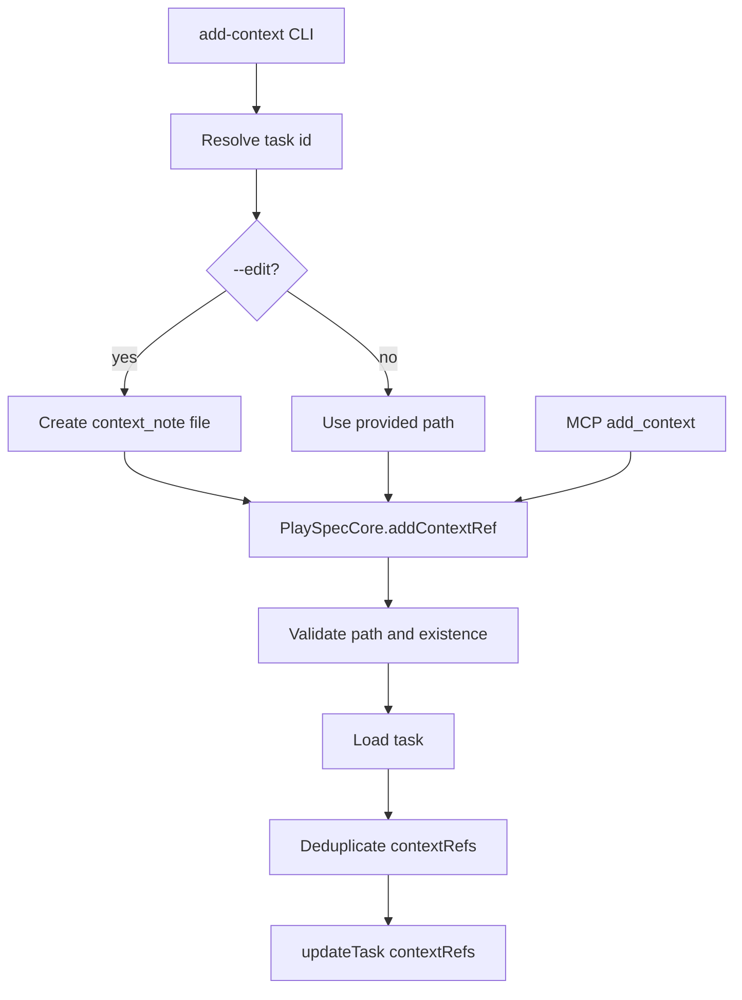
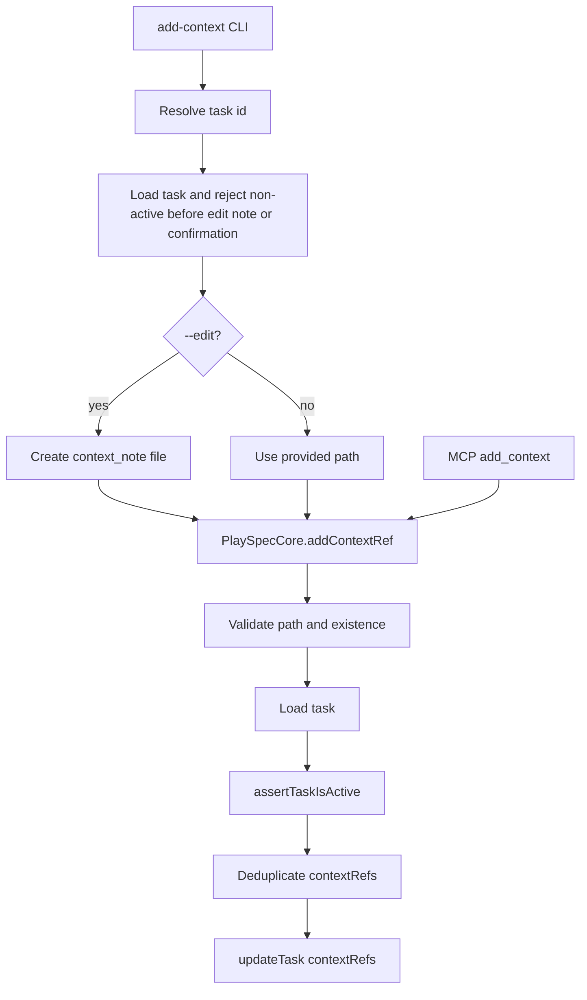

# Issue 155 Add-Context Completed Task Guard Spec

## Scope

Prevent `playspec add-context` from mutating completed task records. The guard must apply to the shared core mutation path and preserve existing behavior for active tasks, duplicate refs, and context path validation.

Out of scope: lifecycle redesign, archive behavior changes, general task editing, and unrelated command changes.

## Use Case Alignment

Users can attach context files to active tasks while work is in progress. Once a task is completed, normal lifecycle mutation commands must reject writes so completed task history remains stable until deliberate archive or future annotation workflows handle it.

## High-Level Current Implementation Summary

Verified behavior:

- `src/cli/commands/add-context.ts` resolves `--task` directly or resolves HEAD interactively through `ActiveTaskResolver`.
- Non-interactive `add-context` without `--task` fails before mutation.
- `--edit` creates `.playspec/tasks/active/<taskId>/sources/context_note_<timestamp>.md` before calling the core add-context helper.
- `PlaySpecCore.addContextRef()` validates the context path, checks file existence, loads the task, deduplicates by normalized path, and writes `contextRefs` with `taskStore.updateTask()`.
- `PlaySpecCore.assertTaskIsActive()` exists and is used by mutating lifecycle methods such as prompt rendering, phase completion, evidence collection, and snapshots.
- `TaskNotActiveError` already gives the required message and recovery hint.

Inferred behavior:

- Because completed tasks remain loadable under `.playspec/tasks/active/<taskId>/task.yaml` before archive, `addContextRef()` can append `contextRefs` to a completed task today.

## Relevant Files Reviewed

- `src/cli/commands/add-context.ts`
- `src/core/playspec-core.ts`
- `src/core/active-task-resolver.ts`
- `src/core/errors.ts`
- `src/cli/index.ts`
- `tests/cli.test.ts`

## Active Entry Points And Bypasses

Active entry points:

- CLI explicit task path: `playspec add-context <path> --task <taskId>`
- CLI interactive HEAD path: `playspec add-context <path>`
- CLI edit path: `playspec add-context --edit [--task <taskId>]`
- MCP path: `playspec_add_context`, implemented in `src/mcp/server.ts`, calls `PlaySpecCore.addContextRef()`

Bypass today:

- Any caller that reaches `PlaySpecCore.addContextRef()` with a completed task ID can mutate `contextRefs`.
- CLI `--edit` can create a context note file for a completed task before the core helper rejects if only the core layer is guarded.

## Current Architecture

## Verified Behavior

Existing tests cover:

- Non-interactive `add-context` without `--task` rejects before mutation.
- Explicit `add-context --task` succeeds for active tasks without confirmation.
- Prompt rendering and other command paths reject completed tasks via `TaskNotActiveError`.

Missing coverage:

- Explicit `add-context --task <completedTaskId>` rejection.
- Completed-task `--edit` rejection before creating `sources/context_note_*.md`.

## Problems

1. `PlaySpecCore.addContextRef()` lacks `assertTaskIsActive(task)`, so CLI and MCP callers can mutate terminal tasks.
2. CLI `--edit` currently writes the note file before the core helper can inspect task status.
3. The missing CLI regression lets completed-task context mutation reappear without detection.

## Proposed Direction

Proposed flow:

Add the shared lifecycle guard in `PlaySpecCore.addContextRef()` immediately after loading the task and before deduplication or update. Add a CLI preflight helper in `runAddContext()` after resolving a task ID and before `--edit` note creation or interactive confirmation, using `TaskNotActiveError` for the same wording.

## File-By-File Plan

- `src/core/playspec-core.ts`: call `this.assertTaskIsActive(task)` in `addContextRef()` after `getTask(taskId)`.
- `src/cli/commands/add-context.ts`: import `TaskNotActiveError`; when a task is resolved for interactive HEAD or before edit note creation, reject if status is not `active`.
- `tests/cli.test.ts`: add focused regression tests near existing add-context tests for completed explicit `--task` and `--edit` note preflight.

## Risks And Open Questions

Risk:

- Adding CLI preflight duplicates the core status check for `--edit`, but it is needed to avoid creating note files before rejection.

Open question:

- None for this issue. Post-completion annotations should be designed separately.

## Reader Aids

Expected error shape comes from `TaskNotActiveError`:

- Message: `Task "<id>" is not active (status: completed).`
- Recovery: `Switch HEAD to an active task with playspec use <TASK_ID> or pass an active task with --task <TASK_ID>.`
