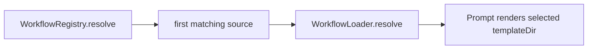
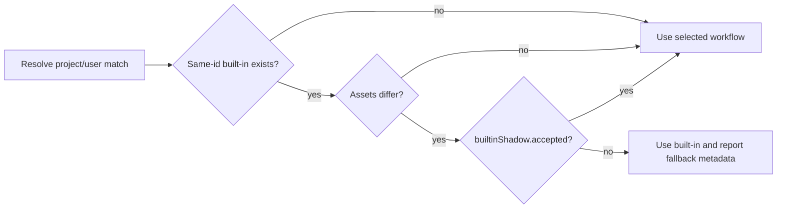

# Issue 156: Stale Built-In Workflow Shadowing

## Scope

Detect project-local or user-local workflows that reuse a built-in workflow id while carrying different workflow assets, and prevent stale shadow copies from silently driving prompt rendering. Keep built-in workflow support, project workflow support, and existing source precedence intact for workflows that do not shadow a built-in id.

## Use Case Alignment

Operators should be able to run `playspec workflow show issue-scope-create` and render prompts in a checkout that contains `.playspec/workflows/issue-scope-create` without losing newer built-in duplicate-replacement requirements. A deliberate local override must remain possible, but it must be explicit.

## High-Level Current Implementation Summary

Verified behavior: `WorkflowRegistry.resolve()` checks sources in project, user, built-in order. `WorkflowLoader.resolve()` loads the first matching `workflow.yaml`, validates phase templates under that same `templateDir`, and returns that source. Prompt rendering later calls `WorkflowLoader.load()` and renders from the returned `templateDir`.

Inferred behavior: because `init` installs built-in workflow copies into `.playspec/workflows`, those project-local copies can become stale after the package built-in templates change.

## Relevant Files Reviewed

- `src/workflow/workflow-registry.ts`: source root order and workflow location lookup.
- `src/workflow/workflow-loader.ts`: workflow YAML parsing, template validation, and resolved workflow object creation.
- `src/cli/commands/workflow.ts`: `workflow list/show` output.
- `src/cli/commands/prompt.ts`: prompt command metadata and output path.
- `src/core/playspec-core.ts`: prompt rendering uses `ResolvedWorkflow.templateDir`.
- `tests/integration/workflow-loader.test.ts`: built-in workflow and resolution precedence coverage.
- `tests/cli.test.ts`: CLI workflow list/show coverage.

## Active Entry Points And Bypasses

Active entry points:
- `WorkflowLoader.resolve(workflowId)` for CLI/MCP/core resolution.
- `WorkflowLoader.load(workflowId)` for prompt phase lookup.
- `playspec workflow show <id>` for operator inspection.
- `PlaySpecCore.renderNextPrompt()` for actual template rendering.

Bypasses:
- `WorkflowLoader.resolveFromDirectory()` validates an explicit directory and is not id-based precedence resolution.
- `WorkflowRegistry.resolve()` currently only returns the first existing source and has no shadow metadata.

## Current Architecture

`WorkflowRegistry` knows all source roots. `WorkflowLoader` is the right enforcement point because it already combines the chosen location, parsed schema, validation, and the returned template directory used by rendering.

## Verified Behavior

`workflow show` reports only the selected source, name, description, phases, variables, and artifacts. It does not inspect a same-id built-in workflow. `workflow-loader.test.ts` explicitly asserts project workflows resolve before user and built-in workflows.

## Problems

- A stale same-id project workflow can silently shadow newer built-in templates.
- `workflow show` does not expose that a project workflow differs from a built-in workflow with the same id.
- Prompt rendering currently uses stale project templates whenever project precedence wins.

## Proposed Direction

Add workflow shadow metadata to `WorkflowLoader.resolve()`:
- When source is project/user and a built-in workflow with the same id exists, compare effective workflow assets.
- If assets match, keep the local workflow.
- If assets differ and the local `workflow.yaml` does not explicitly acknowledge the override, resolve rendering to the built-in workflow and attach shadow metadata explaining the fallback.
- If assets differ and `workflow.yaml` contains an explicit `builtinShadow.accepted: true`, keep the local override and attach metadata showing it is accepted.

Expose the metadata in `workflow show` and add tests proving stale `issue-scope-create` project copies no longer drop duplicate-replacement instructions.

## File-By-File Plan

- `src/core/types.ts`: add optional workflow shadow metadata and acknowledgement types.
- `src/core/schemas.ts`: accept optional `builtinShadow.accepted`.
- `src/workflow/workflow-loader.ts`: compare same-id built-in assets, choose built-in fallback for unaccepted modified shadows, and return metadata.
- `src/cli/commands/workflow.ts`: print shadow status, selected source, and fallback/acceptance note.
- `tests/integration/workflow-loader.test.ts`: cover stale project shadow fallback, accepted override, and `issue-scope-create` rendered template content.
- `tests/cli.test.ts`: assert `workflow show` makes shadow status visible.

## Risks And Open Questions

Risk: switching unaccepted modified shadows to built-in changes behavior for local customizations that were previously implicit. This is intentional for stale built-in shadows, and the acknowledgement field provides an explicit compatibility path.

Open question: whether future UX should include a CLI helper to mark an override accepted. This is outside this issue.

## Reader Aids

Verified flow:

Proposed flow:

