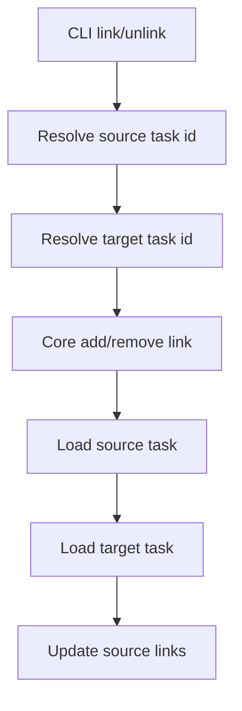
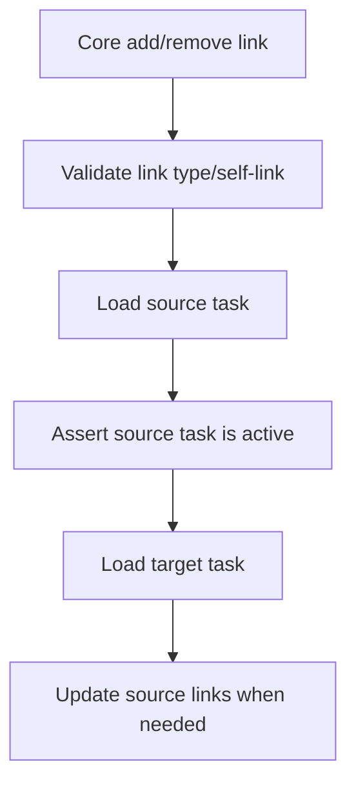

# Technical Spec: Completed Source Link Guard

## Scope

Add lifecycle protection for direct task link mutations. `playspec link` and `playspec unlink` must reject completed source tasks before mutating the source task `links` field. The guard must cover both explicit source IDs and `--to` shorthand, where the source is resolved from HEAD.

Out of scope:

- Changing task link semantics.
- Changing link display.
- Changing whether active tasks may link to completed target tasks.
- Changing archive behavior.

## Use Case Alignment

Operators and automation should not be able to change dependency/history metadata on tasks whose lifecycle has ended. The command should fail clearly with the existing inactive-task error and leave the completed task record unchanged.

## High-Level Current Implementation Summary

Verified behavior:

- `src/cli/commands/link.ts` parses `--as`, resolves a source task from an explicit argument or HEAD via `--to`, resolves the target task, then calls `PlaySpecCore.addTaskLink()`.
- `src/cli/commands/unlink.ts` follows the same shape and calls `PlaySpecCore.removeTaskLink()`.
- `src/core/playspec-core.ts` has a private `assertTaskIsActive()` helper used by lifecycle-sensitive operations including prompt rendering, phase completion, phase recovery, evidence, snapshots, and harness mutations.
- `addTaskLink()` and `removeTaskLink()` currently validate link type/self-link, load the source task, validate the target exists, and write updated `links` without checking source status.
- `TaskIdResolver` can resolve completed tasks, and tests intentionally cover completed task ID lookup.

Inferred behavior:

- The CLI top-level error handling will report `TaskNotActiveError` consistently once the core throws it, matching existing inactive-task command tests.

## Relevant Files Reviewed

- `src/core/playspec-core.ts`
- `src/core/errors.ts`
- `src/cli/commands/link.ts`
- `src/cli/commands/unlink.ts`
- `tests/integration/task-links.test.ts`
- `tests/cli.test.ts`

## Active Entry Points And Bypasses

Active entry points:

- `playspec link <sourceTaskId> <targetTaskId> --as <type>`
- `playspec unlink <sourceTaskId> <targetTaskId> [--as <type>]`
- `playspec link --to <targetTaskId> --as <type>`
- `playspec unlink --to <targetTaskId> [--as <type>]`
- MCP direct link tools call the same core methods without HEAD fallback.

Bypass today:

- Any caller of `PlaySpecCore.addTaskLink()` or `removeTaskLink()` can pass a completed source task ID and mutate `links`.

## Current Architecture

CLI commands are thin wrappers around `PlaySpecCore`. They resolve task IDs and delegate mutation semantics to core. This is the right layer for the guard because it protects explicit CLI sources, HEAD shorthand, and non-CLI callers that use core methods.

Verified current flow:

Proposed flow:

## Verified Behavior

- `TaskNotActiveError` message format is `Task "<id>" is not active (status: <status>).`
- Existing CLI tests assert inactive-task failures by checking stderr for `Task "<id>" is not active`.
- Task link integration tests already cover normal explicit and `--to` link/unlink behavior.

## Problems

- Completed source tasks can be mutated by link/unlink.
- The lifecycle boundary is inconsistent with other core mutation methods.
- The bug exists below CLI resolution, so fixing only CLI would leave MCP/core callers exposed.

## Proposed Direction

Add `this.assertTaskIsActive(source)` immediately after loading the source task in both `addTaskLink()` and `removeTaskLink()`, before target lookup and before any `links` computation or update. This preserves target lookup behavior for active sources while rejecting completed source mutations early.

## File-By-File Plan

- `src/core/playspec-core.ts`: call `assertTaskIsActive(source)` in both direct link mutation methods after `getTask(sourceTaskId)`.
- `tests/integration/task-links.test.ts`: add focused CLI regression coverage for completed source failures and unchanged `links`, including at least one explicit source path and one HEAD/`--to` path.

## Risks And Open Questions

Risks:

- Low. The change reuses an existing core guard and error type.

Open questions:

- None for this issue. The acceptance criteria explicitly scope target task behavior unchanged.

## Reader Aids

Expected rejection examples:

- `playspec link completed_source target --as related`
- `playspec unlink completed_source target`
- `playspec link --to target --as related` when HEAD is `completed_source`
- `playspec unlink --to target` when HEAD is `completed_source`
