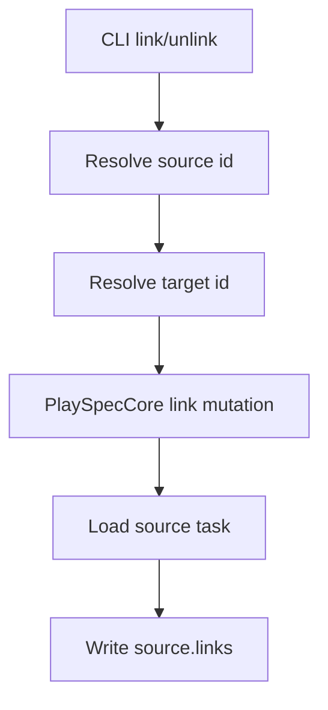
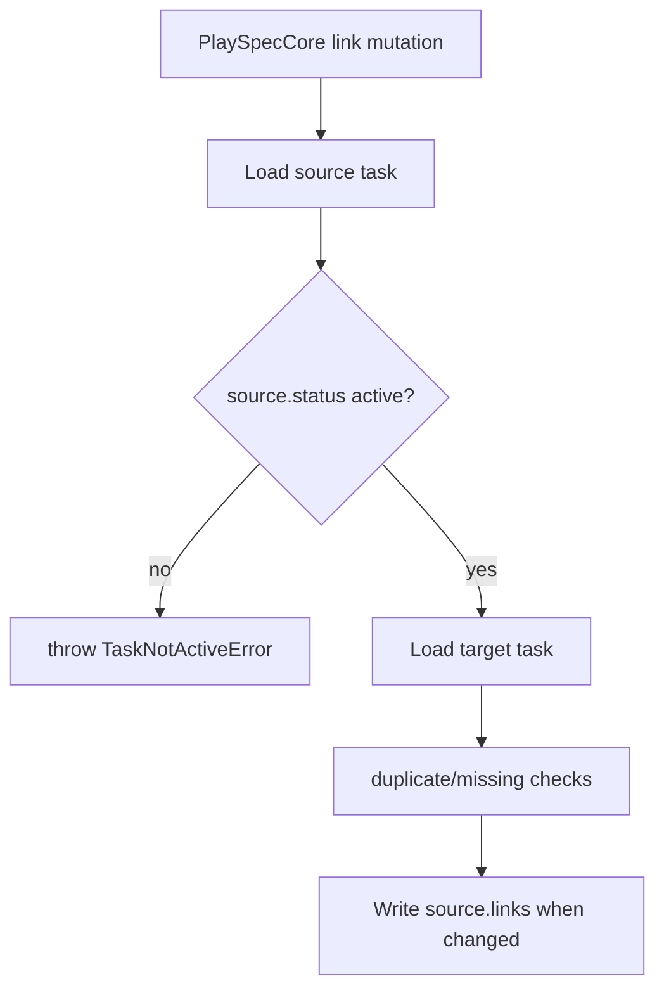

# Issue 159 Completed Source Link Guard Spec

## Scope

Implement the Issue #159 lifecycle guard for direct task link mutations. `playspec link` and `playspec unlink` must reject a completed source task before mutating that source task's `links` field. This applies to both explicit source arguments and the `--to` shorthand that resolves the source from HEAD.

Out of scope: changing target task mutability rules, archive behavior, status rendering, link type semantics, or dependency management.

## Use Case Alignment

Operators and automation can keep completed tasks in `.playspec/tasks/active` until archive. Completed tasks should not remain mutable active work. Link and unlink currently allow relationship edits on completed source tasks, which can change completed task metadata and downstream status/suggested-next output after completion.

## High-Level Current Implementation Summary

Verified behavior:

- `src/cli/commands/link.ts` parses `--as`, resolves the source from either an explicit positional argument or `ActiveTaskResolver` when `--to` is used, resolves the target through `TaskIdResolver`, then calls `PlaySpecCore.addTaskLink()`.
- `src/cli/commands/unlink.ts` follows the same source and target resolution shape, then calls `PlaySpecCore.removeTaskLink()`.
- `src/core/playspec-core.ts` validates link type and self-links, loads source and target tasks, then writes `source.links` without checking `source.status`.
- `PlaySpecCore` already has `assertTaskIsActive(task)` and existing mutating task operations call it before updating task state.
- `tests/integration/task-links.test.ts` covers active source link/unlink success, duplicate warnings, missing-link warnings, prefix resolution, and completed task ID resolution, but not completed-source mutation rejection.

Inferred behavior:

- Adding the guard in core covers both CLI forms and any other caller of the mutation methods.
- Existing target resolution should remain unchanged because the issue only specifies source mutability.

Open questions:

- None for the requested scope.

## Relevant Files Reviewed

- `src/cli/commands/link.ts`
- `src/cli/commands/unlink.ts`
- `src/core/playspec-core.ts`
- `src/core/errors.ts`
- `tests/integration/task-links.test.ts`
- `tests/cli.test.ts`

## Active Entry Points And Bypasses

Active entry points:

- `playspec link <sourceTaskId> <targetTaskId> --as <type>`
- `playspec link --to <targetTaskId> --as <type>`
- `playspec unlink <sourceTaskId> <targetTaskId> [--as <type>]`
- `playspec unlink --to <targetTaskId> [--as <type>]`
- Programmatic `PlaySpecCore.addTaskLink()` and `PlaySpecCore.removeTaskLink()`

Bypass path:

- Completed source tasks can be resolved by exact ID, prefix, or HEAD-based shorthand while they remain in active storage. The current core methods then mutate them without an active-status guard.

## Current Architecture

## Verified Behavior

- Target tasks are loaded to ensure they exist, but no active-status requirement is applied to targets.
- Duplicate add and missing remove warnings are produced after source links are inspected.
- `TaskNotActiveError` already identifies the task id and status with the message `Task "<id>" is not active (status: completed).`

## Problems

- Completed source tasks remain mutable through link/unlink.
- HEAD-based shorthand inherits the same gap because `ActiveTaskResolver` resolves HEAD to a task record but the link command only uses `task.id`.
- Warnings for duplicate or missing links can currently be returned for completed source tasks, which means the completed-source lifecycle guard is never enforced.

## Proposed Direction

Add `this.assertTaskIsActive(source)` immediately after loading the source task in `PlaySpecCore.addTaskLink()` and `PlaySpecCore.removeTaskLink()`, before loading/validating the target and before duplicate/missing-link checks. This ensures rejected mutations exit non-zero without changing the source YAML and without changing target resolution semantics for active source tasks.

Proposed flow:

## File-By-File Plan

- `src/core/playspec-core.ts`: call `assertTaskIsActive(source)` in both link mutation methods before any link mutation path.
- `tests/integration/task-links.test.ts`: add explicit source rejection tests for link and unlink, plus HEAD-based `--to` rejection tests for link and unlink. Capture source task YAML before and after each rejected command and assert it is unchanged.
- `docs/features/issue_159_completed_source_link_guard/plan.md`: document the implementation and validation plan in the next phase.

## Risks And Open Questions

- Compatibility risk: any workflow intentionally editing links on completed source tasks will now fail. This matches the lifecycle safety direction in the issue.
- Ordering risk: putting the guard before duplicate/missing-link warning checks changes completed-source duplicate/missing attempts from warning success to hard failure. This is intended by the acceptance criteria.
- Target mutability remains unchanged by design.

## Reader Aids

- Source task: the record whose `links` field is mutated.
- Target task: the linked task id referenced by the source `links` entries.
- `--to` shorthand: source task comes from HEAD; target task comes from the `--to` value.
