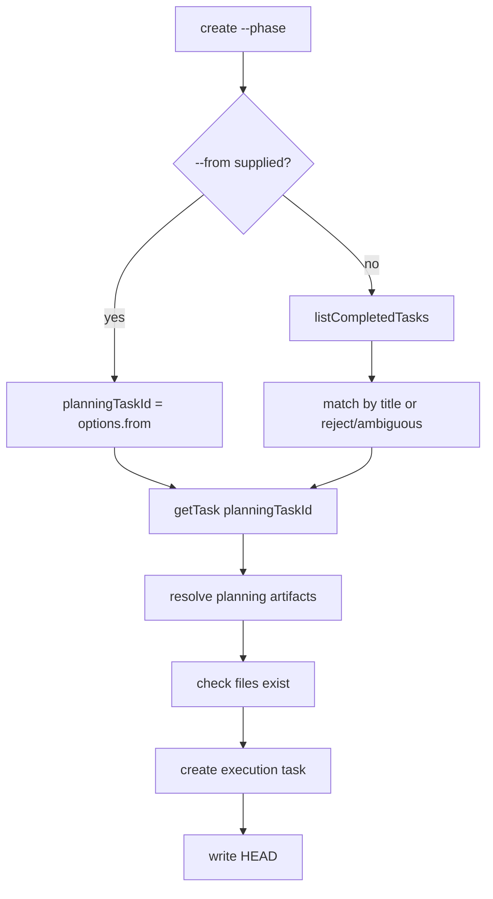
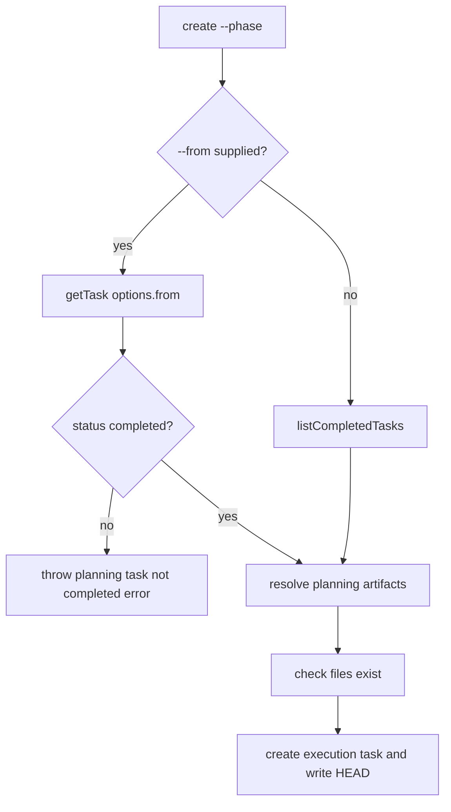

# Issue 185: Reject Active Planning Sources for Phase Execution

## Scope

Implement a focused CLI lifecycle guard for `playspec create <title> --workflow <workflow> --phase <n> --from <taskId>`.

In scope:
- Reject explicit planning source tasks whose `status` is not `completed`.
- Preserve successful creation from completed planning tasks with valid total spec and phase plan artifacts.
- Preserve the automatic no-`--from` discovery path, including completed-only search and ambiguity handling.
- Add a CLI regression proving active planning tasks with existing artifacts are rejected before task creation or HEAD mutation.

Out of scope:
- Redesign phase-execution task creation.
- Change artifact naming, workflow variable rendering, task archive behavior, or unrelated create modes.
- Add an override that allows active planning sources.

## Use Case Alignment

Operators use phase-execution tasks to start downstream implementation work from reviewed planning artifacts. Automatic discovery already enforces this by searching only `store.listCompletedTasks()`. Explicit `--from <taskId>` should enforce the same lifecycle boundary so scripts cannot accidentally bind execution work to unfinished planning material.

## High-Level Current Implementation Summary

Verified behavior in `src/cli/commands/create.ts`:
- Normal task creation runs when `options.phase` is absent. In that mode, `--from` is treated as a source problem file alias.
- Phase-execution creation runs when `options.phase` is present.
- If `--from` is present in phase-execution mode, the code assigns `planningTaskId = options.from`.
- If `--from` is absent, the code calls `store.listCompletedTasks()` and matches completed tasks by title.
- After selecting `planningTaskId`, the code calls `store.getTask(planningTaskId)`, resolves total spec and phase plan artifact paths, checks file existence, creates the execution task, then writes HEAD.

Verified behavior in `src/storage/yaml-task-store.ts`:
- `getTask()` can return active or completed tasks from `.playspec/tasks/active`.
- `listCompletedTasks()` filters tasks to `status === 'completed'`.

## Relevant Files Reviewed

- `src/cli/commands/create.ts`: phase-execution task creation flow and artifact binding.
- `src/core/errors.ts`: existing task state and planning context error classes.
- `src/storage/yaml-task-store.ts`: task status lookup and completed task listing.
- `tests/cli.test.ts`: existing CLI regressions for phase-execution creation, variables, and completed-task guards.

## Active Entry Points And Bypasses

Active entry point:
- `runCreate(workspaceRoot, workflow, title, options)` handles all `playspec create` flows.

Bypass:
- In phase-execution mode, explicit `--from` bypasses `listCompletedTasks()` and accepts any `getTask()` result before artifact checks.

Old path that must remain:
- No-`--from` phase-execution discovery must continue to search completed tasks only and preserve existing ambiguity behavior.

## Current Architecture

Verified phase-execution flow:



Proposed flow:



## Verified Behavior

- Completed explicit planning source with valid artifacts succeeds.
- Completed explicit planning source with missing artifacts fails with `PlanningContextNotFoundError`.
- Automatic no-`--from` discovery only considers completed tasks.
- Explicit active planning source is currently accepted if required artifact files exist.

## Problems

- The explicit `--from` path does not validate `planningTask.status`.
- Because artifact checks happen after `getTask()`, an active planning task with pre-created artifact files can create a downstream execution task and mutate HEAD.
- The lifecycle contract is inconsistent between automatic discovery and explicit selection.

## Proposed Direction

Add a narrow status check immediately after the explicit planning task is loaded and before `resolvePlanningArtifacts()`.

Expected rejection text:
- Clearly identify that the referenced planning task is not completed.
- Clearly state that phase-execution creation requires a completed planning task.

Use a dedicated error class or direct `Error` message. A dedicated `PlaySpecError` subclass is preferable because CLI errors already include recovery hints and similar task state guards live in `src/core/errors.ts`.

## File-By-File Plan

`src/core/errors.ts`
- Add a focused `PlanningTaskNotCompletedError` that reports:
  - `Planning task "<taskId>" is not completed (status: <status>).`
  - `Phase-execution creation requires a completed planning task. Complete the planning task first, then rerun with --from <TASK_ID>.`

`src/cli/commands/create.ts`
- Import the new error.
- In the explicit `--from` branch, load the planning task and verify `status === 'completed'` before artifact resolution.
- Keep the no-`--from` path unchanged.
- Avoid changing normal task creation behavior.

`tests/cli.test.ts`
- Add a regression near existing phase-execution tests:
  - Initialize a workspace.
  - Create an initial HEAD task so HEAD has a known value.
  - Create an active `total-plan` planning task with phase history that resolves the expected total spec and phase plan paths.
  - Write both expected artifact files.
  - Run `create ... --phase 1 --from <activeTaskId>`.
  - Assert exit code is non-zero.
  - Assert stderr includes the not-completed planning task message and phase-execution completed requirement.
  - Assert the expected execution task file does not exist.
  - Assert HEAD remains the original known task.
- Keep or rely on existing completed explicit source coverage.

## Risks And Open Questions

- Risk: Some local scripts may currently pass active planning tasks with pre-created files. This fix intentionally rejects that behavior to match automatic discovery.
- Open question: Whether to reuse `TaskNotCompletedError`. It currently gives archive-specific guidance, so a phase-execution-specific error is cleaner.

## Reader Aids

Primary behavior to verify manually:

```sh
playspec create "Planning Task" --workflow issue-scope-create --phase 1 --from active_planning_task
```

This should fail before any execution task directory is created and before `.playspec/HEAD` changes.
