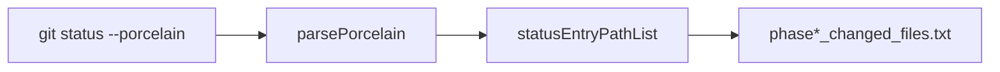
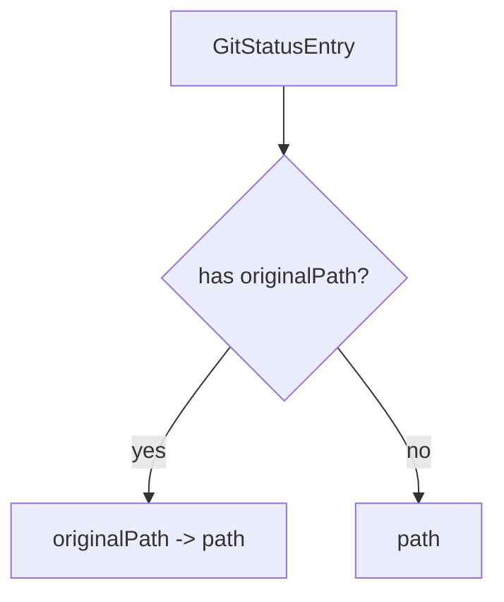

# Preserve Rename Paths in Changed-Files Evidence Technical Spec

## Scope

Update PlaySpec changed-files evidence serialization so Git rename entries preserve both the original path and destination path. Keep evidence filenames and completion history references unchanged.

Out of scope: evidence artifact redesign, rollback/desync behavior changes, workflow template changes, and issue-scope report path changes.

## Use Case Alignment

Reviewers use `.playspec/tasks/.../evidence/phase*_changed_files.txt` to understand what changed during a phase. When a tracked file is renamed, the artifact must show where it moved from and to, without making ordinary one-path-per-line entries harder to read.

## High-Level Current Implementation Summary

Verified behavior:

- `PlaySpecCore.writeEvidence()` writes three evidence files for phase completion and manual collection: Git status, diff stat, and changed files.
- `GitState.getWorkspaceState()` reads `git status --porcelain --untracked-files=all` and parses it with `parsePorcelain()`.
- `parsePorcelain()` detects `old -> new` paths and returns `{ originalPath, path }`.
- `statusEntryPathList()` currently maps every entry to only `entry.path`, so rename source paths are dropped before evidence is written.
- State desync and rollback paths already include both rename sides through their own helpers.

Inferred behavior:

- Consumers may treat the changed-files artifact as one changed item per line. A rename format should remain one line per status entry and keep the destination path plainly extractable.

## Relevant Files Reviewed

- `src/core/git-state.ts`: Git status parsing and changed-file serialization.
- `src/core/playspec-core.ts`: evidence collection and evidence filename generation.
- `src/core/state-desync-detector.ts`: rename-aware comparison behavior.
- `src/core/rollback-manager.ts`: rename-aware rollback planning behavior.
- `tests/integration/completion-engine.test.ts`: phase completion, manual evidence, and rename desync integration coverage.

## Active Entry Points and Bypasses

Active entry points:

- `PlaySpecCore.completePhase()` calls private `writeEvidence()` during phase completion.
- `PlaySpecCore.collectEvidence()` calls the same private `writeEvidence()` for manual evidence.

Bypasses:

- State desync and rollback do not use `statusEntryPathList()` for user-facing changed-files artifacts.
- Git diff stat and raw Git status artifacts are already separate and should not be modified.

## Current Architecture

`GitState` owns Git command execution and parsing. `PlaySpecCore` owns task evidence file naming and writing. The smallest correct architecture is to keep rename formatting inside the existing `statusEntryPathList()` helper so both completion and manual evidence inherit the behavior without changing `PlaySpecCore`.

## Verified Behavior

For a Git porcelain rename line like `R  src/old-name.ts -> src/new-name.ts`, `parsePorcelain()` returns `originalPath: "src/old-name.ts"` and `path: "src/new-name.ts"`. The current serializer emits only:

```text
src/new-name.ts
```

The desired artifact should emit a stable single-line rename entry containing both paths, for example:

```text
src/old-name.ts -> src/new-name.ts
```

Non-rename entries should continue to emit:

```text
src/app.ts
```

## Problems

- Rename evidence loses source path despite the parser already capturing it.
- Reviewers cannot reconstruct rename provenance from `phase*_changed_files.txt` alone.
- Regression coverage exists for rename-aware desync, but not for changed-files evidence.

## Proposed Direction

Change `statusEntryPathList()` so entries with `originalPath` serialize as `originalPath -> path`, while all other entries serialize as `path`. Add a completion-engine integration test that creates and commits a tracked file, completes a phase to establish baseline evidence, renames the tracked file with `git mv`, collects manual evidence or completes the next phase, and asserts the changed-files artifact includes both paths on the rename line.

## File-by-File Plan

- `src/core/git-state.ts`: update `statusEntryPathList()` rename serialization.
- `tests/integration/completion-engine.test.ts`: add focused regression coverage for changed-files evidence with a tracked rename.
- `src/core/playspec-core.ts`: no runtime change expected unless tests reveal evidence writer coupling.

## Risks and Open Questions

- Risk: downstream consumers that parse one literal path per line may need to handle `old -> new` for rename lines. Keeping one status entry per line preserves simple line-based parsing.
- Open question: whether to include Git status code in changed-files evidence. This spec avoids that broader redesign to keep the artifact compatible and readable.

## Reader Aids

Verified flow:



Proposed serializer behavior:


