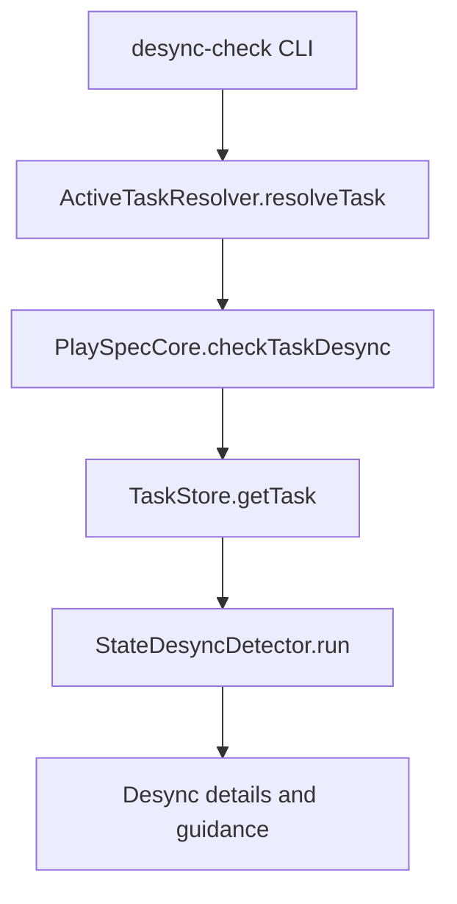
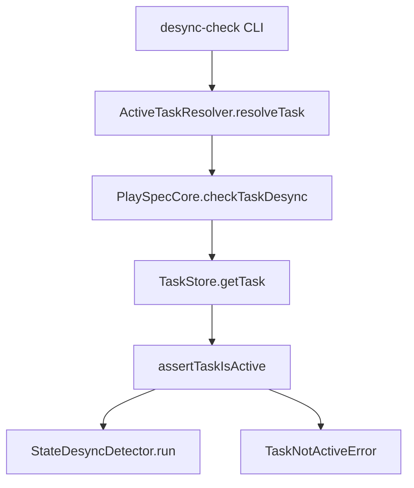

# Issue 191: desync-check completed task active guard

## Scope

Add active-task enforcement to `playspec desync-check` so completed tasks fail before desync classification and recovery guidance are produced.

In scope:

- Guard `PlaySpecCore.checkTaskDesync()` with the existing inactive-task behavior.
- Preserve current `desync-check` output for active tasks.
- Add CLI regression coverage for HEAD-based and explicit `--task` completed-task rejection.

Out of scope:

- Redesigning desync severity classification.
- Changing rollback planning or rollback execution.
- Changing workflow template wording.

## Use Case Alignment

Operators use `desync-check` as a lifecycle recovery command. If `.playspec/HEAD` points at a completed task, or an operator passes `--task <completedTaskId>`, the command should reject the terminal lifecycle instead of presenting stale guidance such as rollback recovery hints.

## High-Level Current Implementation Summary

Verified behavior:

- `src/cli/commands/desync-check.ts` resolves HEAD or `--task` through `ActiveTaskResolver.resolveTask()`.
- The CLI passes the resolved task ID into `PlaySpecCore.checkTaskDesync()`.
- `PlaySpecCore.checkTaskDesync()` loads the task and calls `StateDesyncDetector.run(task)`.
- Unlike nearby lifecycle methods, `checkTaskDesync()` does not call `assertTaskIsActive(task)`.
- `TaskNotActiveError` already provides the desired inactive-task message and recovery hint.

Inferred behavior:

- The CLI top-level error handling will print the `TaskNotActiveError` message and hint consistently once the core method throws it.

## Relevant Files Reviewed

- `src/cli/commands/desync-check.ts`
- `src/core/playspec-core.ts`
- `src/core/errors.ts`
- `tests/cli.test.ts`

## Active Entry Points And Bypasses

Active entry point:

- `playspec desync-check [--task <id>]`

Bypass paths:

- HEAD-based lookup currently accepts completed tasks because `ActiveTaskResolver.resolveTask()` resolves existence, not active lifecycle state.
- Explicit `--task` lookup currently accepts completed tasks for the same reason.
- MCP `playspec_run_state_desync_check` calls `PlaySpecCore.checkTaskDesync()` directly, so a core-level guard protects both CLI and MCP callers.

## Current Architecture

Verified flow:

Proposed flow:

## Verified Behavior

- Active-task desync tests already cover normal medium-severity output for changed and untracked files.
- `TaskNotActiveError` includes both task ID and status in the error message.
- Other lifecycle methods in `PlaySpecCore`, including prompt rendering and phase completion, enforce active status before continuing.

## Problems

- Completed tasks can produce lifecycle recovery output through `desync-check`.
- The CLI behavior is inconsistent with other active-task-only lifecycle commands.
- A CLI-only guard would leave direct core callers inconsistent, including MCP.

## Proposed Direction

Add `this.assertTaskIsActive(task)` inside `PlaySpecCore.checkTaskDesync()` immediately after loading the task and before calling `StateDesyncDetector.run(task)`.

Add two CLI tests:

- HEAD points to a completed task and `playspec desync-check` fails with `Task "<id>" is not active (status: completed).`
- `playspec desync-check --task <completedTaskId>` fails with the same style when HEAD may point elsewhere.

## File-By-File Plan

- `src/core/playspec-core.ts`: add the active-task assertion to `checkTaskDesync()`.
- `tests/cli.test.ts`: add focused regression tests near the existing desync-check tests.

## Risks And Open Questions

Risk:

- Low. This intentionally changes completed-task behavior while preserving active-task behavior.

Open questions:

- None.

## Reader Aids

Acceptance focus:

- Completed HEAD rejected.
- Completed explicit `--task` rejected.
- Error includes task ID and status.
- Existing active-task desync output remains unchanged.
