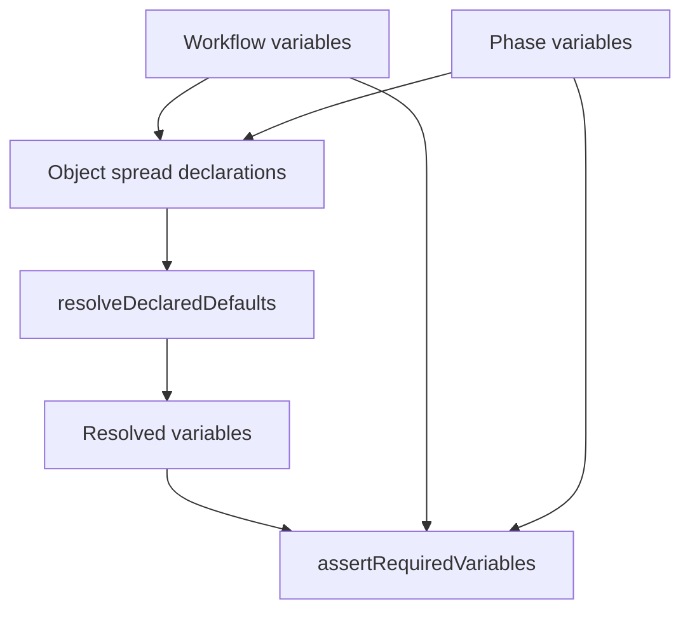

# Issue 194 Variable Declaration Merge Spec

## Scope

Fix workflow/phase variable declaration merging so a phase can customize a same-name variable declaration without accidentally dropping workflow-level metadata such as `required: true`.

In scope:
- `src/template/variable-resolver.ts`
- `src/core/playspec-core.ts`
- `src/core/required-variables.ts` if needed to share merged declaration semantics
- Focused tests in `tests/unit` and render-path coverage under `tests/integration`

Out of scope:
- Workflow schema redesign
- Task variable value precedence changes
- Circular default or unknown default behavior changes
- MCP, rollback, harness, viewer, or routing behavior

## Use Case Alignment

Workflow authors declare global required variables once at workflow level. Individual phases may refine a variable by adding a phase-specific default or description. That refinement should not make the variable optional unless the engine exposes and tests an explicit relaxation contract.

## High-Level Current Implementation Summary

Verified behavior:
- `VariableResolver.resolve()` builds `declarations` using object spread of workflow variables followed by phase variables. A same-name phase declaration replaces the full workflow declaration object.
- Default resolution uses that merged declaration map to compute declared defaults.
- `PlaySpecCore.renderResolvedPhase()` calls `resolveAndAssertRequiredVariables()`.
- `resolveAndAssertRequiredVariables()` resolves variables, then calls `assertRequiredVariables()` with the phase definition and workflow-level declarations.
- `assertRequiredVariables()` currently computes required variables from workflow declarations, phase declarations, and `definition.requiredVariables` separately.

Inference:
- Current render-path validation already preserves workflow-level `required: true` in some cases because it does not rely on the resolver's spread map.
- The resolver still has inconsistent declaration semantics: same-name phase declarations discard workflow defaults/descriptions/required metadata inside the declaration map.

## Relevant Files Reviewed

- `src/template/variable-resolver.ts`: active variable default resolution and declaration merge site.
- `src/core/playspec-core.ts`: prompt render path and required-variable validation entry point.
- `src/core/required-variables.ts`: required-variable assertion helper.
- `src/core/types.ts`: `VariableDeclaration` optional fields.
- `src/core/schemas.ts`: schema allows optional `required`, `default`, and `description`.
- `tests/unit/variable-resolver.test.ts`: existing coverage for defaults, task overrides, unknown references, circular references, and empty task variables.
- `tests/integration/init-create-next.test.ts`: existing render-path required-variable tests.

## Active Entry Points And Bypasses

Active entry points:
- `PlaySpecCore.renderNextPrompt()` -> `renderResolvedPhase()` -> `resolveAndAssertRequiredVariables()`.
- `PlaySpecCore.renderExplicitPhasePrompt()` -> `renderResolvedPhase()` -> `resolveAndAssertRequiredVariables()`.
- CLI create validation path uses `assertRequiredVariables()` after resolving variables.

Bypasses:
- Direct `VariableResolver.resolve()` callers receive resolved values only and do not observe required validation unless they explicitly call `assertRequiredVariables()`.
- The resolver's declaration map is currently private, so tests must observe behavior through resolved default values and render-path missing-variable errors.

## Current Architecture

Verified flow:



Problem point:
- `C` treats phase declarations as total replacements instead of per-field overrides.

## Verified Behavior

- Empty task variable values can fall back to declaration defaults.
- Explicit non-empty task variables override declaration defaults.
- Unknown default dependencies still throw when demanded.
- Circular default dependencies still throw.
- Unused workflow defaults with unavailable dependencies can remain unresolved for an active phase.
- Required workflow variables are validated on render.

## Problems

1. `VariableResolver.resolve()` uses whole-object replacement for same-name declarations.
2. Required-variable validation and default resolution do not share one declaration merge contract.
3. There is no focused regression test for a workflow declaration like `{ required: true, default: "workflow" }` combined with a phase declaration like `{ default: "phase" }`.

## Proposed Direction

Add a small declaration merge helper that merges declarations per variable:

- Start with workflow-level declarations.
- For each phase-level declaration with the same name, merge fields with phase fields taking precedence.
- A phase `default` overrides a workflow `default`.
- A phase `description` overrides a workflow `description`.
- A workflow `required: true` remains present when the phase omits `required`.
- If `required: false` is used, required validation should follow the documented/covered behavior chosen by implementation.

Use the helper in:
- `VariableResolver.resolve()` before `resolveDeclaredDefaults()`.
- The render-path required-variable validation map in `PlaySpecCore.resolveAndAssertRequiredVariables()` or the required-variable helper.

## File-By-File Plan

- `src/template/variable-resolver.ts`
  - Add/export a focused `mergeVariableDeclarations()` helper or equivalent local helper.
  - Replace whole-object spread with per-variable merge.

- `src/core/required-variables.ts`
  - Accept an already-merged declaration map or use the shared helper to compute required variables consistently.

- `src/core/playspec-core.ts`
  - Pass merged workflow/phase declarations into required-variable validation.

- `src/cli/commands/create.ts`
  - Check whether CLI create required validation needs the same helper to avoid inconsistent behavior.

- `tests/unit/variable-resolver.test.ts`
  - Add coverage proving a phase default overrides a workflow default while preserving same-name workflow metadata semantics.

- `tests/integration/init-create-next.test.ts`
  - Add render-path coverage proving a workflow-required variable remains required when the phase same-name declaration only supplies default/description.

## Risks And Open Questions

- Risk: A workflow may rely on same-name phase declarations silently relaxing workflow-level `required: true`. The safer behavior is to preserve required metadata by default.
- Open question: whether `required: false` should be a supported explicit relaxation mechanism. If implemented, it needs a focused test so the contract is not accidental.

## Reader Aids

Minimal regression shape:

```ts
workflow.variables.PROJECT_KEY = { required: true, default: "workflow" };
phase.variables.PROJECT_KEY = { default: "phase" };
```

Expected:
- Resolver returns `PROJECT_KEY === "phase"` when task has no explicit value.
- Render/required validation still treats `PROJECT_KEY` as required metadata after merge.
