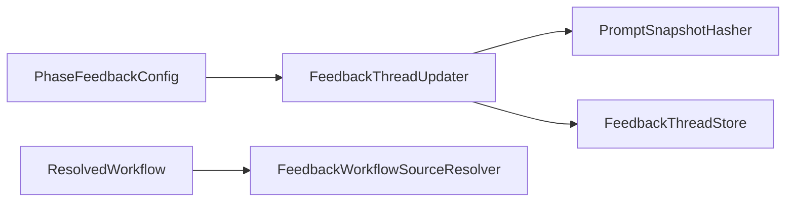
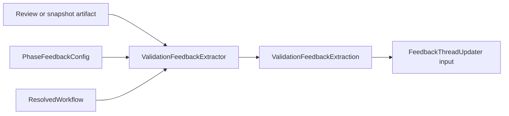

# Issue 198 Validation Feedback Extractor Spec

## Scope

Implement Phase 4 machine-readable extraction for validation feedback that can feed the Phase 3 feedback thread updater. This change adds `src/evolution/validation-feedback-extractor.ts` and focused tests. It does not auto-generate proposals, mutate old validation artifacts, or add LLM summarization.

Required automated validation phases must provide a machine-readable `playspecFeedback` block when their workflow phase feedback config marks feedback as required. Required configured feedback never falls back to markdown, even when `scoreSource.markdownFallback` is true for legacy config compatibility. Optional and compatibility phases may fall back to narrow markdown score parsing, but the result must be low confidence and must not pretend to have structured cause or prompt guidance unless those fields are explicitly present.

## Use Case Alignment

Validation phases already route via `playspec complete --result approved|needs_revision`. The new extractor turns the review/snapshot artifacts produced around `PlaySpecCore.completePhase` into stable data:

- source phase, evaluated artifact phase, and target prompt phase remain separate.
- score and threshold outcomes are numeric and schema-validated.
- cause classification and prompt-evolution guidance are explicit fields, not inferred from prose.
- target type, workflow source metadata, and target writability either come from the feedback block or are resolved from workflow config.
- fallback extraction is visibly low confidence.

## High-Level Current Implementation Summary

Verified:

- `PhaseFeedbackConfig` exists in `src/core/types.ts` and `src/core/schemas.ts`.
- Evolution feedback thread storage, workflow source resolution, prompt snapshot hashing, and semantic dedupe updating exist under `src/evolution/`.
- `FeedbackThreadUpdater.update()` currently requires already-normalized approval result, feedback result, score, cause classification, and summary input.
- `PlaySpecCore.completePhase()` writes completion snapshots, evidence, optional review artifacts, completion ledger records, and task history, but it does not yet extract validation feedback from those artifacts.
- `mono-spec` currently has no feedback config in its workflow YAML on this branch; tests can define project workflows with feedback config.

Inferred:

- The extractor should be a pure library service first, returning normalized metadata suitable for `FeedbackThreadUpdater` without writing threads by itself.
- Completion-time wiring can call the extractor after review/snapshot artifacts are available, then pass the normalized result into `FeedbackThreadUpdater`.

Open question:

- The exact persisted raw observation path can be finalized during implementation; a workspace-relative artifact reference is enough for the extractor contract.

## Relevant Files Reviewed

- `src/core/types.ts`: phase feedback config and task/phase history contracts.
- `src/core/schemas.ts`: zod validation for phase feedback config.
- `src/core/playspec-core.ts`: completion artifact creation entry point.
- `src/evolution/types.ts`: feedback event/thread and updater input contracts.
- `src/evolution/schemas.ts`: feedback event/thread validation schemas.
- `src/evolution/feedback-thread-updater.ts`: target consumer for extracted metadata.
- `src/evolution/feedback-workflow-source-resolver.ts`: source/target template resolution.
- `src/evolution/prompt-snapshot-hasher.ts`: prompt target hashing used by updater.
- `src/preset/assets/workflows/mono-spec/workflow.yaml`: current built-in workflow shape.
- `tests/integration/evolution-feedback-thread-updater.test.ts`: focused Phase 3 behavior examples.

## Active Entry Points And Bypasses

Primary entry point:

- New `ValidationFeedbackExtractor.extract(input)` in `src/evolution/validation-feedback-extractor.ts`.

Future integration entry point:

- `PlaySpecCore.completePhase()` after completion artifacts are written and before/around feedback thread update.

Bypasses to avoid:

- Broad ad hoc markdown parsing for required configured feedback.
- Treating `Score: X/100` as authoritative when a required `playspecFeedback` block is missing.
- Collapsing `sourcePhaseId`, `evaluatedArtifactPhaseId`, and `evolutionTargetPhaseId` into one phase.
- Trusting workflow target writability from prose when config/resolver can determine it.

## Current Architecture

Existing Phase 3 flow:



Proposed Phase 4 extraction flow:



## Verified Behavior

- Feedback score schemas reject values outside 0..100.
- Thread updater validates event score with `z.number().min(0).max(100)`.
- Workflow source resolver already resolves project, user, bundled, and external workflow source metadata and target writability.
- Thread updater stores distinct `sourcePhaseId`, `evaluatedArtifactPhaseId`, and `evolutionTargetPhaseId` from config.

## Problems

- No extractor exists to read `playspecFeedback` from validation artifacts.
- No schema defines machine-readable extraction block shape.
- No required-vs-optional behavior enforces machine-readable blocks.
- No fallback result marks low confidence for compatibility parsing.
- No tests cover invalid scores such as `190/100`.
- No bridge exists from review/snapshot artifacts to normalized thread update input.

## Proposed Direction

Add:

- `ValidationFeedbackBlockSchema` in `src/evolution/schemas.ts`.
- `ValidationFeedbackExtraction` types in `src/evolution/types.ts`.
- `ValidationFeedbackExtractor` in `src/evolution/validation-feedback-extractor.ts`.
- Exports from `src/evolution/index.ts`.
- Focused integration/unit tests for structured extraction, invalid score rejection, required missing block rejection, phase preservation, workflow source/target resolution, and low-confidence fallback.

The machine-readable block should be accepted from fenced YAML or JSON blocks labelled `playspecFeedback`. The extractor should parse only that labelled block for required feedback. Fallback markdown parsing should be deliberately narrow, for example `Score: 72/100`, and only enabled when `config.required === false` and `config.scoreSource.markdownFallback === true`.

The normalized extraction result should include:

- `method`: `machine_readable_block` or `markdown_fallback`.
- `confidence`: high/medium/low, with all fallback results forced to `low`.
- `sourcePhaseId`, `evaluatedArtifactPhaseId`, and `evolutionTargetPhaseId`.
- `score`, `feedbackThreshold`, `feedbackResult`, `approvalThreshold`, and `approvalResult`.
- `causeClassification` using the existing cause categories and confidence enum.
- `promptEvolution.targetType`, initially `workflow_prompt_template`, plus guidance text when present.
- `workflowSource`, `targetPromptTemplate`, `targetWritable`, and `targetPath`, resolved from `FeedbackWorkflowSourceResolver` when absent from the block.
- `dedupeFieldValues` and `summary` suitable for `FeedbackThreadUpdater.update()`.

## File-By-File Plan

- `src/evolution/types.ts`: add extraction input/result, prompt guidance, threshold outcome, target metadata, and fallback metadata types.
- `src/evolution/schemas.ts`: add zod schemas for `playspecFeedback` and extracted result validation, including score range checks.
- `src/evolution/validation-feedback-extractor.ts`: implement block discovery, YAML/JSON parsing, schema validation, fallback parsing, threshold result calculation, and workflow target metadata resolution.
- `src/evolution/index.ts`: export the extractor.
- `tests/integration/validation-feedback-extractor.test.ts`: cover all acceptance criteria.
- `docs/features/issue_198_validation_feedback_extractor/plan.md`: implementation plan in the next phase.

## Risks And Open Questions

- YAML dependency is already available, so parsing labelled YAML blocks should not add a dependency.
- Fenced block discovery must be narrow enough to avoid treating arbitrary markdown as trusted structured data.
- Required feedback missing a block should fail extraction even if markdown contains a valid score.
- Optional fallback can only produce partial data; cause classification should default to `extractor_or_parser_error` with low confidence unless a structured cause exists.
- Completion-time integration may need a follow-up if the narrow Phase 4 scope is limited to extraction and tests.

## Validation Patch Ledger

Latest Step 2 score: 90/100.

Resolved:

- Required configured feedback now explicitly rejects markdown fallback when the `playspecFeedback` block is absent.
- Normalized extraction metadata now explicitly includes method, confidence, thresholds, target type, target metadata, and updater handoff fields.
- Optional fallback behavior is now limited to `required === false` and `markdownFallback === true`.

Remaining blockers: none.

Remaining risks:

- Completion-time wiring is still a scoped implementation decision, but the extractor contract now gives a concrete handoff to `FeedbackThreadUpdater`.

## Reader Aids

Expected `playspecFeedback` shape:

```yaml
playspecFeedback:
  sourcePhaseId: tech_spec_validate
  evaluatedArtifactPhaseId: tech_spec_draft
  evolutionTargetPhaseId: tech_spec_draft
  score: 72
  approval:
    threshold: 80
    result: needs_revision
  feedback:
    threshold: 80
    result: negative
  cause:
    category: authoring_prompt_gap
    confidence: medium
    summary: Draft prompt did not require target-path writability checks.
  promptEvolution:
    targetType: workflow_prompt_template
    guidance: Require validation feedback blocks in automated validation prompts.
  workflowSource:
    kind: project_local
    root: .playspec/workflows/mono-spec
    rootPathKind: workspace_relative
  target:
    path: tech_spec_draft.md
    pathKind: workflow_relative
    writable: true
```

Fallback markdown example:

```markdown
Score: 72/100
```

Fallback extraction should record confidence `low`, extraction method `markdown_fallback`, and partial metadata only.
