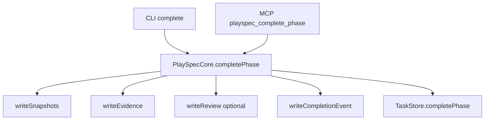
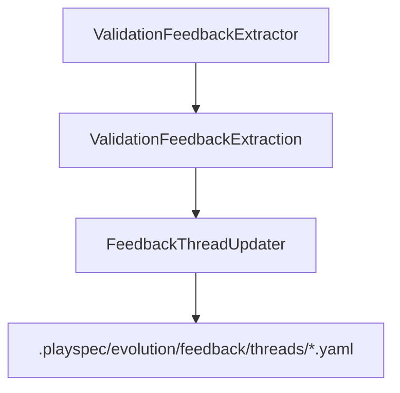
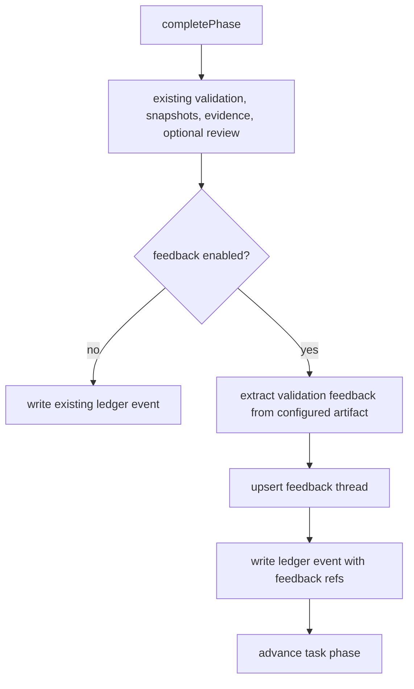

# Issue 199: Phase Validation Feedback Completion Integration

## Scope

Integrate phase validation feedback capture into the shared completion path. The work is limited to completion-time extraction, feedback thread update, task completion result metadata, completion ledger references, and focused CLI/MCP/core tests.

Out of scope: direct workflow template mutation, proposal apply, new proposal generation, and any workflow phase beyond the completion integration slice.

## Use Case Alignment

Validation phases can carry `feedback` config describing how validation output should become prompt evolution signals. When a configured phase completes, PlaySpec should extract the validation signal from the completion artifact, update a stable feedback thread keyed by the configured dedupe inputs, and record references on the completion result and ledger. A CLI completion and an MCP completion must produce the same feedback behavior because both route through `PlaySpecCore.completePhase`.

## High-Level Current Implementation Summary

Verified current behavior:

- `src/core/playspec-core.ts` owns `completePhase()`, including routing validation, snapshots, evidence, optional review, rollback safe point creation, completion ledger append, task state mutation, and optional evolution context snapshot.
- `src/cli/commands/complete.ts` resolves the active task and gate result, then delegates the actual phase completion to `PlaySpecCore.completePhase()`.
- `src/mcp/server.ts` registers `playspec_complete_phase`, resolves task context with `resolveMcpTaskId()`, and delegates completion to `PlaySpecCore.completePhase()`.
- `src/evolution/validation-feedback-extractor.ts` can extract a `ValidationFeedbackExtraction` from a machine-readable `playspecFeedback` block, and can use markdown fallback only for optional configs that allow it.
- `src/evolution/feedback-thread-updater.ts` can create or update one feedback thread under `.playspec/evolution/feedback/threads` using a stable dedupe key.
- `src/storage/completion-ledger-store.ts` appends completion events and markdown artifacts, but completion events do not currently include feedback thread references.

Inferred behavior:

- The issue intends the validation artifact to be the completion review artifact when `completion.validationTemplate` is present, because `completePhase()` already writes that artifact via `writeReview()` and the feedback config's `scoreSource.artifactRole` names the source role.
- Required feedback failures should be surfaced before task phase advancement so a failed required capture cannot silently complete the phase.

## Relevant Files Reviewed

- `src/core/playspec-core.ts`: shared completion path and ledger markdown rendering.
- `src/core/types.ts`: `PhaseDefinition.feedback`, `PhaseFeedbackConfig`, `CompletePhaseOptions`, `CompletionResult`, and `CompletionEvent`.
- `src/evolution/validation-feedback-extractor.ts`: required/optional extraction behavior and approval/feedback threshold separation.
- `src/evolution/feedback-thread-updater.ts`: dedupe key construction and thread upsert behavior.
- `src/evolution/types.ts`: extraction and feedback thread update result types.
- `src/mcp/server.ts`: MCP completion delegates to core.
- `src/cli/commands/complete.ts`: CLI completion delegates to core.
- `src/storage/completion-ledger-store.ts`: ledger persistence.
- `tests/integration/validation-feedback-extractor.test.ts`: extractor expectations.
- `tests/integration/feedback-workflow-source-resolver.test.ts`: feedback source/target resolution expectations.
- `tests/integration/completion-engine.test.ts`, `tests/integration/routing.test.ts`, `tests/integration/mcp-server.test.ts`: completion behavior coverage.

## Active Entry Points And Bypasses

Active entry points:

- CLI: `playspec complete` -> `runComplete()` -> `PlaySpecCore.completePhase()`.
- MCP: `playspec_complete_phase` -> `resolveMcpTaskId()` -> `PlaySpecCore.completePhase()`.
- Core API: direct callers of `PlaySpecCore.completePhase()`.

Bypass paths:

- Direct `TaskStore.completePhase()` calls bypass core behavior. Existing tests may use the store directly for setup; this change should not move feedback capture into storage.
- Prompt rendering and explicit phase rendering are unrelated and should not trigger feedback capture.
- Evolution proposal generation/apply commands remain separate.

## Current Architecture

Completion is centralized enough for this phase:

Feedback libraries are present but not wired into completion:

## Verified Behavior

- Workflows without `feedback` config load unchanged.
- Feedback config is schema-validated and phase references are validated by `WorkflowLoader`.
- `ValidationFeedbackExtractor` keeps approval result and feedback result independent. `approval.result` uses the completion result when present; `feedback.result` uses the feedback threshold unless explicitly provided in the machine-readable block.
- Required feedback with no machine-readable block throws `ValidationFeedbackExtractionError`.
- `FeedbackThreadUpdater` finds existing threads by dedupe key hash and updates the same path.
- MCP completion already uses core, so adding capture inside `PlaySpecCore.completePhase()` should avoid CLI/MCP divergence.

## Problems

- Completion does not inspect `definition.feedback`, so configured validation feedback is ignored.
- Completion ledger records do not expose feedback thread references.
- Completion result does not expose feedback thread references to CLI/MCP callers.
- Required extraction/store failures can disappear if feedback capture is attempted outside core or after completion without failure propagation.
- There is no shared policy handler for `fail_completion`, `warn_and_continue`, and `record_failure`.

## Proposed Direction

Add feedback capture inside `PlaySpecCore.completePhase()` after review/evidence artifacts are available and before task state/ledger completion is finalized. The phase should only attempt capture when `definition.feedback?.enabled === true`.

Proposed flow:

Failure policy:

- `fail_completion`: rethrow extraction/store failures before writing completion ledger or advancing task.
- `warn_and_continue`: complete phase and include a warning/failure summary in `CompletionResult`, without pretending a thread was written.
- `record_failure`: complete phase and record structured failure metadata on the `CompletionEvent` and `CompletionResult`; do not create or update a feedback thread when extraction or store update fails.

The first implementation should avoid inventing proposal mutation or template mutation. It should reuse `ValidationFeedbackExtractor` and `FeedbackThreadUpdater`.

Feedback artifact selection:

- If feedback is enabled, the extraction source is selected by `scoreSource.artifactRole`.
- `artifactRole` values containing `prompt` or `snapshot` read the completion prompt snapshot.
- `artifactRole` values containing `review` read the review artifact written by `writeReview()`.
- If no matching artifact exists for a feedback-enabled phase, treat that as a feedback capture failure and apply `onFailure`.
- The failure metadata should identify the failed stage as `missing_artifact`, `extraction`, or `thread_update`.
- Snapshot/evidence/review artifacts may already exist when a required failure aborts completion. That is acceptable because they are pre-completion evidence, but task state and completion ledger must not advance for `fail_completion`.

Feedback result contract:

- Success metadata includes `threadId`, `threadPath`, `created`, `approvalResult`, `feedbackResult`, `score` when present, and `dedupeKeyHash`.
- Failure metadata includes `policy`, `stage`, `message`, and `feedbackResult: "parse_failed"`.
- Completion markdown renders a `## Feedback` section only when success or failure metadata exists.
- CLI prints the same success/failure summary exposed by `CompletionResult`; MCP receives the same fields through the core result object.

## File-By-File Plan

- `src/core/types.ts`
  - Add feedback capture metadata to `CompletionResult` and `CompletionEvent`.
  - Keep fields optional so no-feedback workflows remain unchanged.
  - Add a small public result shape for success/failure metadata that can be serialized by CLI and MCP without importing evolution internals.

- `src/core/schemas.ts`
  - Extend `CompletionEventSchema` for optional feedback references/failure metadata.

- `src/core/playspec-core.ts`
  - Instantiate `ValidationFeedbackExtractor` and `FeedbackThreadUpdater`.
  - Add a helper that resolves the configured feedback artifact, reads it, extracts feedback, updates a thread, and returns ledger/result metadata.
  - Call the helper only for enabled phase feedback config.
  - Apply `onFailure` policy before final task state mutation.
  - Include feedback references in completion markdown.

- `src/cli/commands/complete.ts`
  - Print feedback thread/failure lines only when present in the shared completion result.
  - Do not duplicate extraction logic in CLI.

- `src/mcp/server.ts`
  - No behavioral logic expected beyond type-compatible result serialization, because MCP already delegates to core.

- `tests/integration/completion-engine.test.ts`
  - Add core tests for no-feedback unchanged behavior, successful thread creation/update, same dedupe key reusing thread path, independent approval vs feedback threshold results, and required failure policy.

- `tests/integration/mcp-server.test.ts`
  - Add or adjust coverage proving `playspec_complete_phase` receives the same feedback fields from core.

- `tests/cli.test.ts` or a focused integration test
  - Verify CLI completion prints feedback references and does not diverge from core behavior.

## Risks And Open Questions

- Artifact source selection is intentionally minimal and based on `scoreSource.artifactRole` so workflows can choose a prompt snapshot or review artifact without new storage primitives.
- `record_failure` is intentionally limited to completion event/result metadata in this phase; it must not invent a new feedback observation store path.
- Existing completion ordering writes ledger before task mutation. Feedback capture should happen before both for required failures, while preserving the established snapshot/evidence/review writes that provide extraction input.
- The branch depends on #198 and its prior dependency stack. The PR should target the dependency branch unless those changes merge first.

## Validation Patch Ledger

- Step 2 validation score: 90/100.
- Resolved: `record_failure` storage ambiguity. The spec now defines completion-level failure metadata only and explicitly forbids creating/updating a thread on capture failure.
- Resolved: feedback artifact source ambiguity. The spec now uses the review artifact written by `writeReview()` and applies `onFailure` when missing.
- Remaining blockers: none after this patch.

## Reader Aids

- Approval result: route/gate completion result such as `approved` or `needs_revision`.
- Feedback threshold result: prompt evolution signal result such as `positive` or `negative`.
- Dedupe key: stable key from workflow id, feedback phase ids, cause category, and configured fields used by `FeedbackThreadUpdater`.
- Feedback thread reference: the path/id returned by `FeedbackThreadUpdater.update()` and recorded on completion output.
