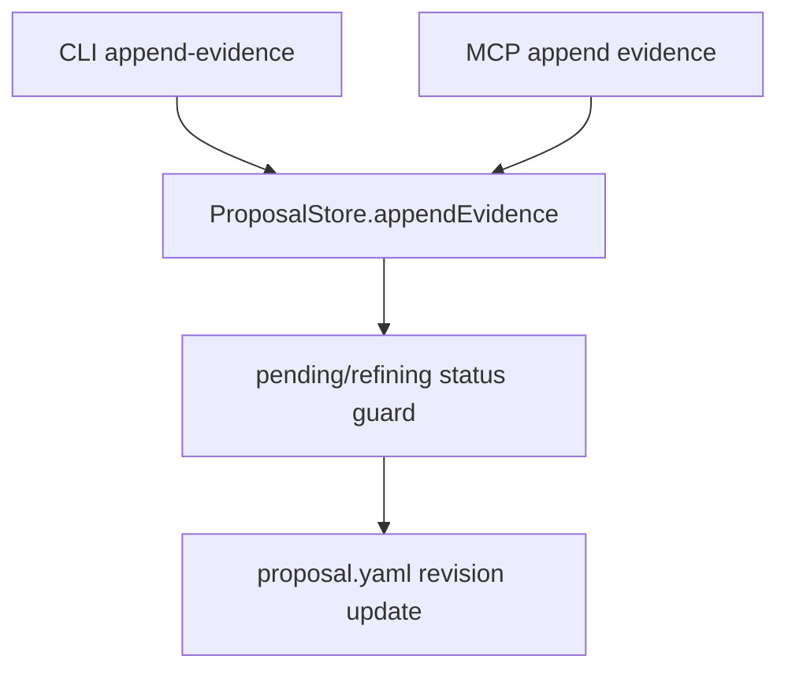
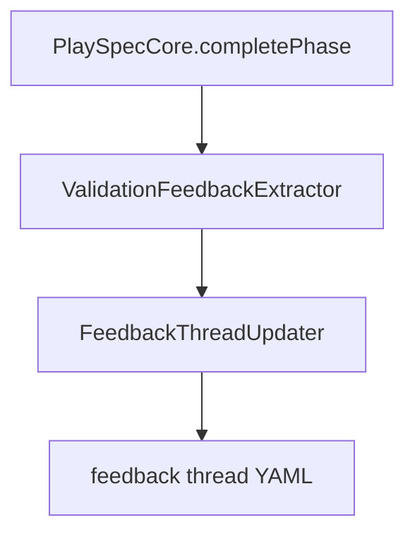
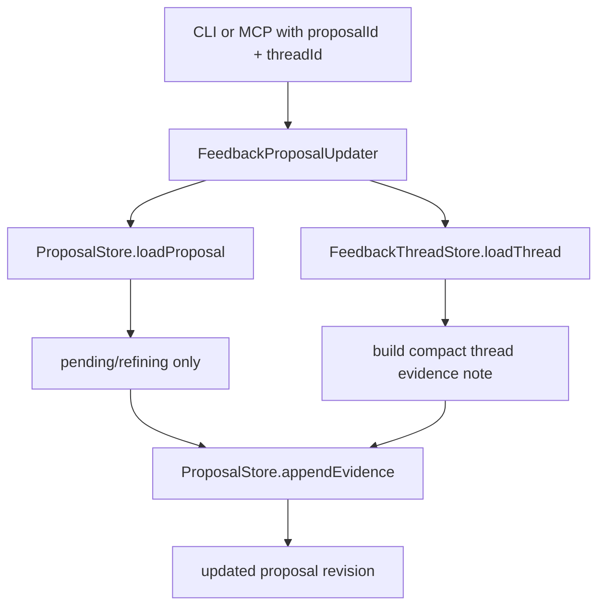

# Issue 200: Thread-Based Proposal Evidence Attachment

## Scope

Add an explicit feedback-thread-to-evolution-proposal attachment path. The implementation should attach a mature feedback thread summary to an existing pending/refining proposal only when the caller provides an explicit proposal ID and thread ID.

Out of scope: automatic proposal apply, broad proposal generation from feedback, matching proposals by target path, automatic `readyForProposal` promotion, and direct mutation of read-only/bundled/external workflow assets.

## Use Case Alignment

After validation feedback has been captured into durable feedback threads, a reviewer may decide that a specific thread is mature enough to support an existing evolution proposal. PlaySpec needs a safe command/API for attaching that thread as compact proposal evidence. The evidence should summarize the thread and bounded history, not append an individual raw validation event or infer a proposal from a matching target file.

## High-Level Current Implementation Summary

Verified current behavior:

- `src/evolution/feedback-thread-store.ts` persists feedback threads under `.playspec/evolution/feedback/threads/*.yaml` and can load/list threads by `FeedbackThreadIdSchema`.
- `src/evolution/feedback-thread-updater.ts` updates one thread per semantic dedupe key and stores compact event history plus trend/readiness metadata. It does not attach threads to proposals.
- `src/core/playspec-core.ts` now captures validation feedback during completion and returns/stores `threadId`, `threadPath`, feedback result, score, and dedupe hash metadata.
- `src/evolution/proposal-store.ts` already has `appendEvidence(proposalId, { path, note })`, guarded by `assertProposalCanChange()` so only pending/refining proposals can change.
- `src/evolution/proposal-generator.ts` can generate or update proposals from explicit file evidence and still rejects duplicate active target overlap for new generated proposals. Updates require explicit `proposalId`.
- CLI and MCP already expose generic append-evidence behavior by explicit proposal ID.

Inferred behavior:

- The intended evidence source for this phase is the feedback thread YAML path, but the appended note should contain a compact thread summary so reviewers do not need to inspect raw event details first.
- Existing proposal evidence refs are path/note/source triples. This phase can reuse that storage shape without adding a new proposal schema field, as long as the evidence note clearly identifies the thread and summary.

## Relevant Files Reviewed

- `src/evolution/proposal-store.ts`: proposal load/update/append, status guard, revision/validation writes.
- `src/evolution/proposal-generator.ts`: explicit proposal update behavior and target-overlap rejection.
- `src/evolution/feedback-thread-store.ts`: thread load/list/persistence paths.
- `src/evolution/feedback-thread-updater.ts`: thread compaction, trend/readiness, and event shape.
- `src/evolution/feedback-workflow-source-resolver.ts`: writable vs bundled/external workflow source classification.
- `src/evolution/types.ts` and `src/evolution/schemas.ts`: proposal evidence refs, feedback thread, trend, workflow source, and target writability schemas.
- `src/cli/commands/evolution.ts`: CLI evolution command handlers.
- `src/cli/index.ts`: hidden evolution command registration.
- `src/mcp/server.ts`: MCP evolution tools and explicit task/session resolution rules.
- `tests/integration/evolution-feedback-thread-updater.test.ts`: thread dedupe, compaction, readiness behavior.
- `tests/integration/evolution-proposal-generator.test.ts`: explicit proposal update and non-active rejection.
- `tests/cli.test.ts` and `tests/integration/mcp-server.test.ts`: existing CLI/MCP proposal append coverage.

## Active Entry Points And Bypasses

Active entry points to add:

- Core/service: a new `src/evolution/feedback-updater.ts` service function named `appendFeedbackThreadEvidence(workspaceRoot, input)` where `input` is exactly `{ proposalId: string; threadId: string }`.
- CLI: a narrow evolution subcommand named `playspec evolution append-thread-evidence <proposalId> <threadId>`.
- MCP: an explicit tool named `playspec_append_evolution_thread_evidence` with required `{ proposalId: string; threadId: string }`.

Existing entry points to preserve:

- `playspec evolution append-evidence <proposalId> --file <path> --note <note>` should continue to append arbitrary explicit evidence.
- `playspec evolution generate --proposal <proposalId>` remains the explicit proposal refinement path.

Bypasses to avoid:

- Do not search active proposals by `targetFiles` or `FeedbackThread.targetPath`.
- Do not append evidence from `FeedbackThreadEvent.eventId` alone.
- Do not call proposal generation automatically from completion feedback capture.
- Do not mutate workflow template files when thread targets are bundled, read-only, or external.

## Current Architecture

Verified proposal append flow:

Verified feedback thread flow:

Proposed explicit attachment flow:

## Verified Behavior

- Existing `appendEvidence()` rejects skipped proposals through the same pending/refining guard used by proposal updates.
- Applied and failed proposals are also rejected by the same guard.
- Missing proposal IDs fail at `loadProposal()`/schema/path read time and do not write proposal files.
- Thread IDs are validated by `FeedbackThreadIdSchema` when loading feedback threads.
- Feedback thread trend/readiness can reach `ready_for_review`; existing code deliberately never writes `proposal_candidate` in the first implementation.
- Feedback workflow source resolution marks only project-local and user-global targets writable; bundled preset and external targets are not writable.

## Problems

- There is no explicit service that accepts a feedback thread ID and proposal ID and appends thread evidence.
- Existing generic append-evidence requires the caller to manually know the thread file path and craft a safe note.
- Existing proposal generation uses explicit file evidence and target paths, but a careless extension could accidentally match by `targetFiles`; this phase should avoid that by design.
- There is no compact thread evidence note builder, so raw event-level evidence could leak into proposal history.
- CLI/MCP command surfaces do not distinguish thread evidence attachment from arbitrary evidence append.
- Read-only/bundled/external feedback targets currently have metadata on the thread, but no attachment summary that recommends override/copy strategies.

## Proposed Direction

Add a small evolution service in `src/evolution/feedback-updater.ts` that:

- Accepts explicit `proposalId` and `threadId`.
- Loads the feedback thread and proposal directly by ID.
- Relies on `EvolutionProposalStore.appendEvidence()` for revisioning, validation, and pending/refining status enforcement.
- Builds an evidence path from the canonical thread file path relative to the workspace.
- Builds an evidence note from the thread summary fields: thread ID, target phase/path, trend counts, readiness state, latest retained summaries, overflow summary when present, and a target mutation recommendation.
- Uses read-only/bundled/external metadata only to recommend project-local override or user-global copy strategies in the note. It must not generate direct executable mutations for those targets.
- Reuses the existing proposal evidence source value `append-evidence`; no proposal schema change is required in this phase.
- Does not deduplicate repeated thread attachments. If a caller intentionally invokes the command twice, it appends a second evidence ref through existing proposal revision semantics.

The service should fail before mutation when:

- The proposal ID is missing/invalid/not found.
- The thread ID is missing/invalid/not found.
- The proposal status is applied, failed, skipped, or otherwise non-active.

The service should not inspect raw events beyond the bounded `FeedbackThread.events` already stored in compact history.

Concrete output contract:

- Input type: `AppendFeedbackThreadEvidenceInput` with `proposalId` and `threadId`.
- Result type: `AppendFeedbackThreadEvidenceResult` containing the `EvolutionProposalWriteResult` fields plus `threadId`, `threadPath`, `evidencePath`, and `evidenceNote`.
- `evidencePath`: workspace-relative path to `.playspec/evolution/feedback/threads/<threadId>.yaml`.
- `evidenceNote`: a bounded single string built with these lines:
  - `Feedback thread <threadId> for <sourcePhaseId> -> <evolutionTargetPhaseId>.`
  - `Target: <targetPath> (writable: <true|false>, source: <workflowSource.kind>).`
  - `Trend: <direction>, readiness: <readinessState>, total events: <n>, positive: <n>, negative: <n>, neutral: <n>, parse_failed: <n>.`
  - `Latest summaries: <up to three retained event summaries in chronological order>.`
  - `History overflow: <omitted count and first/last omitted timestamps>.` only when present.
  - `Target strategy: mutate project-local/user-global proposal target only after review.` for writable targets.
  - `Target strategy: create a project-local workflow override or user-global workflow copy; do not mutate bundled/external/read-only targets directly.` for non-writable, bundled preset, or external targets.

## File-By-File Plan

- `src/evolution/feedback-updater.ts`
  - Add `appendFeedbackThreadEvidence(workspaceRoot, input)`.
  - Load `FeedbackThread` via `EvolutionFeedbackThreadStore`.
  - Append evidence via `EvolutionProposalStore.appendEvidence`.
  - Return the proposal write result plus `threadPath` and generated evidence note/path.

- `src/evolution/types.ts`
  - Add narrow input/result types for the new service.
  - Keep proposal evidence schema unchanged and use the existing `append-evidence` source.

- `src/evolution/index.ts`
  - Export the new updater service.

- `src/cli/commands/evolution.ts`
  - Add `runEvolutionAppendThreadEvidence(workspaceRoot, proposalId, threadId)`.
  - Print proposal ID, status, revision, thread ID/path, evidence note, revision file, proposal file, and validation file.
  - Preserve existing generic append-evidence behavior.

- `src/cli/index.ts`
  - Register `append-thread-evidence <proposalId> <threadId>`.

- `src/mcp/server.ts`
  - Register `playspec_append_evolution_thread_evidence`.
  - Require `proposalId` and `threadId`. Do not accept event ID or target path as alternatives.
  - Do not resolve task context or HEAD for this tool unless a later phase explicitly needs task-scoped filtering.

- Tests
  - Add focused service tests for successful append, non-active/missing proposal rejection, missing thread rejection, no target-path matching, compact note content, and read-only/bundled recommendations.
  - Add CLI coverage for the new command.
  - Add MCP registration/handler coverage.

## Risks And Open Questions

- Evidence refs currently have source values `append-evidence` and `generated`. This phase intentionally reuses `append-evidence` to avoid proposal schema churn; user-visible CLI/MCP command names and evidence note text carry the thread-specific meaning.
- The thread note can become long if it includes too many event summaries. Keep it bounded to the first retained event plus the latest two retained events, matching the compact history intent.
- A thread can point at a writable project-local target or a read-only bundled/external target. Attachment should only describe the target strategy; proposal actions remain whatever the explicit proposal already contains.
- If a caller attaches the same thread twice, existing `appendEvidence()` appends duplicate refs. This is accepted for the first implementation because explicit caller intent is required and duplicate suppression is not in the acceptance criteria.

## Validation Patch Ledger

- Step 2 validation score: 92/100.
- Resolved: CLI contract ambiguity. The spec now requires `playspec evolution append-thread-evidence <proposalId> <threadId>`.
- Resolved: MCP contract ambiguity. The spec now requires `playspec_append_evolution_thread_evidence` with only `proposalId` and `threadId`.
- Resolved: service contract ambiguity. The spec now names `appendFeedbackThreadEvidence()` and defines input/result fields.
- Resolved: evidence note ambiguity. The spec now defines a bounded line-based note format and target strategy wording.
- Resolved: evidence source ambiguity. The spec now intentionally reuses `append-evidence` without schema changes.
- Resolved: duplicate attachment ambiguity. The spec now accepts duplicate explicit attachments through existing revision semantics.
- Remaining blockers: none.

## Reader Aids

- Feedback thread: durable, deduped prompt evolution signal with compact history and trend metadata.
- Proposal evidence attachment: adding a reference and summary to an existing proposal; it is not proposal application.
- Explicit proposal ID: the proposal ID provided by the caller. Target path matching is not a substitute.
- Raw event ID: `FeedbackThreadEvent.eventId`; this phase should not accept it as the attachment key.
