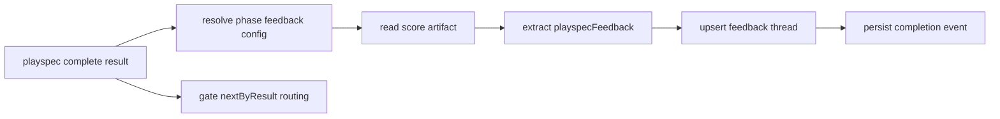
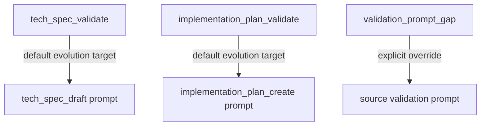

# Issue #201 Phase Validation Feedback Spec

## Scope

Configure the built-in `mono-spec` validation phases to emit prompt evolution feedback signals using the Phase 7 feedback infrastructure from issue #200. The change is limited to workflow configuration, validation prompt guidance, and focused tests proving the config loads and completion capture preserves existing approval routing.

In scope:
- Add `feedback` config to `tech_spec_validate`.
- Add `feedback` config to `implementation_plan_validate`.
- Update both validation templates to require a `playspecFeedback` block with source/evaluated/target phase metadata, target type, workflow source, cause classification, target path, and target writability.
- Keep approval threshold at `95` while feedback threshold is `90`.
- Add regression coverage for config loading, 91/89 score feedback capture, unchanged gated routing, and validation-prompt-gap targeting.

Out of scope:
- Lowering approval gates to `90`.
- Changing MCP behavior or MCP context resolution.
- Auto-applying evolution proposals.
- Changing feedback schema semantics from issue #200.

## Use Case Alignment

Mono-spec validation phases already decide whether the spec or plan is ready to advance. This feature lets those same validation results also generate prompt-evolution feedback threads when validation scores cross the 90 feedback threshold, without weakening the 95 approval gate.

Expected behavior:
- `Score: 91/100` with completion result `needs_revision` records positive feedback because `91 >= feedbackThreshold: 90`, while routing still uses `needs_revision` because the approval threshold remains 95 and the completion result is explicit.
- `Score: 89/100` records negative feedback.
- Technical spec validation feedback targets `tech_spec_draft` by default.
- Implementation plan validation feedback targets `implementation_plan_create` by default.
- A validator prompt gap can explicitly target the validation prompt itself by using `cause.category: validation_prompt_gap`, `evolutionTargetPhaseId` equal to the validation phase, and the validation template target path.

## High-Level Current Implementation Summary

Verified code behavior from the #200 base branch:
- `PhaseDefinition` supports optional `feedback?: PhaseFeedbackConfig`.
- `WorkflowDefinitionSchema` validates the nested feedback config and `WorkflowLoader.validateWorkflowDefinition()` rejects feedback phase references that do not exist.
- `PlaySpecCore.completePhase()` calls `captureValidationFeedback()` after review/evidence/snapshot creation and before persistence of the completion event.
- `ValidationFeedbackExtractor` prefers a fenced `playspecFeedback` block and falls back to markdown score extraction only when allowed.
- Feedback extraction stores separate `approval.threshold/result` and `feedback.threshold/result`.
- `FeedbackThreadUpdater` deduplicates by configured fields, stores compact thread history, records workflow source and target writability, and hashes the configured target prompt snapshot.

Inferred behavior:
- The mono-spec built-in workflow currently has no feedback config on its validation phases, so the #200 capture path is dormant for `mono-spec`.
- The validation templates currently require `Score: X/100` but do not require machine-readable feedback metadata.

## Relevant Files Reviewed

- `src/preset/assets/workflows/mono-spec/workflow.yaml`
- `src/preset/assets/workflows/mono-spec/templates/tech_spec_validate.md`
- `src/preset/assets/workflows/mono-spec/templates/implementation_plan_validate.md`
- `src/core/types.ts`
- `src/core/schemas.ts`
- `src/core/playspec-core.ts`
- `src/evolution/validation-feedback-extractor.ts`
- `src/evolution/feedback-thread-updater.ts`
- `src/evolution/feedback-workflow-source-resolver.ts`
- `tests/integration/workflow-loader.test.ts`
- `tests/integration/completion-engine.test.ts`

## Active Entry Points And Bypasses

Active entry point:
- CLI `playspec complete --result <approved|needs_revision>` delegates to `PlaySpecCore.completePhase()`.

State/data update:
- Completion reads the phase `feedback` config, reads the configured score artifact, extracts feedback, upserts a thread under `.playspec/evolution/feedback/threads`, and records completion feedback metadata.

Propagation:
- Completion event markdown includes a feedback summary.
- MCP complete-phase delegates to the same core path and should remain unchanged.

Reset/clear:
- No new reset behavior is required. Feedback thread compaction is handled by the existing updater.

Bypass paths:
- Phases without `feedback.enabled: true` continue with no feedback capture.
- If a validation artifact lacks a required `playspecFeedback` block, `onFailure: fail_completion` should fail completion for the opted-in mono-spec validation phases.
- Plain markdown fallback remains available only if `markdownFallback: true`, but the templates should still require the structured block.

## Current Architecture

The feature should remain declarative:
- Workflow YAML owns phase opt-in, thresholds, phase IDs, target paths, dedupe fields, compact history policy, manual proposal readiness, workflow source metadata, and target writability.
- Validation templates own instructions for the model-generated artifact format.
- Core and evolution code should not need behavior changes unless tests reveal a schema or capture gap.

Layer boundaries:
- `src/preset/assets/...` can declare built-in workflow behavior.
- `src/core/*` schema and workflow loading already understand feedback config.
- `src/evolution/*` already persists and updates feedback threads.
- No CLI-to-core coupling should be added.

## Verified Behavior

Verified:
- Feedback threshold and approval threshold are separate fields.
- `approval.resultSource: completion_result` allows explicit gate result to drive routing independently of the extracted score.
- `feedbackResultFromScore()` uses the feedback threshold only.
- The schema supports `authoring_prompt_gap` and `validation_prompt_gap`.
- The schema supports `workspace_relative` target paths and `writable` flags.
- Compact history and proposal readiness policy fields are required by the feedback schema.

Open verification needed in implementation:
- Built-in `mono-spec` workflow loads after adding two feedback configs.
- Project preset parity is maintained if `.playspec/workflows/mono-spec` fixtures are tracked or used by tests.
- Completion capture writes positive feedback for score 91 with `needs_revision`.
- Completion capture writes negative feedback for score 89.
- Existing `nextByResult` routing remains unchanged.

## Problems

1. `mono-spec` validation phases do not opt into feedback capture.
2. Validation templates do not require the structured `playspecFeedback` block.
3. Without explicit target guidance, feedback for validation failures could incorrectly target the validation prompt instead of the authoring prompt by default.
4. Without tests, future edits could accidentally couple approval threshold and feedback threshold.

## Proposed Direction

Add equivalent `feedback` blocks to the two mono-spec validation phases with phase-specific defaults:
- `tech_spec_validate`:
  - `sourcePhaseId: tech_spec_validate`
  - `evaluatedArtifactPhaseId: tech_spec_draft`
  - `evolutionTargetPhaseId: tech_spec_draft`
  - target file `.playspec/workflows/mono-spec/templates/tech_spec_draft.md`
- `implementation_plan_validate`:
  - `sourcePhaseId: implementation_plan_validate`
  - `evaluatedArtifactPhaseId: implementation_plan_create`
  - `evolutionTargetPhaseId: implementation_plan_create`
  - target file `.playspec/workflows/mono-spec/templates/implementation_plan_create.md`

Common config:
- `kind: prompt_evolution_signal`
- `feedbackThreshold: 90`
- `thresholdMode: greater_or_equal`
- `required: true`
- `onFailure: fail_completion`
- `scoreSource.artifactRole: validation_report`
- `scoreSource.preferredBlock: playspecFeedback`
- `scoreSource.markdownFallback: true`
- `approval.threshold: 95`
- `approval.resultSource: completion_result`
- allowed causes include artifact quality, authoring prompt gap, validation prompt gap, workflow policy gap, extractor/parser error.
- compact history policy is bounded.
- proposal readiness is manual-review-only initial readiness.
- workflow source identifies the built-in mono-spec preset.
- default target prompt template path is the authoring prompt template and is not writable when it is the bundled preset.

Template updates:
- Add an output section requiring a fenced `playspecFeedback` YAML block.
- Document default target semantics: target the authoring prompt for artifact quality/authoring gaps; target the validation prompt only for validator prompt gaps.
- Require fields for phase IDs, approval, feedback, cause, prompt evolution target type, workflow source, target, target writable, target path, summary, and dedupe values.

## File-By-File Plan

- `src/preset/assets/workflows/mono-spec/workflow.yaml`
  - Add `feedback` config to both validation phases.
  - Preserve existing `gate.nextByResult` and 95 approval gate semantics.

- `.playspec/workflows/mono-spec/workflow.yaml`
  - Update only if project workflow fixtures are tracked by this branch and needed for parity. Otherwise avoid committing generated `.playspec` task/workflow state.

- `src/preset/assets/workflows/mono-spec/templates/tech_spec_validate.md`
  - Require the machine-readable block and authoring-prompt default target.
  - Include validation-prompt-gap override guidance.

- `src/preset/assets/workflows/mono-spec/templates/implementation_plan_validate.md`
  - Same as above, with plan-specific phase IDs and target prompt path.

- `tests/integration/workflow-loader.test.ts`
  - Extend mono-spec assertions to verify feedback config loads and preserves routing.

- `tests/integration/completion-engine.test.ts`
  - Add mono-spec or equivalent completion tests for score 91 positive feedback with `needs_revision`, score 89 negative feedback, default authoring target, and validation prompt gap target override.

## Risks And Open Questions

- Risk: Built-in workflow source metadata may need `bundled_preset` and `package_relative` paths rather than project-local writable paths. The resolver supports bundled preset metadata and should mark built-in targets non-writable by default.
- Risk: Tests may use installed project workflows rather than bundled preset workflows. If so, project-local workflow copies may resolve as writable; tests should assert built-in config values when loading from built-in assets and capture behavior in a temporary initialized workspace as appropriate.
- Risk: `scoreSource.artifactRole: validation_report` must align with completion artifact discovery. If mono-spec validation phases do not produce a validation_report artifact role, tests should expose whether an additional artifact declaration or score source adjustment is needed.

## Reader Aids

Verified completion flow:

Proposed mono-spec target defaults:

