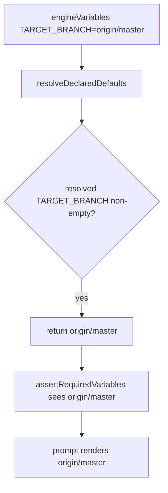
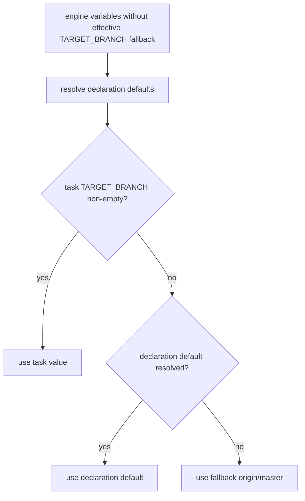

# Issue 215 TARGET_BRANCH Workflow Default

## Scope

Change variable resolution so workflow or phase declarations can provide an effective `TARGET_BRANCH.default` while preserving the current hardcoded `origin/master` fallback when no declaration or explicit task value exists.

Out of scope:

- Redesigning workflow variable declarations.
- Changing branch detection or adding git remote introspection.
- Changing unrelated engine variables.
- Changing MCP, rollback, harness, or unrelated workflow behavior.

## Use Case Alignment

Workflow authors need to declare `TARGET_BRANCH.default: origin/main` or another branch in a custom workflow and have prompts and required-variable validation use that value when the task does not explicitly set `TARGET_BRANCH`.

Task variables remain highest precedence:

1. Non-empty task `TARGET_BRANCH`.
2. Phase `TARGET_BRANCH.default` merged over workflow default.
3. Workflow `TARGET_BRANCH.default`.
4. Resolver fallback `origin/master`.

## High-Level Current Implementation Summary

Verified in code:

- `src/template/variable-resolver.ts` builds `engineVariables` with `TARGET_BRANCH: 'origin/master'`.
- `resolveDeclaredDefaults()` initializes its `resolved` map with engine variables and task variables.
- `resolveOne()` returns any existing non-empty value before checking a declaration default.
- Final output spreads `engineVariables`, then `resolvedDefaults`, then non-empty task variables.
- `src/core/playspec-core.ts` renders prompts through `resolveAndAssertRequiredVariables()`, which calls the resolver and then `assertRequiredVariables()`.
- `src/core/required-variables.ts` validates required variables from merged declarations and phase `requiredVariables` against the resolved variable map.

The current implementation therefore treats `TARGET_BRANCH: origin/master` as already resolved before declaration defaults are evaluated.

## Relevant Files Reviewed

- `src/template/variable-resolver.ts`: owns engine variables, declaration default resolution, default reference rendering, and final precedence.
- `src/core/playspec-core.ts`: render path calls resolver and required-variable assertion.
- `src/core/required-variables.ts`: required-variable validation consumes resolved variables.
- `src/core/types.ts`: `WorkflowDefinition`, `PhaseDefinition`, and `VariableDeclaration` shapes.
- `src/preset/assets/workflows/mono-spec/workflow.yaml`: built-in mono-spec declares `TARGET_BRANCH.default: origin/master` and requires it in `safe_refactor` and `pr_prepare`.
- `tests/unit/variable-resolver.test.ts`: focused resolver coverage for mono-spec defaults, task overrides, unknown default references, and circular default references.
- `tests/integration/init-create-next.test.ts`: render-path coverage that asserts mono-spec prompts include `origin/master`.

## Active Entry Points And Bypasses

Active render entry point:

1. CLI or core calls `PlaySpecCore.renderNextPrompt()` or `renderExplicitPhasePrompt()`.
2. `renderResolvedPhase()` calls `resolveAndAssertRequiredVariables()`.
3. `VariableResolver.resolve()` creates the variable map.
4. `assertRequiredVariables()` validates phase requirements.
5. `TemplateRenderer.render()` renders the prompt with resolved variables.

Potential bypasses:

- Direct callers of `VariableResolver.resolve()` get the same current precedence bug without going through `PlaySpecCore`.
- Task creation validation in `src/cli/commands/create.ts` also calls `VariableResolver.resolve()` before required-variable checks, so the fix must live in the resolver rather than only in prompt rendering.

## Current Architecture

`mergeVariableDeclarations()` merges workflow variables with phase variables. Same-name phase declarations override workflow fields while retaining omitted workflow metadata. `resolveDeclaredDefaults()` then resolves declaration defaults with reference expansion and cycle/unknown-reference protection.

Engine variables currently serve two roles:

- Real computed values such as `TASK_ID`, `STEP_ID`, and context variables.
- Empty placeholders for declarative path variables such as `SPEC_FILE`.
- A non-empty fallback for `TARGET_BRANCH`.

The non-empty `TARGET_BRANCH` fallback is the only value in scope that must behave differently from normal computed engine variables.

## Verified Behavior

Verified from `src/template/variable-resolver.ts`:

- A non-empty task variable overrides defaults because final output spreads `nonEmptyTaskVariables` last.
- An empty task variable does not override defaults because it is filtered out of the final spread.
- Defaults are skipped when a name already has a non-empty value in `resolved`.
- Unknown default references are ignored for unused, non-demanded variables and thrown for demanded variables.
- Circular default references throw `CircularVariableDefaultError`.

Verified from tests:

- Mono-spec currently resolves `TARGET_BRANCH` to `origin/master`.
- Existing integration tests assert `safe_refactor` and `pr_prepare` prompts contain `origin/master`.
- Existing unit tests cover declaration defaults, explicit overrides, unknown default references, and circular defaults.

## Problems

`TARGET_BRANCH` is seeded as a non-empty engine variable before declaration defaults are resolved. Because `resolveOne()` short-circuits on any existing non-empty value, a workflow declaration such as:

```yaml
variables:
  TARGET_BRANCH:
    default: origin/main
```

cannot override the fallback. Required-variable validation also sees `origin/master`, so a phase requiring `TARGET_BRANCH` passes with the fallback even when the workflow author supplied a different default.

## Proposed Direction

Keep `TARGET_BRANCH` fallback explicit but apply it after declaration defaults and before final non-empty task variables.

Implementation shape:

- Remove `TARGET_BRANCH: 'origin/master'` from the initial engine variables passed into `resolveDeclaredDefaults()`, or pass a default-resolution base where `TARGET_BRANCH` is blank.
- Keep `ResolvedVariables` output populated with `TARGET_BRANCH`.
- After `resolvedDefaults` are computed, inject `origin/master` only when neither the declaration defaults nor non-empty task variables provide `TARGET_BRANCH`.
- Preserve all other engine variable behavior.

This keeps explicit task variables highest precedence and keeps mono-spec unchanged because mono-spec declares the same `origin/master` default.

## File-By-File Plan

- `src/template/variable-resolver.ts`
  - Introduce a local constant for the fallback branch.
  - Make `TARGET_BRANCH` default resolution treat the engine fallback as empty or late-applied.
  - Ensure final output still always has a non-empty `TARGET_BRANCH`, falling back to `origin/master` only as a final resolver fallback.

- `tests/unit/variable-resolver.test.ts`
  - Add a focused test where workflow `TARGET_BRANCH.default` is `origin/main` and task variables do not include `TARGET_BRANCH`.
  - Add or extend coverage proving a non-empty task `TARGET_BRANCH` still wins.
  - Include required-phase coverage in the same resolver-level test if sufficient because `assertRequiredVariables()` consumes the resolved value.

- `tests/integration/init-create-next.test.ts`
  - Leave existing mono-spec `origin/master` assertions passing.
  - Add render-path integration only if resolver-level coverage does not exercise the required-variable path clearly enough.

## Risks And Open Questions

Risks:

- Accidentally making all engine variables overridable by declaration defaults would create broad behavior changes. The fix should special-case only `TARGET_BRANCH`.
- Changing how empty task variables interact with defaults could regress existing issue #147 behavior. Existing tests should stay unchanged.
- Required-variable validation should continue to see the final resolved map, so no separate validation change is expected.

Open questions:

- None requiring product input. The issue explicitly asks for a scoped `TARGET_BRANCH` precedence change without branch detection.

## Reader Aids

Verified current flow:



Proposed flow:


