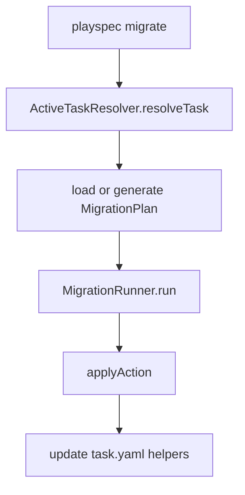
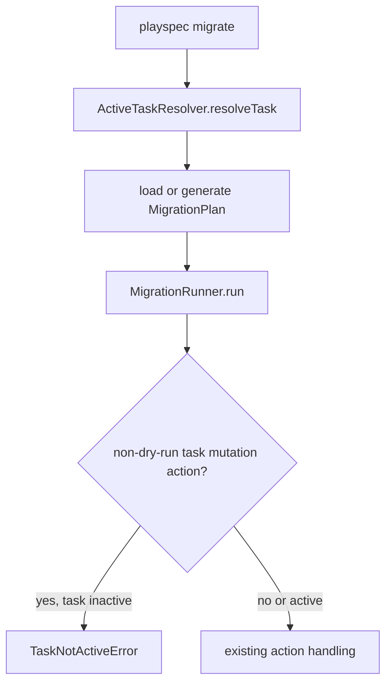

# Issue 217: Migrate Rejects Completed Tasks

## Scope

`playspec migrate` must not mutate `task.yaml` for tasks whose `status` is not `active`. The guard should cover both generated migration plans and external `--plan` files before any task mutation action is applied.

In scope:

- Reject completed target tasks for migration actions that mutate task state: `update_task_state`, `add_context_ref`, `remove_context_ref`.
- Preserve existing active-task migration behavior.
- Preserve plan schema validation and archive flag behavior.
- Add focused regression coverage for completed-task rejection and unchanged task YAML.

Out of scope:

- Redesigning migration.
- Removing or un-hiding the deprecated `migrate` command.
- Changing unrelated lifecycle commands.
- Making archived/completed tasks mutable through a new annotation flow.

## Use Case Alignment

The user-facing boundary is that completed tasks are terminal. A user can still call the deprecated hidden `playspec migrate`, but if the target task is completed and the plan would mutate its task record, the command must fail with a message that includes the task ID and status.

## High-Level Current Implementation Summary

Verified behavior:

- `src/cli/commands/migrate.ts` resolves the target with `ActiveTaskResolver.resolveTask(options.task)` and passes the task ID into a migration plan.
- External plan files are parsed through `MigrationPlanSchema` and have `mode` and `targetTaskId` overridden from CLI context when absent.
- Generated plans currently create `add_context_ref` actions against `.playspec/tasks/active/<taskId>/task.yaml`.
- `src/migration/migration-runner.ts` validates the plan and applies actions.
- In non-dry-run modes, `update_task_state`, `add_context_ref`, and `remove_context_ref` load the target task through `TaskStore.getTask()` and write `task.yaml` directly.
- `TaskNotActiveError` already exists in `src/core/errors.ts` and produces the expected task ID/status message.

Inferred behavior:

- A runner-level guard is the lowest shared boundary that protects external plans, generated plans, direct runner usage, auto mode, and review mode.
- Dry-run can remain safe for completed tasks because `MigrationRunner.run()` persists plan/report only and does not invoke mutation helpers in dry-run mode.

## Relevant Files Reviewed

- `src/cli/commands/migrate.ts`
- `src/migration/migration-runner.ts`
- `src/core/errors.ts`
- `src/core/types.ts`
- `tests/integration/migration.test.ts`
- `tests/cli.test.ts`

## Active Entry Points And Bypasses

Active entry points:

- CLI: hidden `playspec migrate`.
- Core migration runner: `new MigrationRunner(...).run(plan, options)`.

Bypasses:

- Explicit task IDs passed to `ActiveTaskResolver.resolveTask(options.task)` can resolve completed task records.
- External plans can include task mutation actions and reach the runner without generated-plan checks.
- Runner mutation helpers do not currently enforce the active-task lifecycle boundary.

## Current Architecture

Verified flow:

Proposed flow:

## Verified Behavior

- Dry-run reports every action as skipped before `applyAction`.
- Auto mode can apply non-review `add_context_ref` actions.
- Review mode can apply approved task mutation actions.
- Existing tests already cover active-task migration success paths and archive guard behavior.

## Problems

- Completed tasks can remain in active storage until archived.
- Migration task mutation helpers write task YAML without checking `task.status`.
- CLI-level validation alone would not protect direct runner callers or future external plan paths.

## Proposed Direction

Add a narrow guard inside `MigrationRunner.run()` before non-dry-run action execution:

- Identify whether the plan contains any task mutation actions: `update_task_state`, `add_context_ref`, `remove_context_ref`.
- If the plan mode is not `dry-run` and at least one such action exists, load `plan.targetTaskId` and throw `TaskNotActiveError` when `status !== 'active'`.
- Run this before plan persistence and before archive backup/mutation work so rejection leaves task YAML and migration artifacts untouched.
- Leave file-only migration actions unchanged.
- Keep dry-run as explicitly safe for completed tasks because it does not call mutation helpers.

## File-By-File Plan

- `src/migration/migration-runner.ts`
  - Import `TaskNotActiveError`.
  - Add a small task-mutation action type guard/helper.
  - Add a preflight active-task guard in `run()` after schema/archive validation and before `savePlan()`.

- `tests/integration/migration.test.ts`
  - Add runner-level coverage that a completed task with generated-style `add_context_ref` in auto mode rejects and leaves `task.yaml` unchanged.
  - Add coverage for an external-plan-style task mutation such as `update_task_state` or `remove_context_ref`.
  - Add dry-run coverage documenting that completed-task task mutation plans are safe and produce skipped reports without changing task YAML.

- `tests/cli.test.ts`
  - Add CLI coverage for `migrate --task <completedTaskId> --plan <planFile> --mode auto` returning non-zero, including the task ID/status message, and leaving task YAML unchanged.

## Risks And Open Questions

Risks:

- Users who used `migrate` to annotate completed tasks will now receive a hard lifecycle rejection for task mutations.
- If a mixed plan contains file actions plus task mutation actions, rejecting the whole plan is safer than partially applying file actions before failing.

Open questions:

- None blocking. Dry-run behavior will be documented by tests as safe for completed tasks.

## Reader Aids

Task mutation actions are the only migration action types that write `.playspec/tasks/active/<taskId>/task.yaml`. File update and archive actions operate on other paths and are outside this issue unless bundled with a task mutation in the same plan.
