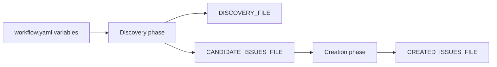
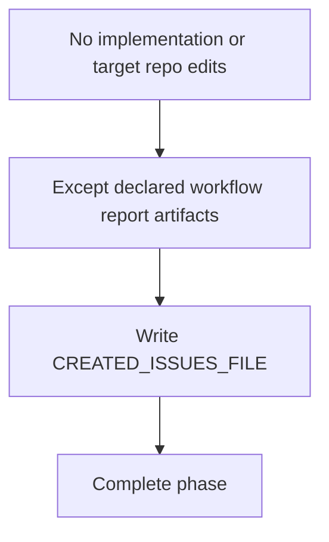

# Issue 218 Artifact Report Path Clarification Spec

## Scope

Clarify the built-in `issue-scope-create` workflow so its creation phase can require the final report artifact without contradicting the no-target-repository-edit safety rule. Preserve the existing artifact contract and explicit variable overrides.

In scope:

- `src/preset/assets/workflows/issue-scope-create/templates/create_scoped_issues.md`
- `src/preset/assets/workflows/issue-scope-create/workflow.yaml`
- `docs/workflows/issue-scope-create.md`
- `tests/integration/workflow-loader.test.ts`

Out of scope:

- Redesigning artifact storage.
- Changing GitHub issue creation semantics.
- Reopening duplicate path-collision behavior or embedded placeholder resolution.

## Use Case Alignment

Operators use `issue-scope-create` to inspect a target repository, write workflow evidence reports, and create a bounded set of GitHub issues. The workflow must distinguish prohibited implementation edits from required report artifact writes.

The intended contract is:

- Agents must not implement code, create branches, commits, or PRs in the target repository.
- Agents must write declared workflow report artifacts.
- Default artifact locations remain under `docs/issues/scope-create/{{TASK_ID}}`.
- Operators can override `OUTPUT_DIR`, `DISCOVERY_FILE`, `CANDIDATE_ISSUES_FILE`, and `CREATED_ISSUES_FILE`.

## High-Level Current Implementation Summary

Verified behavior:

- `workflow.yaml` declares `OUTPUT_DIR` with default `docs/issues/scope-create/{{TASK_ID}}`.
- `DISCOVERY_FILE`, `CANDIDATE_ISSUES_FILE`, and `CREATED_ISSUES_FILE` derive from `OUTPUT_DIR`.
- The workflow artifact map points to those variables.
- Discovery outputs `DISCOVERY_FILE` and `CANDIDATE_ISSUES_FILE`.
- Creation outputs `CREATED_ISSUES_FILE`.
- The docs already include a "Report Artifacts" section listing the default paths and override options.
- The creation template says not to edit files in the target repository and later requires writing `{{CREATED_ISSUES_FILE}}`.

Inferred behavior:

- Because report artifacts may live inside the target checkout by default, the creation template needs an explicit exception for declared report artifacts rather than a storage redesign.

## Relevant Files Reviewed

- `src/preset/assets/workflows/issue-scope-create/templates/create_scoped_issues.md`
- `src/preset/assets/workflows/issue-scope-create/workflow.yaml`
- `docs/workflows/issue-scope-create.md`
- `tests/integration/workflow-loader.test.ts`

## Active Entry Points And Bypasses

Active entry points:

- `WorkflowLoader` loads built-in workflow definitions and templates from preset assets.
- `PlaySpecCore.renderNextPrompt()` renders workflow templates with resolved variables.
- `tests/integration/workflow-loader.test.ts` already validates `issue-scope-create` workflow declarations and template safeguards.

Bypasses and alternate paths:

- Explicit variable overrides can redirect `OUTPUT_DIR`, `DISCOVERY_FILE`, `CANDIDATE_ISSUES_FILE`, or `CREATED_ISSUES_FILE`.
- Project or user workflow shadows may override built-ins when explicitly accepted, but this issue targets shipped built-in assets.

## Current Architecture

The workflow owns artifact declarations in YAML and prompt instructions in Markdown templates. Documentation describes intended operator usage. Tests inspect the loaded built-in workflow and template files directly, which is appropriate for catching wording and declaration regressions.

## Verified Behavior

- `OUTPUT_DIR` default is task-specific: `docs/issues/scope-create/{{TASK_ID}}`.
- The three report variables remain configurable.
- Creation phase output is still `{{CREATED_ISSUES_FILE}}`.
- Current template text has no explicit artifact exception near the no-edit rule.

## Problems

1. The creation template can be read as forbidding its own required final report write when reports are inside the target checkout.
2. Existing tests assert broad safeguards but do not fail on this specific contradiction.
3. The docs should be pinned by tests so artifact variable documentation is not silently removed.

## Proposed Direction

Use the lowest-risk wording and coverage fix:

- Update `create_scoped_issues.md` so the no-edit rule explicitly excludes declared workflow report artifacts: `{{DISCOVERY_FILE}}`, `{{CANDIDATE_ISSUES_FILE}}`, and `{{CREATED_ISSUES_FILE}}`.
- Keep default paths and override behavior unchanged.
- Strengthen workflow-loader integration tests to assert:
  - the creation template contains the no-edit rule,
  - the creation template requires writing `{{CREATED_ISSUES_FILE}}`,
  - the creation template includes an explicit declared-report-artifact exception,
  - the loaded workflow exposes all four artifact path variables with expected defaults,
  - the docs mention those variables and default report location.

## File-By-File Plan

- `src/preset/assets/workflows/issue-scope-create/templates/create_scoped_issues.md`
  - Add explicit wording that the no-edit rule does not apply to declared workflow report artifacts.

- `docs/workflows/issue-scope-create.md`
  - Ensure `OUTPUT_DIR`, `DISCOVERY_FILE`, `CANDIDATE_ISSUES_FILE`, and `CREATED_ISSUES_FILE` are named and default behavior is clear.

- `tests/integration/workflow-loader.test.ts`
  - Add assertions for the artifact exception in the creation template.
  - Add assertions for variable declarations and docs coverage.

## Risks And Open Questions

- Risk: overly broad wording could weaken the no-edit safety rule. Mitigation: exception text should name only declared workflow report artifacts.
- Risk: docs already mention defaults, but tests may need to avoid brittle prose matching. Mitigation: assert key variable names and default path fragments, not full paragraphs.
- Open question: none blocking.

## Reader Aids

Verified current artifact flow:

Proposed prompt clarification:

