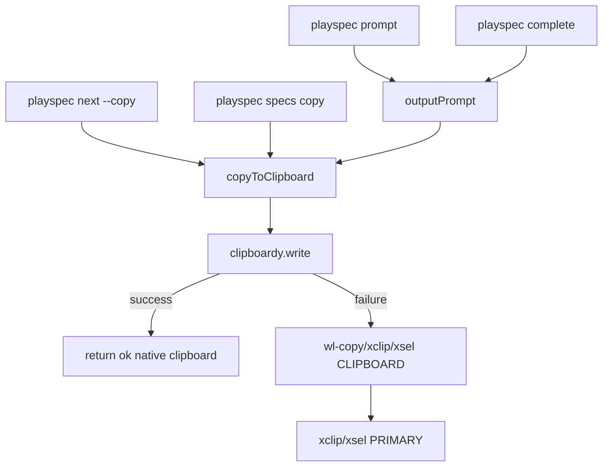
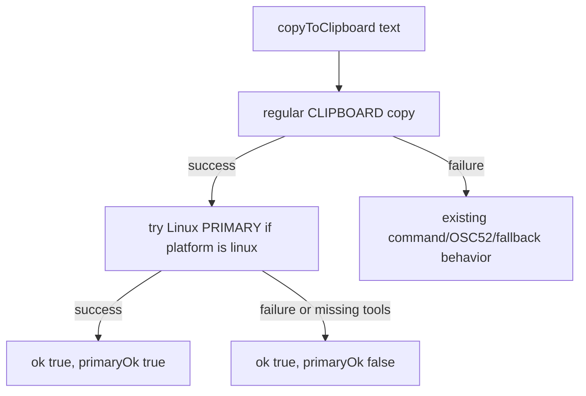

# Issue 21 Linux PRIMARY Clipboard Spec

## Scope

Implement minimal best-effort Linux PRIMARY selection support for `playspec prompt` without changing existing CLIPBOARD behavior. The same clipboard helper is shared by other copy paths, so the implementation must preserve current success/fallback semantics for `prompt`, `complete` post-phase prompt output, `next --copy`, and `specs` copy.

Out of scope: Windows/macOS behavior changes, mandatory new clipboard dependencies, clipboard history integration, and viewer work.

## Use Case Alignment

Linux users expect `playspec prompt` output copied to the regular CLIPBOARD buffer for Ctrl+V/right-click paste and to the PRIMARY selection for middle-click paste. Existing behavior only guarantees regular clipboard copy. PRIMARY support must be attempted only after the regular copy succeeds and must never make a successful regular copy fail.

## High-Level Current Implementation Summary

Verified code behavior:

- `src/cli/index.ts` registers `playspec prompt`; it copies by default and prints when `--no-copy` or `--print-only` are used.
- `src/cli/commands/prompt.ts` renders the current prompt and delegates copy behavior to `copyToClipboard()`.
- `src/utils/clipboard.ts` first calls `clipboardy.write()`. If that succeeds, it returns `ok: true` immediately with method `native clipboard`.
- If `clipboardy.write()` fails, `copyWithPlatformCommand()` tries platform commands. On Linux those are `wl-copy`, `xclip -selection clipboard`, and `xsel --clipboard --input`.
- Only the platform command fallback path currently calls `tryLinuxPrimary()`.
- `tryLinuxPrimary()` currently tries `xclip -selection primary` and `xsel --primary --input`; it does not try `wl-copy --primary`.
- `src/cli/commands/specs.ts` already warns when `result.primaryOk === false`, but `src/cli/commands/prompt.ts` and `src/cli/commands/next.ts` do not surface PRIMARY status.

Inferred behavior:

- On a Linux system where `clipboardy.write()` succeeds, `playspec prompt` returns before any PRIMARY attempt, so middle-click paste remains unchanged.
- On a Linux system where the fallback command path succeeds and PRIMARY fails, `specs` warns but `prompt` and `next --copy` still report only normal clipboard success.

## Relevant Files Reviewed

- `src/cli/index.ts`: command registration and default copy option semantics.
- `src/cli/commands/prompt.ts`: canonical prompt output path and post-completion prompt output helper.
- `src/utils/clipboard.ts`: shared clipboard helper and platform command fallback.
- `src/cli/commands/specs.ts`: existing PRIMARY warning pattern.
- `src/cli/commands/next.ts`: deprecated copy path with duplicate success messaging.
- `tests/unit/clipboard.test.ts`: existing helper-level tests.
- `tests/cli.test.ts`: prompt copy/fallback/no-copy CLI tests.

## Active Entry Points And Bypasses

Active entry points:

- `playspec prompt` default copy path: `runPrompt()` -> `outputPrompt()` -> `copyToClipboard()`.
- `playspec complete` without `--no-copy`: `runComplete()` -> `outputPrompt()` -> `copyToClipboard()`.

Bypass and alternate paths:

- `playspec prompt --no-copy` and `--print-only` bypass clipboard entirely.
- `playspec prompt --out` writes a file and still attempts clipboard unless combined with no-copy behavior.
- Deprecated `playspec next --copy` calls `copyToClipboard()` directly and has separate output text.
- `playspec specs` calls `copyToClipboard()` for selected file content and already emits a PRIMARY warning.

## Current Architecture

## Verified Behavior

- Existing regular clipboard behavior is centralized in `copyToClipboard()`.
- `PLAY_SPEC_DISABLE_CLIPBOARD=1` returns `ok: false` before any clipboard attempt.
- Missing platform clipboard tools are already treated as command failures and can fall through to OSC52/fallback output.
- PRIMARY failure is represented as `primaryOk: false` on Linux command fallback success.

## Problems

- PRIMARY is not attempted after the normal native clipboard path succeeds.
- Wayland PRIMARY support via `wl-copy --primary` is missing.
- `playspec prompt` does not print a PRIMARY success or unavailable message after normal clipboard success.
- Tests do not cover Linux PRIMARY success, missing-tool graceful behavior, or prompt CLI output for PRIMARY status.

## Proposed Direction

Update `copyToClipboard()` so a successful regular clipboard copy attempts Linux PRIMARY best-effort before returning. Keep the regular copy result successful regardless of PRIMARY outcome. Include `wl-copy --primary` in the PRIMARY candidate list before X11 tools, followed by `xclip -selection primary` and `xsel --primary --input`.

Represent Linux PRIMARY status with the existing optional `primaryOk` field:

- `true`: PRIMARY write succeeded.
- `false`: Linux PRIMARY was attempted but no candidate succeeded.
- `undefined`: non-Linux path or no regular clipboard success path where PRIMARY is relevant.

Update prompt-facing success output to preserve the existing `Prompt copied to clipboard...` line and add one concise second line on Linux when status is available:

- `PRIMARY selection updated.`
- `Warning: PRIMARY selection not available; CLIPBOARD copy succeeded.`

Use the same formatting helper from `prompt` and `next` if practical, but keep the change small.

## File-By-File Plan

- `src/utils/clipboard.ts`: after `clipboardy.write()` success, call Linux PRIMARY helper; add `wl-copy --primary`; keep timeouts and swallowed PRIMARY errors.
- `src/cli/commands/prompt.ts`: print PRIMARY status after copy success in `outputPrompt()`. Prefer a small exported formatting helper for copy success messages so output can be tested without spawning real clipboard subprocesses.
- `src/cli/commands/next.ts`: keep deprecated copy path consistent with prompt output by reusing the same formatting helper if it receives `primaryOk`.
- `tests/unit/clipboard.test.ts`: mock `clipboardy` and `execa` to cover native success plus PRIMARY success, native success plus PRIMARY unavailable, non-Linux behavior, candidate ordering, and disabled clipboard behavior.
- `tests/cli.test.ts` or a focused prompt-command unit test: cover the prompt-facing success/warning text through a deterministic formatter or injected result shape, not through the host OS clipboard. Existing CLI fallback tests should continue to cover disabled clipboard/fallback behavior.

## Validation Ledger

- Implementation gap: PRIMARY is not attempted after `clipboardy.write()` succeeds. Keep active; fixed in `src/utils/clipboard.ts`.
- Implementation gap: `wl-copy --primary` is absent. Keep active; add before X11 candidates.
- Implementation gap: `prompt` and deprecated `next --copy` do not report PRIMARY status. Keep active; reuse a small output helper to keep messages consistent.
- Test risk: subprocess CLI tests cannot reliably simulate native clipboard success plus PRIMARY missing. Resolved in spec by requiring helper-level tests for clipboard behavior and deterministic output formatting tests for prompt-visible messages.
- Non-blocker: current implementation has partial PRIMARY support only on fallback command success. This is useful context but not sufficient for issue acceptance.

## Risks And Open Questions

- Risk: mocking `process.platform` in unit tests can leak across tests. Tests should restore descriptors after each case.
- Risk: CLI tests use subprocesses, so testing native clipboard success may require a controllable test hook rather than fragile OS clipboard behavior.
- Open question: exact output wording can be adjusted to match project style, but it should preserve existing success text to avoid breaking users/scripts.

## Reader Aids

Proposed Linux success flow:

