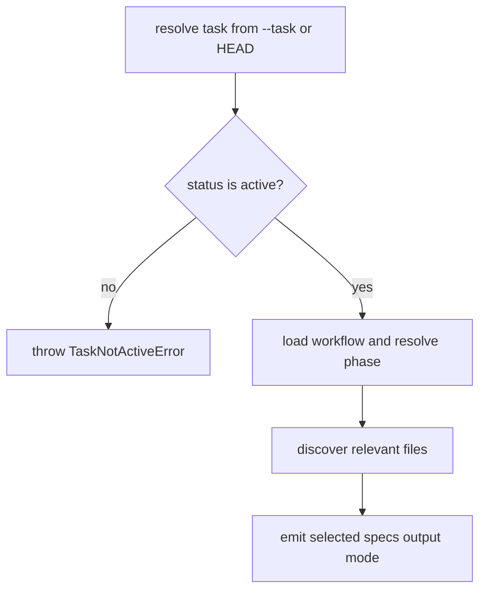

# Technical Spec: specs --task active guard

## Scope

`playspec specs --task <taskId>` must reject tasks whose status is not `active` before resolving workflow phase context or discovering relevant files. The change is limited to the `specs` CLI command and focused CLI regression coverage.

Out of scope: resolver redesign, archive lookup behavior, completed-task inspection modes, and behavior changes for prompt, phase, next, use, link, add-context, rollback, desync-check, migrate, or create.

## Use Case Alignment

`specs` is an active-workflow context helper. Users may point it at an active task explicitly without changing HEAD, but a completed task should not drive path-only, print, copy, or interactive context exposure. HEAD-based `specs` already rejects completed HEAD tasks; explicit `--task` must match that lifecycle boundary.

## High-Level Current Implementation Summary

Verified behavior in `src/cli/commands/specs.ts`:

- `runSpecs()` creates `YamlTaskStore` and `ActiveTaskResolver`.
- `resolver.resolveTask(opts.task)` loads either the explicit task or HEAD.
- The active guard currently runs only when `opts.task` is absent.
- Workflow loading, phase resolution, and `discoverRelevantFiles()` happen after that guard.
- `--path-only`, `--print`, interactive selection, missing warnings, large-file skipping, and binary-file skipping are all downstream of discovery.

## Relevant Files Reviewed

- `src/cli/commands/specs.ts`: active guard and relevant-file output flow.
- `src/core/active-task-resolver.ts`: explicit task IDs bypass HEAD and load through the task store.
- `src/core/errors.ts`: `TaskNotActiveError` message and recovery hint.
- `tests/cli.test.ts`: existing specs CLI tests and completed-task active guard assertions for related commands.

## Active Entry Points And Bypasses

Verified entry points:

- `playspec specs --path-only` resolves HEAD and rejects non-active HEAD tasks.
- `playspec specs --task <activeTaskId> --path-only` resolves an explicit active task and preserves HEAD.

Verified bypass:

- `playspec specs --task <completedTaskId> --path-only` can pass the current guard because the condition checks `!opts.task`.
- A completed task can still exist under `.playspec/tasks/active/<taskId>/task.yaml` until archival, so direct task lookup can load it.

## Current Architecture

`specs` is a CLI boundary that combines task resolution, workflow phase resolution, relevant-file discovery, and output mode handling. Core task resolution intentionally does not decide whether a command requires an active task. Commands such as `prompt` and `next` enforce their own active-task checks after resolution.

## Verified Behavior

- `TaskNotActiveError` reports `Task "<id>" is not active (status: <status>).`
- The recovery hint is `Switch HEAD to an active task with \`playspec use <TASK_ID>\` or pass an active task with \`--task <TASK_ID>\`.`
- Existing specs tests cover active HEAD path-only, active explicit task path-only without HEAD mutation, missing-path stderr, print mode, binary/large handling, and interactive selection.

## Problems

The explicit task path allows completed tasks to reach workflow context resolution and relevant-file discovery. For `--path-only`, this can expose completed-task relevant paths on stdout, which conflicts with the active-workflow semantics already enforced for HEAD-based `specs`.

## Proposed Direction

Change the guard in `runSpecs()` to reject any resolved task whose status is not `active`, regardless of whether the task came from HEAD or `--task`.

Proposed flow:

## File-By-File Plan

- `src/cli/commands/specs.ts`: replace `if (!opts.task && task.status !== 'active')` with an unconditional `task.status !== 'active'` guard.
- `tests/cli.test.ts`: add a regression near the existing specs tests that creates an active task, writes a relevant file, marks the task completed, runs `specs --task <id> --path-only`, and asserts non-zero exit, `Task "<id>" is not active` in stderr, active-task recovery hint in stderr, and no relevant path in stdout.

## Risks And Open Questions

Risk: callers using `specs --task <completed>` as a read-only convenience will lose that path. This is intentional per the issue; completed-task inspection should use explicit artifacts or a future read-only command.

Open questions: none for this focused fix.

## Reader Aids

The smallest safe change is at the command boundary after task resolution and before workflow loading. This preserves `ActiveTaskResolver` behavior and keeps all downstream specs output behavior unchanged for active tasks.
